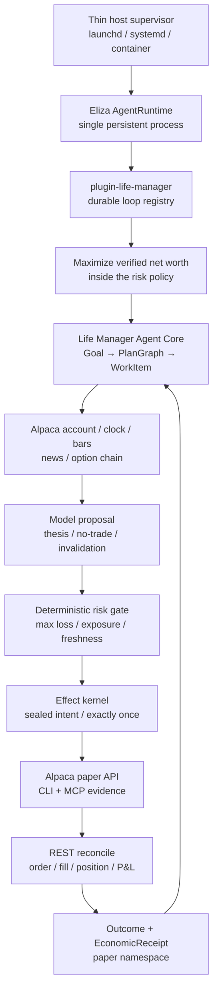
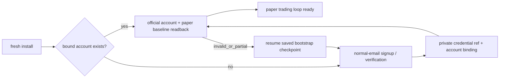

# Life Manager Alpaca Money Maximizer — design and ordered TODO

status: APPROVED DESIGN / A01-A04 DONE / A05 ACTIVE
owner: Dais / Life Manager
deadline: 2026-09-05 00:00 JST
execution SSOT: `2026-08-01-dais-life-manager-five-phase-execution-spec.md` §0.0

## 1. Goal and boundaries

Build the first registered durable loop in `plugin-life-manager` and the first CAPITAL capability of the Life
Manager general money agent. One owner goal starts a bounded, restart-safe loop that observes Alpaca market/account state, lets the model propose or refuse a defined-risk
options trade, applies deterministic risk and effect gates, executes on the dedicated hackathon paper account,
and records official order/fill/P&L receipts. The same capability later ships in the local OSS and cloud hosts.

This slice does not promise profit, call paper P&L money, use Dais's live capital, manage another person's
assets, bypass CAPTCHA/KYC/provider consent, or let a model rewrite production and immediately trade. Paper,
live owner-capital, and regulated customer management remain different capabilities and ledgers.

### Acceptance

1. The submission satisfies every event-specific eligibility item: Trading API, CLI or MCP, options in every
   eligible strategy, a new dedicated $100,000 paper account, private account ID, and real paper activity/P&L.
2. A scheduled no-routine-human pass completes `observe → decide → risk → effect → reconcile → receipt → reflect`.
3. Unknown order outcome never causes a blind retry. New risk stops on stale state, reconciliation failure,
   daily loss, drawdown, insufficient option level, undefined max loss, or excessive spread/concentration.
4. Public repository, hosted demo, cover, one-pager, PDF slides, and a video no longer than four minutes are
   submitted before the deadline and independently readable while logged out.
5. The capability uses the existing Life Manager Goal/PlanGraph/WorkItem/EffectIntent/OutcomeReceipt/
   EconomicReceipt chain. Eliza owns the only loop registry and scheduler; the capability does not create a
   second agent core, scheduler, product, or general ledger.
6. A fresh install owns the complete lifecycle: create or resume the dedicated account through normal email,
   verify and store only secret references, prove a new-session login, then run trading without routine human
   setup. Replaying bootstrap reuses the bound account and creates zero duplicate accounts.

## 2. Product and runtime decision

The product is the canonical Life Manager monorepo. The agent core is the already selected ElizaOS
`AgentRuntime` plus the single `plugin-life-manager`; Alpaca is a capability/provider adapter inside that core.
The Alpaca loop registers with `plugin-life-manager` and is started, scheduled, checkpointed, resumed, healed,
and improved by the existing Eliza `AgentRuntime`. Current launchd code contributes proven lock, heartbeat,
timeout, and Telegram patterns during migration, but it does not own an Alpaca schedule or pass. The only
host-level responsibility is keeping the Eliza process alive: launchd on macOS, systemd on Linux, or the
container/cloud restart policy. These interchangeable adapters contain no goal, market, account, risk, effect,
or improvement state.

Local OSS and cloud run the same persistent Eliza runtime and internal loop registry. Host adapters only start
or restart that runtime; they never schedule the Alpaca loop. Phones are Telegram/web clients to a persistent
host because mobile operating systems are not promised as reliable background daemon hosts. Cloud adds tenant
isolation, vault, queue, billing, and quota without another core.

Eliza self-healing owns task timeout, provider failure, stale observation, acknowledgement loss, circuit break,
checkpoint resume, and loop-local quarantine. Eliza self-improvement owns receipt attribution, offline replay,
no-effect evaluation, paper canary, versioned promotion, monitoring, and rollback. A completely dead Eliza
process cannot execute its own recovery code, so only process resurrection remains outside Eliza. Machine power
and host failure remain the responsibility of the operating system or cloud platform.

### Event contract and Alpaca interface authority

This matrix freezes A01. The current official event page was read through the existing browser session; the
archived 20 August 2026 PDF verification (`SHA-256 7e436430…`) independently corroborates its controlling
requirements. Anonymous crawl/search snippets are incomplete and do not override the live page. A changed
official form or organizer notice remains controlling and must be recorded as a visible conflict before
submission.

| Requirement | Frozen contract | Evidence and conflict handling |
|---|---|---|
| Event window and deadline | Online, 28 August–4 September 2026; submit by **5 September 2026 00:00 JST** | Current official page and schedule both show the exact deadline; archived PDF agrees. |
| Challenge | Build an autonomous AI trading agent using Alpaca Trading API in paper trading | Current official challenge and archived PDF page 2 agree. |
| Agent-facing Alpaca surface | Event minimum is **either** Alpaca CLI or Alpaca MCP server | Current official `CORE REQUIREMENTS` and archived PDF page 2 agree. Life Manager chooses CLI authority plus optional read-only MCP presentation. |
| Options | All strategies incorporate options; underlying-only entry is ineligible | Current official `CORE REQUIREMENTS` and archived PDF page 2 agree. Alpaca official options docs confirm paper options are enabled by default and levels 2/3 support long options/spreads. |
| Judged account | Brand-new Alpaca paper account dedicated to this hackathon, starting at exactly `$100,000`; development accounts may differ | Current official `REQUIRED FOR JUDGING` and `ADDITIONAL REQUIREMENTS`. Alpaca official paper docs confirm global email-only Paper Only signup and the default `$100,000` balance. |
| Required write-up | One page covering AI logic, risk gates, and Alpaca infrastructure implementation | Current official `ADDITIONAL REQUIREMENTS`. This is separate from the slide presentation. |
| Private judge identifier | Submit the dedicated Alpaca paper account ID for activity/P&L verification | Current official `WHAT TO SUBMIT` and archived PDF page 6 agree. Public artifacts expose only a redacted/hash reference. |
| Submission fields | Project title; short and long descriptions; technology/category tags; cover image; video presentation; slide presentation; public GitHub repository; demo platform and application URL; Alpaca account ID | Current official `WHAT TO SUBMIT`. Generic Lablab guidance permits a video up to five minutes; this project keeps the stricter ≤4-minute target. |
| Social extra challenge | Up to five X/LinkedIn post links tagging lablab.ai and Alpaca | Current official extra challenge. These links are optional for main judging but required to compete for the social prize. |
| Judging | P&L Performance; Technology Implementation; Creativity & Originality; Presentation & Execution | Current event-specific official criteria. The generic Lablab rubric does not replace these criteria. P&L never overrides safety or truthfulness. |
| Team and originality | Team size 1–6; entrants 18+ for prize eligibility; submissions must be original and MIT-compliant | Current official guidelines and prize terms. Life Manager remains public MIT-compatible OSS with donor notices. |
| Prize pool | `$6,000` cash plus `$300` Featherless credits displayed as `$6,300` total | Current official prize section: main cash `$2,500 + $1,500 + $1,000`, social cash `2 × $500`, and first-place Featherless credits `$300`. |

**CLI authority decision:** the Alpaca CLI is the sole broker command/readback surface used by the Financial
loop. Eliza invokes pinned CLI commands with structured JSON, binds every mutation to a stable
`client_order_id`, and reconciles through CLI account/order/position/activity reads. The adapter does not add a
second REST or SDK mutation path. MCP may be enabled only as a read-only judge/explanation surface; its absence
cannot stop the loop, and it cannot place, replace, cancel, exercise, or close orders.

## 3. Reuse research — fixed source and decision

The repositories below were cloned into an isolated temporary directory and inspected at the listed commits.
The review covered entrypoints, broker calls, risk, state, reconciliation, scheduler, and demo rather than
README claims alone.

| Source | Fixed commit / observed evidence | Decision |
|---|---|---|
| [Veto](https://github.com/dancaldera/veto) | `4e5e6af95a70e4dd99d96323958ec72ad3538b84`; MIT; isolated `uv run pytest`: 43/43 | Primary donor. Copy/adapt paper-only key rejection, option selection/collar order construction, risk checks, `client_order_id`, reconcile/halt behavior, and read-only demo formatting. Preserve MIT notice. Do not copy its SQLite scheduler, SMA brain, separate MCP server, or product shell. |
| [Reason Before Result](https://github.com/wubian87/reason-before-result) | `095b2ae0afc1432aac786651dac797f8627ee112`; MIT; risk self-check 10/10; ledger/MCP static check PASS | Secondary donor. Copy/adapt the written-decision-before-effect sequence, MCP request/receipt redaction, and all-gates-visible explanation. Preserve MIT notice. Do not copy Chinese UI/product shell or its separate ledger. |
| [Alpaca Risk Agent](https://github.com/Stephen-Kimoi/alpaca-risk-agent) | `0d6f5a5dc5ecfc52d6868f028468df679943510e`; 415 Python LOC; no tests or LICENSE file | Learn only. Adopt the one-shot re-derive-from-broker shape and thin structured CLI invocation. Do not copy code without a license; its stock bracket strategy does not satisfy the event options requirement. |
| [Dis-Pater](https://github.com/MuhammadTahaBinZaeem/Dis-Pater) | `b40188a09fc69c99145dc5aad58f3243996ad70a`; 62,891 Python LOC, 115 tests, no root LICENSE file | Learn only and reject wholesale adoption. Reproduce only the small safety invariants: uncertain POST → reconcile by stable ID before retry, stale quote/account denial, protective exits during halt, and circuit-open on unhealthy reconciliation. |

### Reuse ladder inside Life Manager

1. Reuse the existing Eliza Goal/effect/receipt/restart kernel for orchestration and exactly-once effects.
2. Reuse current Life Manager financial/economic receipt, secret-reference, lease/heartbeat, and Telegram
   patterns; do not reuse launchd as the loop owner.
3. Adapt only MIT donor code that fills an Alpaca-specific gap and record attribution in
   `THIRD_PARTY_NOTICES.md`.
4. Use the pinned official Alpaca CLI as the sole broker authority rather than writing a custom market protocol;
   optional MCP is read-only and judge-facing.
5. Add no strategy framework, new database, agent team, dashboard framework, or second scheduler.

## 4. Hackathon strategy and winning demo

The agent trades only defined-risk option structures. The first eligible structures are long call, long put,
bull call debit spread, and bear put debit spread, subject to the dedicated account's actual approved option
level. A strategy requiring an unavailable level is unavailable, not silently replaced by a stock-only trade.
No naked short option, unbounded loss, leverage, martingale, or fabricated fill is permitted.

The model interprets market regime, price/volume evidence, news, and option-chain evidence and produces one
proposal or `NO_TRADE`. Deterministic code validates structure and arithmetic. The initial frozen policy is:

- hard maximum loss per trade: 0.5% of current paper equity;
- total open maximum loss: 3%; minimum uncommitted cash: 30%; no borrowed leverage;
- daily realised/unrealised loss halt: 1.5%; portfolio high-water drawdown halt: 4%;
- maximum five positions; maximum ten open orders; five-minute entry cooldown;
- quote age at most 30 seconds, Greeks age at most 60 seconds, spread at most 15%;
- only regular-session entries; risk-reducing exits remain allowed while entries are halted.

Parameters freeze before the first judged trade. Historical replay chooses the initial strategy; competition
P&L does not trigger mid-event curve fitting. Paper deposit, reset, or self-transfer is never income.

The four-minute demo shows: Life Manager goal, new paper account and option level, CLI observation, model thesis,
one rejected proposal, one permitted defined-risk proposal, Alpaca CLI order receipt, reconcile/fill/P&L,
Telegram/panel evidence, the optional read-only MCP explanation view, and the same-core OSS path. The broad SELL/WORK/CAPITAL story is the opening/closing
differentiator; the middle of the demo is real Alpaca execution.

## 5. No-routine-human bootstrap

Use normal email signup through the existing owned browser and mailbox session; do not require Google login.
The bootstrap may read a provider email code and continue, store credentials only in the private credential
SSOT, and prove a new-session login. It must stop rather than bypass CAPTCHA, mandatory identity/KYC, legal
consent, or a provider request for the account owner. Such a provider-enforced handoff is reported as a named
blocked capability and is not hidden behind a claim of full autonomy.

Account bootstrap is a resumable one-time state machine inside the same Financial/Alpaca capability, not a
manual prerequisite and not part of every market wake:

## 6. Ordered TODO — current priority track

The order below is fixed until Dais explicitly changes it. Each atom ends with the named official readback;
tests support the atom and do not create a separate completeness program.

Current cursor: **A05 Alpaca CLI provider adapter**. A01 is DONE with the event contract matrix above. The prerequisite startup-context drift repair is DONE: public
`/lm` metadata is bound to context `2026-09-01.1` / digest `f61cbb3c…` through anicca-products PR #402,
production deploy run `33500496615` and its money-path smoke passed, and the Life Manager live audit reads
product/repository/Telegram as 3/3 GREEN. This prerequisite does not consume or reorder an Alpaca atom.

A02 is **DONE**. The normal-email Lablab account remains `Approved` for the event, and Dais completed Discord's
required human-presence checks. The connected Discord identity initially differed from the identity that had
joined the LABLAB.AI community; changing the official Lablab OAuth connection to the joined identity removed
the provider's `DISCORD_COMMUNITY_JOIN_REQUIRED` response. Lablab then returned HTTP `201` with a team slug and
created the one-member, closed, UTC +9:00 team `Life Manager`. Official readback:
`https://lablab.ai/ai-hackathons/alpaca-ai-trading-agents-hackathon/life-manager`.

The submission draft also exists and is saved at Step 2 of 3 with title `Life Manager: Autonomous Options Money
Loop`, truthful short/long descriptions, categories Finance/Investment/Personal Finance, and technology Alpaca.
The official editor exposes cover image, required video and PDF slides, public repository, demo platform/URL,
private Alpaca account ID, and up to five social links. It reads `Last saved`; final submission has not occurred.
Google login was not used, no secret or Discord/account identifier was written to the repository, and later atoms
must replace provisional copy only with verified campaign facts.

A03 is **DONE**. A brand-new Alpaca Trading API identity was created through the normal-email form and verified
through the existing authenticated mail reader. Authenticator MFA and its recovery code are active; password,
TOTP secret, recovery code, and paper account ID exist only in the mode-`0600` private credential SSOT. A fresh
cookie-free login required both password and a newly generated TOTP code and returned the same private paper
account. The official paper dashboard reads equity `$100,000.00`, cash `$100,000.00`, no open positions, no
orders, and no activities. Official configuration reads options `Level 3`, including defined-risk spreads and
multi-leg strategies. The provider offered a separate live Individual/Business account application; it was not
started, and no KYC, funding, live-capital, or live-trading state was created.

The active Eliza implementation branch `feat/alpaca-a03-autonomous-bootstrap-20260901` now exposes
`ALPACA_BOOTSTRAP` from the sole `plugin-life-manager`. It stores one redacted, non-scheduled checkpoint Task
row; an empty checkpoint discovers six bound private refs from the mode-`0600` credential SSOT and runs only
the pinned CLI. A production readback through that operation returned `READY` twice with one Task row,
`scheduled=false`, paper ACTIVE, cash/equity `100000`, options Level 3, and zero positions/orders/activities.
The second pass created no Task or account duplicate. A fresh-install fixture now atomically seeds only the
owner's normal email, an internally generated password, and the paper endpoint into the private SSOT, preserves
mode `0600`, and checkpoints three bound refs without returning the password to the model. BrowserService actions
now fill those values without model exposure, use the authenticated read-only mailbox CLI to allowlist and open
only the Alpaca verification URL, capture TOTP/recovery/API/account material directly into the private SSOT, and
generate/fill the current TOTP code without returning either the secret or code. Commit `69a3fa4e58` passed Biome
and package typecheck; a production-function runtime fixture preserved mode `0600`, filled exactly six digits,
and exposed neither value. Commit `4b0bb86350` extends the same checkpoint to deterministic
`CREATE_PAPER_ACCOUNT → VERIFY_EMAIL → CONFIGURE_MFA → BIND_API_KEYS → RUN_TRADING_LOOP` resumption. Its runtime
fixture produced exactly one create step, required eight private refs including recovery code and account ID,
then reached paper `READY` with cash/equity `100000`; Bun compiled every changed production entrypoint. The real
existing account path remained `READY` and left the SSOT hash unchanged. Commit `9c7dba5473` registers
`plugin-life-manager` once in the normal macOS/Linux/Docker core collector while keeping it out of the CLI-less
mobile boot. Commit `8dd1114f3e` routes every Alpaca Action into the `finance/automation` owner context and returns
the concrete BrowserService/private-action chain to the native planner; its handler fixture persisted one Task,
selected normal email rather than Google login, and exposed no secret. A real isolated Eliza runtime then loaded
`plugin-life-manager`, accepted one authenticated owner goal, selected and successfully executed
`ALPACA_BOOTSTRAP`, and persisted exactly one checkpoint Task at `READY / RUN_TRADING_LOOP`. Its redacted action
trajectory and Task readback reported eight bound credential refs, paper `ACTIVE`, cash/equity `100000`, options
Level 3, and zero positions/orders/activities. After a full runtime stop and restart against the same state, a
second owner goal executed the same action, kept the Task count at one, and returned the same facts; immediate
official CLI readback still returned zero positions/orders/activities. No account, order, or trade was created by
either pass. The closing implementation on branch `feat/alpaca-a03-autonomous-bootstrap-20260901` adds the
existing CloakBrowser CDP session as a local BrowserService target and a deterministic, authenticated Life
Manager bootstrap dispatch. Life Manager used Alpaca's official account switcher, created exactly one additional
paper account named `Life Manager`, and left the original baseline account intact. The provider returned HTTP
`200` for `POST /api/v1/paper_accounts`; switcher readback showed two paper accounts and exactly one `Life
Manager` account. Life Manager selected the new account, generated its API keys, and captured the key, secret,
and account number directly into the mode-`0600` private credential SSOT without returning their values to the
model or logs. Pinned CLI v0.0.14 then returned `READY / RUN_TRADING_LOOP`, paper `ACTIVE`, cash/equity `100000`,
options Level 3, and zero positions/orders/activities. After a full runtime restart, the same checkpoint returned
the same READY facts; the provider still showed two paper accounts and one `Life Manager` account, proving zero
duplicate creation. No live account, live capital, order, position, or trade was created. Closing commits through
`a8e00e3f3e` passed BrowserService `22/22`, bootstrap/private-capture `2/2`, and focused import/diff checks.

A04 is **DONE** against the official `alpacahq/cli` release `v0.0.14`, source commit
`53606273aa230a40c64b783425dcb3f4423ede30`. Its published release checksum was verified before installing the
native macOS arm64 binary. `alpaca version` returns `0.0.14`; `alpaca doctor` reports no saved profile, env-only
credentials, active profile `paper`, connected `paper-api.alpaca.markets` trading and data APIs, and all checks
passed. CLI JSON reads return the same private account with status ACTIVE, cash/equity `100000`, options level
3, a valid market clock, a current SPY trade, ten SPY option-chain snapshots, and three SPY news items. CLI
position/order/activity lists each return zero. Paper keys exist only in the private credential SSOT and are
injected into the process environment; `ALPACA_LIVE_TRADE=false`, no CLI profile or repo secret exists, and no
mutation command ran. The closing readback against the Life Manager-created A03 account returned the same
paper ACTIVE cash/equity `100000`, options Level 3, current market clock and SPY trade, ten option-chain
snapshots, three news items, and zero positions/orders/activities. No CLI profile was created.

| Seq | Atom | Done condition |
|---:|---|---|
| A01 | Freeze event contract — **DONE** | Official/archived rules matrix confirms deadline, Trading API, CLI/MCP, options, new paper account, account ID, judging, and every submission artifact; conflicts remain visible. |
| A02 | Team/submission shell — **DONE** | The official one-member team and saved Step-2 submission draft exist; the editor exposes title, short/long descriptions, tags, cover, video, slides, public GitHub, demo platform/URL, Alpaca account ID, and up to five social links; no final submit yet. |
| A03 | Life Manager-owned paper-account bootstrap — **DONE** | From the existing normal-email/password/TOTP login, `plugin-life-manager` uses Alpaca's official **Open New Paper Account** path, captures the new account ID/API keys privately, and checkpoints the result; a restart resumes the saved checkpoint; pinned-CLI readback proves the new paper account has cash/equity=`100000`, empty positions/orders/activity, and options Level 3. The existing baseline account is neither deleted nor presented as agent-created. |
| A04 | Alpaca CLI preflight — **DONE** | Pinned CLI v0.0.14 and doctor plus account/clock/SPY/options/news reads return the dedicated paper account; zero positions/orders/activities reconcile; secrets appear in no repo/log/chat artifact. Optional MCP is not a readiness dependency. |
| A05 | Alpaca CLI provider adapter — **ACTIVE** | `plugin-life-manager` converts CLI JSON account/market/option data to typed observations and can submit a paper-only defined-risk order request through the CLI; live mode is structurally rejected and no second REST/SDK mutation path exists. |
| A06 | Decision-before-effect | One bounded model call returns `NO_TRADE` or a typed thesis, structure, max loss, invalidation, exit, and evidence refs; the written decision precedes any effect intent. |
| A07 | Risk gate | Pure gate proves defined max loss, option level, quote/Greeks freshness, spread, DTE, cash/exposure, order/position count, cooldown, daily loss, drawdown, leverage, and reconciliation health. |
| A08 | Exactly-once paper canary | Sealed intent submits one minimum-risk paper options order through the CLI; official ID/client ID/CLI readback bind to the intent; replay submits zero additional orders. |
| A09 | Ack-loss/restart reconciliation | Simulated lost acknowledgement and process restart reconcile by client ID; absent/unknown state opens the breaker and blind retry remains zero. |
| A10 | First registered durable loop | `plugin-life-manager` registers exactly one Alpaca loop; Eliza alone schedules each bounded pass, owns its lease/heartbeat/checkpoint, uses Alpaca clock, observes/decides/acts/reconciles, and resumes the same state after restart. Host adapters contain no Alpaca schedule. |
| A11 | Paper campaign | Frozen strategy runs on the dedicated account; every proposal/no-trade/order/fill/exit/P&L is recorded; official account activity and Life Manager projection have zero unexplained delta. |
| A12 | Read-only public demo | Hosted URL shows redacted account equity/P&L, positions/max loss, thesis, gate reasons, order/fill receipts, and timeline; public UI cannot place an order. |
| A13 | Submission assets | Public README, one-pager, PDF slides, 16:9 cover, and ≤4-minute video truthfully match the current account and code. |
| A14 | Submit and read back | Form contains hosted URL, public repo, assets, tags, and private account ID; official submitted state is read back before 2026-09-05 00:00 JST. |
| A15 | Portable OSS release | Clean macOS and Linux/Docker installs start the same Eliza runtime in paper mode from the public SHA; launchd/systemd/container policy only supervise that process, while the Eliza registry schedules the loop; secret-free fixture replay passes. |

### Remaining execution queue — fixed order

- [x] **A03:** Life Manager opens one new paper account inside the existing normal-email Alpaca login, binds its
  private account ID and fresh keys, proves exactly `$100,000` and zero effects through CLI, then proves restart
  resumption without creating another account.
- [x] **A04:** Close the already-collected pinned CLI preflight against the new A03 account.
- [ ] **A05:** Implement the typed, paper-only Alpaca CLI provider adapter; reject live mode and any REST/SDK
  mutation fallback.
- [ ] **A06:** Persist one model-authored `NO_TRADE` or typed options thesis before any effect intent.
- [ ] **A07:** Enforce the deterministic defined-risk, exposure, freshness, cooldown, and drawdown gate.
- [ ] **A08:** Submit and reconcile one minimum-risk paper canary with a stable `client_order_id`; replay adds
  zero orders.
- [ ] **A09:** Prove lost-acknowledgement and restart reconciliation without blind retry.
- [ ] **A10:** Register exactly one Eliza-owned durable Alpaca loop; host adapters only restart Eliza.
- [ ] **A11:** Run the frozen paper campaign and reconcile every proposal, fill, exit, and P&L receipt.
- [ ] **A12:** Publish a logged-out, read-only, redacted demo with no order-placement surface.
- [ ] **A13:** Publish the truthful README, one-page write-up, PDF slides, 16:9 cover, and ≤4-minute video.
- [ ] **A14:** Submit every required URL and the private account ID to Lablab, then read back official submitted
  state before the deadline.
- [ ] **A15:** Publish and verify the portable macOS/Linux/Docker OSS release from the public SHA.

## 7. After submission — production ladder

Production does not redefine hackathon paper P&L as revenue. It advances only in this order:

| Seq | Atom | Gate |
|---:|---|---|
| P01 | Measurement window | Frozen paper strategy reaches the predeclared duration/trade count; fees/slippage assumptions, drawdown, benchmark, and option liquidity are reported. |
| P02 | Owner-live eligibility | Alpaca confirms Dais's jurisdiction/account/product eligibility; tax and broker conditions are recorded; live and paper credentials remain separate. |
| P03 | Live shadow | Live account/market is read-only and produces proposals while paper executes; decision and expected-fill deltas are measured. |
| P04 | Owner-capital canary | Dais predefines a loss budget and funds only that budget; one smallest defined-risk position executes and independently reconciles. |
| P05 | Bounded live campaign | Capital cap increases only after verified positive net after fees and no safety breach; net-negative or unexplained state automatically demotes to paper/read-only. |
| P06 | Cross-rail allocator | The existing model compares verified SELL, WORK, reserve, compute, and CAPITAL opportunity economics; deposits and unrealised gains never count as earned income. |
| P07 | Self-improvement | Economic receipts create private improvement candidates; offline replay → no-effect canary → bounded canary → versioned promotion/rollback. Model/code changes cannot trade in the same release cycle. |

Managing only Dais's own account is the first production boundary. Selling compensated security-specific advice
or accepting discretion over customer assets is a separate regulated product track. Before that track, obtain
qualified Japanese legal advice and determine registration: Japan's FSA says compensated investment advice may
require investment advisory/agency registration, while accepting investment authority over customer assets may
require investment management registration. Customer beta stays paper-only until that boundary is closed.

## 8. Scope target for the first implementation plan

First plan scope is A01–A09 only. Soft target: at most three production files and 100 production LOC per atom;
reuse one existing contract/store/runner per responsibility. One focused normal-path check plus only the minimum
regressions preventing money error, duplicate effect, unknown broker state, or secret leakage. A10–A15 and P01+
receive later plans after the prior receipts exist.

## 9. Controlling references

- Event: <https://lablab.ai/ai-hackathons/alpaca-ai-trading-agents-hackathon>
- Archived event-rule verification and PDF provenance:
  <https://github.com/MuhammadTahaBinZaeem/Dis-Pater/blob/b40188a09fc69c99145dc5aad58f3243996ad70a/artifacts/hackathon-rule-verification.md>
- Alpaca CLI: <https://docs.alpaca.markets/us/docs/alpacas-cli>
- Alpaca MCP Server: <https://docs.alpaca.markets/us/docs/alpaca-mcp-server>
- Alpaca paper trading: <https://docs.alpaca.markets/us/docs/paper-trading>
- Lablab submission/judging overview: <https://lablab.ai/guide/ai-hackathons>
- Japan FSA registration guide: <https://www.fsa.go.jp/policy/marketentry/guidebook/02.html>
