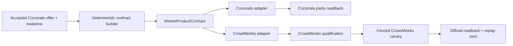

# Market Product Contract and CrowdWorks Design

## Goal

Finish the marketplace-neutral product boundary after the proven Coconala four-loop system, then
carry that same product to CrowdWorks without duplicating product judgment. Lancers is excluded from
this sequence because another owner is implementing it.

## Scope and order

1. Persist one `MarketProductContract` from an accepted Coconala Storefront offer.
2. Render that contract through a thin Coconala adapter and verify parity with the accepted offer.
3. Render and independently qualify the same contract through a thin CrowdWorks adapter.
4. Publish one fenced CrowdWorks canary through its installed owner, require exact official readback,
   and prove replay produces no duplicate effect.

Fiverr and Lancers adapters are not part of this sequence. The existing Apply, Reply, Storefront, and
Paid loops remain independent owners and are not combined or serialized.

## MarketProductContract

The contract is one versioned JSON document with no marketplace identifiers or form fields. It stores:

- stable product identity and version;
- buyer job and delivery kind;
- inclusions, exclusions, and buyer inputs;
- artifact acceptance criteria;
- base price and currency;
- recurring-support boundary;
- capability evidence references;
- paid-demand evidence references, with unknown remaining explicit;
- originality provenance proving that marketplace observations informed judgment without contributing
  competitor-owned prose, images, or identity.

The existing accepted Storefront offer and its evidence receipts are the source. A deterministic
builder performs mapping, validation, hashing, and atomic persistence only; it does not invent or rank
product claims. The existing Storefront model remains responsible for product judgment.

## Storage and flow

Persist one canonical JSON file under the Storefront private bundle's contracts directory. Storefront
writes it only after an offer has passed the existing proposal, capability, originality, and official
readback gates. Re-running with identical source evidence produces the same contract hash and no
duplicate append or external effect.

## Adapter boundary

Adapters may map title/body fields, platform categories, currency representation, length limits, and
official identifiers. They may not change the buyer job, delivery, scope, acceptance criteria, price
meaning, evidence, or originality provenance. Platform-specific demand evidence stays separate;
Coconala performance never proves CrowdWorks demand.

## Failure behavior

Missing required source evidence produces an explicit no-effect validation receipt. Unknown
CrowdWorks demand remains unknown. Authentication or official-page failure affects only the
CrowdWorks owner; it does not block or pause the four Coconala owners. Every external write is fenced
before submission, confirmed by exact official readback, and replayed with zero duplicate effect.

## Acceptance

- One schema-valid marketplace-neutral contract exists without a Coconala service ID, category ID,
  URL, or form field.
- Rebuilding from the same accepted offer is idempotent.
- Coconala rendering matches the accepted offer without moving product judgment into the adapter.
- CrowdWorks qualification uses current CrowdWorks evidence and never inherits Coconala demand.
- One installed CrowdWorks owner publishes a fenced canary, exact official readback matches the shared
  contract, and replay is effect-zero.
- The four Coconala owners remain independently scheduled and running throughout.

## Minimal implementation target

S11 is limited to one schema, one small deterministic builder/persistence path, and the smallest
focused existing check that proves validation and idempotence. S12-S14 are separate later slices.
No database, framework, compatibility layer, new agent, or generalized marketplace registry is added.
