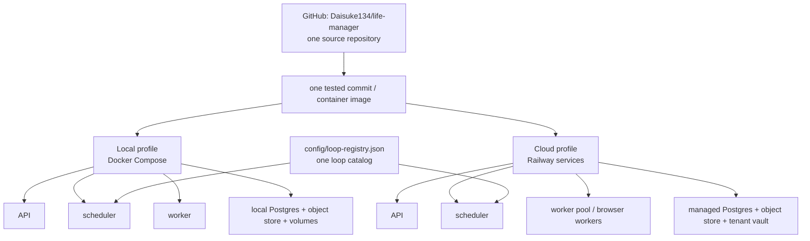

# Life Manager one-repo / two-runtime design

状態: DIRECTION APPROVED — architecture and ordered TODO are canonical; portability implementation remains incomplete

正本範囲: Life Manager の source、loop配置、local/self-hosted runtime、cloud runtime、portable install boundary

既存順序との関係: 本書は
[`2026-08-28-life-manager-cloud-on-time-core-finish.md`](../plans/2026-08-28-life-manager-cloud-on-time-core-finish.md)
と
[`2026-07-19-anicca-one-repo-consolidation-spec.md`](./2026-07-19-anicca-one-repo-consolidation-spec.md)
の確定順序を変更しない。現在状態は既存progress/SSOTだけを更新し、本書へ複製しない。

## 0. Authority and supersession

| Topic | Authority |
|---|---|
| Product/repository/runtime topology | this spec |
| Cloud launch behavior and MUST/DO NOT | `2026-08-26-life-manager-cloud-on-time-core-design.md` |
| Cloud implementation order | `2026-08-28-life-manager-cloud-on-time-core-finish.md` |
| Cloud measured status | matching `.superpowers/sdd/.../progress.md` |
| Portable migration order | `2026-07-19-anicca-one-repo-consolidation-spec.md` |
| Telegram/Mini App owner experience | `2026-08-28-life-manager-cloud-telegram-product-ux-design.md` |

This spec supersedes any older requirement that ElizaOS, OpenClaw, Hermes or another agent framework must be the
shared Life Manager runtime. They may be optional adapters, never required source or a second control plane. The
existing deterministic claim, policy, effect, readback and receipt core remains authoritative during migration;
there is no launch-blocking framework rewrite.

## 1. 単一判断

Life Manager は一つのOSS product、一つのGitHub repository、一つのcodebaseである。
Local/self-hosted版とcloud版は別version・別repo・別loop実装ではない。同じcommitから同じcore、loop
entrypoint、schema、receipt contractを実行する二つのdeployment profileである。

- **Local/self-hosted:** ownerのdevice上でAPI、scheduler、worker、database、object storeを動かし、private
  dataはownerのvolumeに置く。
- **Cloud:** 同じimageをAPI、scheduler、workerへ分けて常時稼働し、tenant-scoped database、object store、
  vault、hosted browserを使う。
- **Client:** Telegram、Mini App、browser、phoneはどちらのruntimeにも接続できる。phoneだけでcloudを使えるが、
  phone自体がserverを動かすという意味ではない。

用語を次のように固定する。

- **OSS:** source/license/distributionの形態であり、稼働場所ではない。
- **Local:** ownerのpersonal device上で動くsingle-owner deployment。
- **Self-hosted:** ownerが管理するMac、Linux、Windows/WSL2またはserver上のsingle-tenant deployment。
- **Cloud:** Life Managerが管理するalways-on multi-tenant deployment。



## 2. Canonical repository tree

```text
life-manager/
├── apps/
│   └── life-manager/          # shared API, Telegram, Mini App, scheduler and worker core
├── skills/                    # shared capabilities and provider adapters
├── runtime/
│   ├── loop/                  # loop lifecycle, dispatch and supervisor adapters
│   └── agent-runner/          # model-backed work boundary
├── bin/                       # repository-owned lifecycle commands and loop entrypoints
├── services/                  # independently deployed services from the same repository
├── tools/                     # repository-owned supporting entrypoints
├── config/
│   └── loop-registry.json     # every shipped loop; schedule + repository-relative entrypoint
├── deploy/
│   ├── local/                 # Docker Compose self-host profile
│   └── cloud/                 # target: cloud service declarations from the same image
├── scripts/
│   ├── local-up.sh            # local lifecycle entrypoint
│   └── bootstrap*.sh          # onboarding entrypoints
├── docs/                      # current specs, runbooks and evidence
└── tests/
```

Runtime data never belongs in this tree:

```text
Local host                         Cloud project
~/.local/state/life-manager/       managed Postgres / object store
~/.config/life-manager/            tenant-scoped secret vault
Docker named volumes               worker/browser session volumes
```

Credentials, OAuth sessions, browser profiles, logs, ledgers, receipts and user data remain outside Git.

## 3. Where loops live

A loop has one source definition, not a local copy and a cloud copy.

1. `config/loop-registry.json` owns its stable ID, cadence, entrypoint and lifecycle metadata.
2. The entrypoint is a tracked repository-relative file; current valid roots include `apps/`, `skills/`, `runtime/`,
   `bin/`, `services/` and `tools/`.
3. In the target contract, the scheduler claims a due loop and dispatches that same entrypoint to a worker. Today,
   the local Compose scheduler starts a smaller built-in set directly; full registry dispatch remains TODO.
4. Mutable job state, leases, receipts and evidence are stored through the runtime state adapter.
5. Provider effects are complete only after provider-owned readback; process exit is not success.

| Concern | Local/self-hosted | Cloud | Shared contract |
|---|---|---|---|
| Code | checked-out commit / local image | image built from the same commit | repository-relative entrypoint |
| Scheduler | Compose `scheduler`; macOS `launchd` only for device-bound optional loops | resident scheduler or platform cron | registry cadence + single-writer lease |
| Workers | Compose worker on owner device | horizontally scalable worker services | capability claim + idempotency key |
| State | local Postgres and named volumes | managed tenant-scoped Postgres/object store | same schemas and receipt vocabulary |
| Secrets | owner-controlled secret store | tenant vault | `secret://` references only |
| Browser | local owner browser/profile when required | hosted isolated browser worker | same provider adapter/readback |
| Reports | owner's Telegram bot | hosted tenant Telegram bot | common outbox + provider message ID |

`launchd` is a macOS supervisor adapter, not the Life Manager architecture. Linux may use Docker restart policies
or a later systemd adapter; Windows uses Docker Desktop/WSL for the server profile. A loop that requires macOS UI,
a local browser session or Apple-only integration must declare that capability and cannot be advertised as portable
until a cloud or cross-platform adapter exists.

## 4. Startup flows

### Local/self-hosted

```bash
git clone https://github.com/Daisuke134/life-manager ~/life-manager
cd ~/life-manager
./scripts/local-up.sh
```

The command builds the shared runtime image and starts Postgres, object store, migration, API, scheduler and worker
from [`deploy/local/compose.yaml`](../../../deploy/local/compose.yaml). Local state survives container recreation in
named volumes. Optional external-effect loops remain off until the owner selects them and supplies the required
credential references.

### Cloud

```text
push/merge main
  -> build the same repository commit
  -> deploy API + scheduler + worker roles
  -> attach managed state, object storage and tenant vault
  -> expose Telegram/Mini App/webhook endpoints
```

Cloud changes hosting and operations, not business semantics. It provides always-on compute, upgrades, monitoring,
backups and hosted browser capacity. It must not create cloud-only loop logic or weaken local receipt gates.

## 5. Portability promise

The target promise is: a user can clone one public repository, run documented commands on a supported host, connect
their own accounts, and receive the same Life Manager behavior without any Dais-specific checkout or private source
tree.

The repository may claim this only when a clean-machine test proves it. Today, the Docker server stack exists, but
not every catalog loop is portable: some production paths still depend on macOS `launchd`, host browser profiles,
OpenClaw, or local legacy directories. Those are migration TODOs, not hidden prerequisites.

Initial supported server matrix:

- macOS with Docker Desktop: supported target, including optional host-native adapters;
- Linux with Docker Engine + Compose: supported target for container-capable loops;
- Windows with Docker Desktop/WSL2: supported target for container-capable loops;
- iOS/Android: client surface only; use the cloud runtime or another always-on host.

## 6. Ordered implementation TODO

Do not create a second portability backlog. The canonical immutable order is the existing one-repo program order:

```text
BROWSER-MATRIX-1
  -> BROWSER-HANDOFF-1
  -> BROWSER-RECOVERY-1
  -> LOCAL-CLOUD-PARITY-1
  -> CLOUD-LOOPS-1
  -> LIFE-OUTCOMES-1
  -> LEGACY-RETIRE-1
  -> DEV-E2E-1
  -> OPS-PANEL-1
```

This design contributes the following acceptance to those existing atoms; it does not reorder them or duplicate
their live status:

| Existing atom | Required contribution from this design |
|---|---|
| `BROWSER-MATRIX-1` | classify local and hosted browser capabilities without a framework dependency |
| `BROWSER-HANDOFF-1` | hand off the same job identity and receipt contract between browser workers |
| `BROWSER-RECOVERY-1` | resume after worker/browser loss without duplicate provider effect |
| `LOCAL-CLOUD-PARITY-1` | same commit, loop ID, entrypoint, fixture and receipt on local and cloud |
| `CLOUD-LOOPS-1` | deploy repository-owned API, scheduler and worker roles; no second loop implementation |
| `LIFE-OUTCOMES-1` | prove owner-visible outcomes from official provider receipts on both runtimes |
| `LEGACY-RETIRE-1` | remove required OpenClaw, Hermes, `anicca`, `anicca-oss`, worktree and absolute-source dependencies |
| `DEV-E2E-1` | prove clean clone-to-healthy on the declared macOS/Linux/Windows-WSL2 support matrix |
| `OPS-PANEL-1` | expose runtime, blocker, receipt and version truth without making the panel a second authority |

Within `LOCAL-CLOUD-PARITY-1` through `DEV-E2E-1`, the implementation must also converge Telegram onto one durable
outbox with provider message-ID receipts, make state/secrets externally configurable, and fail closed for unsupported
host capabilities. The cloud launch-core plan keeps its own active order; production cutover waits for its existing
acceptance and is not moved by this document.

## 7. Acceptance

Complete means all of the following are measured, not inferred:

- one public repository contains every required executable source and deployment declaration;
- local and cloud build from the same pushed commit and run the same loop IDs/entrypoints;
- no active runtime references another checkout, worktree or `~/.../skills` source tree;
- clean supported hosts reach healthy API, scheduler and worker using documented commands;
- each runtime resumes after restart without duplicate effects;
- platform-specific loops declare their capability instead of failing mysteriously;
- local data stays local by default, cloud data is tenant-scoped, and no secret enters Git;
- Telegram and external effects retain provider-owned message/effect receipts on both surfaces.

## 8. External design evidence

- Docker Compose defines and runs a multi-container application from one YAML model and supports development,
  testing, staging, production and CI: <https://docs.docker.com/compose/>.
- Railway services are container deployment targets and can use a GitHub repository, Docker image or local directory;
  persistent services and scheduled jobs are separate service types: <https://docs.railway.com/guides/services>.
- Apple documents `launchd` as the macOS daemon/user-agent manager, including timed jobs under LaunchAgents and
  LaunchDaemons; it is therefore an OS adapter rather than a portable loop definition:
  <https://developer.apple.com/library/archive/documentation/MacOSX/Conceptual/BPSystemStartup/Chapters/CreatingLaunchdJobs.html>.
