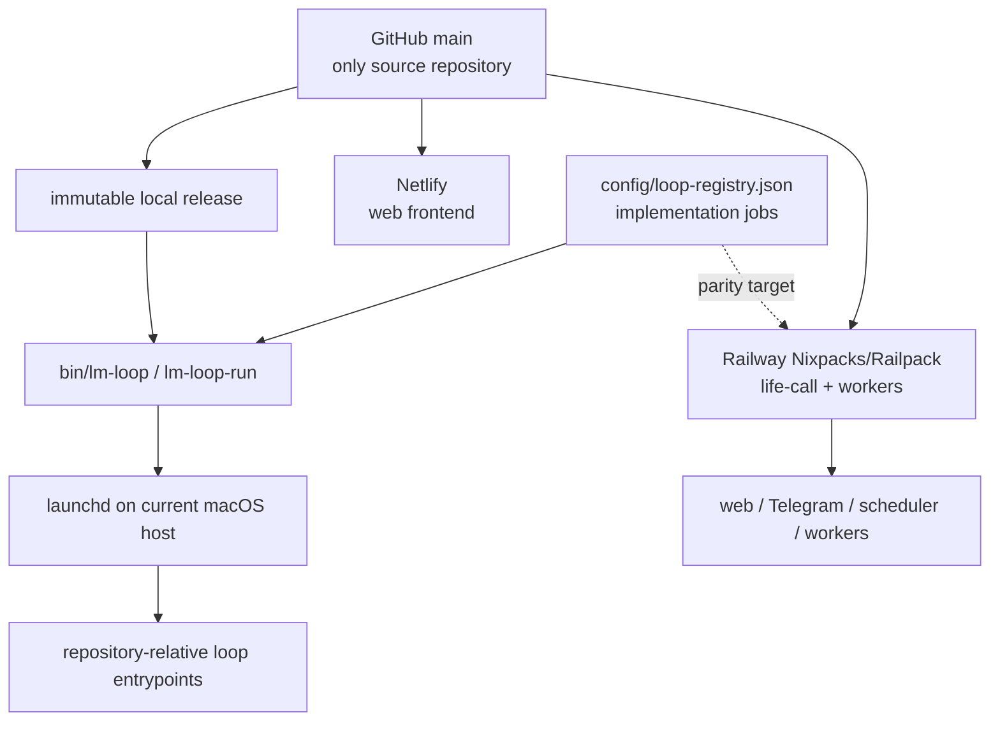

# Life Manager one-repo / two-runtime design

状態: CURRENT RUNTIME VERIFIED — portability implementation remains incomplete

正本範囲: Life Managerのsource、14 product loops、Money Printer umbrella、local/self-hosted runtime、cloud runtime、portable install boundary

本書は既存の実装順序を変更しない。進捗の正本は既存spec/task listのままとする。

## 0. Corrected runtime truth

Life Manager is one open-source product in one GitHub repository. Local/self-hosted and cloud are two deployment
surfaces, not two codebases. They share product contracts and repository-owned entrypoints, but they do **not**
currently run through Docker Compose or one identical container image.

| Surface | Verified current runtime | Docker status |
|---|---|---|
| Mac production loops | immutable main-derived release → `lm-loop-run` → Python/Node/shell entrypoint, supervised by `launchd` | no Docker/Colima daemon or socket; no loaded loop references Docker |
| Selling cloud product | Netlify web frontend; Railway `life-call` and worker roles built from `apps/life-manager` with Nixpacks/Railpack; managed state and hosted browser services | Railway exports OCI images internally, but the product uses neither the checked-in runtime Dockerfile nor Compose |
| Retired local Compose profile | no runtime owner | removed because neither Mac production nor the selling cloud product invoked it |

Some supporting Railway services retain their own checked-in Dockerfiles. They are separate deployment owners and
do not make Docker or Compose a Life Manager local requirement.

## 1. One product, two execution surfaces



- **Local today:** single-owner direct processes on macOS. Code comes from an immutable pushed-main release; mutable
  state, credentials, logs, ledgers, receipts, sessions and browser profiles live outside Git.
- **Cloud today:** the same repository supplies the Netlify frontend and Railway application/services. Cloud owns
  always-on compute and tenant-scoped managed state.
- **Portable self-host target:** a clean clone plus documented host adapter starts supported loops without another
  checkout, OpenClaw, Hermes, Dais-specific paths or private source. macOS is the only verified full production host
  today; Linux and Windows support must be proven before it is advertised.
- **Phone:** a client for cloud or another always-on self-hosted server, not the server itself.

## 2. Canonical repository and runtime tree

```text
life-manager/                         # one GitHub repository
├── apps/
│   ├── life-manager/                # cloud web, Telegram, scheduler and worker core
│   └── landing/                     # Netlify frontend
├── skills/                          # product capabilities and provider adapters
├── runtime/
│   ├── loop/                        # lifecycle, dispatch and runtime events
│   └── agent-runner/                # model-backed work boundary
├── services/                        # independently deployed supporting services
├── bin/                             # lm-loop and repository-owned commands
├── tools/                           # support entrypoints
├── config/loop-registry.json        # implementation/support job registry
├── scripts/                         # onboarding and operational scripts
└── docs/                            # specs and runbooks

outside Git (local)                  managed by cloud providers
├── ~/.local/state/life-manager/     ├── tenant-scoped database/object state
├── credential store                ├── service secrets
├── logs, receipts and ledgers       └── isolated hosted browser/session state
└── browser profiles
```

This is both the target source boundary and the post-cleanup repository shape. Product state, credentials, logs,
browser sessions, receipts and ledgers stay outside Git by design; they are not stray source folders.

The desired developer filesystem is one working folder, `life-manager-main`, connected to the one
`Daisuke134/life-manager` repository. Dedicated temporary worktrees may exist while a change is being developed;
they are removed after merge and are never runtime dependencies.

## 3. The 14 product loops and Money Printer umbrella

The product catalog contains 14 user-facing loops. The count is not a process count: `config/loop-registry.json`
contains many smaller lifecycle IDs because one product loop can need application, browser, reporting,
reconciliation and health jobs.

1. Gig — Coconala
2. Gig — Lancers
3. Gig — CrowdWorks
4. Writer
5. Affiliate
6. Investment / Alpaca
7. Agent Economy
8. Job Hunter
9. Fundraiser
10. Connector
11. Life Manager Cloud
12. Life Manager Mobile Apps — Anicca iOS, Honne and the other owned iOS apps; build, marketing, distribution and measurement
13. Capafy
14. CFO

The README owns the human-readable purpose and representative current runtime owners for each product loop. The
registry owns executable loop IDs.

**Money Printer is not a fifteenth loop.** It is the umbrella name for the system in which all revenue-producing
loops discover work or demand, execute it, verify the provider outcome, reconcile revenue through CFO, and improve.
The `/money-printer` control room is the cross-loop view of that system, not a separate business loop competing with
Coconala, Lancers, Writer, Capafy, Cloud, or the other earning loops. Connector and shared infrastructure may support
the system without being independently revenue-producing.

## 4. Where loop code lives and how it starts

1. A registry-managed job has one stable ID in `config/loop-registry.json` and one repository-relative entrypoint.
2. Current valid source roots include `apps/`, `skills/`, `runtime/`, `bin/`, `services/` and `tools/`; there is no
   separate local-loop copy or cloud-loop copy.
3. On the Mac, a pushed `main` commit becomes a read-only release. `bin/lm-loop` applies selected jobs and `launchd`
   wakes `lm-loop-run`, which dispatches the release-pinned entrypoint.
4. In cloud, Railway starts the roles declared under `apps/life-manager`; `life-call` owns the web/Telegram endpoint
   and in-process cloud scheduling, while worker roles claim supported work.
5. A process exit is not business success. Provider-owned readback and a durable receipt are required.

Safe read-only local inspection:

```bash
jq -r '.loops | keys[]' config/loop-registry.json
./bin/lm-loop status all
./bin/lm-loop doctor
```

Cloning does not automatically install effectful loops. Apply/start is an operator action from an immutable release
after required credentials and host capabilities are configured.

### 4.1 Current reuse truth

The loops do not yet follow one common physical folder shape. Source is distributed across `skills/`, `apps/`,
`runtime/`, `services/` and `tools/`. All 175 managed registry entrypoints exist, and the main local lifecycle and
agent runner are shared, but four declaration/execution systems remain:

1. `config/loop-registry.json` + `runtime/loop` for macOS release and lifecycle;
2. `apps/life-manager/config/loop-adapters.json` + the Postgres job store for cloud adapters;
3. `skills/registry.json` + `runtime/loop/index.mjs` for agent-economy slots;
4. five legacy `loops/*/loop.toml` declarations + `bin/plistgen.py`.

Reuse already working:

- immutable main-derived releases, `lm-loop`, runtime events and the shared agent runner;
- repository-relative entrypoints and explicit state roots;
- marketing generation/publication components for multiple Anicca iOS and Honne lanes;
- the shared marketplace profile/contracts layer used by part of the gig family.

Reuse still missing:

- one manifest and one lifecycle owner for every loop;
- one job/effect/receipt/outbox contract across file, SQLite and Postgres backends;
- one browser lease/target-owner contract across Connector, Gig and Job Hunter;
- one generic mobile-app build/marketing boot path instead of many nearly identical wrappers;
- one gig adapter shape across Coconala, Lancers and CrowdWorks;
- removal of legacy installers, handwritten dispatch maps and external source paths.

### 4.2 Ideal common loop structure

Every product loop uses the same shell. Domain differences live only in a thin adapter and business skill.

```text
loops/
└── <domain>/<loop-id>/
    ├── loop.json                 # ID, cadence, deployment, command/adapter, state, effects
    └── adapter.{py,js,sh}        # thin domain/provider adapter

runtime/
├── control/                      # registry, immutable release, lifecycle, supervisor adapters
├── agent-runner/                 # model-agnostic agent execution
├── browser/                      # lease, target ownership, local/hosted browser adapters
├── contracts/
│   ├── loop-event.schema.json
│   ├── job.schema.json
│   ├── effect.schema.json
│   ├── receipt.schema.json
│   └── outbox.schema.json
└── durable/
    ├── file/                     # local JSONL/SQLite backend adapters
    └── postgres/                 # cloud backend adapter

skills/<domain>/                  # business judgment, prompts and provider-specific tools only
apps/life-manager/adapters/       # cloud API/UI adapters only
```

`loop.json` becomes the only hand-edited declaration. Local and cloud use the same loop ID, adapter, agent/tool
contract and receipt vocabulary. They may use different supervisor, browser and storage backends. Existing mutable
ledgers are not bulk-moved merely to make folders look uniform.

## 5. Dependency boundary

Every required executable, adapter, schema, prompt and lockfile must live in this repository. An active runtime may
not import code from OpenClaw, Hermes, an Eliza migration folder, another checkout, a worktree or a home-directory
skills tree. External services are allowed only through explicit APIs or host adapters with repository-owned code.

OpenClaw-dependent and absolute-path production jobs are current migration debt, not part of the target. Unused
runtime choices must not remain presented as active architecture. The unowned local Compose stack and its orphaned
container guardian are removed; Railway `internal-worker` and independently owned service Dockerfiles remain.

## 6. Ordered implementation TODO

The established order remains unchanged:

```text
BROWSER-MATRIX-1
  -> BROWSER-HANDOFF-1
  -> BROWSER-RECOVERY-1
  -> LOCAL-CLOUD-PARITY-1
  -> CLOUD-LOOPS-1
  -> LIFE-OUTCOMES-1
  -> LEGACY-RETIRE-1
  -> DEV-E2E-1
  -> OPS-PANEL-1
```

| Existing atom | Required contribution |
|---|---|
| `BROWSER-MATRIX-1` | classify local and hosted browser capabilities without a framework dependency |
| `BROWSER-HANDOFF-1` | hand off the same job identity and receipt contract between browser workers |
| `BROWSER-RECOVERY-1` | resume after worker/browser loss without duplicate provider effect |
| `LOCAL-CLOUD-PARITY-1` | prove the same pushed source, product behavior and receipt contract on both surfaces |
| `CLOUD-LOOPS-1` | converge supported cloud jobs on repository-owned entrypoints without a second implementation |
| `LIFE-OUTCOMES-1` | prove owner-visible outcomes from official provider receipts on both runtimes |
| `LEGACY-RETIRE-1` | remove required OpenClaw, Hermes, migration-folder, worktree, absolute-source and unchosen runtime dependencies; delete the inactive Compose profile unless a real supported owner is proven |
| `DEV-E2E-1` | prove clean clone-to-healthy on each host before claiming support |
| `OPS-PANEL-1` | expose runtime, blocker, receipt and version truth without creating a second authority |

### 6.1 Atomic shared-architecture and cleanup checklist

This checklist does not reorder the product TODO above. It is the fixed internal order used when the corresponding
shared-component or legacy-retirement atom is active.

- [x] `CLEAN-01` Verify Mac loops use immutable releases/launchd and Cloud uses Netlify + Railway Nixpacks/Railpack.
- [x] `CLEAN-02` Correct the 14-loop catalog; define Money Printer as the earning-loop umbrella.
- [x] `CLEAN-03` Classify the local Compose stack, runtime image and container guardian as unowned.
- [x] `CLEAN-04` Remove Compose YAML/env, runtime Dockerfile, Compose CLI, Compose-only scheduler/liveness code and orphan guardian while retaining Railway `internal-worker`.
- [x] `CLEAN-05` Pass focused Node/Python tests, static reference fence and Mac `lm-loop doctor`; confirm Railway `life-call` health and Netlify `/lm` both return HTTP 200 after the source cleanup.
- [x] `WT-01` Inventory all 75 registered worktrees with path, branch, lock, dirty state, PR, merge status and active process owner.
- [x] `WT-02` Attempt exact-path cleanup only after a same-command preflight. The two audit candidates became locked before execution, so fail closed and remove zero; never force-remove, unlock or delete dirty/unmerged/active paths.
- [x] `WT-03` Confirm dry-run prune has no eligible metadata and retain 75 paths: 65 locked plus 10 active/open-PR/unmerged/ignored-state paths.
- [ ] `WT-04` Add an owner/expiry/heartbeat policy for task worktree locks, then have each owner retire its merged clean worktree; re-audit before every exact removal.
- [ ] `ARCH-01` Freeze the current 175 managed, 22 external, 48 retired and cloud-adapter inventory with owner and last receipt.
- [ ] `ARCH-02` Add one `loop.json` schema generated from the current registry; do not create a second hand-edited source.
- [ ] `ARCH-03` Add validated `command`/`adapter` fields and migrate one low-risk loop end to end.
- [ ] `ARCH-04` Migrate the remaining handwritten dispatch entries one at a time; verify label, argv, state root and receipt after each; delete `entry_dispatch.py` when empty.
- [ ] `ARCH-05` Migrate the five legacy `loop.toml` declarations; delete the second plist generator/declaration path.
- [ ] `ARCH-06` Define common job, event, effect, receipt and outbox schemas without moving existing databases.
- [ ] `ARCH-07` Extract one browser lease/target-owner contract; migrate Connector, then Gig and Job Hunter after live readback.
- [ ] `ARCH-08` Adapt file/JSONL, SQLite and Postgres persistence behind the common contracts.
- [ ] `ARCH-09` Replace the Anicca iOS/Honne per-lane boot wrappers with one product-aware mobile-app command and manifest.
- [ ] `ARCH-10` Retire Lancers and other legacy installers after registry-only ownership is proven; align all gig providers to the same adapter shell.
- [ ] `ARCH-11` Remove external checkout/worktree/OpenClaw/Hermes code dependencies and move required source into this repository.
- [ ] `ARCH-12` Prove clean local and cloud runs use the same loop contracts with replay-zero and official provider receipts.
- [x] `DOC-01` Update English/Japanese README architecture and status from measured output; remove the Compose runtime claim and describe Mobile Apps as Anicca iOS, Honne and the other owned iOS build/marketing loops.

## 7. Acceptance

Complete means all of the following are measured:

- one public repository contains every required executable source and deployment declaration;
- no active runtime references another checkout, worktree, migration folder or private source tree;
- each advertised host reaches a healthy supported runtime through documented commands;
- local and cloud use repository-owned entrypoints and the same state/effect/receipt contracts;
- restart does not duplicate external effects;
- unsupported platform capabilities fail closed and are visible;
- local private data stays outside Git and cloud data remains tenant scoped;
- Telegram and every external effect retain provider-owned receipts.

## 8. Evidence used for this correction

- live Mac readback: Docker context points to Colima, but its socket is absent; no daemon/container is running; loaded
  Life Manager LaunchAgents execute immutable-release `lm-loop-run` directly;
- live Railway deployment metadata: `life-call` uses `NIXPACKS` with no repository Dockerfile path and starts
  `node server.js`; the worker uses Railpack/Nixpacks with no repository Dockerfile path;
- live cloud readback: the Life Manager endpoints are healthy and the web response is served through Netlify;
- repository declarations: `apps/life-manager/railway.toml` selects Nixpacks and retains
  `node scripts/runtime-up.js internal-worker`; the removed local Compose paths had no production owner.

Railway internally producing an OCI container image is an infrastructure implementation detail. It does not mean
that users or operators run Docker Compose, and it does not justify documenting Compose as the canonical runtime.
