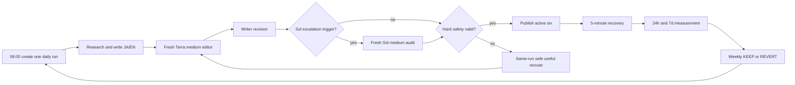
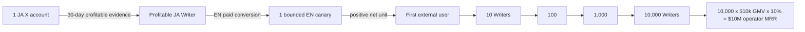

# Writer Agent — Revenue, UX, Runtime, and Roadmap SSOT

Last updated: 2026-08-05 JST

This file is the only current source of truth for the Writer Agent's objective,
user experience, revenue model, execution order, and remaining work. Historical
investigation and incident evidence remains in
`docs/loop-engineering/47-writer-loop-quality-and-self-improvement.md`, but that
file no longer defines current priorities or completion.

## 0. Objective

Build one Writer Agent that continuously discovers valuable subjects, writes,
publishes, earns directly from its writing, measures verified payments, repairs
its own interrupted runs, and reports money without ongoing human operation.

### 0.1 Canonical name and subject scope

The product and agent name is **Writer Agent**. **Writer Loop** means its
persistent execution loop. `AI Entity Article Writer`,
`ai-entity-article-writer`, and similar names are legacy runtime identifiers,
not the current product name.

The Writer has no AI-entity subject restriction. It may write about any lawful
subject when the model finds evidence of reader value, editorial demand,
product relevance, or profitable conversion. Topic selection is model judgment
from current claims, audience evidence, opportunity terms, product state, and
past economics; it is not a hard-coded subject allowlist or keyword router.

Legacy names in historical incident reports or in Anicca's separate brand
description are historical/brand facts and need not be rewritten. Active
Writer skill metadata, aliases, prompts, scheduler descriptions, state paths,
tests, and UI labels must migrate to `writer-agent` without creating a second
pipeline or breaking existing durable runs. Temporary compatibility aliases
must point to the one canonical Writer tree and be removed only after a live
resume/publish parity receipt.

The order is:

1. Prove the loop for Dais locally.
2. Reach verified $10,000 monthly revenue with one or more profitable writing
   units.
3. Package the same contract as open source and cloud software.
4. Let anyone start without supplying Google, Gmail, note, Substack, or social
   credentials by using an agent-owned identity, publication surface, and
   device-generated payment identity.
5. Scale proven units and protocol revenue toward $10,000,000 MRR.

The machine cannot guarantee demand or revenue. It must guarantee continuous
measurable attempts, honest receipts, bounded improvement, and automatic
recovery.

## 1. Product boundary

### 1.1 Article-first revenue

The initial product is the writing itself. The Writer does **not** need to turn
every article into a template, API, course, or unrelated digital product.

Before $10,000 monthly revenue, the primary money paths are:

1. A publisher pays an editorial fee for an accepted article.
2. A reader buys one paid article.
3. A reader pays a recurring subscription for continuing writing or an archive.
4. A reader pays to unlock an article on the Writer's self-owned publication.

The same Writer is also Life Manager's writing-led marketing engine. It reads
the verified state of apps, agents, skills, and other products; discovers the
reader problem each solves; publishes useful evidence-led articles; and
attributes article -> product visit -> activation -> purchase/subscription.
Product revenue is reported separately from direct writing revenue so the same
payment is never counted twice. Promotional copy without a reader job or
verified product claim is not a successful article.

Derived products are deferred. They may be proposed only after direct writing
revenue has been measured long enough to show that the target cannot be reached
efficiently, or when readers explicitly demand a reusable artifact. They are
not a prerequisite for the first payment.

### 1.2 Economic truth

"The user supplies no customers" is a valid UX requirement: the Agent must find
readers and payers itself. "No payer exists" is not a revenue model. Every
payment has an economic counterparty: a reader, publisher, advertiser,
business, marketplace, protocol, or another agent.

"The user supplies no credentials" means the system generates and safeguards
the required identity on the user's device. Ownership still requires a signing
key, passkey, wallet, or regulated payout identity. A fiat payout through
Stripe, PayPal, or a bank can require account creation and KYC. A no-account OSS
mode therefore cannot depend on note, Substack, Google, Gmail, or Stripe.

## 2. Non-negotiable runtime rules

### 2.1 No passive waiting

If safe work can run now, the Agent runs it now. A missed or incomplete daily
run is kickstarted immediately; it does not wait for the next schedule.

If one platform enforces a future publication window, only that destination is
`PENDING`. All other publication, measurement, research, and reporting work
continues.

Every wait state must record:

- exact blocked target;
- external reason;
- earliest retry time;
- durable resume owner;
- work continuing in parallel;
- Telegram event UUID.

Allowed wait reasons are limited to an externally enforced publication window,
an explicit `Retry-After`, an external editorial/payment response, or a human
legal/KYC action that cannot be delegated. "Wait for the next schedule" is not a
valid terminal state for unfinished work.

### 2.2 Same-run recovery

Failure resumes the same `run_id`, `artifact_id`, content hash, destination, and
publication intent. A new article must not hide a failed article. A replacement
is allowed only after a recorded terminal content rejection and must retain the
failed feedback.

### 2.3 Honest evidence

- A generated draft is not published.
- A URL is not live until public readback passes.
- A checkout view is not a sale.
- A test payment is not revenue.
- A view, like, or impression is not revenue.
- Missing measurement is `unknown`, never zero.
- Revenue requires a processor, platform, publisher, or public-ledger receipt.
- MRR includes active recurring contracts only; editorial fees and paid articles
  remain one-time monthly revenue.

### 2.4 Daily shipment contract

`ai.anicca.article-daily` is the sole creator of a new daily Writer run and
runs with `ARTICLE_AUTOPUBLISH=1`. `ai.anicca.article-resume` owns same-run,
per-destination recovery; claim, opportunity, money, report, and learning
workers continue on their own intervals.

The Writer improves the **same article** from reader/editorial feedback. The
maximum iteration count bounds generation cost and time; it never decides
whether the article ships. At that bound, the Agent freezes the best current
JA/EN bytes, records remaining feedback as quality debt, initializes every
currently active destination intent, and enters the publication rig. `block_freeze` is not an
allowed terminal state. A reader/editorial verdict is an improvement input, not
a publication veto.

Every daily run has one observable service-level objective: each active
destination receives a verified public URL. A destination-specific platform
failure starts immediate, bounded recovery for that destination while all other
destinations continue; it never cancels the others. A destination without
a public readback is displayed as an SLO breach with its real platform error
and recovery receipt, never as "published" or a silent pending state. Only a
verified public readback counts as published, and only an external receipt
counts as earned.

**Current divergence, owned by Task 1:** the live runtime still sets
`MAX_REROUTES = 1`, returns `block_freeze`, and prevents publication-state
initialization after the second failed quality assessment. The 2026-08-04 run
therefore produced no publication state or platform dispatch. This is an
implementation defect against this contract, not an acceptable no-shipment
outcome.

### 2.5 Active-six distribution and dormant-adapter contract

One daily Writer run freezes one Japanese article and one independently
localized English article, then derives exactly these six active destination
intents. Translation does not create a second topic or daily run.

| Destination | Language | Revenue role | Required receipt |
|---|---|---|---|
| note paid article | JA | One-time direct writing revenue | Authenticated price/paywall readback, public URL, later purchase/fee/payout receipt |
| Substack article | JA | Recurring direct writing revenue | Authenticated paid-audience/paywall readback, public URL, later contract/charge/churn receipt |
| Substack article | EN | Recurring direct writing revenue | Authenticated paid-audience/paywall readback, public URL, later contract/charge/churn receipt |
| Dev.to article | EN | Free discovery | Public title/body/media readback |
| Zenn article | JA | Free discovery | Public title/body/media readback |
| X Article | JA | Long-form acquisition | Public Article URL and rendered-body readback |

The following adapters, code, historical receipts, and state are retained but
must not create a daily publication intent while marked `DORMANT_EXPERIMENT`:

| Dormant destination | State | Reactivation gate |
|---|---|---|
| X Article EN | `DORMANT_EXPERIMENT` | Substack EN has a real attributed paid conversion, a distinct English audience/account can be measured, and 30 days of nonduplicate English topic supply exists |
| X Post JA | `DORMANT_EXPERIMENT` | X Article JA has a 30-day standalone baseline, incremental teaser-to-paid conversion can be measured, and the added cadence does not bury the Article |

X Article JA publishes at most once per JST day. English distribution remains
Substack EN and Dev.to EN until the English X gate passes. Dormant means skipped
without an SLO breach; it does not mean deleted. More posts or accounts are not
scale when they reduce reach, reader trust, or causal attribution.

This follows X's own guidance to revise for the reader, use a specific hook,
promote and pin an Article during its first 24–72 hours, and avoid platform
manipulation/spam. X Creator Revenue Sharing is an optional bonus, not the
Writer's `$10k` foundation: eligibility currently requires Premium, 5M organic
impressions in three months, 500 verified followers, a supported country,
identity verification, and a payout account; payout weighting may vary by
format. Sources: https://help.x.com/en/using-x/articles,
https://help.x.com/en/using-x/creator-revenue-sharing, and
https://help.x.com/en/rules-and-policies/content-monetization-standards.

## 3. Revenue streams

### 3.1 Current stream ledger

| Stream | What is sold | Revenue type | Current state | Account/KYC dependency | Verified amount now |
|---|---|---|---|---|---:|
| AppSignal | Accepted technical article | One-time editorial fee | A prior run reported an application submitted, but no durable submission ID, confirmation page, email, or content hash is present in the current Writer state. Runtime therefore keeps the program `VALUE_UNKNOWN` and must recover that receipt before treating it as `SUBMITTED` | Author agreement and publisher payment details | $0 |
| DigitalOcean Write for DOnations | Accepted and published tutorial | One-time editorial fee | Intake is not currently usable: the official page still says submissions are paused, and `do.co/w4do` redirects to that page instead of an application form | PayPal receive capability and DO credit exist; contract/contact details still apply. Never store the PayPal address in this SSOT | $0 |
| note | Paid Japanese article | One-time reader payment | Paid publication capability exists; attributed sales receipt absent | note creator and payout account | ¥0 verified |
| Substack | Paid subscription/archive | Recurring reader payment | $8/month tier was enabled; paid subscriber receipt absent | Substack creator plus Stripe | $0 MRR verified |
| Self-owned publication | Paid article or recurring archive | One-time or recurring reader payment | Not implemented | Default OSS mode uses device-generated identity/payment rail; fiat connector optional | $0 |
| Dev.to / Zenn / X | Free distribution | Distribution only by default | Publishing adapters exist or are under repair | Platform account | Excluded from money reward |
| Book | Reconstructed long-form writing | One-time royalty | Deferred until direct daily writing works | Store-specific | $0 |

### 3.2 Publisher fee facts

DigitalOcean's official page currently states $400 for a newly published
tutorial and $100 for an update, while a FAQ on the same page describes a
"typical" $300 payout. Payment occurs after acceptance, editing, and
publication; it is not an automatic $400 monthly subscription. The contract or
acceptance message is the final amount authority. The page also says payment is
through PayPal or DigitalOcean credit.

Source: https://www.digitalocean.com/community/pages/write-for-digitalocean

The dated DigitalOcean copy says "paused until 2025," but that stale wording is
still the live state observed on 2026-08-01 and the advertised application URL
does not open an intake form. Therefore the Writer must report it as
`CLOSED_OR_STALE`, not infer that a past date means open, and must monitor for a
real form reopening. Available PayPal and DigitalOcean-credit payout rails make
the opportunity executable after reopening; they do not make intake open now.

AppSignal publicly promises a base article rate but does not publish the amount.
Its documented process includes an author agreement, topic approval, editing,
approval, payment, and publication. Until the first acceptance states a rate,
the target contribution is `unknown`, not $400.

Source: https://blog.appsignal.com/write-for-us.html

### 3.3 Paid-writing opportunity watch

The Writer continuously discovers and re-verifies paid editorial opportunities
instead of hard-coding DigitalOcean as the only $400 path. The model evaluates
fit and expected value from official evidence; deterministic code stores and
rechecks receipts.

Each opportunity record contains:

- publisher, official program URL, application URL, and last verified time;
- intake state: `OPEN`, `CLOSED`, `PAUSED`, `STALE`, or `UNKNOWN`;
- stated fee/range, currency, whether it is per accepted article or recurring;
- topics, originality/exclusivity terms, editorial steps, and expected delay;
- payout rail, account/KYC/tax/contract requirements, and geographic limits;
- proposed article, evidence of fit, next executable action, and submission ID;
- acceptance, publication, invoice/payment, fee, and payout receipts.

The Agent checks official publisher pages first, then reputable discovery
sources, and never calls an opportunity open from a search snippet. Closed
programs remain on a low-frequency recheck list while the Agent continues
finding alternatives. A human-readable Telegram delta is sent only for a real
state change or a high-fit newly open opportunity.

Current verified opportunity matrix (2026-08-02):

| Publisher | State | Public compensation | Writer decision |
|---|---|---|---|
| AppSignal | `SUBMITTED_REPORTED_RECEIPT_MISSING`; runtime `VALUE_UNKNOWN` | Base rate promised; amount not public | Recover a real prior-submission receipt before importing `SUBMITTED`; never duplicate-submit from the chat/spec assertion alone |
| Hygraph Creator Program | `OPEN_POLICY_UNKNOWN` | Rewards/compensation stated; amount and payout rail not public | Highest-fit new lead because AI agents, MCP, GraphQL, and structured content are named topics; clarify AI-authorship policy and compensation before submission |
| Civo | `REJECTED_POLICY` | Fee agreed on acceptance; PayPal or Civo credits | Do not submit: the official call explicitly rejects AI-generated content and requires a Google Doc |
| Oracle Technical Articles | `OPEN_VALUE_UNKNOWN` | Stipend only occasionally available | Low priority; confirm commission, amount, identity requirements, and AI-authorship policy before work |
| DigitalOcean | `CLOSED_OR_STALE` | Historical page advertises $400/new article | Watch for an actual intake form; do not count or submit now |
| Better Stack | `CLOSED` | Historical $300/article | Recheck on the closed-program cadence |
| Honeybadger | `CLOSED` | Historical $500/post | Recheck on the closed-program cadence |
| Earthly | `CLOSED` | Historical $350/article | Recheck on the closed-program cadence |
| Baeldung | `CLOSED` | Historical contributor budgets shown | Recheck on the closed-program cadence |

Sources:

- https://hygraph.com/write-for-hygraph
- https://www.civo.com/write-for-us
- https://www.oracle.com/technical-resources/articles/otn-submit.html
- https://betterstack.com/community/write-for-us/
- https://www.honeybadger.io/blog/write-for-us/
- https://earthly.dev/blog/write-for-us/
- https://www.baeldung.com/contribution-guidelines
- https://github.com/rohitg00/technical-writing-websites

Runtime commit `83afe1b` turns replacement discovery into a bounded durable
loop. The index is discovery input only: its publisher names and claimed fees
are never treated as official evidence. One 2026-08-02 JST manual wake parsed
127 canonical candidates, then verified the five highest claimed-value unseen
URLs from their full official pages. Corellium and Airbyte became
`REJECTED_POLICY`; Retool, Fauna, and Argot became `VALUE_UNKNOWN`. The live
`ai.anicca.writer-opportunity-discovery` LaunchAgent is `RunAtLoad`, runs every
86,400 seconds, was kicked immediately, and exited `0` after verifying the next
five candidates: CircleCI, Neptune.ai, Clubhouse.io, Draft.dev, and Architect,
all honestly parked at `VALUE_UNKNOWN`. It never fabricated an open compatible
program or a pitch. Candidate URL and DNS boundaries reject localhost, private,
link-local, internal-suffix, and nonstandard-port direct-fetch targets; one
unavailable candidate cannot stop the remaining budget. The latest discovery
receipt contains the index SHA-256, candidate IDs, official URLs, durable
opportunity IDs, outcome, reason, and exact attempted/verified/unavailable
totals.

Runtime commit `8572122` makes the same daily wake advance existing supply
before adding more. State-specific deterministic cadences recheck at most five
due programs per wake (`VALUE_UNKNOWN` after seven days;
`CLOSED`/`REJECTED_POLICY`/`EXPIRED` after thirty; newly actionable states
daily), isolate a failed publisher, and persist a separate recheck receipt.
After discovery, each `POLICY_CLEAR` program may receive one model-proposed
pitch only when deterministic code binds it to an unused durable claim ID, the
claim's exact canonical source URL and reader job, and a structured title and
angle. A database uniqueness boundary prevents that claim from entering a
second pitch. Only then may the state become `PITCH_READY`; no submission state
is allowed without external submission evidence. The first live aggregate
wake exited `0` with zero due rechecks, five of five official candidates
verified, and zero eligible pitches. The zero is evidence of correct refusal,
not simulated progress: all five were `VALUE_UNKNOWN`, so the Agent generated
nothing and advanced nothing.

Runtime commit `912074b` prevents unavailable high-value index entries from
starving unseen programs. A failed candidate waits at least twenty-four hours,
is attempted at most three times, and then becomes `EXHAUSTED` with its reason
preserved. The immediate live wake therefore skipped the same-day unavailable
rows, verified five unseen official pages, and exited `0`: Okta and Algolia
became `VALUE_UNKNOWN`; Bugsnag, Honeycomb, and Teleport became `CLOSED`.

Runtime commit `80eb909` adds the first live compatible replacement program.
The TECHi Author Program is verified from its official application, editorial
standards, and publication-principles pages as open, paid by a flat rate per
accepted piece plus traffic revenue share, and paid monthly through Stripe.
Its official rules permit writers to use workflow software, require material
automation disclosure, and require human editorial review before publication.
The exact flat rate is set in later payment terms, so the Writer may spend one
bounded pitch to obtain those terms but may not begin the article without an
acceptance receipt. The live state advanced through `POLICY_CLEAR` to a
deduplicated `PITCH_READY` bound to GitHub's official stacked-Copilot-sessions
claim. The Agent generated a free TECHi account credential in its local auth
vault and reached the official email-verification screen; the Gmail read-only
check currently has no delivered message, so the opportunity remains
`PITCH_READY` and is not falsely marked `SUBMITTED`.

Runtime commit `4490e49` persists the supporting official policy URLs with the
opportunity and passes them back into every due recheck. A live re-verification
read the same three TECHi pages, retained `PITCH_READY`, returned
`UNCHANGED_ACTIVE_APPLICATION`, and stored both canonical supporting URLs;
future wakes therefore cannot silently forget the AI/payment evidence by
reading only the application page.

The opportunity subsystem is a stateful loop, not a periodic search report:

```text
DISCOVER official calls, RSS, GitHub, and reputable indexes
  -> VERIFY live form, fee, terms, payout rail, identity/KYC, AI policy
  -> DECIDE fit and expected value with the model
  -> STORE evidence and deduplicate publisher + proposal
  -> CLARIFY unknown policy/rate before producing speculative work
  -> PITCH only when policy-compatible
  -> TRACK response and deadlines
  -> WRITE only after the call's required acceptance point
  -> SUBMIT / PUBLISH / PUBLIC READBACK
  -> RECEIVE publisher or payment-processor receipt
  -> LEARN from acceptance, rejection, time, cost, and received money
  -> DISCOVER again
```

The durable states are `DISCOVERED`, `VERIFIED_OPEN`, `POLICY_CLEAR`,
`PITCH_READY`, `SUBMITTED`, `ACCEPTED`, `DRAFTING`, `ARTICLE_SUBMITTED`,
`PUBLISHED`, and `RECEIVED`. Terminal or parked states are `CLOSED`,
`REJECTED_POLICY`, `DECLINED`, `EXPIRED`, and `VALUE_UNKNOWN`. Every wake first
advances due records, then discovers enough new candidates to restore the
verified-open opportunity floor. Code schedules, fetches, deduplicates, and
stores receipts; the model judges topic fit, originality, policy meaning, and
proposal quality from the full official evidence. No keyword allowlist decides
market fit.

### 3.4 Reader payment facts

note officially supports paid individual articles, memberships, paid magazines,
and recurring magazines. The first Writer target is the paid individual article;
subscriptions are measured separately.

Source: https://note.com/monetization-guide

Substack publishing is free, but paid subscriptions incur a 10% Substack fee in
addition to Stripe processing and Billing fees. Gross MRR and net MRR must both
be reported.

Source: https://support.substack.com/hc/en-us/articles/360037607131-How-much-does-Substack-cost

### 3.5 Revenue-demand topic supply

`claim-watch.json` is an evidence adapter, not the topic authority. A small list
of vendor feeds can prove a claim after selection, but it cannot decide what
people will pay to read. The active topic supply must begin with observed reader
demand and paid-market evidence, then retrieve fresh claims needed to answer the
selected problem.

The current implementation violates that boundary at
`skills/writer-agent/config/claim-watch.json:4-34`: its only inputs are OpenAI X,
OpenAI Python releases, Cloudflare RSS, and GitHub Blog RSS. The selector at
`skills/writer-agent/scripts/claim_supply.py:48-78` scores reader usefulness,
evidence, freshness, and non-paraphrase value, but receives no observed paid
demand, price, conversion, or purchase evidence. Removing the old subject
allowlist therefore broadens policy without broadening supply; the resulting
queue remains structurally biased toward vendor development news.

The Writer adopts proven public structures instead of inventing another feed
scraper:

- **RSSHub pattern:** source-specific routes feed one normalized observation
  contract. RSSHub provides thousands of routes and global instances; the
  Writer uses compatible adapters or the architecture, subject to its AGPL-3.0
  license, rather than hand-writing every publisher fetcher.
- **TrendRadar pattern:** aggregate multiple platforms, canonicalize URLs,
  deduplicate the same event, preserve rank/time history, compare periods, and
  cap source-family concentration. Its GPL-3.0 code is not copied into the
  proprietary runtime without license compliance; the public architecture is
  reused.
- **GPT Researcher / Open Deep Research pattern:** separate research planning,
  parallel multi-source retrieval, source compression, and cited final writing.
  Their Apache-2.0/MIT implementations are preferred copy-and-tweak candidates.
- **PostHog / GrowthBook pattern:** store a reader funnel as events and change
  one variable per experiment; keep, revert, or declare the result
  inconclusive from measured cohorts rather than prose judgment.

OSS references:

- https://github.com/DIYgod/RSSHub
- https://github.com/Sansan0/TrendRadar
- https://github.com/assafelovic/gpt-researcher
- https://github.com/langchain-ai/open_deep_research
- https://github.com/PostHog/posthog
- https://github.com/growthbook/growthbook

The normalized demand observation contains the source URL, market and language,
observation time, audience, reader problem, promised transformation, usable
deliverable, public price/paywall evidence when visible, popularity trajectory,
evidence confidence, and whether the evidence is a platform aggregate, creator
claim, or the Writer's own verified receipt. Another creator's sales claim is a
demand signal, never Writer revenue.

The live collectors cover independent evidence families rather than four
preselected technology vendors:

1. paid-market evidence from public note, newsletter, publication, and article
   offer surfaces;
2. reader pain and search/social demand from X, web search, communities, RSS,
   and public trend sources;
3. publisher briefs and paid-writing opportunities;
4. the Writer's own impressions, reads, qualified CTA clicks, purchases,
   subscriptions, refunds, churn, fees, payouts, and reader questions.

The model selects one buyer, one costly problem, one observable transformation,
one article deliverable, one price hypothesis, and one distribution path from
that evidence. Subject judgment is not a keyword allowlist. Deterministic code
only fetches, validates, normalizes, deduplicates, limits source concentration,
stores receipts, computes economics, and schedules retries.

Each selected topic receives a research plan and evidence bundle before
writing. The Writer queries multiple independent sources, tracks every claim to
its origin, separates fact from inference, and rejects a proposal that merely
paraphrases one announcement. The public section must independently help the
reader and prove the promised outcome; the paid section may deliver the exact
procedure, worked example, checklist, decision aid, or deeper evidence needed
to complete the job. This remains sale of the article itself, not a requirement
to manufacture a separate product.

Public evidence supports this contract:

- note's analysis of roughly 300,000 paid articles reports that top-selling
  practical know-how averages ¥1,842 versus ¥983 for reading-oriented work;
  length has almost no sales correlation, while the free section establishes
  the concrete outcome and why the buyer can recover the price.
  Source: https://note.jp/n/n8522197d1ced
- Lenny Rachitsky reports 15,000 free and 500 paid subscribers and $65,000
  annualized revenue in his first year; recurring weekly value, guest access to
  the target audience, occasional deep flagship work, and strong free posts
  drive acquisition.
  Source: https://on.substack.com/p/how-lenny-rachitsky-earned-65000
- Emily Atkin reports that paid conversion follows an original, consistent free
  publication and a deliberate launch; she reports over 20,000 free signups and
  over 2,000 paid-list entries, while explicitly testing price, appeals, and
  reader feedback.
  Source: https://on.substack.com/p/how-emily-atkin-turned-her-climate

These examples are evidence about mechanisms, not guaranteed conversion rates
for this Writer. Only the Writer's external receipts can promote a topic,
price, prompt, or channel into the active playbook.

### 3.6 Full-page market-reading and prompt evidence

Search snippets, titles, screenshots, and public logged-out summaries are
discovery inputs only. When a selected source is an X post or X Article, the
Writer must open the actual source in the existing CloakBrowser daily-driver
through CDP `127.0.0.1:9222`, read the rendered DOM, and persist the canonical
URL, author, observation time, body hash, extracted offer, free/paid boundary,
CTA, prompt structure, claimed metrics, and evidence class. A login banner does
not prove the Article body is unavailable; the rendered DOM is checked before
declaring an access failure. If CDP genuinely cannot supply the body, the
Writer tries the other approved acquisition paths and records the exact
failure rather than inventing the missing text.

The 2026-08-05 measured exemplars establish the first prompt-pattern evidence:

- MuchoAI's rendered X Article contains seven prompt contracts: topic mining
  from experience, experience interviewing, free/paid boundary design,
  experience-preserving drafting, article-to-X repurposing, buyer artifact
  generation, and a durable editorial workspace. Its central offer is reduced
  reader trial-and-error, not word count. Core quote: "売れているのは文章量
  ではなく『読者の試行錯誤をどれだけ飛ばせるか』".
  Source: https://x.com/MuchoAi/status/2079105435056107721
- Maron's rendered X Article contains four prompt contracts: bilingual X
  Article trend research, outline-only generation, session-grounded drafting,
  and evidence-image planning. It explicitly orders theme -> outline -> body ->
  images and says topic choice determines most of the outcome. Core quote:
  "テーマ選びの段階で、記事が伸びるかどうかの8割が決まります".
  Source: https://x.com/rimuruafi/status/2069458256238612785

These are market exemplars, not truth authorities. Their revenue and impression
claims remain creator claims until independently receipted. The Writer may
reuse the observed structures and short prompt patterns, but only the Writer's
own matched external receipts may promote a prompt version. The active prompt
registry stores `prompt_id`, version, content hash, source URL, permitted use,
article/run consumption, baseline/candidate relationship, and KEEP/REVERT/
INCONCLUSIVE outcome.

The reusable paid-writing shape is:

```text
specific costly problem or desired result
  -> evidence and concrete numbers
  -> why prior attempts fail
  -> reproducible procedure
  -> copyable prompt/template/checklist/decision aid
  -> failure modes and correction path
  -> next reader action
  -> purchase or recurring subscription
```

Prompts and templates embedded in the paid section remain writing content. They
do not create a separate derived-product business. Writer revenue is payment
for the article/archive or commissioned writing. Affiliate commission belongs
to the separate Affiliator ledger even when both Agents observe the same market
source or use the same editorial technique.

## 4. First $10,000 monthly revenue model

The following is a planning allocation, not a forecast. Actual allocation must
be replaced by measured receipts. Planning conversion uses ¥150/$ and displays
gross and net separately.

| Stream | Example monthly target | Required event | Why it exists |
|---|---:|---|---|
| Paid publisher articles | $1,000 | Accepted articles totaling $1,000; opportunity-dependent, never assumed | Useful one-time cash, but current compatible open supply is too weak to be the foundation |
| note paid articles | ¥300,000 gross (~$2,000) | 600 purchases at ¥500, or an equivalent price/volume mix | Direct sale of the Japanese article itself |
| Substack subscription | $2,000 gross MRR | 250 active paid readers at $8/month | Recurring English/overseas writing revenue; AI disclosure and churn must be measured |
| Self-owned paid writing | $5,000 gross monthly | For example, 600 $5 unlocks plus 250 $8 active subscriptions | Core reader-payment surface without dependency on a creator platform |
| Total | ~$10,000 gross monthly | Verified receipts only | Initial target mix |

This mix is not a quota imposed on the Agent. Each stream begins at zero. The
Agent reallocates effort only after real conversion, acceptance, churn, fees,
and capacity are measured.

### 4.1 Stage gates

| Stage | Target | Gate |
|---|---|---|
| S-1 | Publishing alive | Three consecutive daily runs publish all currently enabled, non-window-blocked destinations; duplicate zero |
| S0 | First money | One verified non-test payment joined to an article or publisher submission |
| S1 | $400 monthly | $400 verified monthly writing revenue from any receipted mix; one publisher article may satisfy it, but it is not recurring |
| S2 | $1,000 monthly | Three consecutive revenue-positive weeks with zero manual execution |
| S3 | $10,000 monthly | Three consecutive months at or above $10,000 gross, net positive after compute/platform fees, with every dollar attributed |
| S4 | $10,000 MRR | Active recurring writing contracts total $10,000: reader subscriptions plus externally contracted recurring writing retainers; one-time editorial/article revenue remains separate |

### 4.2 $10,000 MRR composition and replacement rule

The first `$10,000 monthly revenue` gate and `$10,000 MRR` gate are different.
Paid articles and one-time publisher fees accelerate learning and cash flow but
never satisfy recurring revenue. A publisher/client contract counts as MRR only
while an external recurring retainer contract is active.

The initial planning composition is deliberately concrete, not a forecast:

| Recurring unit | Planning quantity | Gross MRR contribution |
|---|---:|---:|
| English paid writing | 600 active readers at $8/month | $4,800 |
| Japanese paid writing | 400 active readers at ¥1,500/month, planning FX ¥150/$ | $4,000 |
| One recurring commissioned-writing retainer | One active external contract | $1,200 |
| Total | 1,000 reader contracts plus one retainer | $10,000 |

Displayed MRR uses transaction currency and receipted period values; planning
FX is never silently applied to accounting. The Agent replaces this mix from
measured acquisition, conversion, renewal, churn, fees, compute cost, capacity,
and net margin. The desired steady state removes dependence on the retainer by
growing reader subscriptions, but the retainer is a legitimate early recurring
writing unit rather than affiliate or unrelated product revenue.

The repeatable path for Dais and later local/cloud users is:

```text
publishing alive
  -> first verified writing payment
  -> $400 monthly writing revenue
  -> $1,000 monthly with three autonomous positive weeks
  -> one recurring reader cohort with renewal and churn receipts
  -> $3,000 MRR
  -> $10,000 monthly revenue for three months
  -> $10,000 active recurring MRR for three months, net positive
  -> package the same identity/publication/payment/measurement contract
  -> fresh local/cloud user earns without daily human operation
```

## 5. Daily Agent loop

```text
WATCH
  Observe paid-market offers, reader problems, search/social demand, publisher
  calls, prior payments, churn, publication failures, and unanswered questions.
    |
DECIDE
  The model selects one buyer, one costly problem, one promised transformation,
  one article deliverable, one price/revenue path, and at most one experimental
  variable. It then requests the claims needed to answer that job. Code does not
  classify market judgment with keyword rules.
    |
WRITE
  Write the article for the selected reader and direct writing revenue mode.
  Do not manufacture a separate product by default.
    |
VERIFY
  Citation, editorial, reader, identity, PII, policy, and destination checks.
  Finite revisions choose the best valid draft; attempt exhaustion does not
  permanently poison a repaired article.
    |
PUBLISH / SUBMIT
  Publish available destinations immediately. Submit publisher-paid original
  work only to the selected publisher. Platform-specific waits stay isolated.
    |
READBACK
  Persist public URL, platform ID, content hash, account identity, timestamp,
  price/paywall state, and public readback receipt.
    |
MEASURE
  Join impression -> read -> paid boundary -> purchase/subscription/editorial
  acceptance -> payment -> payout. Unknown remains unknown.
    |
LEARN
  Attribute the outcome to the one changed variable. Use held-out evaluation
  and a bounded canary. KEEP or REVERT.
    |
REPORT
  Money first, then funnel, publication state, change, next action, and blocker.
```

Deterministic code owns arithmetic, receipts, idempotency, deduplication,
scheduling, and bookkeeping. The Agent owns topic, reader, article form,
revenue-stream selection, experiment choice, and interpretation.

The loop is continuously awake, but it does not continuously publish. One JST
daily artifact receives repeated research, review, recovery, measurement, and
learning work until its active-six SLO and revenue observations are closed.



| Cadence | Durable owner | Required action |
|---|---|---|
| 06:00 JST daily | daily creator | Create exactly one new run; catch up immediately if missed |
| Every 5 minutes | same-run reconciler | Resume incomplete review/publication/readback without making a new article |
| Every 15 minutes | demand and opportunity workers | Read actual source bodies, publisher state, questions, and failures |
| Hourly and on material delta | measure/report workers | Refresh funnel, received money, cost, recovery, and next action |
| 24 hours and 7 days after publish | outcome closer | Close matched outcome windows without replacing unknown with zero |
| Weekly | strategy controller | Promote only an evidence-backed KEEP; otherwise REVERT/INCONCLUSIVE |

Every article receives one fresh Terra editorial pass. Sol is not a daily
second editor. It is invoked only for an escalation trigger: medical, legal, or
financial claims; an irreversible/high-value publisher submission; a new topic
class without prior receipts; the stratified quality sample; or a weekly
strategy promotion. The first 30 articles sample exactly six Sol audits spread
across topic and language classes, in addition to mandatory risk triggers.
After calibration, the sample rate is promoted, retained, or reduced only by a
matched defect-detection and net-cost receipt. The Writer may revise at most
twice. Review feedback is quality input, not a publication veto. Only
deterministic identity, PII, citation-integrity, platform-policy, and harm
checks may block an artifact; a blocked artifact immediately reroutes within
the same run to a safe useful article. The Agent never reviews its own strategy
promotion in the context that proposed it.

### 5.1 Model, effort, and cost contract

Use the lowest effort that closes the measured quality contract. The default
production matrix is executable configuration, not a human suggestion:

| Work | Model | Effort | Call boundary |
|---|---|---|---|
| Topic selection, research synthesis, JA/EN drafting, revision | `gpt-5.6-terra` | `medium` | One resumable context per daily run; compact between phases instead of replaying the full source bundle |
| Fresh editorial review | `gpt-5.6-terra` | `medium` | One review per article; output only defect IDs, evidence, and bounded edits |
| Complex multi-source ambiguity that fails the medium rubric once | `gpt-5.6-terra` | `high` | At most one escalation for the same artifact; never automatic `xhigh` |
| Risk/high-value/sample/strategy audit | `gpt-5.6-sol` | `medium` | Zero on an ordinary article; at most one when a declared trigger is receipted |
| Safety-critical ambiguity still unresolved after Sol medium | `gpt-5.6-sol` | `high` | At most one escalation; otherwise safe reroute, not more retries |
| Deterministic extraction, normalization, formatting, receipt summaries | code first; `gpt-5.6-luna` only when judgment is genuinely required | `low` | Batched and schema-bounded; never use `xhigh` for repeatable transformation |

`max`, `xhigh`, and `ultra` are outside the daily Writer contract. Any future
use requires a versioned canary proving that its incremental received-money or
defect reduction exceeds incremental model cost. Every call records model,
effort, input/cached/output/reasoning tokens, latency, phase, artifact, retry,
and attributable cost. Cost per published article and Sol-escalation rate are
visible in Money Control and participate in KEEP/REVERT.

**Current divergence, owned by Task 3:** the live model runner now defaults to
`gpt-5.6-terra` with `medium`, and the live editorial gate spends at most one
Terra-high evaluation after a changed draft follows a medium FAIL. It does not
yet implement receipted Sol routing or per-call token/cost accounting. Claude
Sonnet remains the classified fallback until those later slices replace the
fallback contract.

Implementation slice `docs/writer-agent/plans/2026-08-05-terra-medium-runtime.md`
starts with only the executable Terra-medium default. Its isolated runtime
worktree is `profitable-claude/.worktrees/writer-terra-medium`. The measured
pre-change repository baseline was `336/368 passed`; all 32 failures were
outside Writer (Gig/CEO/clip/agent-runner/video families). Runtime commit
`fe894b31` was promoted to live checkout commit `9baf58e5` and both are pushed.
The command-contract test first failed on captured `gpt-5.6-luna`, then passed
`1/1` after the two-default change. Two isolated real Codex judge E2Es—feature
worktree and live path—returned exactly `TERRAMEDIUM`, exit `0`, provider log
`status=success`, and health `healthy`, without publication. The post-change
suite is `337/369 passed`: the new Writer test passes and the same 32 unrelated
files fail, so the failure set did not grow. Terra-high, Sol routing, cost
receipts, `block_freeze`, and active-six remain later slices.

The second one-at-a-time slice is
`docs/writer-agent/plans/2026-08-05-terra-high-editorial-escalation.md`.
Runtime commit `1d0f7f66` was promoted to live checkout commit `bb6c2193`; both
are pushed. RED stopped on the missing medium effort receipt. Focused GREEN
proves medium first, high only after changed bytes following FAIL, same-byte
exit `76`, and third changed-draft exit `77` with provider calls unchanged at
two. Adjacent CTA, citation, persistent-control, and shell syntax contracts
pass. A real isolated editorial E2E produced medium FAIL then high FAIL with two
Codex `status=success` receipts; the real third call exited `77` without a
provider call. The full suite remains `337/369` with the same 32 unrelated
failure files. Sol remains out of scope and is the next model-routing slice.

The third slice is
`docs/writer-agent/plans/2026-08-05-sol-trigger-execution-boundary.md`.
Runtime commit `0fdade7f` was promoted to live checkout commit `309d670c`; both
are pushed. RED proved the old runner ignored the Sol role: it used Terra for a
valid receipt and called a provider for missing, invalid, and wrong-run
receipts. GREEN has three command-contract tests: ordinary calls remain Terra;
only an allowed schema-v1 receipt with matching run, artifact, hash, and
medium/high effort selects Sol; the receipt is atomically claimed before the
call; replay exits `78` with call count unchanged. A real isolated
`quality_sample` Sol-medium judge returned `SOLAUDIT`, logged one Codex success,
stored the exact receipt SHA-256, and replay kept the success count `1 -> 1`.
The live path passes the same three contracts. The full suite was `336/369`
with 33 non-Writer failures; the one delta, Gig silence alert, also fails alone
on the pre-Sol live parent `bb6c2193`, proving it is a time-dependent unrelated
baseline change rather than a Writer regression. Deterministic trigger
producers remain the following slice.

The fourth slice is
`docs/writer-agent/plans/2026-08-05-sol-quality-sample-producer.md`. Its
calibration contract counts distinct runs when they first reach review and
selects only ordinals `5, 10, 15, 20, 25, 30`. Those six slots alternate
`ja, en, ja, en, ja, en`; retries do not advance the counter, a wrong-language
attempt cannot spend or transfer its run's slot, and ordinals above 30 create
no sample receipt. The producer must emit the exact hash-bound schema accepted
by the already-live one-use Sol boundary. Runtime commit `0b05ba24` was
promoted to live checkout commit `d6a7e212`; both are pushed. RED had three
failures because no producer existed. GREEN has four contracts covering the
six exact alternating receipts, ordinary and post-calibration runs, pending
wrong-language correction without slot transfer, replay idempotency, and 16
concurrent observations of one run producing one ordinal. The generated fifth
JA receipt crossed the real provider boundary as `gpt-5.6-sol` at `medium`,
returned exactly `SOLSAMPLE4`, logged one success, and stored its atomic claim.
The live checkout passes all four producer contracts and all three model-runner
contracts. The full suite is `337/370`; the new Writer file passes and the same
33 non-Writer failure files remain from the measured `336/369` baseline. The
next slice wires this producer into the daily review owner; producer existence
alone does not claim that unattended daily review invokes it.

The fifth slice is
`docs/writer-agent/plans/2026-08-05-sol-quality-sample-daily-wiring.md`.
`editorial-gate.sh` is the canonical integration owner because every initial
and recovery path already calls it. It registers eligibility only after a
current-hash Terra PASS, invokes the selected-language Sol audit once, reuses a
same-hash audit verdict without another call, and fails closed when a receipt
was bound or claimed without a matching audit verdict. A recorded Sol FAIL may
be repaired and rechecked by Terra, but it cannot purchase another Sol sample.
Runtime commit `4c3cae40` was promoted to live checkout commit `f93f3589`;
both are pushed. RED proved the fifth JA Terra PASS made zero Sol calls. GREEN
proves ordinary runs and the non-selected language make zero Sol calls, the
fifth selected language calls Sol once, a same-hash replay reuses the durable
audit, a recorded Sol FAIL blocks that attempt while its changed repair returns
to Terra without a second Sol purchase, and a claimed trigger without a
matching audit fails closed. The complete suite is `339/371`; the new wiring
test passes and all 32 failures are outside Writer. Live checkout verification
passes the wiring contract, all four producer contracts, and all three
model-runner contracts. The next eligible daily editorial calls now advance
the durable sample ledger without a human command; no historical runs are
retroactively counted.

The sixth slice is
`docs/writer-agent/plans/2026-08-05-quality-terminal-partial-language-recovery.md`.
Live run `daily-2026-08-05` proves the concrete poison path: JA has a
current-hash editorial FAIL, EN has a full current-hash PASS, generation
returned successfully, publication state is absent, and the terminal action is
`block_freeze`; nevertheless the start controller returns
`same-jst-day-unclassified-run`. Its classifier incorrectly requires both
languages to be failed. This slice changes the classifier—not the quality
gate—so declared failed languages must be current FAIL while all other
languages must be current PASS. Implementation evidence is pending.

Decision evidence:

- OpenAI describes Terra as the everyday workhorse and Sol as the model for
  complex, open-ended, difficult, or high-value work. It says: "Use the lowest
  reasoning effort that produces the result you need." Source:
  https://developers.openai.com/codex/models
- The same official guide says higher effort takes longer and uses more tokens,
  and that most tasks do not need Max or Ultra. Source:
  https://developers.openai.com/codex/models
- OpenAI cost guidance says to reduce requests, minimize tokens, and select a
  smaller model that maintains accuracy. Source:
  https://developers.openai.com/api/docs/guides/cost-optimization

### 5.2 Metric provenance matrix

Every metric joins through `run_id -> topic_id -> artifact_id`; prompt-led
experiments additionally bind `prompt_id` and immutable prompt hash. Platform
account totals may be retained as observations but cannot be attributed to an
article without an exact join.

| Stage | Required measures | Authority |
|---|---|---|
| Demand | observation count, source-family diversity, JA/EN market, problem, transformation, visible price/paywall, trajectory, evidence class | Full rendered source pages through approved crawler/CDP paths; official publisher pages; community/search source URLs |
| Topic | buyer, costly problem, observable transformation, article deliverable, price hypothesis, distribution path, source bundle | Immutable topic card and selector receipt |
| Research | primary-source count, independent-source count, fact/inference boundary, unsupported claims | Research plan, fetched-body hashes, citation manifest |
| Prompt | prompt ID/version/hash, source pattern, changed field, consuming run/article | Prompt registry and experiment ledger |
| Draft/quality | reader-job completion, citation support, editorial usefulness, identity/PII/safety, quality debt | Current-draft-hash gate receipts |
| Publication | URL, platform ID, content hash, account identity, language, price/paywall, title/body/media render | Authenticated platform response plus public browser readback |
| X acquisition | Article impressions/opens, Post impressions/engagement, qualified link click | X authenticated analytics/CDP observation joined to exact public IDs |
| note funnel | views, paid-boundary visits, purchases, refunds, fees, payout | note authenticated creator/API observation plus external transaction/payout receipt |
| Substack funnel | free/paid subscriber, conversion, active/canceled/past-due contract, renewal, churn, fee, payout | Substack authenticated observation plus Stripe contract/charge/payout receipts |
| Self-owned funnel | visit, read, checkout, paid event, unlock, renewal, churn, fee, payout | First-party event ledger plus payment webhook and payout receipt |
| Publisher | opportunity, pitch, acceptance, contracted rate, article submission, publication, payment, payout | Official provider endpoint/form/email correlated to submission ID plus payment receipt |
| Economics | gross, refund, platform fee, compute, net, time-to-payment, margin | Canonical money/cost ledger; currencies remain separate unless an explicit receipted conversion exists |
| Learning | baseline/candidate, one changed variable, same-age outcome, sample/uncertainty, net-revenue delta, decision, later consumption | Immutable experiment ledger and matched production receipts |

Authority order is external payment/provider receipt, authenticated platform
API/dashboard, public readback, browser-observed metric, then creator claim.
Creator claims may inform demand but never become Writer revenue. Unknown is
visible and cannot be converted to zero.

### 5.3 Self-improvement loop and visible diff

Self-improvement is not "the Agent rewrote something" and not a higher judge
score on one draft. It exists only when an immutable baseline and candidate are
compared, a decision is recorded, and the winning lesson changes a later run.

The Writer reuses the established pattern from Self-Refine, Reflexion,
PromptWizard/DSPy, and experiment-comparison systems:

```text
OBSERVE
  Collect yesterday/previous-run traces, article receipts, funnel, money,
  reader questions, failures, cost, and opportunity outcomes.
    |
SCORE
  Compare against the active baseline on frozen examples and real production
  cohorts. Quality, money, cost, safety, and variance remain separate metrics.
    |
DIAGNOSE
  The Agent explains the weakest link from evidence: discovery, opening,
  usefulness, trust, CTA, paywall, price, channel, or offer. Code does not
  diagnose writing with keyword rules.
    |
PROPOSE ONE CHANGE
  Create a candidate strategy/prompt/example set with exactly one declared
  variable changed and an expected measurable effect.
    |
OFFLINE REPLAY
  Run baseline and candidate on the same held-out article briefs and reader
  questions, with repeated/randomized pairwise evaluation to expose judge
  variance. Reject safety/citation regressions.
    |
BOUNDED CANARY
  Apply the candidate to a small matched production cohort. Keep price,
  platform, reader job, measurement window, and all non-tested variables fixed
  where possible.
    |
COMPARE
  Persist output diff, per-case improvements/regressions, funnel delta,
  received-money delta, compute/fee delta, sample size, and uncertainty.
    |
DECIDE
  KEEP only with sufficient comparable evidence and no guardrail regression;
  REVERT on harm; INCONCLUSIVE when the window/sample is insufficient.
    |
LEARN
  Promote only a validated lesson into the active strategy hash and show where
  the next run consumed it. Failed reflections remain evidence, not policy.
```

The UI always shows a descriptive day-over-day diff, but it must not confuse
that with causal evidence. Two unrelated topics published on consecutive days
are not an A/B test. Conversion is compared at the same article age (for
example, first 24 hours versus first 24 hours, then seven days versus seven
days), on the same destination and attribution contract. Editorial acceptance
and payout may take weeks, so their experiment remains `INCONCLUSIVE` until the
matched outcome window closes.

The active comparison unit contains:

- baseline/candidate IDs and immutable strategy/prompt/example hashes;
- the single changed field and a human-readable before/after text diff;
- identical held-out inputs, model/provider/version, evaluator versions, and
  randomized repeated trial receipts;
- quality dimensions: reader-job completion, factual/citation support,
  editorial usefulness, trust/authenticity, and render correctness;
- business dimensions: qualified views, reads, CTA clicks, paid-boundary
  visits, purchases, active subscriptions, refunds/churn, gross received,
  fees, net received, compute cost, and time-to-payment;
- improvement/regression counts per case, sample size, uncertainty, decision,
  reason, rollback target, and the next run that consumed the lesson.

External patterns reused rather than reinvented:

- Self-Refine: feedback and refinement over iterative outputs —
  https://github.com/madaan/self-refine
- Reflexion: retain prior attempt/reflection as episodic memory —
  https://github.com/noahshinn/reflexion
- PromptWizard: generate, critique, and refine prompts/examples —
  https://github.com/microsoft/PromptWizard
- DSPy/GEPA: evaluate candidates and advance improved candidates through a
  validation/Pareto process —
  https://github.com/stanfordnlp/dspy
- LangSmith and Braintrust: immutable experiments, explicit baseline,
  side-by-side output diff, improvements, regressions, cost, and shared result —
  https://docs.langchain.com/langsmith/compare-experiment-results and
  https://www.braintrust.dev/docs/evaluate/compare-experiments

## 6. User experience

### 6.1 Money screen

The first screen shows:

```text
Verified revenue today
Verified revenue this month
Verified MRR
Available balance
Pending payout

By stream:
  AppSignal editorial fees
  DigitalOcean editorial fees
  note one-time paid articles
  Substack recurring subscriptions
  self-owned one-time article payments
  self-owned recurring subscriptions
```

Each amount opens the exact article, payment/publisher receipt, fee, net amount,
and payout state. Dry-run and test data are visually separated and never added
to revenue.

### 6.2 Live screen

The user sees current action and durable ownership:

```text
14:03 claim selected
14:18 article ready
14:21 note public readback PASS
14:22 Zenn PENDING until external window; owner=zenn-resume-worker
14:23 Substack publishing continues
```

The interface never displays an unqualified `WAITING` state.

### 6.3 Telegram

Hourly messages are event/delta based, not a noisy empty heartbeat. Publication,
sale, payout, failure, automatic recovery, and opportunity-state changes are
sent immediately. Daily and weekly reports are mandatory even when revenue is
zero.

```text
Writer — 8月1日 14:00

お金: 今日 ¥500 / $0、今月 ¥3,000 / $400、MRR $16
入金元: note ¥500（1件）／Substack $16 MRR（2人）／
AppSignalから$400受取済み／DigitalOceanからの受取 $0（受付停止中）
手数料後: ¥455 / $394.28。未入金: ¥500。計測不明: なし。

今日の記事: 5媒体で公開、2媒体は復旧中
• note: 「AIエージェントの…」 1,240表示 → 42購入ページ → 1購入
  https://note.com/.../n/...
• Substack EN: 680表示 → 21 subscribe → 2有料
  https://example.substack.com/p/...
• Zenn: 公開済み、売上対象外
  https://zenn.dev/.../articles/...

機会: DigitalOceanは公式フォームなし。新規3件を確認し、1件を高適合
として次の記事候補にしました。
解釈: 閲覧数ではなくnote購入率が今週の収益増に寄与しています。
次: 同じ価格で導入文だけを変える1変数テストを自動実行します。
あなたの操作: なし。
```

Every improvement event adds a separate diff block:

```text
自己改善 #exp-042 — KEEP

変えたのは1つだけ:
導入文「一般的な説明」→「読者の失敗を最初に提示」

比較条件:
同じ媒体、同じ価格、同じ読者job、公開後24時間、各3 trial。

結果（baseline → candidate）:
読者job達成 72% → 84%（+12pt）
CTA click率 1.8% → 3.1%（+1.3pt）
購入 0/812 → 2/805
当社の受取額 ¥0 → ¥1,000
compute cost ¥180 → ¥205
退行 1件: 英語版が長文化

判断:
純受取額と読者jobが改善し、安全・引用の退行なし。KEEP。
英語の長文化は次の候補にせず、失敗例として保存。

次回:
active strategy hash abc123… をrun daily-2026-08-02が使用します。
```

Money wording is always receiver-oriented. Use `当社が受取済み`,
`読者から受取済み`, `出版社から入金予定`, or `未入金`. Never use the
ambiguous standalone phrase `支払済み`, which can sound as if the user paid
someone else.

Required fields by cadence:

| Cadence | Trigger | Natural-language contents |
|---|---|---|
| Immediate/hourly delta | New publication, money, payout, failure/recovery, or opportunity change | What happened, exact amount or `unknown`, article/publisher link, whether the Agent recovered, and next owner/action |
| Daily, after the operating day | Always | Today/MTD/MRR, gross/net/pending, revenue by source, complete article URL list, views/reads/paywall visits/purchases/subscribers/refunds, failures and recoveries, opportunity watch, plain-language interpretation |
| Weekly | Always | Each stream versus prior week, one-time versus recurring, winning/losing article/topic, conversion and churn, fees/compute/net margin, opportunity pipeline, KEEP/REVERT decisions, and next week's single experiment |

The renderer receives structured ledger data but speaks in ordinary language.
It must never expose a raw stack trace or unexplained status code as the user
message. It translates the failure, says what was attempted, identifies the
durable retry owner, and links an optional technical receipt for experts. Every
article entry includes all available public platform URLs, while drafts and
failed readbacks are visibly labeled and never presented as public.

### 6.4 Visual contract

The Web/Local UI has four visual layers, all backed by the same ledger used for
Telegram:

1. money cards for verified today, month-to-date, one-time revenue, MRR, net,
   available balance, and pending payout;
2. a stacked revenue chart by source, with one-time and recurring separated;
3. a per-article funnel from view/read to paywall/checkout and paid receipt;
4. an article table with headline image, title, every public platform link,
   publication/recovery state, gross/net revenue, and latest Agent explanation.

Verified money uses the primary visual treatment. Pending payout, unknown
measurement, test money, and simulated data use visibly different treatments
and are never stacked into earned revenue. Empty states say what is missing and
what the Agent is doing next; they do not show fake demo income.

Each published article receives one platform-safe headline visual and, when the
claim benefits from it, one evidence-bearing diagram or chart. The same frozen
media hashes travel with the article to each destination. A platform is shown
as visually complete only after public render/readback confirms the expected
title, body, image, and diagram; decorative image generation alone is not a
success metric.

## 7. Zero-account open-source mode

An OSS user must be able to start without Google, Gmail, note, Substack, X, or
Stripe. Therefore these platforms are optional adapters, not the foundation.

On first start, the local runtime generates:

- agent identity and signing key;
- device-bound recovery/passkey policy;
- public author profile;
- self-owned publication endpoint and RSS/feed;
- payment identity capable of receiving without a third-party creator account;
- local encrypted state;
- public receipts and Telegram/Web UI if configured.

The user does not provide an audience or customer list. The Agent discovers
distribution surfaces and potential payers. The user does not approve daily
topics, articles, publication, or experiments.

Creating note, Substack, Gmail, or other third-party accounts autonomously is
not a universal OSS contract: platforms may require email verification,
CAPTCHA, phone verification, terms acceptance, payout identity, or KYC. The
system must not claim credentialless support by silently automating around those
requirements.

Fiat connectors remain optional. A user who wants bank/Stripe/PayPal payouts may
complete the legally required one-time onboarding; the no-account mode continues
to work without them.

### 7.1 `aniccaai.com/blog` hosting

The current public `/blog` is served by Netlify and the domain uses Netlify's
NS1 nameservers. Cloudflare Pages/Workers static-asset requests are free and
unlimited, so the static blog is a valid $0-hosting migration target. Cloudflare
Pages Functions share Workers quotas; the current repository also contains
Netlify Functions, so "move the whole site for free" is not yet proven.

Migration order:

1. inventory `/blog` static output, redirects, analytics, canonical URLs, RSS,
   images, and current monthly Netlify invoice;
2. deploy the unchanged static blog to a preview Pages URL and compare every
   route, response, canonical, feed, and screenshot;
3. attach `aniccaai.com`/the chosen blog hostname, change DNS only after parity,
   and retain instant rollback;
4. port and test dynamic Netlify Functions separately before considering the
   rest of the site moved;
5. report actual before/after hosting cost, never an assumed $6 saving.

Sources:
https://developers.cloudflare.com/pages/functions/pricing/ and
https://developers.cloudflare.com/pages/configuration/custom-domains/

## 8. $10,000 to $10,000,000 MRR

One publication is not expected to reach $10M MRR. Scale comes from proven
Writer units and a transparent protocol/service fee.

Example network arithmetic:

```text
100,000 active Writer units
× $1,000 monthly paid-writing GMV per unit
= $100,000,000 monthly network GMV

$100,000,000 GMV
× 10% protocol/service fee
= $10,000,000 MRR to the network operator
```

Alternative:

```text
10,000 units × $10,000 GMV × 10% = $10,000,000 MRR
```

The fee is revenue only when a real payer purchases writing or access. Token
issuance, estimated value, impressions, and internal transfers do not count.

There are two independent multiplication axes:

```text
Axis A — one Writer becomes economically real
$0 -> first $1 -> $400/month -> $1,000/month -> $10,000/month -> $10,000 MRR

Axis B — repeat only the proven unit
1 profitable Writer -> 100 -> 1,000 -> 10,000 -> 100,000 Writers
```

The first $10,000 belongs to Dais's Writer unit and proves that readers and
publishers pay for its writing. The first $10,000,000 operator MRR cannot come
from one Writer writing 1,000 times more. It requires many independently
profitable Writer units and an explicit fee users knowingly accept. At a 10%
fee, $10M MRR requires $100M monthly network GMV. The same arithmetic gives
$100M MRR at $1B monthly GMV and $1B MRR at $10B monthly GMV. These are scale
conditions, not forecasts or promises.

Scale order:

1. Dais's local unit reaches verified first payment.
2. It reaches $400, $1,000, and $10,000 monthly gates.
3. The unit runs for three months with positive net margin and no manual work.
4. The exact runtime is released as OSS zero-account mode.
5. Cloud hosting adds durable operation without changing Agent judgment.
6. Independent users retain their revenue; an explicit network fee funds the
   shared operator.
7. Only profitable units are cloned across niches and languages.
8. Losing units are stopped automatically.

Account count is not a growth metric. The initial X unit is one Japanese
account publishing at most one X Article per day. A new account/language unit
is permitted only when the current unit has 30 days of public and payment
receipts, attributable paid conversion, positive net contribution after review
and compute cost, 30 days of distinct topic supply, no policy strike, and a
distinct audience/job that cannot be measured cleanly in the current unit. The
second X unit is an English canary only after Substack EN conversion passes its
gate. Duplicate content, multi-account spam, and automated cross-account
engagement are prohibited.



### 8.1 Autonomous scale controller

Reaching $10M must not require a person to choose daily topics, repair runs,
approve every article, discover each publisher, or manually clone each proven
unit. After initial legal/payment setup, the Agent operates this promotion
loop:

```text
OBSERVE unit economics and unmet reader demand
  -> PROPOSE one new subject/language/distribution unit
  -> REPLAY against held-out safety, quality, and conversion evidence
  -> DEPLOY one budget-capped canary
  -> VERIFY public output, received money, cost, churn, and complaints
  -> PROMOTE 1 -> 3 -> 10 -> 100 only while gates remain positive
  -> PAUSE or ROLLBACK losing/unsafe units automatically
  -> REPORT the exact unit diff and receipts
  -> REPEAT
```

The model judges market opportunity, positioning, writing, and the next
experiment. Deterministic systems enforce spending caps, tenant isolation,
deduplication, accounting, receipt verification, rollout size, rollback, and
legal/policy blocks. No unit may self-replicate without a verified positive-net
canary, and no projected or internally transferred money can unlock promotion.

No ongoing human operation does not erase external law or platform authority.
A regulated payout/KYC event, contract signature that legally requires a
person, material increase in authorized spending, or disputed harmful output
may require the owner. These are exception gates, not routine babysitting.

## 9. Remaining work — only active TODO

The order is binding. Work that can be performed now must not wait for natural
schedules or future data.

### 9.0 Active execution order

The table number is a stable task identity, not a command to repeat completed
work. Tasks 5, 6, and 7 are not skipped: their runtime, live verification, and
push receipts are recorded as `DONE` in their rows. Task 8's report generator
is complete, but its public Web route is absent and is therefore reopened.

Task 1 is the first foreground repair. The daily run is loaded, but its current
quality terminal violates the shipment contract in §2.4 by cancelling all
destinations. Task 4 follows Task 1: a better topic cannot create revenue while
the Writer is permitted to ship nothing.

Task 4 is not complete when another feed has been added. It is complete only
when one live selected topic begins with paid-market/reader-demand evidence,
the actual source bodies (including rendered X Article DOM when applicable)
are hash-bound, the topic card contains buyer/problem/transformation/
deliverable/price/distribution/source bundle, its prompt version is registered,
the resulting JA/EN article is researched from multiple independent sources,
and the active-six run supplies public receipts. Later conversion may
change the strategy, but missing conversion does not erase this supply receipt.

There are three execution lanes:

1. **Foreground development:** complete Task 1's mandatory active-six shipment
   path first, then complete Task 4 revenue-demand supply.
2. **Always-running recovery:** Task 1 continues per-destination publication
   recovery whenever a verified public URL is missing. It does not cancel other
   destinations or create a second daily article.
3. **External-state monitoring:** Tasks 9 and 10 continue polling AppSignal,
   TECHi, and other verified opportunities while Task 4 is implemented. An
   external acceptance immediately advances its own contracted article path;
   silence is not a reason to pause Task 4.

After Task 1 and Task 4 pass their live acceptance receipts, the remaining
foreground order is binding:

1. Task 8: deploy the existing Writer Money Control UI at a public Writer route
   and prove that it renders the same snapshot as Telegram.
2. Tasks 9 and 10: turn compatible publisher opportunities into accepted,
   published, paid articles while discovery continues.
3. Task 11: obtain and attribute the first real note paid-article purchase.
4. Task 12: obtain and reconcile the first real Substack paid contract.
5. Task 13: close the self-owned one-time unlock and recurring-renewal path.
6. Task 14: close one real matched self-improvement canary and prove a later run
   consumes a winning strategy.
7. Tasks 15 through 20: pass first-dollar, $400, $1,000, unit-economics,
   $10,000-monthly, and $10,000-MRR gates in that order.
8. Tasks 21 through 23: package OSS, establish cloud parity, and prove one
   external user receives real writing revenue without daily intervention.
9. Tasks 24 through 28: expand only positive-net units through the portfolio,
   self-extension, $100K, $1M, and $10M gates.

Read as one end-to-end completion route, the remaining work is:

```text
1/3  migrate Luna-xhigh to Terra-medium plus triggered Sol, repair finite-quality
     shipment, and prove three consecutive active-six days
  -> 4  replace vendor-news supply with full-page paid-demand selection
  -> 8  expose the receipt-backed Money Control publicly
  -> 9/10  advance publisher opportunities to real payment or honest rejection
  -> 11  first attributed note purchase
  -> 12  first Substack contract, renewal/churn, fee and payout
  -> 13  first self-owned unlock and recurring renewal
  -> 14  real matched prompt/strategy canary and later-run consumption
  -> 15/16/17/18  first dollar, $400, $1K, scorable unit economics
  -> 19  three $10K monthly-revenue months
  -> 20  three $10K active-MRR months with positive net margin
  -> 21/22/23  local OSS, cloud parity, first autonomous external earner
  -> 24/25  add only positive-net subject/language units and self-extension
  -> 26/27/28  $100K, $1M and $10M operator revenue with receipts
```

Tasks 9 through 14 may collect external observations concurrently, but a later
revenue gate cannot be marked complete without all of its own receipts. Task
numbers are never renumbered when work is reopened or completed; status and
this section define what runs next.

| # | Phase | Work | Done receipt | Status |
|---:|---|---|---|---|
| 0 | Boundary | Create this dedicated Writer SSOT; point AGENTS and historical spec here | File exists, links resolve, committed and pushed | DONE |
| 1 | Availability | Recover today's and yesterday's missed publication immediately | Same-run receipts, all active destinations live, dormant destinations skipped, no duplicate | IN PROGRESS, not complete. Historical run `20260802-000152` used the superseded eight-target contract and produced six authenticated live receipts; its X Article EN and X Post JA history remains immutable but neither is required by the current contract. Current completion requires the runtime contract migration, recovery from `block_freeze`, both due historical Zenn readbacks, three consecutive active-six daily runs, active-six completion notification, dormant-skip receipts, and a final no-duplicate audit. Runtime commits `16800ac` and `a42e9cb` remain valid historical recovery evidence. Received revenue remains zero; paid state is not a purchase receipt. |
| 2 | Availability | Install no-passive-wait catch-up and per-platform pending/resume | Missed schedule and platform-window fixtures plus live recovery | DONE: the armed 06:00 daily creator, five-minute same-run reconciler, and five-minute Zenn deferred worker are enabled on the live host. Runtime commit `670ae86` makes the reconciler hand `new` to the daily wrapper immediately after a missed 06:00 event, while refusing an early pre-06:00 run; a date-bound expectation prevents a race from creating a duplicate. The same commit restores `ai.anicca.article-daily` to `enabled` in the launchd registry and adds a PID-bearing, install-scoped shared lock so manual relative invocation, launchd, Zenn, and media repair cannot steal one another's publication ownership. Platform-window fixtures prove X EN remains pending until six hours after the verified JA timestamp and Zenn remains delegated until its measured interval; current run `20260731-213927` supplies live recovery receipts for six independent destinations while those two waits do not block any other work. Verification: 101 schedule/start/full-pass/launchd tests plus the shell daily contract pass |
| 3 | Quality/cost | Repair attempt exhaustion, contradictory advisory/blocking contract, log path crash, language mismatch, and model-effort overspend | Repaired content can pass; no permanent poison; model/effort/cost receipts; focused tests | REOPENED / PARTIAL: attempt reset, log-path/language repairs, live Terra-`medium`, one-shot Terra-`high`, fail-closed one-use Sol execution, the deterministic first-30 quality-sample producer, and its unattended daily editorial wiring are complete. Runtime/live commit pairs are `fe894b31`/`9baf58e5`, `1d0f7f66`/`bb6c2193`, `0fdade7f`/`309d670c`, `0b05ba24`/`d6a7e212`, and `4c3cae40`/`f93f3589`; RED/GREEN and provider evidence are in §5.1. Active next slice: replace `block_freeze` with bounded safe reroute so quality failure cannot poison a daily slot. Remaining after it: implement deterministic risk/high-value/strategy producers and the single Sol-`high` safety escalation; store tokens, latency, phase, retry, and cost; prove ordinary articles create zero Sol receipts/calls; prove all active destinations dispatch while dormant adapters skip without an SLO breach. |
| 4 | Revenue-demand supply | Replace the static four-vendor claim watch as topic authority with the §3.5 paid-market and reader-demand loop while preserving the one canonical `writer-agent` tree and existing publication matrix | Live JA/EN observations from independent demand families; source-family diversity; one buyer/problem/transformation/deliverable/price/distribution contract per queue card; multi-source cited research; first live topic selected from paid-demand evidence | REOPENED / PARTIAL: runtime commit `8dcef20` changes the skill identity to `writer-agent`, points metadata at this SSOT, removes the AI-entity niche allowlist and the conflicting instruction to keep a separate general-purpose writer, and replaces active daily/platform/scheduler wording with the one Writer Agent identity. Topic validity now comes from a concrete reader, reader job, useful outcome, and verified evidence plan; Life Manager products, publisher/company assignments, software, business, and other subjects are allowed, while internal loop diaries are not the default. Live `~/.claude/skills/writer-agent` and `~/.openclaw/skills/writer-agent` aliases resolve to the same current tree, and the legacy alias resolves that same tree rather than a second pipeline. Runtime commit `f4e6b33` adds one durable claim store and one bounded watch path for X, GitHub releases, and RSS: HTTPS/source validation, fetched-content SHA-256, canonical URL plus normalized-claim deduplication, repeat-observation receipts, one-time claim-to-topic consumption, immutable queue-card recovery, and per-source honest availability state. A live 2026-08-02 JST wake stored nine nonduplicate official claims (three OpenAI Python releases, three Cloudflare RSS entries, and three GitHub Blog RSS entries); repeated wakes deduplicate rather than re-add them. Runtime commit `bb93b81` replaces the hanging macOS Keychain scan with an ephemeral daily-driver CDP bridge: X cookies stay in memory and child-process environment, never files, logs, or arguments. Two live 15-minute wakes fetched and stored three meaningful OpenAI X claims with canonical status URLs and content hashes, then deduplicated them; all four X/GitHub/RSS sources were `OK`, unavailable was zero, and exit was `0`. A URL-only X row was preserved but quarantined by a rejection receipt and is not offered to topic or pitch selection. Runtime commit `1fad26c` adds the model-selected refill boundary and installs `ai.anicca.writer-claim-loop`: every 900 seconds and at installation time it performs one locked `WATCH -> SELECT -> REFILL` wake, keeps three queue cards, continues from durable claims during a source outage, and does not call the model when supply is sufficient. The live selector chose two official OpenAI Python release claims, materialized hash-bound cards for `v2.52.0` content-provenance checks and `v2.51.0` fast tier, consumed only those two claim IDs, and raised the queue from one to three. Both cards pass the existing topic router. The latest launchd wake finished `READY`, last exit `0`, with X/GitHub/RSS all `OK` and queue `SUFFICIENT`. Runtime commit `2ac1bdf` adds the §3.3 evidence-bound opportunity state machine: official/policy/submission/acceptance/article-submission/publication/payment receipts, legal transitions without state skipping, publisher+proposal pitch deduplication, duplicate-submit refusal, and positive non-test external payment requirements for `RECEIVED`. A live full-official-page wake stored nine programs, nine content hashes, and nine transitions: AppSignal/Hygraph/Oracle `VALUE_UNKNOWN`; Civo `REJECTED_POLICY`; DigitalOcean/Better Stack/Honeybadger/Earthly/Baeldung `CLOSED`. Runtime commit `83afe1b` adds bounded replacement discovery from an untrusted curated index, candidate-level deduplication/retry, public-network fetch boundaries, official-page verification, a daily `RunAtLoad` LaunchAgent, and exact discovery receipts. Two live wakes parsed 127 candidates and verified ten official programs; two were automatically rejected for incompatible AI policies and eight were parked at `VALUE_UNKNOWN`, so no pitch was fabricated. Runtime commit `8572122` adds state-cadenced bounded rechecks before discovery and claim-bound automatic pitch preparation after discovery. Runtime commit `912074b` adds a 24-hour retry backoff and a three-attempt terminal so unreachable programs cannot starve unseen candidates. Runtime commit `93c3b02` separates official information pages from real application routes, validates exact public application URLs and contributor emails against official page bytes, migrates 45 misleading self-links to null, and leaves the live 51-program ledger with one application URL and one contributor email; AppSignal now records its public `editorial@appsignal.com` contact without inventing an application form. Runtime commit `af608cb` installs the read-only `ai.anicca.writer-opportunity-response` worker every 15 minutes: it searches only durable `SUBMITTED` and `ARTICLE_SUBMITTED` rows, forces Gmail `--gmail-no-send`, requires trusted sender plus exact submission-ID correlation, treats email as untrusted input, stores content hashes/message IDs, deduplicates messages, and permits only the current state's legal acceptance/rejection/expiry/publication transition. Its immediate live wake exited `0` with `watched:0`, accurately proving no current submission exists rather than fabricating progress. The live discovery wake at 2026-08-02 01:33 JST verified five more official programs: Every Developer/Kestra/Magic `VALUE_UNKNOWN`, Hasura/MailSender `CLOSED`; no pitch was fabricated. Thirty-two focused claim/opportunity tests prove exact source/reader-job binding, one-claim-one-pitch uniqueness, bounded retries, official-route validation, response correlation, process cleanup, and no transition without evidence. Runtime commit `57bd62d` completes the required live transition with a real compatible program: the Agent created a free TECHi account through the existing Google session, submitted the exact claim-bound pitch with public samples and explicit AI-assistance disclosure, and the authenticated Author endpoint returned provider application ID `4`, status `pending`, submitted at `2026-08-01T22:55:54.393Z`. Durable evidence `ev_6b84adaa3dd7302bfbabd3a3` advanced `PITCH_READY -> SUBMITTED` in transition `tr_5dc89eb7427ee6a621856350`. Because TECHi's confirmation email omits the application ID and incorrectly labels the Author submission as Analyst, the 15-minute worker now avoids an ambiguous Gmail search and polls the authenticated provider-native Author endpoint by exact ID; the first live poll returned `pending`, `unavailable:0`. The full Writer suite passes `646 passed`. Runtime commit `ed17cb2` completes the canonical-tree migration: tracked `skills/writer-agent` is the only implementation, tracked `skills/article-writer` is a repository-relative symlink, Writer Engine's article form is a symlink to the same canonical `SKILL.md`, and live Claude/OpenClaw current and legacy aliases all resolve to that one tree. All installed article/writer plist program paths and descriptions use the canonical identity; no process runs an old implementation. A versioned state migration changed only 22 mutable `publication-state.json`/backup controls (170 exact absolute-path replacements), retained immutable historical receipts unchanged, recorded before/after SHA-256 for every file, and returned the same receipt on replay with zero legacy paths reappearing. The reloaded live resume and Zenn workers both exited `0` without a new run or duplicate publication. Unmanaged Dev.to and Zenn wrapper entry points now refuse without the managed run/state/ledger boundary, removing the second manual pipeline. Canonical, alias, launchd, state-migration, publisher-boundary, report-restart, and full Writer verification pass: `674 passed`; runtime commit `ed17cb2` is pushed. Remaining before DONE: replace the four-vendor claim list as topic authority with the §3.5 revenue-demand supply; collect live JA/EN paid-market, reader-demand, publisher, and owned-funnel evidence; require each queued proposal to bind one buyer, problem, transformation, deliverable, price hypothesis, distribution path, and source bundle; prove source-family diversity and a first live topic selected from paid-demand evidence. Existing X and bilingual publication destinations remain unchanged. |
| 5 | Supply | Reject proposals that do not cite a new claim useful to a reader | Negative and positive fixtures | DONE: `f4e6b33` and `1fad26c` require an unconsumed durable claim ID, exact durable `reader_job`, exact canonical source URL in the browse evidence plan, a valid reader/outcome/form route, and an immutable topic-card hash before consumption. Missing-source, partial-model-JSON, changed-card, already-consumed, and model-unavailable fixtures create no card and consume no claim. Positive fixtures and the two live OpenAI release cards prove the accepted path; the model judges usefulness without a subject allowlist and deterministic code enforces evidence/newness |
| 6 | Measurement | Add metrics, sales, subscription, editorial, payout, fee, and attribution schema | Status-bearing rows join through `artifact_id` | DONE: runtime commit `d00a8ff` adds the canonical typed SQLite money ledger for immutable published artifacts, metric observations, direct-writing/product-derived/network-fee money events, subscription contracts, fees, payouts, payout allocations, and one-lineage artifact attribution. A verified received sale or editorial fee requires a positive non-test external receipt; the same receipt cannot move between streams or be counted as both direct and product revenue; refunds reduce net; fees reconcile to their event; payouts reconcile gross minus fee to net and remain cash movement rather than new revenue; one event cannot be over-allocated across payouts; currencies never get silently converted or combined; active non-test contracts alone produce MRR; unknown observations stay null with a reason. The compatibility importer registers only full public publication receipts and imports legacy sales-dashboard, funnel, and own-metric rows as observations—never as received money—and refuses to guess unmatched old metrics onto an article. `ai.anicca.writer-money-sync` is installed on the live host with `RunAtLoad=true`, immediate kickstart, and a five-minute interval. Its first two live runs exited `0`, registered 59 verified artifacts and 156 typed observations, reported 141 unmatched historical rows instead of fabricating joins, and truthfully returned empty verified gross, net, fees, payouts, and MRR because no external transaction receipt exists. Sixteen focused ledger/sync tests plus 24 existing attribution, sales-measurement, and opportunity-payment tests pass |
| 7 | Measurement | Mark destinations `revenue_capable`; exclude Dev.to/Zenn/X views from money reward; attribute article -> Life Manager product visit -> activation -> purchase without double counting | Reward uses verified money surfaces only; direct writing and product-derived revenue reconcile separately | DONE: runtime commit `8d63b71` makes `revenue_capable` an executable, versioned contract rather than prose. note, Substack, verified editorial work, and the future self-owned publication can accept direct-writing receipts; Dev.to, Zenn, X Article, and X Post are explicitly non-money surfaces until an external payout receipt is wired, so views/likes cannot be promoted into revenue. A real product purchase may still originate from any registered public article: the canonical ledger now fixes one `product_id/run_id/artifact_id/variant_id/click_id` lineage, requires visit before activation and activation before purchase, rejects a click that moves to another publication, rejects late/out-of-order or duplicate target evidence, and creates `product_derived` money only from a positive non-test external purchase receipt. Direct-writing and product-derived gross are reported in separate stream/class maps without currency conversion or receipt reuse. The recurring five-minute live sync imports append-only `product-funnel.jsonl`; its current truthful result is zero rows and zero product revenue, not a synthetic conversion. Self-improvement no longer reads note/Substack dashboard totals as money; only canonical verified net receipt money can become its revenue score, and a multi-currency window remains unscored rather than guessed through FX. The complete article suite passes: 575 tests, including direct-vs-product reconciliation, non-money destination rejection, visit/activation/purchase ordering, idempotent replay, and missing-receipt fixtures |
| 8 | Reporting/UX | Build the money-first visual UI and send natural-language immediate/hourly deltas, daily report, and weekly stream report with every public article URL | UI and Telegram equal the ledger; verified/test/unknown visually separated; nontechnical fixture is understandable without logs | REOPENED / PARTIAL: the receipt-backed `WRITER MONEY CONTROL` generator and Telegram reporter are implemented and live locally. Its current artifacts are `skills/writer-agent/state/reporting/index.html` and `latest.json`; it has no public Writer route. `https://aniccaai.com/dashboard` is a different USDC dashboard and must not be represented as this Writer UI. Remaining: deploy the existing report at a public Writer URL, serve the same snapshot JSON, add the active-six plus dormant-adapter daily URL/SLO matrix, and prove public Web and Telegram render the same values. The existing generator's money/stream/publication/delta behaviors and test receipts remain valid. |
| 9 | Editorial fee | Continue AppSignal state machine from submitted to response, article, publication, payment | Contracted rate and payment receipt | PARTIAL: the prior submission is now restored from external evidence rather than prose. The immutable original Claude session contains the exact AppSignal Google Form `formResponse` URL, provider confirmation text, confirmation PNG bytes, pre-submit field readback, submission timestamp, and a second parent-agent visual read. Runtime commit `5f345c1` adds a replay-safe historical recovery boundary that does not pretend the unknown AI policy/rate gate passed and does not relax the normal `POLICY_CLEAR -> PITCH_READY -> SUBMITTED` path. The recovered confirmation PNG has SHA-256 `045f099d8e797414ee75ae0a9e066ca127a4152dca90a95d9e7e45dcf3dce5b4`; durable evidence `ev_6150e3272dfc77648f74e592` and transition `tr_0b7897f6abbf23021ed74eca` moved AppSignal `VALUE_UNKNOWN -> SUBMITTED` with derived receipt identifier `google-form-response:045f099d8e797414ee75ae0a`, explicitly recording that Google supplied no provider submission ID. Runtime commits `0bba0d2`, `5f9ef00`, and `e1cc020` correlate replies through the unique submitted plus-address plus trusted official sender, supply launchd's missing HOME, and pass only the two required GOG values from the protected env file to the Gmail child process. The live 15-minute worker now watches AppSignal and TECHi with `unavailable:0`, AppSignal `NO_RESPONSE`, TECHi `pending`, and exit `0`. The complete Writer suite passes `680 passed`. Remaining before DONE: receive AppSignal's external response, record the contracted rate/policy/payout terms if accepted, draft and submit the article, obtain public publication evidence, and reconcile a real payment, fee, and payout receipt |
| 10 | Editorial fee | Advance AppSignal; clarify Hygraph policy/rate; monitor DigitalOcean, Better Stack, Honeybadger, Earthly, and Baeldung; reject Civo under its current AI-content policy; continuously discover replacements | Current official-state receipts; policy/rate clarification; only compatible submission receipts; later contract, publication, payment | PARTIAL: `2ac1bdf` implements the durable state/evidence contract and the live 2026-08-02 JST wake verified all nine configured official pages. Civo is automatically rejected under its current AI prohibition; five closed/stale programs cannot be submitted; Hygraph and Oracle remain parked until missing value/policy facts are clarified; AppSignal is now evidence-backed `SUBMITTED` from its recovered provider confirmation without claiming those unknown terms are resolved. `83afe1b` completes automatic replacement discovery: 127 canonical candidates are durable, a bounded daily worker continuously verifies official pages, rejects incompatible policies, and parks unknown terms without pretending they are safe. `8572122` prepares an exact-claim-bound pitch whenever official evidence reaches `POLICY_CLEAR`; `93c3b02` accepts only exact official application routes/contact addresses; `af608cb` monitors verified submitted work every 15 minutes and advances only from correlated publisher evidence. None can mark `SUBMITTED` without an external receipt. TECHi is now the first live compatible replacement: Author application ID `4` is durably `SUBMITTED`, and runtime commit `57bd62d` polls the authenticated official status endpoint every 15 minutes by exact provider ID. Remaining: advance both evidence-backed AppSignal and TECHi submissions through acceptance or honest decline, contracted drafting, article submission, publication, external payment, fee, and payout reconciliation while the discovery loop continues evaluating other programs |
| 11 | Paid article | Make every selected note article's price/paywall state explicit and measurable | Public paid state plus first attributed purchase | PARTIAL: runtime commit `0515555` removes the stale `forms.json` ¥1,000 description and makes the executable one-time ¥500 policy consistent across the form registry, publisher, tests, and report. The five-minute money sync now reads each durable live note publication receipt, requires matching run/public URL/public ID plus `verified=true`, `monetization_verified=true`, and positive price, then stores article-scoped `price` and `paywall_active` observations without creating a sale. The current article `20260731-213927__note__ja` is live at `https://note.com/anicca123/n/n84aed983c96c`; canonical metrics now show `price=500 JPY verified` and `paywall_active=1 verified` from its 2026-08-01 public/API receipt. Web and Telegram display `¥500買い切り・有料状態確認済み` while still reporting received revenue as zero; the semantic delta was delivered with Telegram receipt `5139`. The full Writer suite passes 587 tests and the 390px UI was visually inspected. Remaining before DONE: observe the first real external note purchase/fee/payout receipt, join it to this exact artifact without using an account-total proxy, and show gross/net/payout in the same report |
| 12 | Subscription | Measure Substack active paid, new, churn, gross MRR, fees, and net MRR | Stripe/Substack receipts join to article | PARTIAL: runtime commit `0e7d5d2` closes the paid-publication and recurring-measurement boundaries. A Substack article is now live only when authenticated post-publish readback still proves `audience=only_paid`, free preview enabled, and exactly one paywall; a lost paid contract returns unknown instead of minting a live receipt. Both current JA/EN articles passed that live API readback and canonical article metrics now show `paid_post_active=1 verified`; the Web/Telegram report labels them `有料購読者限定・paywall確認済み`, with semantic-delta Telegram receipt `5141`. `ai.anicca.writer-sales-measure` is installed with `RunAtLoad=true`, immediate kickstart, and a 3,600-second interval; its first live run exited `0`, collected external note/Substack dashboard observations, and synchronized the canonical ledger. The same run measured explicit note month sales `¥0` and purchase count `0`; Substack currently renders a dash/no numeric MRR or paid-subscriber count, so those values remain `unknown`, not fabricated zero. The canonical sync now accepts append-only external `subscription-receipts.jsonl`, orders updates by observation time, maps Substack/self-owned contracts and an exact acquisition article when available, and counts only active non-test external contract IDs in gross MRR; fixture replay is idempotent. The full Writer suite passes 594 tests. Remaining before DONE: the first real Substack/Stripe contract and charge receipts; explicit new/canceled/past-due transitions; actual platform/Stripe fee receipts; gross MRR, period net receipts, churn, and payout reconciliation. Net MRR must remain unknown rather than using an estimated fee percentage |
| 13 | Self-owned | Implement paid article and recurring archive on an Agent-owned publication | Public unlock/payment/renewal receipts without creator-platform account | IN PROGRESS: Tasks 1-6 are complete. Task 7 now has live Stripe Products/Prices, production Checkout, deployed JA/EN paid pages, webhook coverage, explicit prices, private-content denial, and future-contract bundling; exact receipts are in §9.1. Remaining before DONE: a non-expired restricted live read key in the exact Keychain item, the installed live collector's first successful receipt, one real external one-time payment with public unlock/return access, and one real recurring renewal with fee/payout reconciliation. Received revenue remains zero until those external receipts exist |
| 14 | Learning | Implement the full observable self-improvement contract: yesterday/today descriptive diff; immutable baseline/candidate; one changed variable; held-out repeated replay; matched canary; per-case/output/funnel/received-money/cost diff; KEEP/REVERT/INCONCLUSIVE; validated lesson consumption | Telegram/Web improvement card links baseline, candidate, evidence, rollback, and the later run consuming the winning strategy hash | PARTIAL: runtime commit `3a23fe6` adds the schema-v2 comparison boundary and report surface. Baseline and candidate strategies are content-addressed and immutable; creation rejects any candidate changing more than its one declared field. Held-out receipts bind JA/EN case input hashes, baseline/candidate output hashes, randomized order, evaluator version, per-dimension scores, and at least three trials per case. Missing repeats or an open/absent matched canary returns `INCONCLUSIVE`; safety/citation regression and verified received-money/refund harm force `REVERT` before a model can override them. Only an evidence-citing `KEEP` can promote the candidate hash with an exact rollback hash, and the next run must record both frozen article hashes against that active strategy. Telegram/Web render consecutive-run quality changes explicitly as `説明差分・因果ではない`, separately from the causal experiment card, one-field text diff, canary deltas, decision reason, rollback, and consuming run. Runtime commit `ca6f65f` removes the unsafe production path: the 22:30 wrapper no longer runs the legacy controller that appended a proposal before evaluation and could keep `0 -> 0`. It asks the model for one writing-only change, freezes the latest bilingual reader-bound run, generates one frozen JA and EN candidate output, randomizes baseline/candidate display order across three judge trials per language, stores content-addressed output artifacts and six replay receipts, and only then creates one canary assignment. Runtime commits `6a8ca2f`, `a007748`, `25fa520`, `a707481`, `e205e69`, and `ca2c6ce` make selection use frozen evidence time, exclude unfinished runs, resume the same journaled experiment after interruption, bound learning reasoning independently, reuse each frozen candidate across repeated judges, and expose the assignment before topic selection. The daily Writer can consume that assignment once only when the new topic preserves the exact reader job; software verifies a 12+ character candidate excerpt in both frozen drafts, binds both artifact hashes to the candidate strategy, and refuses a different reader job. Runtime commit `6d72259` closes an applied canary only after its real 24-hour window, resolves baseline and candidate to exact note artifact hashes, requires same-age verified views, qualified CTA clicks, purchases, contract price, live paywall, currency-specific net received money, and compute cost, and returns `MEASUREMENT_INSUFFICIENT` instead of inventing zero for missing evidence. A different price is rejected; lower currency-specific net receipts or higher refunds force deterministic `REVERT`; only an evidence-citing `KEEP` promotes. The 22:30 wrapper now closes an applied canary first and starts another replay only when there is no applied canary. The active playbook remains unchanged until an evidence-citing KEEP. Learning state is included in the report semantic hash, so a new experiment/decision triggers the immediate Telegram delta as well as Web rendering. A real-provider experiment `learning-2026-08-02` is durably journaled from frozen run `20260731-213927`. Runtime commit `57bd62d` fixes the nested evaluator JSON parser against the exact captured `scores`/`guardrails` output. The repaired worker then resumed the same experiment without replacing its artifacts, generated one frozen JA and one frozen EN candidate, and stored all six required real-provider replay receipts (three randomized trials per language). The resulting assignment is `READY` with candidate strategy SHA-256 `4e3e33957d741276c24ff67c53d56de5e51057594e58c263f64fc2067c4ca68d`; the offline receipt truthfully reports `AWAITING_MATCHED_CANARY`, so no promotion or revenue result is claimed. During that resume a dead broker retained a fresh heartbeat and would have caused a blind 900-second wait. Runtime commit `55138f3` now requires both a fresh heartbeat and the broker's live PID, cleans its own PID receipt on exit, and makes a nested run without a live broker fail immediately instead of waiting. Runtime commit `9980f7c` also repairs the pre-run self-improvement verifier under the installed launchd runtime: macOS `/usr/bin/python3` is 3.9 and does not implement `int.bit_count()`, so the shared media dHash distance now uses an equivalent Python-3.9-safe population count. The exact system-Python regression, 54 media/publication tests, and the complete Writer suite pass (`649 passed`); the real verifier now reports three old `daily-2026-07-29` evidence gaps instead of crashing. Remaining before DONE: publish one genuinely matched candidate canary preserving the exact reader job, close its real same-age 24-hour measurement window with funnel/received-money/cost receipts, produce a real KEEP/REVERT/INCONCLUSIVE decision, and—if KEEP—prove a later production run consumed the promoted strategy hash |
| 15 | Gate S0 | Earn the first verified dollar from writing | Non-test receipt joined to article/submission | TODO |
| 16 | Gate S1 | Reach $400 monthly writing revenue | Verified monthly ledger | TODO |
| 17 | Gate S2 | Reach $1,000 monthly with three positive weeks and no manual execution | Ledger plus run receipts | TODO |
| 18 | Economics | Make conversion, churn, LTV, compute cost, platform fees, and net margin scorable | No invented values; unknown/insufficient explicit | TODO |
| 19 | Gate S3 | Reach $10,000 monthly for three consecutive months | Gross/net ledger and attribution completeness | TODO |
| 20 | Recurring | Reach $10,000 MRR; keep one-time revenue separate | Active paid contracts and churn receipts | TODO |
| 21 | OSS | Package local zero-account install, generated identity, publication, payment, and UI | Fresh machine reaches public article and real payment without third-party account input | TODO |
| 22 | Cloud | Migrate the static `aniccaai.com/blog` surface to Cloudflare after parity/cost proof; then run the same Writer contract in cloud with durable workers and encrypted tenant isolation | Route/feed/canonical/screenshot parity, rollback receipt, actual cost delta, local/cloud Writer parity suite and real E2E | TODO |
| 23 | Productization | External user receives writing revenue and reports without daily intervention | One external user E2E | TODO |
| 24 | Portfolio | Add only profitable niches/languages; stop losing units | Second unit matches first-unit economics | TODO |
| 25 | Self-extension | Implement §8.1: add publisher/collector and propose new subject/language units through sandbox, held-out replay, budget-capped canary, staged promotion, and automatic rollback | Regression zero; real side-effect receipt; losing and unsafe canary fixtures stop automatically | TODO |
| 26 | $100K | Autonomously operate enough proven units for $100K monthly net-positive revenue | Three-month receipts; no daily topic/repair/clone operation by a person | TODO |
| 27 | $1M | Autonomously scale cloud/network distribution and retention to $1M MRR | Active recurring receipts, staged-promotion receipts, bounded spend, rollback proof | TODO |
| 28 | $10M | Reach $100M network GMV at 10% fee, or another fully receipted equivalent, through the autonomous scale controller | $10M active recurring receipts; no internal/self payments; no routine human operation; legal/KYC exceptions explicit | TODO |

Current-contract note: historical Task rows describe receipts under the former
eight-target matrix. Wherever a historical sentence says X destinations remain
unchanged, §2.5 supersedes it for new runs: active six, dormant two.

Task 1 handoff correction (`bb4779a`, superseding the reporting text introduced
by `68550b9`): `article-resume-pending.sh` is the installed same-run reconciler,
not merely a publication-state worker. When a hash-bound `block_freeze` has no
publication state, its bounded quality-feedback phase owns the run, researches
the exact failed feedback against primary evidence, rewrites the same JA/EN
artifacts, reruns the gates, and may continue to publication only after
`ready_to_freeze`. A run with publication state instead enters its publication
resume phase. The daily log and natural-language Telegram message now state the
actual owner, current zero-publication truth, and bounded recovery action; they
no longer claim that the worker cannot recover the run. The resumable fixture
also creates real create-once media receipts, canonical JA/EN drafts, distinct
measurable CTAs, a publication state, and all eight stable intents before
proving the publication handoff. The complete Writer suite passes `662 passed`.

Task 1 live continuation (`16800ac`, `a42e9cb`, 2026-08-02 JST): the bounded
replacement `20260802-000152` did not remain frozen. Its same-run feedback
recovery passed the current JA/EN identity, editorial, and reader-question
gates, retained the frozen article and two image hashes, and registered all
eight stable publication targets. The installed resume LaunchAgent initially
lost `ARTICLE_AUTOPUBLISH=1` because launchd jobs do not inherit another job's
environment; `16800ac` installs and tests the armed value on the resume job.
The same commit makes the managed Substack publisher consume the real dispatch
manifest shape (`platform=substack`, separate `lang`) instead of the obsolete
`substack-{lang}` fixture shape.

The run now has these six authenticated live receipts, with no replacement
identity:

- note JA, ¥500 paid state:
  `https://note.com/anicca123/n/n7a0eac82f085`
- Substack JA, `only_paid`, free preview and one paywall:
  `https://aniccabuddha.substack.com/p/sdkfast-mode`
- Substack EN, `only_paid`, free preview and one paywall:
  `https://aniccabuddha.substack.com/p/sdk-2510-does-not-opt-you-into-fast`
- Dev.to EN, article ID `4290584`:
  `https://dev.to/anicca_301094325e/sdk-2510-does-not-opt-you-into-fast-mode-log-both-tiers-219p`
- X Article JA, preserved edit ID `2083734123722743808`, public ID
  `2083746767065997454`:
  `https://x.com/diceai0/article/2083746767065997454`
- X Post JA, one assigned JST slot, status ID `2083749784066912326`:
  `https://x.com/diceai0/status/2083749784066912326`

The X Post side effect was initially frozen after X returned the exact status
ID but the first timeline matcher classified the readback as unknown. The
planner also omitted X Post from its bounded recovery selection, and the URL
matcher treated a Markdown link's closing `)` as URL bytes. `a42e9cb` adds the
missing recovery selection, reuses the durable effect fence, calls only
`recover-ambiguous` without reopening the composer, and fixes the Markdown URL
comparison. The same status ID then produced content, timeline, emoji,
identity, and published-time receipts. Focused schedule/publisher/remote
verification passes `86 passed`. Telegram semantic-delta receipt `5547`
reported the first five live URLs and truthful zero received revenue; the
X Post delta remains owned by the installed report worker.

The remaining two current-run pairs are externally time-bound, not idle work:
X Article EN is ineligible until the verified JA timestamp plus six hours
(`2026-08-02T17:48:38+09:00`), and Zenn JA is delegated behind the older run's
measured interval (`2026-08-02T18:10:43+09:00`). The workers remain installed;
all independent work continues meanwhile. Neither paid-state receipt nor a
public URL is revenue: verified received revenue is still zero.

Task 14 cumulative implementation update (`fe215fc`): promotion now publishes
the content-addressed candidate into the existing daily `strategy_runtime`
active manifest. The next wrapper verifies and records that hash before
generation; the Writer reads the immutable strategy and applies it to both
languages; and a separate worker requires the exact experiment, strategy hash,
changed field, byte-present JA/EN excerpts, and both frozen article hashes
before creating a production-consumption receipt. Repeated recording is
idempotent. A completed assignment rolls into the next experiment without
deleting evidence, the next baseline accumulates prior active rules, and a
later KEEP may supersede the previous strategy only after production-consumption
proof while retaining rollback history. The complete Writer suite now passes
`636 passed`. This proves the executable contract, not a real KEEP result; the
real-provider replay, matched published canary, same-age external measurements,
decision, and later production consumption remain required for Task 14 DONE.

Runtime correction `8b4b5f1` separates a byte-verified candidate draft from a
published canary. `record-application` now reserves the one-use assignment as
`PREPARED`; the close worker reports `AWAITING_CANARY_PUBLICATION` until the
canonical money ledger contains the exact note run/artifact hash, and only that
external publication receipt advances it to `APPLIED` and starts the 24-hour
window. Focused learning/strategy verification passes (`19 passed`); this
correction does not claim that the real canary has been published.

Runtime correction `8e09ee4` also rejects a canary comparison when baseline
and candidate compute-cost observations use different currencies/units. Such a
window remains `MEASUREMENT_INSUFFICIENT`; it cannot silently omit cost from a
KEEP decision.

Runtime commit `1755b87` wires the previously missing production measurement
path instead of satisfying Task 14 with fixtures. The installed hourly sales
collector now reads note's authenticated, paginated first-party endpoint
`/api/v1/stats/pv?filter=all&page=N&sort=pv`, joins an article by exact note key
and owner, requires the terminal page and a dashboard calculation later than
publication, and hashes the complete page set. An absent key becomes zero only
when every returned row has a positive `read_count`, which is the observed API
contract; otherwise it remains unknown. The live baseline artifact
`20260731-213927__note__ja` produced an artifact-scoped `views=0` receipt at
note's stated calculation time `2026-08-02 05:42 JST` with receipt SHA-256
`069a7d99ee462cba580a9dcfacbc62a68c2234b0abd59f1e670c943fee069a6c`.
The five-minute money sync now derives only from canonical rows: verified CTA
visits, positive external purchase receipts, currency-matched refunds and fees,
nonnegative net received money, and the sum of real generation-attempt wall
seconds. Its live baseline snapshot contains `qualified_cta_clicks=0`,
`purchases=0`, `refunds_JPY=0`, `net_received_JPY=0`, and
`compute_cost_wall_seconds=2741.860675`; price and paywall receipts were already
present. Refund evidence is now mandatory and stale dynamic observations are
rejected rather than treated as a completed 24-hour window. The complete Writer
suite passes `641 passed`. This closes the production metric wiring, not the
experiment: zero views cannot form a positive canary sample, and the real
provider replay, matched publication, externally refreshed same-age window,
decision, and later KEEP consumption remain required.

Runtime correction `1372c85` prevents a second timing error in those receipts.
Because note exposes its own `last_calculate_at` instead of real-time views, the
money sync now reconstructs CTA visits, purchases, refunds, net received money,
and generation wall time at that exact first-party view timestamp. The canary
reader anchors every dynamic metric and compute cost to the same timestamp,
records `measurement_age_seconds` from publication, and refuses baseline and
candidate snapshots whose ages differ by more than 3,900 seconds. The live
baseline is now byte-for-byte aligned at `2026-08-01T20:42:00Z`: views `0`, CTA
visits `0`, purchases `0`, refunds `JPY 0`, net received `JPY 0`, and generation
cost `2741.860675 wall_seconds`; the reader resolves eight receipt IDs and
truthfully remains insufficient only because a zero-view sample cannot define a
CTA rate. The complete Writer suite passes `643 passed`. This is a real unknown,
not a request to wait idly: the daily collector continues taking first-party
snapshots while the remaining replay/canary work proceeds.

### 9.1 Task 13 production receipt — 2026-08-02 JST

The writing itself is the product. No template, course, checklist, or separate
auto-generated product was introduced.

- Live Stripe Product: `prod_Uzi1v7FLGvWKsd`.
- One-time Prices: JA `price_1TzibREeDsUAcaLSnpg7wrSb` = JPY 500; EN
  `price_1TzibREeDsUAcaLSDpjHEFYZ` = USD 5.00.
- Recurring archive Prices: JA `price_1TSpDMEeDsUAcaLSdJC8G6CZ` = JPY
  980/month; EN `price_1TSpDMEeDsUAcaLSJLVPqFZU` = USD 9.99/month.
- The existing live webhook `we_1TSDgIEeDsUAcaLSRmEDibCC` was extended rather
  than duplicated. Its exact enabled union is `charge.refunded`,
  `checkout.session.completed`, `customer.subscription.created`,
  `customer.subscription.deleted`, `customer.subscription.updated`,
  `invoice.paid`, `invoice.payment_failed`, `payout.canceled`,
  `payout.created`, `payout.failed`, `payout.paid`, and `payout.updated`.
- JA is live at `https://aniccaai.com/blog/aipass5`; EN is live at
  `https://aniccaai.com/blog/a-green-check-is-not-learning-until-the-next-run-reads-it`.
  Both public readbacks retain exact canonical URLs and `index, follow`.
- Product PRs `#386`, `#387`, and `#388` delivered the private boundary,
  production path correction, and static Lambda contract registry. PR `#389`
  (`928eea1150b3404403b314a131bf42929be3b50a`) adds explicit pre-Checkout
  prices to all four JA/EN one-time/archive CTAs.
- Netlify production deploy `6a6e589c9f15e8d1139eebdb` is live. Desktop and
  390px screenshots prove `$5`, `$9.99/month`, `¥500`, and `¥980/month` are
  visible without layout collapse. Unpaid GET returns generic `401`; a fake
  session POST returns generic `403`; neither response exposes Stripe IDs or
  paid bytes.
- Live Checkout creation was verified without payment. The JA one-time Session
  was `livemode=true`, `mode=payment`, `status=open`, `payment_status=unpaid`,
  exact JPY 500 Price, receipt hash
  `516dc3fc14cb2644e15cfee3d34147206363e0e188e541168226a5c7d52f4bd9`.
  The EN archive Session was `livemode=true`, `mode=subscription`,
  `status=open`, `payment_status=unpaid`, exact USD 9.99 Price, receipt hash
  `eebe52fa62e7f6a6f9b385df275837d584684ac88b3fd1098a4b72819ac82ab7`.
  Both correctly count as zero revenue.
- Runtime commit `02591a0` makes every future immutable contract regenerate a
  sorted static `require` registry in the same exact Git transaction, retains
  earlier articles, validates crash resume, and refuses unrelated JavaScript.
  This follows Netlify's documented bundling contract: statically referenced
  files are included automatically, while `included_files` supports dynamic
  references (`https://docs.netlify.com/build/configure-builds/file-based-configuration/`).
- Runtime commit `9656810` closes the macOS no-`timeout` path with a bounded
  process group. The prior hung-runner regression failed at the outer 60-second
  limit; it now passes in 3.53 seconds with no `sleep 300` child left behind.
  Python documents that `start_new_session=True` calls `setsid()` and that
  `os.killpg` signals the whole process group
  (`https://docs.python.org/ja/3/library/subprocess.html`,
  `https://docs.python.org/ja/3/library/os.html#os.killpg`).
- Verification after both runtime fixes: 16/16 focused self-owned tests and
  617/617 complete Writer tests. Product verification: production build and
  319/319 Netlify tests.
- The exact Keychain service `ai.anicca.writer-stripe-read` remains absent. The
  only local Stripe CLI `rk_live_` expired on 2026-07-30; all seven required
  list endpoints returned `401`. A new official CLI browser flow reused the
  existing Google session but reached Stripe's authenticator-app 2FA boundary,
  so it did not mint or store a key. Stripe's key contract keeps restricted
  keys limited by resource and permission and provisions them through the
  Dashboard (`https://docs.stripe.com/keys`). No `sk_` fallback was accepted,
  and no failing collector was installed.
- Current accounting truth: self-owned received gross = 0; net = 0; MRR = 0
  external receipts. An open/unpaid Checkout Session is not a sale.

### 9.2 Task 4/10 TECHi submission receipt — 2026-08-02 JST

- The live opportunity is `opp_f6d01cac5a1189a68190cee4`, publisher `TECHi
  Author Program`, with AI policy `ALLOWED_WITH_DISCLOSURE` and monthly Stripe
  payout terms on the official page.
- The frozen proposal is `pitch_c9a96119079295f84efe3c60`, bound to official
  GitHub claim `clm_6a67da2307f6130d0d88b02c`: “When Stacked Copilot
  Sessions and Pull Requests Make Legacy-Code Modernization Easier.” TECHi's
  own search returned no existing result for that exact workflow.
- The Agent created the free account through the already-authenticated
  `keiodaisuke@gmail.com` Google session. TECHi populated the public account
  name as `Daisuke Narita`; no password, cookie, or token was written to a
  receipt.
- The official Author form received the exact pitch, `AI` and `Tech / product`
  beats, four verified profile URLs, three public samples, and an explicit
  disclosure that the autonomous Writer Agent assists with source discovery,
  drafting, and testing while the bylined author remains accountable.
- The form rendered `Application received.` The authenticated provider endpoint
  `https://www.techi.com/api/account/author-application` returned HTTP 200 with
  exact application ID `4`, status `pending`, and submitted timestamp
  `2026-08-01T22:55:54.393Z`; canonical receipt SHA-256 is
  `cb7e79fe00fe480f8f61f93fa137ae704cd142dc2afe8b55dd05b85686d045f2`.
- Evidence `ev_6b84adaa3dd7302bfbabd3a3` and transition
  `tr_5dc89eb7427ee6a621856350` moved the live row from `PITCH_READY` to
  `SUBMITTED`. This is an application receipt, not acceptance or revenue.
- TECHi's email template said “analyst application” even though the submitted
  page, title, POST route, and authenticated GET route are all Author-specific.
  The provider-native endpoint is therefore authoritative. Runtime commit
  `57bd62d` makes the installed 15-minute response worker poll that exact
  endpoint and ID instead of searching Gmail for the ambiguous bare ID `4`.
  Its first live poll returned `PENDING`, `watched:1`, `unavailable:0`.
- Current accounting truth remains received gross = 0; net = 0; MRR = 0. The
  next external transition is acceptance or rejection; only later published
  work and a positive non-test Stripe receipt can become revenue.

## 10. Explicitly deferred

These do not block first article revenue:

- automatic template/course/checklist product generation;
- books assembled from article inventory;
- hundreds of platform accounts;
- source-level self-modification in production;
- speculative token revenue;
- dashboards that display estimated money without receipts.

They return only after the preceding stage gate supplies evidence that they are
the smallest next step.

## 11. Completion definition

The Writer is complete only when:

- selected market sources are read from their actual full rendered bodies, not
  inferred from titles or snippets, and every extracted prompt/offer/claim has
  a source URL, body hash, evidence class, and observation receipt;
- missed runs recover without being told;
- platform-specific waits never stall the whole loop;
- each daily article contract produces the active JA/EN six-destination matrix
  in §2.5, exposes each missing active public readback as an owned SLO breach,
  and skips dormant adapters without deleting their code or history;
- articles remain useful to external readers rather than describing the loop;
- every reported dollar has a verifiable origin and owner;
- one-time revenue and MRR are never mixed;
- `$10,000 monthly revenue` and `$10,000 MRR` pass their separate three-month
  gates with positive net margin, renewal/churn receipts, and complete
  attribution;
- prompt/topic/channel improvements use one changed variable, matched evidence,
  KEEP/REVERT/INCONCLUSIVE, rollback, and a later consuming run;
- the Agent finds readers and payers without receiving a customer list;
- the OSS default starts without Google/Gmail/note/Substack credentials;
- optional fiat/platform connectors state their account and KYC requirements;
- local and cloud use the same Agent judgment contract;
- a fresh external local/cloud user receives real writing revenue without daily
  human topic choice, execution, repair, measurement, or reporting;
- users see money, work in progress, failures, recovery, and next action;
- no dry-run, test, or estimated value is represented as earnings.
