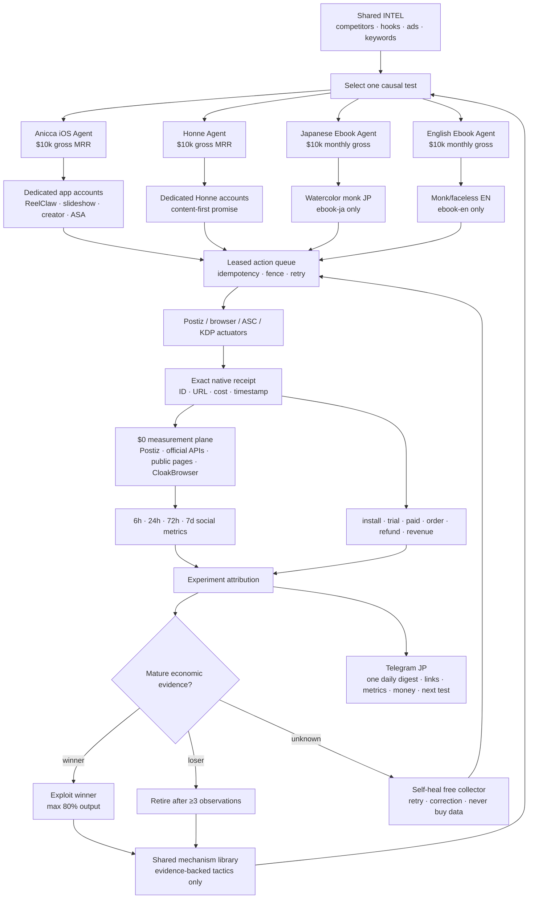
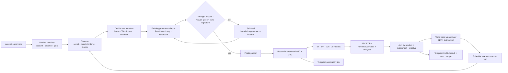
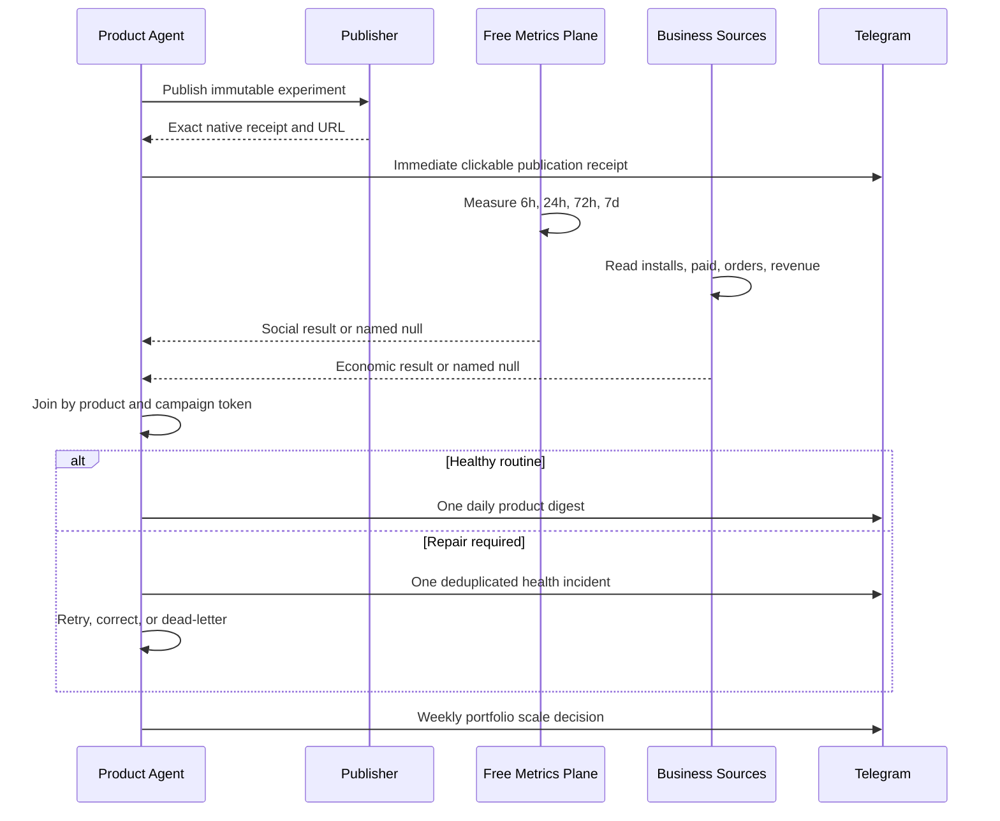
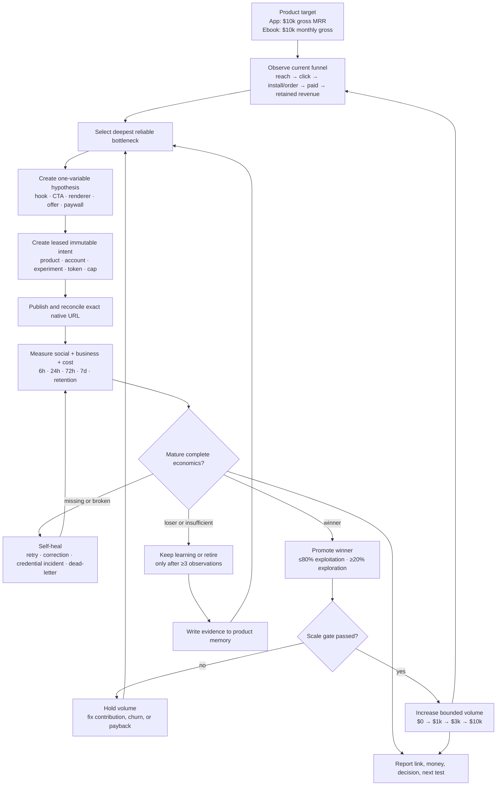

# 27 — Marketing Engine end-to-end

Status: execution SSOT for marketing only

Effective: 2026-08-01

Owner: Dais

Business outcomes: see `26-MOBILE-APP-EBOOK-10K-LOOPS.md`

## 1. Outcome and boundary

Build one measured marketing engine shared by `aniccaios`, `honne`, `ebook-ja`, and `ebook-en`. It continuously reads competitors, selects a testable tactic, produces and publishes variants, attributes outcomes, writes the result back, and reports facts through Telegram.

This file covers marketing only. It excludes mobile app implementation, ASC review, onboarding/paywall code, manuscript production, KDP publication automation, and unrelated Anicca runtime work. Those are downstream product actuators and must not reorder this plan.

Locked boundaries:

- No phone call, Twilio, or life-manager-call work.
- Telegram uses the Bot API directly. Postiz may remain a publishing transport.
- No new code depends on OpenClaw CLI, cron, process, state path, or secret path.
- OpenClaw is removed only after leased-queue shadow verification.
- Avatar video is optional. A faceless/slideshow lane always exists and may remain production.
- **Production measurement is free-only.** Apify, paid scraping credits, paid proxy pools, and any automatic paid fallback are `DO NOT USE`. The engine may use the already-owned Postiz API, official platform APIs within their no-incremental-cost quota, public native pages through CloakBrowser, and local code. If those sources cannot return a value, the result remains unavailable with one deduplicated health incident; the agent MUST NOT spend money to fill it.
- Generated files, posts, and views are not revenue. Decisions use attributed clicks, installs, paid starts, orders, refunds, retention, contribution margin, and revenue.

### 1.1 Live execution status

Last updated: 2026-08-06

Completed gate: **13 — truthful experiment attribution**

Active build lane: **four fresh product economies — then self-improvement**

Background evidence lane: **14 — native publication, maturity, and real performance write-back; 16 shadow soak**

Gate state: **Gates 1–3 and 5–13 remain complete. Gate 4's free-only producer and Gate 15's quiet-reporting repair are implemented and live; their rolling soak remains open. One serialized hourly LaunchAgent owns reconciliation, binding, native collection, and reporting. The paid legacy collector is disabled and unloaded. The next active SSOT item is §15.6 step 1: close the `aniccaios` fresh acquisition-to-money E2E before touching the next product.**

2026-08-06 live read-back: `ai.anicca.marketing-owner-events` is hourly, has `runs=11`, and last exited `0`. Canonical state contains 107 publication identities, 492 metric snapshots, 28 business snapshots, 323 owner reports, and 646 delivery-state rows. The latest reconciliation resolves `79/81 = 97.5309%` eligible published identities and passes the 95% gate; two remain explicitly ambiguous. The latest collection appended one measured row. The 2026-08-05 `aniccaios` business snapshot reads App Store Connect, product analytics, and RevenueCat successfully while PostHog remains unavailable for a named credential reason. These facts prove collection health, not a completed social-to-paid cohort.

2026-08-05 implementation and live verification override older audit text where it conflicts:

- The free truth plane is live at `ai.anicca.marketing-owner-events`. Read-back proves direct execution of `report/truth_pipeline.py`, a 3,600-second interval, `runs=2`, and `last exit code=0`. The pipeline executes the fixed order `publication reconcile -> bind -> native collect -> action/checkpoint/incident/experiment report` under a non-overlapping file lock.
- The latest reconciliation resolves `85/87` eligible published identities (`97.7011%`) and passes the 95% gate. The two remaining publication identities are explicitly `ambiguous`; 20 Postiz `ERROR` rows are excluded from the published denominator rather than converted to zero.
- The live correction/backfill run grew canonical metrics from `223` to `485` rows. Late checkpoints call the real provider and append linked correction snapshots instead of becoming terminal `missed` rows. The current immediate replay produced `new_rows=0`.
- Quiet Telegram is verified against the real Bot API. Measurement failures collapse to one `measurement_unhealthy` event per product/platform/day; the repair run delivered aggregate incidents with message IDs `7190`–`7194`. The final immediate replay kept metrics `485->485`, reports `315->315`, and delivery rows `630->630`, so it sent **zero new Telegram messages**.
- `ai.anicca.marketing-post-metrics` and `ai.anicca.marketing-account-audit`, the two loaded Apify-backed jobs found in the live scheduler audit, are disabled and unloaded after HTTP 402 failures. A fresh loaded-entrypoint scan finds no `Apify`, `api.apify.com`, or `APIFY_API_TOKEN` reference. The active `mine` registry path is `scheduled_runner.py mine -> bin/lm intel daily`; it does **not** invoke the dormant historical `mine/mine_daily.sh`. Dormant paid scripts remain non-production artifacts and MUST NOT be reintroduced into a loaded schedule.
- One bounded fresh-Sonnet adversarial pass found the still-loaded account-audit path above; it was accepted and repaired. The same pass could not break append-only correction, five-key Telegram aggregation, replay-zero, lock/order, tests, or scheduler read-back. It also found unrelated shared-CDP debug traffic in the owner-event stderr log. That is a log-isolation/secret-redaction hardening item for step 3, not evidence of metric corruption; production evidence MUST use structured JSON receipts rather than raw shared-browser debug logs.

Historical pre-repair audit below is retained as failure evidence and is superseded by the implementation bullets above:

- A fresh production audit proves the measurement plane is not operating for the four product agents. Canonical state has `223` checkpoints (`9 measured / 212 missed / 2 error`), but every measured row has `product_id=null`. Product-bound results are `aniccaios=15 missed`, `honne=23 missed + 2 error`, `ebook-ja=3 missed`, and `ebook-en=14 missed`: **zero usable measured checkpoints for every target product**.
- No user LaunchAgent or crontab invokes canonical `identity/publication_ledger.py` or `measure/native_metrics.py`. `ai.anicca.marketing-post-metrics` instead runs legacy `collect_post_metrics.py` every six hours, writes `~/.openclaw/state/content-library/post-metrics.jsonl`, and currently exits 1 because Apify returns HTTP 402. `ai.anicca.marketing-metrics-daily` runs `business_outcomes.py`, not native social collection. Apify is therefore removed from all remaining production designs rather than funded or retried.
- The exact YouTube notification `checkpoint:aniccaios:postiz:cms9mz2k90om0qn0ybphj6n7s:72` was not a provider inability. The first canonical observation occurred at age `106.2136h`, `34.2136h` after the 72-hour target, so the collector marked it missed and skipped the provider call. A direct live Postiz analytics read returned Views/Likes/Comments/Favorites=`0`, and the native YouTube page also showed zero views. Telegram MUST report a measured zero when retrievable, not “could not obtain.”
- Free live provider reads are viable: the sampled YouTube and Instagram Postiz analytics calls returned metric arrays, while the sampled Honne TikTok call returned an empty array. The locked free adapter order is Postiz/official API first, then isolated CloakBrowser public read-back; one TikTok timeout MUST NOT fail another post or platform.
- Gate 15 checkpoint binding implementation is merged on canonical `feature/dist1-mcp-launchd` at `7b25a50b3`. The pre-change focused suite was 73/73 PASS; Task 1 commit `f035ad931` supplied 15 binding contracts and Task 2 commit `f1cd4727c` supplied the publication-ledger/downstream integration. The pure binder uses only exact account-manifest integration IDs, fails closed on conflicts, and performs no network/provider calls in existing-only mode. The follow-up incident-key repair is included in `7b25a50b3`.
- Task 2 TDD RED is verified: three new CLI options were unrecognized, `bind_merged_rows` was absent, and default registry binding did not populate `product_id`; the raw three-file command also exposed the owner-report test's existing local-import requirement. Commit `f1cd4727c` makes 14 publication-ledger, 17 native-metrics, 30 owner-report, and 95 total Gate 15 tests GREEN. Its bounded review verdict is `ship` with no Critical/Important finding: normal mode binds the full merge before validation/atomic write, existing-only bypasses credential/network paths, and downstream code adds no inference.
- Canonical Task 3 implementation and the duplicate social-incident-key repair are merged at `7b25a50b3`; the canonical focused suite is now **97/97 PASS**. The exact target tuple is `cmsaselv6070sqn0yp7oix7yd` → integration `cmo5s4edx00vgn10ygnu34a0n` → account `tiktok.obou_anicca` → product `ebook-ja` → native `7669159327655054613` / `https://www.tiktok.com/@obou_anicca/video/7669159327655054613`.
- Product-scoped read-only collection succeeded for `aniccaios`, `honne`, `ebook-ja`, and `ebook-en`. `aniccaios` returned RevenueCat MRR `$20.73`, five actives, ASC first-time downloads `1` for the latest processed August 1–3 window, and Mixpanel `app_opened=3` / `paywall_primer_viewed=3` for August 4. `honne` returned RevenueCat MRR `$0` and zero actives; ASC was readable but its newest complete source data was July 30; its inside-app funnel remains unavailable. Both ebook Stripe product-scoped queries succeeded with zero paid orders for August 4. KDP is unauthenticated, Gumroad is not configured, and PostHog lacks a project-read credential.
- Gate 15 still runs three dedicated LaunchAgents: events every 900 seconds, product-daily at 22:00 local time, and portfolio-weekly at Sunday 21:00 local time. The resumed owner-events run read back canonical `/Users/anicca/anicca` paths, ended inactive with `runs=11`, and exited zero; legacy metric and publisher jobs were not modified.
- Real Telegram delivery now has `160` owner-report rows and `320` delivery rows. The original five kinds retain receipts `6916`–`6926`; the product-bound checkpoint receipts are `7053`, `7054`, and `7055`; the fixed incident-key backlog added 49 delivered incident receipts. Current hashes are `owner-reports.jsonl=35a7d02e077d82f21c0c49be7d75c30fcee5a5b1dfd28e1ff715a7f551ad007c` before the backlog and `fed6a2475216062e9d14e20b43fcfc02eca75128b42a2cebe585a05367422fe6` after it, and `owner-report-deliveries.jsonl=963b4b0d8473866eefe3869d74f75fc5034471e6736700e6a2bbd4aee0591fc9`.
- The checkpoint builder now emits three product-bound `ebook-ja` events for the exact native post. The 6h, 24h, and 72h missed checkpoints have truthful null metrics and explicit `checkpoint_missed` reasons; their real Telegram receipts are `7053`, `7054`, and `7055`. Gate 15 remains OPEN because the full replay-zero proof was interrupted when two new 168h rows became due during the time boundary.
- Incident generation initially exposed 42 historical rows. The live fix now makes social-checkpoint incident keys target-age-safe, allowing every missed checkpoint to be delivered once; the resumed owner-events run added 49 incident backlog receipts and exited zero.
- The canonical focused production suite passes **97 tests**. It covers deterministic rendering, product binding, ledger equality, atomic delivery claims, replay dedupe, attribution snapshot transitions, upgrade-compatible event identities, multi-currency minor-unit rendering, schedule installation/read-back, and direct Telegram transport. Fix `7b25a50b3` also makes duplicate incident keys target-age-safe; the resumed owner-events run exits zero.
- Postiz live read-back shows one `ebook-ja` watercolor TikTok marked `PUBLISHED` on each of August 2, 3, and 4, followed by one `QUEUE` row per day from August 5 through August 11. Queue state is not native publication. No durable producer is proven for August 12 onward.
- The canonical state snapshot is: publication identity `92` rows / SHA-256 `545d0f5aa6e62250a79fdc3d1da27e8b52d7872b25764490f78cd58879a18d27`; post metrics `223` rows / SHA-256 `2b12d76a73667716e2cc0cca0d31912be5d6258db0652c7ffdb9e20ebe8b5a8b`; owner reports `160` rows / SHA-256 `fed6a2475216062e9d14e20b43fcfc02eca75128b42a2cebe585a05367422fe6`; owner deliveries `320` rows / SHA-256 `963b4b0d8473866eefe3869d74f75fc5034471e6736700e6a2bbd4aee0591fc9`. Metrics comprise `9` measured, `212` missed, and `2` error rows; the two errors are unrelated Honne TikTok CDP timeouts with explicit null reasons. Gate 14 remains OPEN: most metrics are missed/null, maturity/completeness is not met, and no `won`/`lost` write-back is evidenced.
- The current lease/fence implementation is SQLite in `publish/intent_store.py`. There is no verified shared Marketing Engine PostgreSQL queue to adopt today. Gate 16A first moves this tested contract under the Life Manager worker and proves seven-day shadow equivalence. A PostgreSQL backend is introduced only when more than one host must compete for the same leases; storage migration must not block restoring truthful daily operation.

Verified before implementation:

- Telegram's official cloud Bot API accepts JSON/form requests for text and `multipart/form-data` for file uploads; successful `sendMessage`, `sendDocument`, `sendPhoto`, and `sendVideo` calls return a `Message` containing `message_id`.
- The cloud API accepts files up to 50 MB. A local Bot API server can raise that to 2 GB, but it adds an unnecessary service and is out of scope for reports.
- Flood-control responses can include `parameters.retry_after`. This is the only automatically retried send failure; an ambiguous transport timeout is reported as `delivery_unknown` and is not blindly resent because Telegram send methods have no idempotency key.
- The current repository has a direct-curl text-only helper, but it reads `~/.openclaw/.env`; four marketing reporters still invoke `openclaw message send`. Neither is an acceptable production dependency.
- The existing `skills/_shared/send-telegram.sh` has an unrelated pre-existing working-tree edit that adds the returned message ID. It is preserved until callers migrate to the new Python client.
- The current Telegram token also exists in a legacy backup file and was exposed during local inspection. Rotation was recommended for security, but on 2026-08-01 the owner explicitly rejected rotation because the same bot currently serves Life Manager and an uncoordinated revoke could stop it. This is an accepted security risk, not a functional blocker. Marketing code reads `~/anicca/.env`; legacy copies remain temporarily for the running out-of-scope Life Manager and are not a Marketing Engine dependency.
- Implemented `skills/_shared/telegram.py` and its local fake-API contract suite. Nine tests cover config, text chunk receipts, multipart media, bounded 429 handling, no timeout retry, redaction, validation, and absence of an OpenClaw runtime dependency.
- Migrated the current credential to `~/anicca/.env` without printing it, set file mode `0600`, and verified direct `getMe` against `AniccaLifeBot`. The transport is functionally verified; credential reuse remains the explicitly accepted security risk above.
- Direct verification sends reached chat `8547730585`: text `4946`, document `4947`, photo `4949`, and video `4950`. Evidence is in `skills/earn/marketing-engine/evidence/telegram/2026-08-01-gate1-staging.jsonl`; its historical `legacy_token_pending_rotation` labels describe how the receipts were captured, not a remaining gate.
- The backward-compatible `send-telegram.sh` now delegates to `telegram.py`, preserves the prior `TELEGRAM_SENT=true MSGID=…` output contract, has no hard-coded default chat, and no longer reads an OpenClaw path. Its live compatibility receipt is message `4951`.
- `notify_posts.py`, `daily_report.py`, `weekly_review.py`, and `audit_accounts.py` now call the same direct client and expose returned message IDs. Twelve transport/unit tests pass. Their existing metric/state inputs remain legacy and are not thereby validated; for example, a dry-run displaying aggregate `MRR 20` is not product-scoped RevenueCat evidence and cannot count as an `aniccaios` or `honne` outcome.
- The earlier rotation request was delivered as Telegram message `4952`, then superseded by the owner's explicit no-rotation decision. Gate 1 is complete on the verified functional contract.

Historical blocker audit, now resolved by owner risk acceptance:

1. The current credential was migrated without disclosure and direct text/document/photo/video receipts proved the implementation, but local inspection found that the same credential remained in both the legacy env and its backup.
2. The compatibility wrapper and all four Marketing Engine reporters were migrated off the OpenClaw transport, 12 tests passed, and the owner action was delivered as Telegram message `4952`; the credential itself still required BotFather revocation.
3. A secret-safe equality check on 2026-08-01 confirmed `TARGET_DIFFERS_FROM_OLD=false` and `OLD_AND_BACKUP_MATCH=true`; `getMe` still identifies `AniccaLifeBot`, proving the old credential remains active rather than revoked.

The prior plan required BotFather rotation. On 2026-08-01 the owner explicitly chose continuity of the shared Life Manager bot over that security hardening. Therefore no revoke, legacy-line deletion, or new-token receipt is required for Gate 1. Revisit rotation only as a separately coordinated Life Manager credential migration; it must never be performed as part of this marketing-only execution without a simultaneous receiver update.

Rejected Gate 1 hypotheses:

| Hypothesis | Decision | Evidence/reason |
|---|---|---|
| Keep `openclaw message send` as the Telegram transport | Rejected | It preserves the exact runtime dependency this gate removes and hides the Bot API receipt behind another process |
| Adopt `python-telegram-bot` | Rejected | The required surface is five small HTTP methods; the dependency is GPL-3.0 and would add an unnecessary framework |
| Run Telegram's local Bot API server | Rejected | Its 2 GB upload advantage is irrelevant to compact reports; the official 50 MB cloud limit is sufficient |
| Retry all network failures | Rejected | Telegram send calls have no idempotency key; an ambiguous timeout may already have delivered and an automatic retry can duplicate the report |
| Treat the migrated existing token as production-safe | Rejected | The same credential exists in a legacy backup and was exposed; only BotFather revocation plus new-token verification closes the security condition |

Primary sources: [Telegram Bot API](https://core.telegram.org/bots/api), [Telegram Bot FAQ](https://core.telegram.org/bots/faq), [Telegram bot tutorial](https://core.telegram.org/bots/tutorial). OSS mechanisms inspected, not copied wholesale: [`go-telegram/bot`](https://github.com/go-telegram/bot) (MIT; typed API errors, token-redacted request errors, `retry_after`) and [`python-telegram-bot`](https://github.com/python-telegram-bot/python-telegram-bot) (GPL-3.0; comparison only). The shared client remains Python-standard-library-only.

## 2. Ideal closed loop

```text
       DAILY/WEEKLY INTEL                 PRODUCT CONTEXT
 X · RSS · GitHub · TikTok · ads     app/ebook manifests + economics
              |                                  |
              +----------------+-----------------+
                               v
        playbook.jsonl · hook-library.jsonl · ad-swipe.jsonl
                               |
                   model selects ONE test
                               |
                experiment_id + treatment manifest
                               |
        +----------------------+----------------------+
        |                      |                      |
        v                      v                      v
  FACELESS/SLIDESHOW      AVATAR (OPTIONAL)      COPY/LISTING/AD
  local, reliable, $0     only if it wins        app + ebook lanes
        |                      |                      |
        +----------------------+----------------------+
                               v
              Postiz and/or browser publishing adapters
                               |
                               v
     impressions -> qualified click -> install/order -> paid/revenue
                               |
                               v
       experiment attribution -> won/lost -> hook/tactic EWMA
                               |
             bottom 20% retire · 20% exploration reserved
                               |
                               v
        Telegram daily facts + weekly gaps/decisions/evidence
                               |
                               +-----------> next experiment
```

After completion, the owner wakes up to a compact report saying what the system learned, what it published, what produced money, what it stopped, and what it will test next. The owner no longer reads every source, chooses every hook, watches every cron, or guesses which post caused a sale.

## 3. Gate ledger and executable priority

The gate numbers below preserve causal and audit history; they are not a serial
instruction to leave workers idle while a real-world checkpoint matures. Work
is scheduled by the four-step SSOT in §15.6:

1. **FREE-ONLY TRUTH PLANE:** replace the broken paid collector with one
   serialized canonical reconcile -> bind -> collect -> report pipeline and
   make Telegram report measured zero as zero instead of checkpoint spam.
2. **FOUR MEASURED PRODUCT ECONOMIES:** keep every product publishing daily and
   prove fresh social-to-money attribution independently for `aniccaios`,
   `honne`, `ebook-ja`, and `ebook-en`.
3. **SELF-IMPROVING, SELF-HEALING LOOP:** promote mature winners, retire proven
   losers, preserve exploration, recover safe failures, and cut over to the
   leased Life Manager worker after shadow evidence passes.
4. **EVIDENCE-GATED `$10K` SCALE:** advance each product through
   `$0 -> $1k -> $3k -> $10k` only while its own complete economics remain
   positive. This is an operating target, not a guaranteed outcome.

No task may convert a provider queue receipt into a native publication, an
immature value into zero, or a shadow intent into a second external action.
Self-improvement and self-healing mean the agents perform the ongoing
observation, diagnosis, safe retry, selection, and write-back themselves. They
do not mean that evidence gates, platform delays, or policy boundaries vanish.

### 3.0 Historical gate ledger

| # | Work | Done condition |
|---:|---|---|
| 1 | Add `~/anicca/skills/_shared/telegram.py`; make `~/anicca/.env` the Marketing Engine credential source; support text, document, photo, and video with direct Bot API | **DONE 2026-08-01:** `getMe` passes; text `4946`, document `4947`, photo `4949`, video `4950`, and wrapper `4951` arrived with message IDs; 12 tests pass; Marketing Engine reporters invoke no OpenClaw message process |
| 2 | Inventory and quarantine legacy marketing LaunchAgents; map each old Larry, ReelClaw, watercolor, monk, metrics, score, and dashboard task to keep/migrate/retire | **DONE 2026-08-01:** 79 relevant records inventoried; 28 LaunchAgents and seven live OpenClaw legacy jobs reversibly quarantined; post-snapshot has zero enabled publishers and zero enabled/loaded retire targets; ten measurement/report jobs remain loaded; plist hashes unchanged; inert rollback round trip passed |
| 3 | Create the publication identity ledger from existing Postiz data: `experiment_id`, creative hash, Postiz ID, `releaseId`, native platform post ID/URL, account/integration ID, and timestamps | **DONE 2026-08-01:** 91 live rows written; 71/73 PUBLISHED uniquely resolve to native identity (97.2603%); two TikTok duplicate-caption rows remain ambiguous; all 18 ERROR rows remain errors; nine tests and idempotent 91→91 rerun pass |
| 4 | Repair and verify social metrics collectors against native posts at 6h, 24h, 72h, and 7d | **REOPENED 2026-08-05:** the historical fixture/live slice proved adapters once, but production ownership is absent. All 57 product-bound checkpoints are unmeasured, canonical reconciliation/collection has no schedule, and the loaded legacy job writes another ledger and fails on paid Apify HTTP 402. Closure now requires the free-only canonical producer and four-product fresh-post E2E in §15.6 steps 1–2 |
| 5 | Restore business outcome inputs: RevenueCat, Stripe, App Store Connect, PostHog, KDP, Gumroad/direct sales; add owned campaign redirects and compact publication tokens | **DONE 2026-08-01:** four unique product/date snapshots verify; ASC report segments and RC app-filtered charts are live; ebook Stripe queries use exact product and one-day bounds with gross/refund/net; unavailable KDP/Gumroad/PostHog/Honne-funnel states remain null with reasons; production `/go/{token}` returned 302 and its minimal Supabase receipt read back; 54 focused Python and 288 Netlify tests pass |
| 6 | Wire the truthful run/report contract to mine, score, metrics, dashboard, clip, video, self-improve, and capafy | **DONE 2026-08-01:** all eight lanes emitted validated production reports; metrics/dashboard executed successfully and six gated lanes emitted evidenced `skipped` results without running publishers; Telegram receipts are `5023`, `5048`, and `5049–5054`; verifier reports 8/8, zero duplicate final/delivery keys, zero replay sends, and zero production dry runs; seven existing LaunchAgents read back the canonical runner and an idempotent reinstall plan has zero changes |
| 7 | Create and validate `intel/playbook.jsonl`, `hook-library.jsonl`, `creators.jsonl`, and `ad-swipe.jsonl`; seed nine open gaps and the completed fixed-character rule | **DONE 2026-08-01:** four UTF-8 JSONL stores and four Draft 2020-12 schemas validate; playbook has ten unique tactics, exactly nine `new`, one operational `done`, and zero unproved `won`; hook/creator/ad stores are honest empty streams; first/rerun hashes match; 111 Gate 1–7 focused tests pass; Telegram receipt `5059` |
| 8 | Implement daily `lm intel pull` for X Articles/fxtwitter, RSS, GitHub, competitor discovery, ads, and storefront intel; implement weekly `lm intel gap` | **DONE 2026-08-01:** the append-only source store now has 76 native items and all 76 are judged with zero pending (the verified Gate 8 baseline was 75); live X, RSS/Atom, GitHub, discovery, and Apple adapters succeeded/returned unchanged while Meta is explicitly unavailable; canonical counts are playbook 12, hooks 0, creators 4, ad swipes 1; 11 seed tactics have exact source enrichments; the identical rerun appended zero and preserved hashes; schedules read back unchanged; Telegram weekly `5094` and daily `5095` were delivered |
| 9 | Add competitor-video ingestion: handle -> native URL -> `yt-dlp` -> transcript -> model-applied virality rubric -> library | **DONE 2026-08-01:** bounded EN/JA registries yielded 40 native observations, four hashed local transcripts, four judgments, and 11 original hooks (EN 5/JA 6) with exact source/media/transcript evidence; current `yt-dlp 2026.07.04`, Whisper `20250625`, and ffmpeg `8.1` are locked; rerun added zero; scheduled `mine -> lm intel daily` reached Telegram `5102`; reusable verifier passes |
| 10 | Add a universal product registry, one-product-per-account manifests, and initial manifests for `aniccaios`, `honne`, `ebook-ja`, and `ebook-en`; make the library the only production hook/tactic source and wire `variation.py` | **DONE 2026-08-01:** four product manifests, nine one-product account manifests, five renderer definitions, strict schemas, and `lm creative plan` validate; two safe EN/JA ebook plans contain the full attribution tuple and replay with zero duplicate append; app candidate counts remain honestly zero rather than borrowing ebook hooks; canonical router legacy-hook/OpenClaw references and enabled legacy publishers are both zero; 177 integrated tests pass; Telegram `5106` |
| 11 | Add the renderer registry and ten-clip eval pack: slideshow, ReelClaw/card, MoneyPrinterTurbo, OmniAvatar, and watercolor monk | **DONE 2026-08-01:** frozen five EN + five JA fixtures produced ten local 720×1280 H.264/AAC safety outputs at $0 with exact receipts; rerun appended zero; OmniAvatar/MuseTalk/LongCat remain explicitly unavailable; visual evaluation honestly failed the static baseline (no motion/sync and clipped JP captions), so nothing was promoted or posted; 178 tests + 47 subtests pass; Telegram `5109` and contact sheet `5110` |
| 12 | Make Postiz/browser posting adapters idempotent and lease-owned | **DONE 2026-08-02:** exact route and asset approved; immutable intent passed shadow; upload/draft/promote each accepted once; one exact Postiz read-back reconciled to TikTok ID `7669159327655054613` and its native URL; replay-safe identity ledger and production DB both report `published` |
| 13 | Join social metrics and business outcomes back to experiments through the attribution ledger | **DONE 2026-08-02:** one production snapshot contains all ten required result records; an exact Supabase token+product query reports deterministic qualified clicks `0`; the nine 15-minute-old social/business results remain `not_mature=null`; fabricated-zero count is zero; exact replay stays one ledger row; schema/verifier pass; 262 tests + 47 subtests pass |
| 14 | Restore write-back: tactic status, hook EWMA, renderer result, bottom-20% retirement, and 20% exploration | **OPEN 2026-08-05:** canonical metrics are `9 measured / 212 missed / 2 error` across 223 unique checkpoints, but all nine measured rows are product-null legacy rows and all 57 product-bound checkpoints are unmeasured. Two Honne TikTok rows retain explicit timeout/null reasons, and no mature plan-mapped `won`/`lost` mutation exists. Each product needs at least ten mature, correctly mapped experiments before its own learning promotion is enabled |
| 15 | Deliver compact natural-Japanese daily, incident, experiment, progress, and weekly Telegram reports | **OPEN — transport works, semantics do not:** six report kinds have real receipts and the installed reporter exits zero, but it currently sends one message per missed checkpoint and amplifies the broken producer. Closure requires a healthy free-only producer, one deduplicated `measurement_unhealthy` incident per product/platform/day, measured zero reported as zero, one daily digest with native links, and an immediate replay that produces no new Telegram IDs |
| 16A | Build the leased job queue and start non-mutating shadow operation | **OPEN 2026-08-05:** SQLite lease/fence primitives exist for publication intents, but no one durable worker owns all four products, no seven-day shadow is running, and no producer is proven after the August 11 queue ends |
| 16B | Cut over after the time-dependent shadow soak, then stop Marketing OpenClaw | **TIME-DEPENDENT CLOSURE:** seven consecutive reconciled days, zero duplicate external actions, rollback readiness, Life Manager worker cutover, then OpenClaw processes/crons stop |

Implementation may use small commits. Gates 3–5 remain prerequisites for any
production posting because they prove native identity, social metrics, and
business-outcome truth; they are already complete. After that truth boundary,
independent construction proceeds concurrently with time-dependent monitoring.
An external action still requires its own done-condition evidence and lease;
mere code completion never authorizes it.

### 3.1 Gate 1 implementation contract

`skills/_shared/telegram.py` is a dependency-free sender and importable module with:

- `get_me()`, `send_text()`, `send_document()`, `send_photo()`, and `send_video()` plus matching CLI subcommands;
- configuration from the current process environment and `ANICCA_ENV_FILE`, defaulting only to `~/anicca/.env`; no OpenClaw path or default hard-coded chat ID;
- required `TELEGRAM_BOT_TOKEN` and `TELEGRAM_CHAT_ID`, both omitted from logs and exceptions;
- JSON requests for non-file calls and multipart uploads for media;
- structured receipts containing method, Telegram chat ID, every returned `message_id`, and delivery status;
- text chunking below Telegram's 4096-character ceiling, caption validation below the 1024-character ceiling, readable-file validation, and a 50 MB cloud-upload preflight;
- one bounded retry for a valid `429 retry_after`; no retry for authentication/permission/input errors; `delivery_unknown` for an ambiguous timeout so a caller cannot report a false success or create a duplicate by assumption;
- unit tests using a local fake Bot API for request shape, multipart bodies, message IDs, 429, redaction, timeout ambiguity, limits, and absence of OpenClaw references.

Gate 1 evidence is one append-only JSON record per live verification under `skills/earn/marketing-engine/evidence/telegram/`. It records test time, method, non-secret fixture hash/name, returned chat ID/message ID, status, and client version. It never records the token or raw API URL.

Gate 1 completion note: credential rotation is not part of the accepted Done contract after the owner's explicit risk decision. The shared token must not be revoked from this marketing scope because Life Manager is an active external consumer.

### 3.2 Gate 2 research and quarantine contract

Status: **complete 2026-08-01; Gate 3 may start**.

Verified local state on 2026-08-01:

- The pre-quarantine `launchctl list` and actual user plists showed 13 Larry, 12 ReelClaw, three watercolor, and ten marketing measurement/report LaunchAgents loaded. At the mutation preflight no target had a running PID.
- Eleven Larry publishing jobs can fire 22 times/day; 12 ReelClaw publishing jobs can fire 18 times/day; three watercolor jobs can fire three times/day. That is **43 loaded legacy publication triggers/day**, correcting the earlier 23/16/3 estimate.
- Six additional OpenClaw cron entries remain enabled for daily publication: `larry-anicca-en-1`, `larry-anicca-ja-v2`, `reelclaw-anicca-en-card-2`, `reelclaw-honne-ja-1`, `yangmun-monk-evening`, and `yangmun-monk-noon`. Across both schedulers, up to **49 publication triggers/day** remain declared.
- Direct live Postiz integration lookup resolved the scheduler IDs to native profiles. It also showed `monk_anicca` (`cmo5rwq2p00twn10yrsdglng3`) and `obou_anicca` (`cmo5s4edx00vgn10ygnu34a0n`) are currently `disabled=true`; a loaded schedule is therefore not proof that either Ebook Agent is publishing.
- Real duplicate ownership exists now: OpenClaw and LaunchAgents both target `aniccaen2`, `anicca.he`, `honnevideo`, and overlapping Anicca Instagram/YouTube integrations. The two enabled Yangmun jobs point through dispatcher paths that do not exist, so they are enabled failures, not production evidence.
- Current non-zero LaunchAgent exits include Larry strategy updater (`2`), four ReelClaw card/widget jobs (`1`), and marketing account audit (`1`). A zero exit is only process status; it does not prove a native publication.
- `StartCalendarInterval` wake events may be coalesced and run after wake, so “different nominal clock time” cannot be used as a duplicate-safety mechanism.

Primary behavior sources: local macOS `launchctl(1)` and `launchd.plist(5)` manuals plus Apple's [Scheduling Timed Jobs](https://developer.apple.com/library/archive/documentation/MacOSX/Conceptual/BPSystemStartup/Chapters/ScheduledJobs.html). Apple documents `bootstrap`/`bootout` as the modern registration operations; `disable gui/<uid>/<label>` persists across boots and prevents loading until explicitly enabled. `StartCalendarInterval` events missed during sleep can run on wake and multiple missed intervals may coalesce.

OSS inspected: [`azu/launchd-ui`](https://github.com/azu/launchd-ui) correctly models `launchctl list` as PID/last-exit/label and uses `bootout`, `bootstrap`, `disable`, and `enable`. Its README says MIT, but the repository has no license file and GitHub reports no detected license, so no source is copied. We retain only the independently verified Apple command semantics.

Rejected Gate 2 hypotheses:

| Hypothesis | Decision | Evidence/reason |
|---|---|---|
| Inventory only `~/Library/LaunchAgents` | Rejected | Six OpenClaw publication crons are also enabled; ignoring them leaves real duplicate owners |
| A loaded job with exit `0` is a successful publisher | Rejected | Native Postiz identity and platform receipt are absent; two target integrations are disabled |
| Keep old jobs running until the replacement poster exists | Rejected | Specs prohibit production posting before identity/metric/money truth Gates 3–5, and current overlap can corrupt attribution now |
| Delete plist files to quarantine | Rejected | Destructive and unnecessary; persistent `disable` plus immediate `bootout` is reversible |
| Use only `bootout` | Rejected | A plist in the scanned LaunchAgents directory may return after login; persistent disabled state is required |
| Use OSS manager code | Rejected | The inspected repository has ambiguous licensing and adds a UI dependency to a deterministic inventory task |

Implemented contract and evidence:

1. Produce an append-only inventory snapshot containing runtime, label/job ID, plist/config hash, exact argv/message hash, schedule/time zone, integration IDs, resolved platform/profile, loaded/enabled state, PID, last exit/status, last/next run when available, disposition, and rollback command.
2. Classify only external publishers as `retire/quarantine`; preserve measurement/report jobs for later `migrate`, and leave Capafy, clip, Life Manager, conformity/janitor, and other out-of-scope jobs untouched.
3. Before mutation, assert every target label/job ID matches the reviewed allowlist and no target has a running PID. For LaunchAgents, run persistent `disable` then immediate `bootout`; keep plist files unchanged. For OpenClaw cron, use its supported disable operation and preserve the full pre-change snapshot.
4. Verify with `launchctl print-disabled`, `launchctl list`, the OpenClaw jobs store/CLI, and a second inventory snapshot. Done requires zero enabled/loaded legacy publication owners, unchanged out-of-scope jobs, unchanged plist hashes, and tested rollback instructions. No new publisher is started in Gate 2.

The read-only inventory is `skills/earn/marketing-engine/ops/scheduler_inventory.py`; six inventory tests pass. The fail-closed quarantine is `quarantine_legacy_schedulers.py`; six tests cover selection, running-PID refusal, hash refusal, exact reversible commands, rollback, and rejection of out-of-scope families. `persist_openclaw_quarantine.py` has two tests and exists because live verification exposed a real OpenClaw defect: `cron disable` changed the running gateway but its declared `~/.openclaw/cron/jobs.json` store remained stale. We therefore disabled the seven reviewed jobs in the gateway and changed only their `enabled` fields in the restart store, preserving `jobs.json.pre-marketing-quarantine-20260801T0955.bak`.

Final evidence:

- `evidence/schedulers/2026-08-01-pre-quarantine-v2.json`: 79 records, 35 enabled retire targets, 32 enabled publisher jobs.
- `evidence/schedulers/2026-08-01-quarantine-applied.json`: 35 reviewed targets applied—28 LaunchAgents and seven OpenClaw jobs.
- `evidence/schedulers/2026-08-01-openclaw-store-applied.json`: seven stale restart-store flags reconciled; unrelated jobs unchanged.
- `evidence/schedulers/2026-08-01-post-quarantine-v2.json`: live `openclaw cron get` for all 41 relevant OpenClaw records; `enabled_publishers=0`, `loaded_or_enabled_retire=0`; all ten measurement/report LaunchAgents still loaded; no LaunchAgent plist hash changed.
- `evidence/schedulers/2026-08-01-rollback-probe.json`: an inert `/usr/bin/true` LaunchAgent passed bootstrap → disable/bootout → enable/bootstrap → final bootout, ending unloaded.
- `evidence/schedulers/2026-08-01-pre-quarantine-last-run.json`: the 09:45 Larry process exited zero but its own log says Postiz key missing, no post ID, no history append; it is correctly classified failed, not published.
- Owner receipt: direct Telegram daily-control summary delivered as message `4964`.

No replacement publisher was started. Capafy, clip, Life Manager, conformity/janitor, and all other labels outside the reviewed allowlist received no command.

### 3.3 Gate 3 research and identity-ledger contract

Status: **complete 2026-08-01; Gate 4 may start**.

Verified against the live Postiz API for the immediately preceding 72 hours:

- `GET /public/v1/posts` returned 91 posts: 73 `PUBLISHED` and 18 `ERROR`. Every PUBLISHED row had a Postiz ID, integration ID, `releaseId`, and `releaseURL`; every ERROR row is retained and all 18 had null native ID/URL.
- The 73 PUBLISHED rows were 38 Instagram, 25 TikTok, nine YouTube, and one X post. Instagram/YouTube/X returned item-level native URLs and IDs directly.
- All 25 TikTok `releaseURL` values were profile URLs, not video URLs. Postiz source confirms that when TikTok's publish-status response omits `publicaly_available_post_id`, Postiz stores the TikTok `publish_id` and profile URL. A prefixed value such as `v_pub_file~...` or `p_pub_url~...` is therefore not safe to reinterpret as the video ID.
- Postiz post analytics returned an empty array for sampled affected TikTok posts. Inventing a video URL from the publish token was rejected: TikTok oEmbed returned 400, and the numeric suffix differed from the real native video ID.
- A read-only TikTok profile scan returned the actual recent video IDs/URLs. Twenty-three of 25 TikTok posts resolved uniquely when all three conditions held: same locked account, exactly one whitespace-normalized full-caption match, and exactly one candidate within ±15 minutes of Postiz `publishDate`. Two rows had duplicate captions and duplicate time-window candidates; they remain unresolved.
- Therefore 71 of 73 PUBLISHED posts resolve to unique native identities: **97.26%**, above the 95% done threshold. This is a measured historical reconciliation candidate, not yet a completed gate until the tested ledger writes and revalidates it.

Primary sources: Postiz [List Posts](https://docs.postiz.com/public-api/posts/list), [Post Analytics](https://docs.postiz.com/public-api/analytics/post), [Get Missing Content](https://docs.postiz.com/public-api/posts/missing-content), and [Update Release ID](https://docs.postiz.com/public-api/posts/update-release-id); official [`gitroomhq/postiz-app`](https://github.com/gitroomhq/postiz-app) controller, repository, schema, SDK, and TikTok provider at the inspected main commit. The app is AGPL-3.0; mechanisms were inspected but no source was copied.

Implementation contract:

1. Append one ledger row per Postiz post with state, Postiz ID/group, integration/account/platform, Postiz release fields, native ID/URL, observed/publish timestamps, resolution method/confidence, and provenance.
2. Historical posts lacking the future production manifest retain `experiment_id=null` and `creative_sha256=null` with explicit `legacy_uninstrumented` null reasons. Hashing the caption is allowed only as `content_sha256`; it must never be mislabeled as the creative asset hash.
3. A PUBLISHED row is `resolved` only from a provider-native Postiz receipt or a unique account+full-caption+time-window platform match. Prefix parsing, nearest-time-only selection, partial captions, and duplicate candidates remain `ambiguous` or `unresolved`.
4. Enforce uniqueness of Postiz ID and `(platform, integration_id, native_post_id)`. Keep every ERROR row with null native fields and its source state; never convert it to success.
5. The collector reads Marketing Engine credentials from `~/anicca/.env`, not an OpenClaw path, writes atomically, validates every row, and emits a separate reconciliation report with denominator, resolved count, rate, ambiguities, state/platform counts, source window, and evidence time.

Implemented `skills/earn/marketing-engine/identity/publication_ledger.py` plus nine tests. `POSTIZ_API_KEY` and `APIFY_API_TOKEN` were copied without disclosure or rotation into `~/anicca/.env` (mode `0600`); the collector contains zero OpenClaw path/runtime references. The canonical upsert ledger is `state/publication-identity.jsonl` and stores no raw caption—only `content_sha256`. Historical `experiment_id` and creative hash are null with declared reasons rather than fabricated.

Completion evidence:

- `evidence/identity/2026-08-01-three-day-reconciliation.json`: 91 rows, 73 PUBLISHED denominator, 71 resolved, 97.2603%, gate pass; 18 ERROR and two ambiguous IDs enumerated.
- `evidence/identity/2026-08-01-three-day-reconciliation-rerun.json`: the idempotent rerun remained 91 rows with identical outcome counts.
- `evidence/identity/2026-08-01-tiktok-scan-manifest.json`: read-only six-profile/150-item scan provenance and frozen raw-input hash; raw captions and expiring media URLs were intentionally not retained.
- Validation: 91 unique Postiz IDs, 71 unique `(platform, integration, native_post_id)` keys, zero raw caption fields, zero OpenClaw references, nine tests passing.
- Owner receipt: direct Telegram summary delivered as message `4965`.

### 3.4 Gate 4 research and native-metrics contract

Status: **complete 2026-08-01; Gate 5 may start**.

Verified mechanisms:

- Instagram media insights expose `views`, `reach`, `saved`, `likes`, `comments`, and `shares`. The live Postiz owner integration returns those six labels for resolved Instagram media. A same-run independent public scan matched the visible views/likes/comments on four usable samples; one fifth sample omitted views and is correctly ineligible for comparison rather than coerced to zero.
- TikTok's official video query exposes `view_count`, `like_count`, `comment_count`, and `share_count`. The live Postiz endpoint returned an empty array for sampled TikTok posts even though Gate 3 resolved their native IDs. The inspected provider explains why: the post record still contains a Content Posting API publish token, while its analytics branch recognizes only one token prefix before otherwise sending the stored value as a video ID. The documented Postiz update endpoint is not a general correction endpoint: its repository condition permits updates only when the existing `releaseId` equals `missing`. A one-row live probe against an existing publish token returned HTTP 500; immediate Postiz re-read proved the value was unchanged. No remaining row will be mutated.
- A read-only isolated CloakBrowser page exposed TikTok's own `/api/post/item_list/` response. It contains native video ID plus `playCount`, `diggCount`, `commentCount`, `shareCount`, and `collectCount`; the sampled resolved IDs matched the identity ledger. This free native public response is the production TikTok metric path. The visible detail DOM independently exposes likes/comments/favorites/shares; profile-tile display is not used as a view source because the current logged-out UI showed the like count under a misleading `video-views` selector.
- YouTube `videos.list(part=statistics,id=…)` exposes `viewCount`, `likeCount`, and `commentCount`. The live Postiz owner integration already returns those fields. `favoriteCount` is deprecated and always zero, so it is not treated as a useful business or engagement metric.
- Postiz owner analytics are the first-party acquisition path for Instagram and YouTube. TikTok uses the native public response captured through an isolated CloakBrowser context. Independent validation does not reuse the same response: Instagram uses a public post scan for public fields, TikTok uses the native detail DOM for visible likes/comments/favorites/shares and identity, and YouTube uses a public `yt-dlp` metadata read. A public field that the platform hides is not invented merely to complete a comparison.
- OSS reviewed for mechanisms only: `gitroomhq/postiz-app` at commit `cf4c432c00c9db775ea1b1f12480a8e2b89aec32` (AGPL-3.0), `davidteather/TikTok-Api` (MIT), `instaloader/instaloader` (MIT), and `yt-dlp/yt-dlp` (Unlicense). Production remains standard-library Python plus the already installed `yt-dlp`; no scraper library is copied wholesale.

Primary sources: [Postiz Post Analytics](https://docs.postiz.com/public-api/analytics/post), TikTok [Query Videos](https://developers.tiktok.com/doc/research-api-specs-query-videos/), YouTube [`videos.list`](https://developers.google.com/youtube/v3/docs/videos/list) and [`video.statistics`](https://developers.google.com/youtube/v3/docs/videos), plus the official Postiz Instagram, TikTok, and YouTube provider implementations at the inspected commit.

Implementation contract:

1. Read only `state/publication-identity.jsonl` rows whose Postiz state is `PUBLISHED`, identity is `resolved`, and native ID/URL are non-null. ERROR and ambiguous rows are counted in reconciliation but never measured or changed to zero.
2. Normalize `instagram-standalone` to the metric platform `instagram` without changing its integration identity. Use the ledger's exact Postiz/native IDs; caption, prefix, nearest-time, and profile-URL matching are forbidden.
3. Schedule checkpoints at 6, 24, 72, and 168 hours. The hourly collector may write a checkpoint only inside its declared lateness window. A missed historical checkpoint is appended as `missed` with null metrics and `checkpoint_missed`; a current value must never be relabeled as an earlier 6h/24h value.
4. Store at most one append-only row per `(publication_id, target_age_hours)`. Each row records target and observed age, lateness, observed time, source, collector version, evidence hash, checkpoint status, per-field null reasons, and error. Re-running the same input is idempotent.
5. Preserve numeric zero exactly. A missing label, empty analytics array, hidden counter, HTTP failure, deleted/private post, or unsupported metric remains null with a distinct reason. Boolean `or` fallback between metric fields is forbidden because it converts a valid zero into another field.
6. Store sanitized raw provider responses in a separate append-only evidence stream and hash the canonical response into the metric row. Credentials, raw captions, cookies, and expiring media URLs are not stored.
7. Do not update existing TikTok Postiz `releaseId` values: the endpoint is restricted to `missing` rows and the live probe failed closed without changing data. For TikTok, group ledger rows by exact account handle, open that profile in a new isolated CloakBrowser context, capture only TikTok's `/api/post/item_list/` JSON, and join solely on exact native video ID. Missing native items remain null with `native_item_not_visible`.
8. Gate verification uses four Instagram, three TikTok, and three YouTube posts. Identity must match for all ten. Only fields visible in both sources at the same evidence time are compared; exact integers must match, while abbreviated UI counters may use the declared display interval. Hidden/unavailable fields are excluded with a null reason, never counted as a match.

Implemented `measure/native_metrics.py`, `measure/tiktok_public_metrics.py`, and `measure/verify_native_metrics.py`. Nineteen Gate 4 tests plus nine identity tests and four adjacent verification tests pass (32 total in the final focused suite). The production CLI exposes only `plan` and `collect`; the failed Postiz release-ID hypothesis is not an available mutation command.

Completion evidence:

- `state/post-metrics.jsonl`: 110 unique `(publication_id, target_age_hours)` rows, four measured inside their live 24h windows and 106 historical checkpoints explicitly `missed`; no duplicate, no missing null reason.
- `evidence/metrics/2026-08-01-gate4-canonical-collection.json`: 91 ledger rows, 71 eligible, two ambiguous and 18 ERROR excluded, four measured, 106 missed.
- `evidence/metrics/2026-08-01-gate4-canonical-rerun.json`: zero new rows, proving idempotency.
- `evidence/metrics/2026-08-01-gate4-ten-post-verification.json`: four Instagram, three TikTok, and three YouTube posts; 10/10 native identities matched, every post had at least one independently comparable field, and mismatch count was zero. Compared fields were Instagram views/likes/comments, TikTok likes/comments/shares/saves, and YouTube views; hidden fields were excluded rather than declared matches.
- `evidence/metrics/rejected-pre-gate4/`: retained pre-gate snapshot rejected after verification found deprecated YouTube `Favorites=0` had been incorrectly mapped to saves. The canonical rerun leaves YouTube saves null.
- `evidence/metrics/tiktok-release-repairs.jsonl`: records the single rejected Postiz update probe. Both update calls returned 500 and immediate live re-read proved the original release token remained unchanged; the remaining 22 rows were not attempted.
- Owner receipt: direct Telegram summary delivered as message `4967`.

### 3.5 Gate 5 research and business-outcome contract

Status: **complete 2026-08-01; Gate 6 may start. Production publishing remains
quarantined until the later identity-bearing, idempotent publisher gate.**

The live 2026-07-30 candidate snapshot contains exactly four product rows and
does not use a project-wide value as a product result:

- `aniccaios`: ASC, RevenueCat, and Mixpanel queries succeeded. The selected
  ASC report periods contain one first-time download and one auto-update;
  RevenueCat's latest complete app-filtered MRR point is `$20.73`. Mixpanel
  event counts are funnel evidence only and are never treated as money truth.
- `honne`: ASC and RevenueCat queries succeeded. ASC separates 115 first-time
  downloads, 20 redownloads, 11 auto-updates, two manual updates, and one
  restore. RevenueCat's latest complete app-filtered MRR point is `$0.00`.
  No verified readable in-app funnel exists, so product analytics is unavailable.
- `ebook-en` and `ebook-ja`: Stripe Checkout Session queries succeeded with
  exact product allowlists and returned zero paid orders for the selected day.
  These are valid queried zeros. KDP is `unavailable:not_authenticated` and
  Gumroad is `unavailable:not_configured`; neither is converted to zero.

The initial candidate was not accepted as Gate 5 evidence until its verifier,
idempotent rerun, owned redirect, and live click receipt passed; all four now
pass in the completion evidence below. The legacy `measure/attribution.py`
is not production-safe: it stores state below `~/.openclaw`, uses the account
handle directly as `ct`, and has no owned click receipt. It is replaced, not
wrapped.

Locked redirect design:

1. Every platform publication receives an opaque token matching
   `^(ai|ho|ej|ee)_[a-z2-7]{20}$` (23 characters, below Apple's 30-character
   campaign-token limit). It is derived deterministically from product plus
   publication ID; it contains no account name, caption, customer data, or PII.
2. The canonical ledger maps token one-to-one to product and publication. A
   duplicate token, publication, or product-prefix mismatch fails closed.
3. `https://aniccaai.com/go/{token}` accepts GET only, persists a click receipt
   before redirecting, and returns a unique receipt ID in a response header.
   Storage failure returns 503 rather than producing an unmeasured click.
4. `ai` and `ho` redirect to their exact App Store IDs with `pt`, `ct=token`,
   and `mt=8`. `ej` and `ee` redirect to `/achan` and `/monk` respectively with
   `utm_campaign=token`. Destinations are a fixed allowlist; callers cannot
   supply an arbitrary URL.
5. Click storage contains token, product, receipt ID, and server time only.
   Raw IP, user agent, referrer, cookies, and query strings are not retained.
6. Gate evidence requires unit RED→GREEN, a local function contract test, one
   live non-production verification token whose stored receipt can be read
   back, and an idempotent four-product business snapshot rerun.

Implemented and verified:

- `measure/business_outcomes.py` replaces the legacy OpenClaw-path collector.
  It validates live RevenueCat chart options before filtering, selects complete
  points, downloads and checksum-verifies ASC gzip segments, separates all five
  download types, reads Anicca Mixpanel as funnel-only evidence, and constrains
  Stripe to an exact product allowlist and `[business_day, next_day)` window.
- `state/business-outcomes.jsonl` contains exactly four rows and four unique
  snapshot IDs for 2026-07-30. The verifier passes 4/4 products. Anicca records
  ASC first-time download `1` and app-filtered MRR `$20.73`; Honne records 115
  first-time downloads and MRR `$0.00`; both direct ebook Stripe adapters
  successfully report zero paid orders, zero gross/refund/net for the bounded
  day. These zeros came from successful scoped queries.
- `measure/attribution.py` now creates deterministic opaque 23-character tokens,
  stores its canonical mapping below Marketing Engine state, and has no
  OpenClaw path. Six unit tests cover token and ledger invariants.
- The deployed `aniccaai.com/go/*` Netlify function writes to the RLS-enabled
  `marketing_click_receipts` Supabase table before redirecting. The table has
  exactly five columns and no anon/authenticated grants. A live `ebook-en`
  verification returned HTTP 302 with receipt
  `14c2d355-fef4-4644-bd20-665853792829`; an exact read-back found only schema,
  receipt, token, product, and server time fields.
- Netlify Blobs was rejected after the deploy-specific runtime produced
  `MissingBlobsEnvironmentError`; no site token was embedded. The already proven
  Supabase service-role REST pattern replaced it, and storage failure remains a
  503 with no redirect.
- Final evidence is
  `evidence/business/2026-08-01-gate5-verification.json`. The canonical rerun
  remained four rows, 54 focused Python tests passed, and the full landing
  function suite passed 288/288.
- Owner receipt: direct Telegram Gate 5 summary delivered as message `5020`.

### 3.6 Gate 6 research and truthful-run contract

Status: **complete 2026-08-01; Gate 7 may start.**

The eight named runners are distinct operational lanes, not eight aliases for
the same Marketing Engine script:

| runner ID | current entrypoint/owner | external effect policy during Gate 6 |
|---|---|---|
| `mine` | `scheduled_runner.py mine` → `bin/lm intel daily` | active free registry path; `mine/mine_daily.sh` is a dormant historical artifact and is not scheduler-reachable |
| `score` | `brain/score.py` | read verified metrics and write local score evidence only |
| `metrics` | `measure/business_outcomes.py` plus Gate 4 native collector | read-only provider queries; the legacy aggregate `collect_metrics.py` is never production truth |
| `dashboard` | the existing Marketing dashboard command | local artifact only; hash the produced artifact |
| `clip` | `earn/clip/clip_daily.sh` | production publishing stays quarantined until Gates 10–12; a Gate 6 probe may only report `skipped` |
| `video` | `earn/video/run.sh` | same quarantine rule; `EARN_VIDEO_DRY=1` is test evidence, never production output |
| `self-improve` | `earn/self-improve/run_evolve.sh` | local candidate/evaluation evidence; promotion is not implied by exit zero |
| `capafy` | `earn/capafy-marketing/capafy-ig-marketing-daily.sh` | production publishing stays quarantined; remote listing/account readback is required after later activation |

The canonical final-run event borrows CloudEvents' duplicate rule: a producer's
`source + id` identifies one occurrence and a redelivery keeps the same ID. It
uses an OpenTelemetry-compatible 32-lowercase-hex `run_id` so later child work
can share one trace. The payload is validated as JSON Schema Draft 2020-12 and
written append-only to `state/run-reports.jsonl` before Telegram delivery.

Locked event rules:

1. One final record is allowed for `(runner_id, run_id)`. A byte-equivalent
   replay is a no-op and returns the original local record; a conflicting replay
   fails closed. Telegram delivery is keyed by that same pair and cannot be sent
   twice after a stored `message_id`.
2. Required fields are `schema_version`, `run_id`, `runner_id`, `environment`,
   `started_at`, `finished_at`, `status`, `dry_run`, `product_ids`, `effects`,
   `metrics`, `evidence`, and `error`. Status is one of `success`, `partial`,
   `failed`, or `skipped`; environment is `production` or `test`.
3. Every effect states provider, action, status, and either a provider receipt
   plus evidence or an explicit `null_reason`. A shell exit code, model prose,
   generated file, or claimed URL is not a publication/sale receipt.
4. Every metric states name, scope/product, value, unit, observed time, source,
   and evidence. If unavailable, `value` is null and `null_reason` is mandatory.
   Zero is valid only when the scoped source query succeeded and evidence exists.
5. `dry_run=true` requires `environment=test`. Test events may prove control
   flow but are excluded from production post, customer, revenue, and learning
   totals. A production `success` cannot contain a simulated effect or metric.
6. A runner that is intentionally blocked by a later gate emits `skipped` with
   the exact quarantine reason and evidence; it does not fabricate a dry-run
   post. Exit zero alone never upgrades `skipped` or `partial` to `success`.
7. Raw stdout/stderr is saved as an evidence artifact with SHA-256, byte count,
   command fingerprint, and exit code. It may help debugging but numeric strings
   in logs are never parsed into production metrics without a named adapter.
8. Telegram renders facts from the validated event only. It includes run ID,
   runner/status/environment, external receipt or null reason, each metric with
   source, evidence path/hash, and the Telegram `message_id`. Generated summaries
   cannot introduce numbers absent from the event.

Research decisions:

- CloudEvents 1.0.2 requires producer-scoped unique IDs and permits a duplicate
  redelivery to retain its ID. That is the deduplication basis; an ad-hoc
  date-based key is rejected because retries can cross midnight.
- OpenTelemetry defines a TraceId as 16 bytes/non-zero and serializes it as 32
  lowercase hex characters. Gate 6 uses that shape without requiring an
  OpenTelemetry service or adding a telemetry dependency.
- JSON Schema Draft 2020-12 is the machine contract. Runtime validation remains
  standard-library code so reporting cannot fail merely because an optional
  package is absent.
- `Upload-Post/skill-autoshorts` demonstrates the useful mechanism of persisting
  a publish `request_id`, later pulling analytics, and keeping a per-run audit.
  Its fallback of missing platform metrics to zero and its cross-platform totals
  are rejected here: our native/product adapters preserve null and product scope.

Primary sources: [CloudEvents 1.0.2](https://github.com/cloudevents/spec/blob/v1.0.2/cloudevents/spec.md),
[OpenTelemetry Trace API](https://opentelemetry.io/docs/specs/otel/trace/api/), and
[JSON Schema Draft 2020-12 core](https://json-schema.org/draft/2020-12/json-schema-core.html).
OSS mechanism inspected: [`Upload-Post/skill-autoshorts`](https://github.com/Upload-Post/skill-autoshorts)
at its 2026-08-01 `main` state; it is a design reference, not a dependency.

Implemented and verified:

- `run_contract.py` validates the final event, persists one append-only final
  record per `(runner_id, run_id)`, rejects conflicting replays, and stores a
  separate one-time Telegram delivery receipt. `run-contract.schema.json`
  publishes the same Draft 2020-12 machine contract.
- `run_with_contract.py` captures exact stdout, stderr, execution metadata,
  command fingerprint, byte counts, and SHA-256 hashes. It never parses numbers
  from prose into outcomes. `scheduled_runner.py` and `runners.json` expose
  exactly the eight declared lanes.
- Production probes succeeded for product-scoped `metrics` and local
  `dashboard`. `mine`, `score`, `clip`, `video`, `self-improve`, and `capafy`
  emitted `skipped` with their exact later-gate dependency; their underlying
  commands were not executed. No dry-run or simulated metric entered production.
- Telegram receipts are: metrics `5023`, dashboard `5048`, mine `5049`, score
  `5050`, clip `5051`, video `5052`, self-improve `5053`, and capafy `5054`.
  Gate summary receipt is `5057`.
- `verify_run_reports.py` revalidated all eight events, every evidence file hash
  and size, every delivery receipt, and replay behavior. Result: 8/8 runners,
  zero duplicate final keys, zero duplicate delivery keys, and zero would-resend
  results. Evidence is `evidence/runs/2026-08-01-gate6-verification.json`.
- A reversible installer backed up the seven existing plists and changed only
  their execution entrypoint/working directory; label, cadence, logs, and other
  settings remain. All seven `launchctl` readbacks mention
  `scheduled_runner.py`, bootstraps returned zero, and the post-install plan has
  `would_change=false` for 7/7. `video` had no live scheduler, so Gate 6 did not
  create or enable a new publisher schedule. Installer/readback evidence is
  under `evidence/schedulers/2026-08-01-gate6-launchagent-*.json`.
- Twenty-eight focused Gate 6 tests pass, including schema, null/zero rules,
  dry-run isolation, conflicting replay, one-time Telegram delivery, command
  evidence, quarantine non-execution, exact registry membership, verifier, and
  reversible/idempotent installer behavior.

### 3.7 Gate 7 research and canonical-intel-store contract

Status: **complete 2026-08-01; Gate 8 may start.**

Gate 7 creates four append-only, versioned JSON Lines stores below
`skills/earn/marketing-engine/intel/`. They are the new canonical intelligence
boundary; files below `~/.openclaw/state/content-library` are migration inputs
only and no new code may treat them as the store of record.

JSON Lines rules are locked to the published format: UTF-8, no BOM, every
non-empty physical line is one complete valid JSON value, no blank lines, and a
newline after the last value. An empty store is valid before its first observed
record. Every record is independently checked against its Draft 2020-12 schema,
and duplicate IDs fail the entire store rather than silently keeping one row.

Store contracts:

| store | record identity and required truth |
|---|---|
| `playbook.jsonl` | one tactic: stable ID, claim, mechanism, application lanes, status, testability, capture time, provenance, source URL or exact null reason, evidence, and our observed result or null |
| `hook-library.jsonl` | one exact hook: text, language, product eligibility, native source/provenance, five-part virality rubric, lifecycle status, EWMA or null, observations, and evidence |
| `creators.jsonl` | one platform identity: native handle/URL, language, locked product, individually sourced metrics with observed time/null reasons, green/red flags, verdict, and evidence |
| `ad-swipe.jsonl` | one native ad/store creative: advertiser, product, native URL, dates, scoped impression evidence or null reason, mechanism, replication plan, status, and evidence |

The initial playbook contains exactly these ten owner-supplied tactics; the
first nine are `new`, while fixed identity is `done` rather than falsely marked
as a measured business winner:

1. make `gotcha_moment` a required PRD field;
2. design the viral promise/creative before expanding the product;
3. use feed engineering to discover relevant creators;
4. test concise creator outreach beginning `Paid promo?`, with a bounded daily cap;
5. test a three-day trial only on annual packaging;
6. execute the gotcha during onboarding, then reveal the result at the paywall;
7. use Meta Ads Library mechanisms as replication hypotheses, never copyright-infringing asset copies;
8. run product construction and a high-volume UGC exploration lane in parallel;
9. do not judge a format before a declared 20–30-post cohort, while still requiring real metrics;
10. keep the same voice/character identity within a product account.

The handoff preserved handles and summaries for the X/article claims but not the
exact article URLs. Those seed records therefore use `source_url:null` plus
`article_url_not_preserved_in_handoff`; a profile URL is not substituted. Gate 8
may enrich the records only after exact source retrieval. Likewise, the `done`
fixed-identity row records an operational rule, not revenue lift.

Reusable OSS decision:

- [`Eronred/aso-skills`](https://github.com/Eronred/aso-skills) is MIT at commit
  [`f97c943d44481dd3e29e2deaf672fc3c7ee83fa9`](https://github.com/Eronred/aso-skills/commit/f97c943d44481dd3e29e2deaf672fc3c7ee83fa9).
  Reuse the explicit ASO scorecard/output shape (title, subtitle, keyword field,
  description, screenshots, preview video, ratings/reviews, icon, rankings, and
  conversion signals) and its declared keyword-opportunity arithmetic. Do not
  copy its SaaS-specific Appeeky dependency or present uncited generic benchmark
  ranges as our evidence.
- Gate 7 stores facts and hypotheses only. It does not run creative judgment,
  scrape sources, select winners, or publish. Those actions remain Gates 8–14.

Primary format sources: [JSON Lines](https://jsonlines.org/) and
[JSON Schema Draft 2020-12 validation](https://json-schema.org/draft/2020-12/json-schema-validation.html).

Exact done checks:

1. all four files and four machine schemas exist and pass UTF-8/BOM/newline,
   per-line type, required-field, enum, and null-reason checks;
2. `playbook.jsonl` has ten unique IDs, exactly nine `new`, exactly one `done`,
   and no `won` claim without business evidence;
3. duplicate IDs, blank lines, missing source null reasons, and invalid statuses
   each fail tests;
4. the other three initial stores are valid empty streams—no invented hook,
   creator, ad URL, impression, or rubric score is seeded;
5. the idempotent verifier returns the same hashes/counts on a second run and
   the Gate 7 Telegram report cites that evidence.

Implemented and verified:

- `intel/intel_store.py` validates UTF-8/BOM/final-newline/one-object-per-line,
  exact fields, identifiers, timestamps, enums, nullable source/evidence rules,
  status/result consistency, and duplicate IDs without an optional runtime
  dependency. The four adjacent Draft 2020-12 schemas also pass the installed
  reference validator.
- `playbook.jsonl` contains ten unique stable IDs: nine `new`, one `done`, and
  zero `won`. Exact article URLs absent from the handoff remain null with an
  explicit reason; no profile URL was substituted. The fixed-character row says
  explicitly that it is an accepted operating rule, not proven revenue lift.
- `hook-library.jsonl`, `creators.jsonl`, and `ad-swipe.jsonl` are zero-byte valid
  streams. Gate 7 does not invent a hook, native creator URL, ad impression, or
  rubric score before Gate 8/9 observation.
- Initial and rerun verification both report counts `10/0/0/0` and identical
  bytes/hashes; their files are
  `evidence/intel/2026-08-01-gate7-verification-first.json` and
  `evidence/intel/2026-08-01-gate7-verification-rerun.json`.
- Six Gate 7 tests cover the done condition and negative cases. The combined
  Gate 1–7 focused run executed 111 tests with zero failures. Owner Telegram
  receipt is `5059`.

### 3.8 Gate 8 research and daily-intel contract

Status: **complete 2026-08-01; Gate 9 may start.**

Gate 8 adds a source registry and two commands, `lm intel pull` and
`lm intel gap`. Collection and judgment are separate boundaries: deterministic
code fetches and preserves source evidence, while the shared provider-agnostic
agent runner reads bounded evidence and proposes schema-valid tactic/creator/ad
records. Deterministic keyword rules must not decide why a creative works or
whether a tactic is good.

Verified source behavior on 2026-08-01:

- FxTwitter/FxEmbed API v2 documents JSON responses, pagination cursors, a
  1,000-request/minute/IP limit, and dedicated profile-article and status
  endpoints. Live calls to `/2/profile/{handle}/articles` and `/2/status/{id}`
  returned HTTP/API code 200 and complete article blocks for all four preserved
  sources. Exact native status URLs are:
  `GeorgeLampro20/2081979523873038368`,
  `3Imzdo3/2082760469300011416`,
  `ErnestoSOFTWARE/2082527284301300023`, and
  `woody_research/2061700552422195234`. FxTwitter is an unauthenticated
  third-party adapter, not an X availability guarantee; the native X URL stays
  canonical and a failure is recorded rather than replaced with guessed text.
- RSS 2.0 and Atom RFC 4287 are XML syndication formats with stable item/entry
  identities. GitHub's real `Eronred/aso-skills` Atom feed returned 11 entries
  and update time `2026-07-27T19:18:39Z`. The collector supports RSS and Atom,
  uses `ETag`/`Last-Modified` when supplied, and deduplicates by native ID/link.
- GitHub REST public repository and commit endpoints returned the MIT repository
  and exact latest commit
  `f97c943d44481dd3e29e2deaf672fc3c7ee83fa9`. GitHub recommends conditional
  requests, authenticated access for higher limits, serial requests, and
  respecting `403`/`429` reset headers. The daily collector is read-only,
  serial, bounded, and may use an optional `GITHUB_TOKEN`; it never logs one.
- Apple's official iTunes Search API supports software and ebook search plus
  ID lookup, JSON responses, limits of 1–200 results, caching, and approximately
  20 calls/minute. A live JP lookup returned both declared products:
  `aniccaios` ID `6755129214`, version `1.9.4`, rating `4.5`/46; and `honne` ID
  `6759667221`, version `1.0.3`, rating `5.0`/2. These are storefront facts, not
  ASC impressions, installs, or revenue.
- Meta's official Ad Library help says all currently active ads are searchable,
  while inactive history and additional spend/reach data are specifically
  described for issue/election/political ads. The current machine has no
  declared Ad Library access credential and an unauthenticated public-page HTTP
  probe returned 403. Gate 8 therefore records Meta as `unavailable` until an
  approved API/browser adapter exists. It must not claim general-commercial-ad
  impressions or an impression ordering that Meta did not return.

Locked implementation contract:

1. `intel/sources.json` declares every enabled source, its adapter, native
   identity, cadence, bounded limits, and product/language scope. No endpoint,
   handle, keyword, app ID, or repository is hidden in creative scoring code.
2. Every pull creates an immutable evidence directory and append-only run/source
   receipts containing run ID, observed time, source ID, status
   (`success|unchanged|unavailable|error`), canonical URL, HTTP/API status,
   item identities, byte count, content hash, and exact null/error reason.
   Tokens, cookies, query credentials, and raw authorization headers are never
   written.
3. Raw payloads are bounded and content-addressed. A source failure cannot be
   turned into an empty successful observation. One unavailable adapter does not
   erase successful evidence from the other adapters.
4. The agent judge receives only captured evidence, existing canonical IDs, the
   product/language scopes, copyright/originality rules, and a strict output
   schema. Its output is validated again by deterministic code. Invalid output,
   duplicate IDs, missing evidence URLs, invented metrics, or a source URL not
   present in the captured evidence fail closed and append nothing.
5. Accepted rows append to the four Gate 7 stores under a lock. A rerun over the
   same native item adds zero rows. Existing records are never silently edited;
   source enrichment and supersession use explicit evidence/version records.
6. `lm intel gap` reports only current `new`/`queued` testable tactics we have
   not completed, grouped by application lane with source/evidence URLs. It
   reports source failures separately and sends through the direct Telegram
   client with a returned message ID.
7. The existing daily `mine` schedule is rewired from the quarantined legacy
   OpenClaw content library to `lm intel pull`; the existing weekly marketing
   review schedule is rewired to `lm intel gap`. No new publisher is enabled,
   and neither command reads an OpenClaw CLI, state, log, or secret path.

Gate 8 is done only when tests cover all adapters with fixtures, failure/null
semantics, malicious/invalid judge output, deduplication, locking, and Telegram
format; a live pull captures successful X, RSS/Atom, GitHub, and Apple receipts;
unavailable Meta is reported honestly; at least one new canonical record is
accepted from a real captured source; an identical rerun adds zero duplicates;
both schedules read back the canonical commands; and the weekly Telegram receipt
contains evidence URLs and the still-open gaps.

Completion evidence on 2026-08-01:

- `intel/sources.json` declares 21 bounded source entries. The live pull
  `e736d6f93cef4c17bee50b6558617f81` recorded successful X, GitHub, GitHub
  discovery, and Apple adapters, an unchanged conditional RSS response, and an
  explicit Meta `unavailable` result with
  `meta_ad_library_access_token_not_configured`; no fake impressions were
  emitted.
- `source-items.jsonl` and `judged-items.jsonl` contain the same 75 unique native
  identities, leaving zero pending. The model judge accepted two new tactics,
  four observed X creator records, and one App Store swipe. Deterministic
  validation rejected earlier profile/collection URLs and one mistyped URL
  before any append. Canonical store counts are therefore playbook 12,
  hook-library 0, creators 4, and ad-swipe 1; an empty hook store remains honest
  until Gate 9 observes qualified video hooks.
- Eleven append-only source-enrichment records map the owner-supplied seed
  tactics to exact native X status URLs and verified immutable capture hashes.
  `verify_gate8.py` validates these records in addition to all four canonical
  stores.
- Rerun `f689fff4f03f49c3ba6fd611dd8f4f4d` found zero new items, zero pending
  judgments, and zero accepted rows. The four canonical hashes before and after
  are identical. Evidence is under `evidence/intel/gate8/`, including
  `verification.json`.
- The daily 05:30 LaunchAgent still enters the canonical `mine` scheduled runner,
  whose registry command is now `lm intel daily`; the weekly Sunday 21:00 LaunchAgent
  directly runs `lm intel gap --telegram`. Installer readback reports
  `would_change=false` for both. No publisher schedule was enabled.
- The weekly gap reached Telegram as message `5094`, with exact evidence URLs
  for every open tactic and the Meta failure separately identified. The real
  scheduled daily lane reached Telegram as message `5095`.
- Final integrated verification passed 150 tests: Telegram 9, ops 14, identity
  9, measure 45, report 28, intel 32, and top-level Marketing Engine 13.

Primary specifications: [FxEmbed API](https://docs.fxembed.com/api/introduction/),
[GitHub REST best practices](https://docs.github.com/en/rest/using-the-rest-api/best-practices-for-using-the-rest-api),
[GitHub REST rate limits](https://docs.github.com/en/rest/using-the-rest-api/rate-limits-for-the-rest-api),
[Apple iTunes Search API](https://performance-partners.apple.com/search-api),
[RSS 2.0](https://www.rssboard.org/rss-specification),
[Atom RFC 4287](https://www.rfc-editor.org/rfc/rfc4287), and
[Meta Ad Library help](https://www.facebook.com/help/259468828226154/).

### 3.9 Gate 9 research and competitor-video contract

Status: **complete 2026-08-01; Gate 10 may start.**

Verified baseline:

- The initially installed `yt-dlp` `2026.03.17` could enumerate a TikTok profile without an
  API key and returns exact native video URLs plus view, like, comment, duration,
  caption, uploader, and post identity when TikTok exposes them. It is older than
  90 days and warned to update. It was upgraded through Homebrew to the official
  `2026.07.04` release and the bounded live discovery rerun succeeded for both
  sources with zero duplicate observations. `video-tools.lock.json` also records
  local OpenAI Whisper `20250625`/`base`/CPU and ffmpeg `8.1`.
- A bounded live read of `@itsyangmun` returned 20 posts with average 33,204,
  median 5,430, minimum 921, and maximum 341,300 views. Therefore the account
  fails the locked creator consistency floor even though individual posts are
  valuable exemplars. Account qualification and post qualification are separate
  judgments; an average inflated by one hit is never labeled consistently green.
- The exact 341,300-view post
  `https://www.tiktok.com/@itsyangmun/video/7609309883912965390` downloaded as a
  4,988,951-byte, 67.661-second MP4 below the 30 MB research cap. Local OpenAI
  Whisper `base`, CPU, English, word timestamps produced 13 timestamped segments
  in 12.35 seconds after a one-time 139 MB model fetch. Its observed opening is
  “Staying at home too much is quietly ruining your life.” This proves the
  download/transcript actuator can run locally for $0; it does not prove the
  transcript is perfect or the hook will win for us.
- `@tenzinmun.wisdom` was discovered from its declared Linktree and is a useful
  negative cohort: its latest bounded sample peaked at only 1,272 views. Similar
  visuals or a monk biography are not sufficient selection evidence.
- `dinoosauro/tiktok-to-ytdlp` is MIT and last committed
  `1f3e7389b6c1a50cd223d5dadae5fdd89506d7b1` on 2026-01-23, but it is a browser
  page auto-scroll/export helper, not a reliable headless API. It may inform a
  daily-driver fallback, not own discovery.
- `davidteather/TikTok-Api` is MIT and current at
  `4993fe4698acd4d9e495b1c41cec8ffee8b43be9`; its own documentation calls it
  unofficial and warns TikTok bot blocking may require a proxy. It is a bounded
  optional adapter, not the sole production path.
- `Anil-matcha/AI-Youtube-Shorts-Generator` exposes useful virality dimensions
  and local `yt-dlp`/`faster-whisper` mechanics at commit
  `c30376e94326f8674793c960b482eb532ffbf1f6`, but GitHub currently detects no
  license and the repository has no `LICENSE` file despite an MIT statement in
  its README. Gate 9 may adopt the public ideas—hook, emotional peak, conflict,
  quotability, and practical value—but must not copy its code or prompt text.

Locked implementation direction:

1. A versioned candidate registry binds each handle to platform, lane, language,
   product eligibility, sample size, and bounded daily maximum. Discovery writes
   native post observations and explicit unavailable/error receipts.
2. Deterministic code filters only on declared observable facts and resource
   limits. Creator consistency uses the declared cohort; individual post intake
   uses its own view/engagement/maturity threshold. Missing metrics remain null.
3. Selected native URLs download once under size/duration/type limits, preserve
   metadata and hashes, extract audio, and transcribe locally with a pinned model.
   Media is retained only as bounded analysis evidence and is never reposted.
4. The provider-neutral agent judge sees the native metrics, timestamped
   transcript, and evidence references, then returns an original paraphrased hook
   plus the five-part Gate 7 rubric. Deterministic validation rejects verbatim
   copying, invalid URLs/timestamps, invented metrics, and malformed scores.
5. Only qualified, schema-valid hooks append atomically to
   `hook-library.jsonl`; the native source URL and transcript evidence remain
   attached. A rerun adds zero. Model scores are hypotheses, never `won` status.
6. Gate 9 completion requires fixture tests for discovery, null metrics,
   download limits, transcription failure, malicious judge output, copyright
   similarity rejection, locking, and dedupe; plus one reproducible live EN
   intake and one live JP intake or an explicit evidenced JP-source blocker.

Implemented and verified:

- `video-sources.json` locks one product per source: `@itsyangmun` to
  `ebook-en`, and `@furutani_kodai` to `ebook-ja`. The latter live 20-post
  cohort averaged 182,665 views with a 23,800 floor and passed the declared
  consistency rule; the English cohort remained honestly non-green.
- `video_intel.py` performs bounded native discovery, one-download-per-run
  ingestion, local transcription, hashes, locks, null preservation, and
  dedupe. Forty unique observations and four transcripts are in the ledgers.
- `video_hook_judge.py` sends creative judgment through the provider-neutral
  agent runner, then deterministically validates grounding, exact native URL,
  five-part rubric arithmetic, original wording, and atomic append. Four
  transcript judgments accepted 11 active hypotheses: five English and six
  Japanese. Every EWMA remains null and every observation count remains zero;
  none is falsely marked `won` before outcome measurement.
- `lm intel daily` now composes text pull, both video discoveries, one bounded
  intake, and judgment. The real scheduled `mine` run
  `3368cdd366b4e142ee1c6102a458b63d` returned zero, processed a Japanese clip,
  added three hooks, and delivered Telegram message `5102`. Its overall
  `partial` status is solely the already-declared Meta adapter unavailability,
  not a hidden video failure.
- Idempotent discovery run `c763b04b5c8f487ca8daf3f326b9bdfa`
  succeeded for both language sources and added zero observations.
  `verify_gate9.py` rechecks registry/product isolation, unique ledger IDs,
  exact native URLs, every media/transcript/evidence hash, judgment-to-hook
  equality, runtime tool locks, scheduled command/output, Telegram delivery,
  bilingual minimums, and absence of an OpenClaw dependency. Evidence is
  `evidence/intel/gate9/verification.json`.
- Final integrated verification passed 166 tests: Telegram 9, ops 14, identity
  9, measure 45, report 28, intel 48, and top-level Marketing Engine 13. The
  Gate 9 owner summary reached Telegram as message `5104`.

### 3.10 Gate 10 research and universal routing contract

Status: **complete 2026-08-01; Gate 11 may start.**

Verified legacy state:

- Larry selects a body pattern from the legacy content library but still takes
  its visible first-slide hook and branding from nine
  `~/.openclaw/skills/anicca-larry/state/fixed-strings-*.json` files. Its
  orchestrator also reads and writes legacy account history and sources secrets
  from `~/.openclaw/.env`.
- ReelClaw card runners read separate `hooks-en.json` and `hooks-ja.json`
  stores, while Honne runners read separate `honne-hooks-en.json` and
  `honne-hooks-ja.json` stores. The Japanese card fallback explicitly admits
  that its pattern source can be verbatim competitor text, so that path cannot
  become the canonical production source.
- The English monk and Japanese watercolor factories rotate prewritten scripts
  independently and immediately invoke their renderer/poster. They do not emit
  the common product, experiment, tactic, hook, renderer, creative, and account
  identity tuple required for later attribution.
- These legacy paths remain useful migration/rendering inputs, but Gate 2 has
  already disabled their publication schedules. Therefore Gate 10 does not
  edit them in place or re-enable them. The replacement is a repo-owned planning
  boundary with no OpenClaw path or secret dependency.

Locked implementation contract:

1. Four strict JSON product manifests are the initial registry:
   `aniccaios`, `honne`, `ebook-ja`, and `ebook-en`. Each declares type, live
   state, exact destination, price/currency, approved claims, one CTA,
   conversion/revenue events, margin rule, audiences, and metric adapters.
2. Strict account manifests bind every approved native account identity to
   exactly one product, language, audience, platform, publisher integration or
   explicit null reason, and allowed renderer IDs. Duplicate platform/native
   identity or product switching fails closed.
3. A renderer registry declares capabilities only; Gate 10 does not claim visual
   quality or promote a renderer. Watercolor is allowed only on the existing
   `ebook-ja` accounts and the current monk identity only on `ebook-en` accounts.
4. The replacement `variation.py` reads hooks only from
   `intel/hook-library.jsonl`, filters by active status, exact product and
   language eligibility, and rejects recent account reuse by hook ID. Creative
   judgment is not encoded in deterministic rules; when more than one eligible
   hypothesis remains, the planner exposes the candidates rather than inventing
   a semantic winner.
5. One idempotency key plus the chosen product/account/hook/tactic/renderer
   produces a stable experiment plan containing `experiment_id`, `creative_id`,
   `product_id`, `account_id`, `hook_id`, `tactic_id`, and `renderer_id`, plus
   CTA/destination/primary metric. A replay is byte-identical; changing any
   causal input changes the identity.
6. `lm creative plan` is the sole Gate 10 planning entrypoint. It writes local
   evidence only and never renders or publishes. App products with no eligible
   observed hook fail with `no_eligible_hook`; they never borrow ebook hooks.
7. Done requires four valid product manifests, all locked initial accounts,
   cross-product and mixed-account negative tests, idempotent experiment-plan
   tests, canonical-hook-only source scanning, zero OpenClaw dependency in the
   new router, and a safe local EN/JA ebook plan. No publication schedule is
   enabled in this gate.

Implemented and verified:

- `registry/products/*.json` contains exactly the four initial products;
  `registry/accounts/*.json` contains nine distinct native identities: three
  for `aniccaios`, two each for `honne`, `ebook-en`, and `ebook-ja`.
- `product_router.py` validates strict fields, one product per account, unique
  platform/native identity, explicit missing-integration reasons, and the
  watercolor/English-monk product boundaries. Three Draft 2020-12 manifest
  schemas validate the stored manifests and experiment plan shape.
- `variation.py` and `lm creative candidates|plan` read only the canonical hook
  library and playbook. Stable experiment and creative IDs derive from the
  causal tuple; unknown tactics, cross-product accounts, ineligible hooks,
  disallowed renderers, and recent account reuse fail closed.
- Safe local evidence contains two non-published plans:
  `experiment.7481b64f311f43cd6ff13db3` for `ebook-en` and
  `experiment.de65c60f9e94a33eeef67d67` for `ebook-ja`. Replaying both returned
  `appended:false`; no render or publication occurred.
- `aniccaios` and `honne` each return zero eligible candidates today. The router
  correctly refuses to turn the 11 ebook hooks into fake app hypotheses.
- `verify_gate10.py` reports four products, nine accounts, five renderers, two
  safe plans, zero canonical legacy-hook/runtime references, zero enabled legacy
  publishers, and zero publication effects. Evidence is
  `evidence/creative/gate10/verification.json`.
- Final integrated verification passed 177 tests. Telegram completion receipt
  is `5106`.

### 3.11 Gate 11 research and fixed renderer-evaluation contract

Status: **complete 2026-08-01; Gate 12 may start.**

Verified current state:

- The data volume now has about 40 GiB free and is 81% used, improving from the
  earlier 6.9 GiB/97% snapshot and satisfying the declared 30 GiB free-space
  precondition. Large CUDA models still do not belong on the M4/16 GB Mac.
- `harry0703/MoneyPrinterTurbo` is MIT at
  `e5bb283d2f3cec00ac9b32c306b0387fbedfb9cb` (2026-07-30), and existing local
  faceless renders/B-roll are readable. `met4citizen/HeadAudio` is MIT at
  `d3af5f9ff86ab6b2b1913d411a4e1922ec101953` and remains the local viseme
  candidate.
- `Omni-Avatar/OmniAvatar` code is Apache-2.0 at
  `1536bf31abaec74364fb7d5883470d5b23ffa7f8`; the prior successful ZeroGPU clip
  exists only as Telegram receipt `4893`, not as a durable local artifact.
  Therefore it is historical benchmark evidence, not one of the reproducible
  local outputs.
- `meituan-longcat/LongCat-Video` is MIT at
  `6b3f4b8582a8bc3f20f795735f5383716c4ba794`, but remains explicit multi-GPU
  quality research. `TMElyralab/MuseTalk` currently reports no detected GitHub
  license at `0a89dec45a0192b824e3cf4daf96c239440c5ed8`; code/model terms must be read
  directly before any commercial promotion. Repository code licenses never by
  themselves prove that every checkpoint, training asset, voice, font, or
  generated character is commercially usable.
- Existing owned/local inputs include English monk and Japanese watercolor
  character stills, 13 cached Japanese motion clips, ReelClaw card/widget
  assets, MoneyPrinter/faceless outputs, and local ffmpeg. The English cached
  HeyGen library count is zero, so HeyGen is not a reproducible baseline.

Locked evaluation contract:

1. `renderer-fixtures.json` freezes five active `ebook-en` hooks and five active
   `ebook-ja` hooks, each with product, account, CTA, owned source asset hash,
   script, voice, target duration, and expected 9:16 output.
2. The no-network safety baseline renders all ten fixtures locally. English
   uses the owned English monk still; Japanese uses the owned watercolor still.
   Local system TTS and ffmpeg create A/V output; this is a benchmark, not a
   production claim about voice quality.
3. Local ReelClaw/card, MoneyPrinter/faceless, and watercolor adapters run only
   where their manifest permits. Every attempt writes renderer/version/license,
   start/end/latency, cost, status/reason, exact input/output hashes, ffprobe
   streams, dimensions, duration, and fixture identity. No adapter posts.
4. OmniAvatar, MuseTalk, and LongCat are optional challenger attempts. A missing
   free quota, CUDA hardware, durable artifact, or verified commercial
   checkpoint writes `unavailable` and never blocks the ten local safety clips.
   GitHub Actions/Colab/Kaggle/ZeroGPU are not called production capacity.
5. Deterministic code verifies files, hashes, streams, duration tolerance,
   resolution, routing, licenses, latency, and cost. A provider-neutral visual
   evaluator judges identity, mouth artifacts, motion naturalness, temporal
   stability, captions, sync, and character fit from frozen contact sheets and
   canonical examples; deterministic keyword scoring is forbidden.
6. A renderer can remain `baseline`, `challenger`, `restricted`, `unavailable`,
   or `rejected`. Gate 11 does not emit a business `winner`: qualified-click or
   revenue lift requires later publication/attribution Gates 12–14.
7. Done requires ten local A/V fixtures, append-only attempt receipts, exact
   rerun dedupe, evaluator evidence or explicit evaluation failure, zero posts,
   correct JP/EN product routing, and a Telegram report with accepted/failed/
   unavailable counts. Avatar failure cannot reduce safety-lane completion.

Implemented and verified:

- `render_eval/renderer-fixtures.json` freezes exactly five active `ebook-en`
  and five active `ebook-ja` hypotheses with their dedicated TikTok account,
  CTA, owned source file and SHA-256, system voice, duration target, and 9:16
  contract. Cross-product fixtures fail closed.
- `renderer_eval.py` produced ten local `safety-local` MP4 files. All ten are
  720×1280 H.264 with AAC audio, last 6.03–10.12 seconds, cost `$0`, and contain
  an empty external-effect list. Thirteen append-only receipts cover ten
  successes plus reasoned `unavailable` attempts for OmniAvatar, MuseTalk, and
  LongCat. An exact rerun appended zero and skipped all thirteen identities.
- The visual contact sheet was model-inspected separately from technical
  validation. Identity and product fit held, but the still-image treatment has
  no motion or judgeable lip sync and Japanese captions clip outside safe
  margins. `visual-evaluation.json` therefore records `failed` and explicitly
  forbids publication/promotion; Gate 11 does not disguise a reproducible bad
  baseline as a production winner.
- `verify_gate11.py` rechecks every fixture/receipt/file hash, A/V probe,
  product/account route, zero cost, zero external effects, challenger blockers,
  and the separate visual decision. Evidence is
  `evidence/renderers/gate11/verification.json`; the integrated suite passed
  178 tests plus 47 subtests. Telegram delivered the factual summary as `5109`
  and the contact sheet as `5110`. No clip was posted.

### 3.12 Gate 12 research and lease-owned publication contract

Status: **complete 2026-08-02; Gate 13 may start.**

Verified provider/runtime facts:

- Postiz documents `POST /public/v1/posts` returning `postId` and integration,
  but does not document an idempotency header or caller-supplied unique
  reference. Its own duplicate instructions say to issue another create
  request. Therefore a timed-out create is ambiguous and must never be blindly
  retried. The current `gitroomhq/postiz-app` head is
  `cf4c432c00c9db775ea1b1f12480a8e2b89aec32` (2026-07-30, AGPL-3.0); searches
  of its public backend source found no Postiz create-post idempotency contract.
- Postiz supports a non-public `draft`, then `PUT /posts/{id}/status` with
  `schedule`, and `GET /posts` by UTC date range. That permits a two-stage
  boundary: create/stage once, store `postId`, then separately schedule the
  already-known object. List results expose content, publish date, integration,
  and release URL; live responses used by Gates 3–4 also expose state and
  release ID.
- TikTok's native Content Posting API returns a `publish_id`, supports status
  polling/webhooks, and only exposes the public post ID after moderation. That
  receipt belongs to a future direct TikTok adapter. Postiz-wrapped TikTok work
  cannot pretend it has native `publish_id`; it stores Postiz `postId` first and
  later reconciles the native ID/URL through the proven identity collector.
- The legacy `poster.py` directly mutates Instagram and contains no canonical
  experiment intent, durable dispatch marker, or publication lease. It remains
  quarantined. Browser/instagrapi fallbacks cannot use a network timeout as
  permission to click/upload again.

Locked implementation contract:

1. Every publication starts as one immutable intent containing `publish_key`,
   experiment/creative/product/account/hook/renderer IDs, exact asset and
   caption hashes, attribution token, scheduled UTC time, adapter, and expected
   integration/native identity. `publish_key` is deterministic over the causal
   tuple and has a database uniqueness constraint. Conflicting replay fails.
2. A SQLite lease store uses `BEGIN IMMEDIATE`, an owner, expiry, and monotonic
   fencing token. Only the current fence may begin an external action. One
   account/scheduled slot cannot be leased by two intents. A stale worker may
   append a provider response it already received, but may not dispatch again.
3. Before a non-idempotent request, the worker durably writes a dispatch attempt
   with request SHA-256 and state `dispatching`. A response atomically records
   the provider receipt. Timeout/connection loss after dispatch becomes
   `uncertain`, never `retryable`; the next pass performs read-only remote
   reconciliation instead of another create/upload.
4. The Postiz adapter creates a `draft` once and persists its `postId`. A
   separate promote operation schedules only that known `postId`; it never
   creates a replacement. Repeated create/promote calls return the existing
   receipt. Remote reconciliation requires exact integration, normalized full
   caption hash, scheduled-time window, and unique candidate. Zero/multiple
   candidates remain `uncertain`.
5. Postiz `QUEUE`/`PUBLISHED` is not native success. `published` requires the
   expected native account plus native post ID and URL. `ERROR` remains error;
   a profile URL, shell exit zero, Postiz creation response, or generated file
   cannot be upgraded into a native publication receipt.
6. The browser/instagrapi adapter uses the same intent and lease. It records a
   read-only preflight profile snapshot, writes `dispatching` before UI/API
   mutation, and embeds the compact attribution token. Any ambiguous submit
   stops further writes until one matching native post is read back. It may
   never relogin or switch account to rescue a publication.
7. Assets must pass hash, A/V/format, product-account, renderer, CTA, and visual
   approval checks before an intent can become dispatchable. Gate 11's failed
   safety clips are rejected inputs. Account manifests still marked disabled,
   mapping-pending, or quarantined remain non-dispatchable.
8. Gate 12 done requires unit tests for two workers, expired leases/fences,
   exact replay, conflicting replay, crash-before-dispatch, timeout-after-
   dispatch, remote zero/one/many candidates, draft/promote replay, wrong
   integration/account, and provider ERROR; a safe shadow run with zero external
   effects; then one explicitly approved production creative with one Postiz
   receipt and one native ID/URL. Until that final creative exists, Gate 12 may
   be implementation-complete but not evidence-complete.

Primary sources: [Postiz Upload File](https://docs.postiz.com/public-api/uploads/upload-file),
[Postiz Create Post](https://docs.postiz.com/public-api/posts/create),
[Postiz List Posts](https://docs.postiz.com/public-api/posts/list),
[Postiz Change Post Status](https://docs.postiz.com/public-api/posts/change-status),
[Postiz TikTok settings](https://docs.postiz.com/public-api/providers/tiktok),
[Postiz Instagram settings](https://docs.postiz.com/public-api/providers/instagram),
[Postiz YouTube settings](https://docs.postiz.com/public-api/providers/youtube),
[TikTok Direct Post](https://developers.tiktok.com/doc/content-posting-api-reference-direct-post),
and [TikTok Get Post Status](https://developers.tiktok.com/doc/content-posting-api-reference-get-video-status).

Implementation progress (verified 2026-08-02):

- `publish/intent_store.py` now provides immutable, self-validating publication-intent v2 rows, a
  unique account/scheduled slot, SQLite `BEGIN IMMEDIATE` leases, monotonic
  fences, durable pre-dispatch attempts, exact replay, conflicting replay
  rejection, and the safe rule that an expired worker may record a response it
  already received but may never dispatch again. Registration recomputes the
  asset hash, caption hash, immutable native handle, provider-settings identity, and deterministic
  `publish_key`; a forged derived field is rejected.
- `publish/postiz_adapter.py` durably uploads the exact MP4 once, stores its
  media ID/path, attaches that receipt to the draft, and implements create-draft and promote as separate
  one-attempt operations. Timeout after request dispatch becomes `uncertain`;
  the same call returns that stored attempt and produces no second provider
  call. Remote reconciliation accepts only one exact integration + normalized
  full-caption hash + scheduled-time candidate. Provider settings come from
  the locked account route; the adapter does not infer `__type` from a generic
  platform name.
- `publish/browser_adapter.py` uses an injected already-authenticated driver,
  requires a durable read-only snapshot of the exact native handle, records
  dispatch before submit, never relogs in/switches account/reclicks after an
  ambiguous timeout, and accepts only one account+token+time native match.
  Malformed synchronous responses become durable `browser_rejected` attempts,
  never stranded `dispatching` rows.
- `publish/reconcile.py` requires the exact stored Postiz ID, integration and
  account. `ERROR` remains error; `PUBLISHED` without one native candidate stays
  pending; exactly one candidate appends one publication-identity ledger row
  with the real experiment, asset SHA, native ID and native URL.
- `publish/preflight.py` requires an `approved_active` one-product account,
  exact integration/native handle/platform/provider settings/renderer, unchanged asset hash, product CTA,
  compact owned attribution URL/token, and an accepted visual approval tied to
  that exact asset/product/account. It runs ffprobe and requires MP4, H.264,
  AAC, 9:16, at least 720×1280, and 1–180 seconds. The quarantined legacy
  poster is not used.
- A new no-network watercolor production candidate combines six owned cached
  motion clips with the canonical Japanese hook, product CTA, local Japanese
  narration, and safe-width captions. It is 17.466 seconds, 720×1280 H.264/AAC,
  SHA-256 `03d41c7665f7ca6edb2756b52a838bcc173d65ba78acb8b7e94158e235037be2`,
  and reached Telegram as preview `5113`; it was not posted.
- All nine account manifests now lock `publisher_provider` and complete Postiz
  provider settings (`tiktok`, `instagram-standalone`, or `youtube`); the
  no-integration Instagram route keeps both values null.
- `schemas/publication-intent.schema.json` and `lm publish shadow` provide the
  canonical no-network entry point. The command validates the schema,
  registers the immutable intent, acquires a fenced lease, runs preflight, and
  returns a deterministic shadow request with `external_effects=[]`. Exact
  replay creates no second intent.
- `lm publish intent-create` is the staff-safe constructor for a future
  publication. Staff supplies experiment/creative/hook IDs, the asset, a
  caption file, attribution token, scheduled UTC time and accepted approval
  ID; the command resolves integration ID, native handle, platform and provider
  settings only from the validated registry. It rejects cross-product routes,
  disallowed renderers, missing product CTA, missing exact
  `https://aniccaai.com/go/{token}`, timezone-less schedules, and conflicting
  reuse of an existing output path. It also rejects a scheduled time that is
  not strictly in the future. Exact replay returns the same immutable
  intent and makes zero external mutations.
- `lm publish postiz` is the fail-closed production boundary for upload, draft,
  and promote. It requires explicit `--production`, an accepted exact-asset
  approval, an `approved_active` account and a current fenced lease before a
  provider client is constructed. A tested approved route uploads once; exact
  replay adds no provider call. Malformed provider responses become durable
  `rejected/provider_rejected`, not a stranded `dispatching` row or a retry.
  Every mutation first reads the live integration and requires exact ID,
  provider, native handle and `disabled=false`. Promote additionally requires
  the exact stored post ID and response state `QUEUE`.
- `lm publish route-check` performs a read-only exact integration/provider/
  native-handle/disabled check. Under the owner's explicit browser delegation,
  the authenticated dashboard account was recovered without rotating the API
  key and exactly `tiktok.obou_anicca` was enabled. The plan had 30 slots and
  27 active channels before the mutation; the enable returned HTTP 201. Both
  dashboard and public read-back now report `disabled=false`, the local account
  is `approved_active`, and `route_ready=true`. `tiktok.monk_anicca` remains
  disabled and unchanged. Evidence is
  `evidence/publish/gate12/route-enable-2026-08-02.json` and
  `evidence/publish/gate12/live-route-check-2026-08-02.json`.
- Agent-reach/GitHub source inspection of Postiz commit
  `cf4c432c00c9db775ea1b1f12480a8e2b89aec32` confirms the public API exposes
  disabled state but no enable mutation. The dashboard uses authenticated
  `POST /integrations/enable` with the integration ID, checks the subscription
  channel limit, then sets `disabled=false`. Therefore enabling remains an
  explicit dashboard owner action, not an API-key workaround. Evidence is
  `evidence/publish/gate12/postiz-enable-route-research-2026-08-02.json`.
- `lm publish postiz-readback` queries the exact scheduled window and accepts
  only the stored Postiz ID plus exact integration/full-caption match. It
  writes the provider receipt and a schema-validated zero-mutation report.
- `lm publish native-candidates` visits the immutable TikTok handle through an
  isolated CDP context, distinguishes an unobserved API from a true zero match,
  and writes at most one account+token+time candidate. The live prepublication
  scan observed two item-list responses and 33 profile items, found zero exact
  candidates as expected before posting, and made zero mutations. Evidence is
  `evidence/publish/gate12/prepublication-native-candidate-scan.json`.
- `lm publish reconcile` consumes the stored Postiz receipt and native collector
  evidence, resolves the expected handle from the account registry, and calls
  the strict reconciliation path. One exact native match writes one canonical
  ledger row; zero stays pending and multiple fail closed.
- `lm publish approve` is the deterministic owner-approval ledger boundary. It
  requires a non-empty owner confirmation and confirmation reference, binds the
  exact asset SHA/product/account, and is idempotent. After the owner delegated
  browser completion without a human in the loop, the agent re-inspected the
  contact sheet and A/V contract and recorded one accepted approval for asset
  SHA-256 `03d41c7665f7ca6edb2756b52a838bcc173d65ba78acb8b7e94158e235037be2`.
- `lm publish status` exposes sanitized state, attempt history, lease/fence and
  provider/native receipt IDs without emitting caption text or asset paths.
- The explicit crash-before-dispatch case is tested: after the crashed lease
  expires, one successor fence may create one attempt and exact replay creates
  none.

- The regenerated `verify_gate12.py` artifact is backed by a real shadow SQLite
  database containing one intent and zero dispatch attempts. The focused
  routing/publication suite passes 80 tests; the full Marketing Engine suite
  passes 253 tests plus 47 subtests. Production intent
  `publication.babf5c938cba5dc0d5c02b68` passed shadow preflight, uploaded the
  exact asset once, created one draft, and promoted only stored Postiz ID
  `cmsaselv6070sqn0yp7oix7yd`; the response was the same ID with state `QUEUE`.
  Provider read-back observed one exact post. The artifact reports three real
  external effects and `evidence_status=production_evidence_complete`.
  A prepublication native scan observed two TikTok API responses and 33 profile
  items with zero matches; the first post-publication scan observed 34 items and
  one exact candidate. Reconciliation writes TikTok ID `7669159327655054613`
  and `https://www.tiktok.com/@obou_anicca/video/7669159327655054613` to both
  the durable job and canonical identity ledger. A live defect found during
  reconciliation was fixed with RED→GREEN tests: Postiz `integration.name` is
  a display label, not a native handle, so the strict boundary now verifies
  exact integration ID and provider while the immutable intent/native candidate
  verify the handle. Gate 12 is evidence-complete.
- Telegram received truthful scheduled/pending status as message `5159` and
  the final native receipt, URL, verifier status and test counts as message
  `5163`.

Gate 12 production runbook (ordered; stop on every failed readback):

1. Owner explicitly says `Approve 5113`. Only then run `lm publish approve`
   with preview `5113` as the confirmation reference and the exact preview MP4.
2. Owner enables only `tiktok.obou_anicca` in the authenticated Postiz
   dashboard. The public API key is not used to bypass this owner action.
3. Run `lm publish route-check --account tiktok.obou_anicca`. Continue only
   when the remote integration is the exact ID/provider/handle and reports
   `disabled=false`; then change the local account status from
   `disabled_verified` to `approved_active`, rerun registry tests, and repeat
   route-check.
4. Choose a future UTC slot and run `lm publish intent-create`. Never edit an
   expired intent or copy route/provider fields by hand. Run `lm publish
   shadow` against that exact file; continue only when `dispatchable=true`.
5. Run `lm publish postiz --operation upload --production`, then `draft`, then
   `promote`, always with the same database, publish key and lease owner. A
   timeout/uncertain result stops mutations; it does not authorize a retry.
6. Run `lm publish postiz-readback`. Continue only when the stored Postiz ID,
   integration, full caption and time window match exactly.
7. After the native post becomes visible, run `lm publish native-candidates`,
   then `lm publish reconcile`. Gate 12 closes only when one exact native ID and
   URL are written to the identity ledger.
8. Run `lm publish status` and send its sanitized receipt summary to Telegram.
   Missing metrics remain unavailable/null, never fabricated zeroes.

### 3.13 Gate 13 experiment-attribution contract

Status: **complete 2026-08-02; Gate 14 may start.**

Gate 13 joins evidence; it does not manufacture causality. The immutable
publication intent supplies experiment, creative, product, account, hook,
renderer, publish key, and attribution token. The publication-identity ledger
supplies the verified native post. Provider collectors remain responsible for
their own timestamped raw evidence.

Locked rules:

1. Every production snapshot contains results for impressions, views,
   qualified clicks, first-time downloads, installs, trials, paid orders,
   refunds, gross revenue, and net revenue. Each result carries status, nullable
   value, unit, source, attribution class, confidence, observation window, and
   evidence references. A null value requires a machine-readable reason.
2. Exact native-post metrics and exact token-scoped click receipts are
   `deterministic`. A successful scoped query may return zero; a missing,
   failed, late, or unobserved query returns null, never zero.
3. App Store campaign-cohort results are `apple_aggregate` and preserve Apple's
   threshold/delay. Product/day ASC or RevenueCat values without a campaign
   dimension cannot be assigned to one post. RevenueCat remains subscription
   and money truth, not an attribution network.
4. Direct ebook checkout is deterministic only when the provider evidence
   carries the same publication token. Product/day Stripe totals without that
   token remain product truth but publication attribution is `unknown`.
5. `modeled` is allowed only for a predeclared staggered/holdout method with a
   baseline, sample/window, estimate interval, and evidence. Temporal proximity
   or the one-account/one-product rule alone is insufficient.
6. Young social checkpoints, Apple reporting delay, incomplete business days,
   and unavailable KDP/Gumroad/app-funnel sources remain explicit
   `not_mature`, `unavailable`, or `unknown`. They do not block ledger creation
   and they do not become wins or losses.
7. The attribution ledger is append-only and idempotent. Its stable snapshot ID
   binds the immutable publication plus observation time/window. Exact replay
   is a no-op; a conflicting replay fails closed.
8. Reading the production click count must not visit `/go/{token}` because that
   would contaminate the count. The collector performs an exact read-only
   token+product query against stored receipts.

Verified implementation:

- `lm measure attribution` reads the exact publication DB row, unique native
  identity, latest eligible native metric, exact product/date business snapshot,
  and a read-only Supabase receipt query. It appends
  `state/experiment-attribution.jsonl` idempotently.
- Production attribution `attribution.9264ecd4335dbb0be77a0b04` binds TikTok
  `7669159327655054613` to `experiment.preview-gate12`. At 15 minutes of age,
  the exact token+product Supabase query succeeded with `Content-Range: */0`, so
  qualified clicks are an observed deterministic `0`. The other nine metrics
  are `not_mature` with null values; no view, order, install, or revenue was
  inferred.
- Exact replay left the ledger at one row. The verifier reports ten result
  records, one deterministic result, nine unknown/not-mature results, and zero
  fabricated zeros. Draft 2020-12 validation passes. Evidence is
  `evidence/attribution/gate13/production-attribution.json` and
  `evidence/attribution/gate13/verification.json`.
- Focused attribution tests pass 9/9. The complete Marketing Engine suite passes
  262 tests plus 47 subtests; `git diff --check` passes.
- Telegram received the exact production attribution summary as message `5168`;
  it reports the verified click zero and keeps all nine immature metrics null.

Implementation plan:
`docs/superpowers/plans/2026-08-02-gate13-experiment-attribution.md`.

### 3.14 Gate 14 mature write-back contract

Status: **core scorer/CLI and exact ten-item production cohort verified 2026-08-02; provider queue is complete, while native receipts and mature outcomes accrue in the background.**

1. Score only the latest snapshot for each production experiment after its
   declared checkpoint. Group by product, platform, renderer, and checkpoint;
   never rank unrelated languages/products/formats together.
2. Require at least ten mature comparable experiments. Fewer produces one
   append-only `insufficient_data` receipt and zero winner, loser, EWMA, tactic,
   renderer, or retirement mutations.
3. Use the deepest common observed signal in this order: net revenue, paid
   orders, trials, installs/first downloads, qualified clicks, views. Unknown,
   unavailable, and not-mature values are excluded, not converted to zero.
4. A scored cohort ranks within itself. Top 20% are winners and bottom 20% are
   losers. Hook EWMA uses `alpha=0.3`; retirement additionally requires at least
   three real observations. At least 20% of future selection remains exploration
   and cannot be removed by retirement.
5. Tactic state may update only through an exact experiment-plan mapping. The
   Gate 12 preview intent lacks `tactic_id`, so its tactic result is explicitly
   unavailable; no tactic is inferred from hook, renderer, caption, or timing.
6. State changes are atomic and replay-safe. `hook-perf.jsonl` records every
   attempt, including insufficient data, with source attribution IDs and exact
   evidence. Fixtures and legacy uninstrumented posts never count as production
   learning.

Implementation plan:
`docs/superpowers/plans/2026-08-02-gate14-performance-writeback.md`.

Current verified run:

- `lm measure writeback` reads only the canonical attribution ledger and exact
  experiment-plan ledger. The scorer refuses `--min-cohort` below ten and a
  checkpoint below 24 hours.
- Decision `writeback.7da73ad427f5617d8ce7404e` was recorded at
  `2026-08-01T20:38:22Z` (2026-08-02 JST). The production post was only 23
  minutes old, so status is `insufficient_data`, reason
  `checkpoint_not_mature`, eligible experiments `0`, winners `0`, losers `0`,
  and canonical mutations `0`. Tactic mapping is `unavailable` because the
  preview experiment has no exact plan; no tactic was guessed.
- Pre/post SHA-256 checks prove `hook-library.jsonl` and `playbook.jsonl` were
  unchanged. The hook-performance schema validates, focused tests pass 4/4,
  the full suite passes 280 tests plus 47 subtests, and `git diff --check`
  passes. Evidence is `evidence/writeback/gate14/current-run.json`.
- The mature-only hook updater is now verified separately. A scored cohort
  normalizes all ten comparable results to 0–1 and applies EWMA with
  `alpha=0.3`. A losing hook remains active before its third real observation;
  after three observations it may retire only while at least 20% of the hook
  inventory remains active for exploration. An `insufficient_data` decision
  returns a byte-independent copy with zero receipts and zero mutations. Seven
  focused write-back tests pass. These tests prove mutation safety but do not
  substitute for the required real production cohort.
- Exact entity aggregation is also verified. Tactic scores are produced only
  when every scored experiment has one unique exact experiment-plan mapping;
  any missing mapping returns `tactic_mapping_status=unavailable` with no
  tactic rows. Renderer performance uses the renderer ID already bound to the
  scored cohort. Two tactics split across a ten-experiment fixture correctly
  aggregate into low=`lost` and high=`won`, while the shared renderer remains
  an observed cohort result. Nine focused write-back tests now pass. No fixture
  result is written into production hook, tactic or renderer state.
- Gate 14 is not complete. It may close only after ten comparable instrumented
  production experiments reach the 24-hour checkpoint and a real scored cohort
  produces a canonical winner/loser write-back. Fixtures and old posts with no
  experiment identity cannot satisfy this condition.
- The Gate 12 preview has experiment/hook/renderer identity but no exact
  experiment-plan `tactic_id`. It remains valid reference evidence for its hook
  and renderer, but is excluded from the complete tactic-scored cohort. Ten new
  plan-mapped production experiments are therefore required; retroactively
  guessing a tactic for the preview is forbidden.
- Cohort comparability also requires an immutable treatment manifest beyond the
  existing experiment plan. It binds a fixed body-template ID/text, voice and
  rate, watercolor clip-set hashes/order, renderer/template version, target
  duration band, complete narration/script hash, rendered asset hash, caption
  style, CTA and destination. Across the ten experiments only the declared
  hook treatment may vary. A first local draft for cohort item 001 rendered
  successfully at 7.698 seconds (720×1280 H.264/AAC, SHA-256
  `6ceb718c32ab30616c5acac87f6d977c3ee720a26c9bf352105e9317880708e3`),
  but it is rejected from publication because it is materially shorter than
  the 17.466-second reference and the body template was not yet frozen. Its
  zero external effects make rejection safe.
- The immutable contract is now implemented in
  `render_eval/cohort_treatment.py` with schema
  `schemas/cohort-treatment.schema.json`. It freezes and hashes the renderer
  source, ordered clip set, complete script, rendered asset, body, voice/rate,
  caption style, CTA, destination and duration band; append replay is
  idempotent and any within-cohort drift fails closed. Six focused tests and
  the full 280-test plus 47-subtest suite pass.
- The first three of final frozen cohort v3 are rendered and unposted. Item 001 is
  `treatment.643df43ea4de0d6d48963097` (20.133 seconds, asset SHA-256
  `b20bf302bdcbfda18aa9af42b4ad51b74012f67199ee8a22520643da6278769d`);
  item 002 is `treatment.b51d6ebd2818ce950e9f149c` (20.266 seconds,
  `ab352dd822fb010e027f552a3fff3738d4d7f2fe5cdbdd6e2a18a55c301e0d66`);
  item 003 is `treatment.a8668b1d9cef5323bc8b2760` (20.272 seconds,
  `052ec4b94206fac3dc5e69af87ad092f4d10b8ed92c8b38770b08730b35e9b68`).
  All share renderer-source SHA-256
  `b9965a8e2dd56d1d01202b66ba9ed52d756e068be6f6d4995bae9a1135dbd482`,
  remain inside the 18–23 second band, cost $0 externally, and have no
  publication effects. A visual check on item 003 caught a punctuation-only
  subtitle line; two RED/GREEN tests added Japanese kinsoku wrapping and the
  v3 rerender removed it. All earlier v1/v2 assets remain unposted rejected
  evidence because their renderer-source hashes predate the final freeze.
- Final v3 item 004 is `treatment.7ec591322e2719952c72f8ac` (20.267 seconds,
  asset SHA-256
  `bda57c209393088ffdad39fa441e8fed1af02a81ebbaf1a52c377c481cb1fa37`).
  It matches the frozen renderer-source hash, has zero publication effects,
  and its opening and CTA frames pass visual inspection.
- The first item 008 candidate (`experiment.11201e129663f999bf2b3229`)
  rendered at 23.498 seconds and therefore exceeded the frozen 23-second
  ceiling. The fail-closed path wrote no treatment manifest and caused no
  publication effect. The plan and rejected local asset remain evidence; they
  do not count toward the ten accepted treatments and must not be published.
- Accepted replacement item 008 is `treatment.694b4489a000717d229d13b4`
  (21.922 seconds, asset SHA-256
  `d7fc914884a87682a1e50f64b26d2377f41ad12cc7d4b2ea47dde913a83f6d18`).
  It matches the frozen renderer-source hash, has zero publication effects,
  and its opening and CTA frames pass visual inspection.
- Directly adding generated variations to the observed-hook SSOT was rejected
  during full verification because Gate 9 correctly requires one transcript
  judgment and one evidence row for every canonical hook. No fake evidence was
  backfilled. Two bounded production INTEL passes instead ingested real TikTok
  videos `7469941064267304210` and `7556571246406765832`, transcribed 76 and 23
  segments, and accepted three hooks from each with exact transcript/media
  hashes and judgment IDs. The second pass truthfully reports discovery
  failure (`secondary user ID`) even though its already-observed candidate
  ingest and judgment succeeded.
- The first item 009 treatment `treatment.92bdc5dde0914155b0b1b279`
  passed schema/duration checks but failed visual review: its question-mark hook
  and body occupied one oversized opening subtitle event. It remains immutable
  rejected evidence with publication effects `[]` and does not count toward
  the accepted ten. Two newly ingested, period-terminated, live-observed hooks
  replace items 009–010 without changing the frozen renderer.
- Accepted replacement item 009 is `treatment.f97a21980418788e18de6d13`
  (22.663 seconds, asset SHA-256
  `ae76d107bd9a58a422a04e3158dbf7b08266e64204b8e5ae6c55f8d3e3a95d4e`).
  It matches the frozen renderer-source hash, has zero publication effects,
  and its live-observed opening and CTA frames pass visual review.
- Final item 010 is `treatment.1ff6528125ed3db1f7f10ffd` (22.794 seconds,
  asset SHA-256
  `a5707485f0a29ba3b7eee68f92640ad34121bd332cf5ed94df766f44e44e8051`).
  It matches the frozen renderer-source hash, has zero publication effects,
  and its live-observed opening and CTA frames pass visual inspection.
- `evidence/creative/gate14/accepted-cohort-v3.json` freezes the only ten
  publishable treatments. The selection verifier requires exactly ten unique
  treatment, experiment, and hook IDs; one cohort; identical locked treatment
  fields; current asset, renderer-source, and ordered clip hashes; and duration
  inside the frozen band. The production selection passes 10/10/10 with zero
  publication effects. Rejected manifests remain outside this selection.
- Accepted item 001 now has campaign token `ej_rqfohbwdfnsxlvud6q4j`, visual
  approval `visual.accepted.gate14-v3-item-001`, immutable publication
  `publication.42b830cf56a65e7394e8286d`, and provider post
  `cmsb7fen00zhgkz0ymlugjsol`. Shadow preflight was dispatchable with no
  blocker; live upload, draft and promote were accepted; provider readback
  found exactly one matching post. It is queued for `2026-08-02T11:15:00Z`
  (20:15 JST) and is not yet a native TikTok publication. The other nine
  treatments have no publication effect yet.
- Accepted item 002 has token `ej_zhn3afg7gtkicshdlfb5`, publication
  `publication.24441431f989f3c7c25e64da`, and provider post
  `cmsb7hkfx0zi0kz0ym75336xw`. Shadow, upload, draft, promote, and exact
  provider readback pass; it is queued for `2026-08-03T11:15:00Z` (20:15 JST)
  and is not yet a native TikTok publication.
- All accepted items 001–010 are now queued at 20:15 JST daily from August 2
  through August 11. `evidence/publish/gate14/queue-verification.json` proves
  ten unique intents, publish keys, attribution tokens and schedules; 10/10
  selected asset hashes; 10/10 provider post-ID readbacks; DB state
  `reconciled_provider` for every row; and native receipt count zero before
  scheduled publication. Upload/draft/promote all returned accepted. No
  rejected treatment appears in any queued intent.
- Telegram message `5549` delivered the same natural-Japanese owner summary:
  10/10 queued, token/asset/provider identity 10/10, native receipt 0/10 before
  schedule, fabricated values zero, first/last publication times, and the
  explicit statement that Gate 14 remains open until native and 24-hour data.
- Final v3 item 007 is `treatment.a38bf4f5cc4075beb2509366` (21.571 seconds,
  asset SHA-256
  `2e77d4dfa68a2673c385ba5bb701ecc60565176a4c42456a44d515fa3498365c`).
  It matches the frozen renderer-source hash, has zero publication effects,
  and its opening and CTA frames pass visual inspection.
- Final v3 item 005 is `treatment.633a6ab175fbe33f552b375e` (21.636 seconds,
  asset SHA-256
  `76d9b72b5a5a830a96e6ca4d85cce6585e7e65e5a10c5fc8fd515bf00d9b4513`).
  It matches the frozen renderer-source hash, has zero publication effects,
  stays inside the duration band, and its opening and CTA frames pass visual
  inspection.
- Final v3 item 006 is `treatment.f2b0f1f959b423313aa39703` (21.353 seconds,
  asset SHA-256
  `580e406e54358808c5e9b324ac12db5c9bf4c981277cf4973077e3a65936c9c7`).
  It matches the frozen renderer-source hash, has zero publication effects,
  and its opening and CTA frames pass visual inspection.
- Telegram message `5170` reports this exact waiting state and zero mutations.

## 4. Universal product × creative architecture

Products, creative engines, channel identities, and campaigns are separate objects, but the public account-to-product relationship is locked one-to-one. A monk is a presenter and a slideshow is a treatment; the account manifest permanently declares what the audience expects that account to sell. Every asset sells exactly one declared product through one CTA and one measurable destination; orphan or mixed-product content is forbidden.

```text
PRODUCT REGISTRY                   INTEL / HOOK MEMORY
apps · web · ebooks · skills      competitors · ads · outcomes
tickets · any future product                |
          |                                  |
          +----------------+-----------------+
                           v
                    CAMPAIGN ROUTER
 account's locked product × audience × promise × hook × proof × CTA
                           |
                    experiment manifest
                           |
                           v
              CREATIVE ENGINE REGISTRY
   slideshow · ReelClaw/card · MoneyPrinterTurbo · OmniAvatar
                    watercolor monk
                           |
                           v
             CHANNEL / ACCOUNT ADAPTERS
                Postiz and/or browser
                           |
                           v
       receipt -> metrics -> purchase -> attribution -> memory
```

Initial product registry:

| Product ID | Type | Revenue truth | Primary outcome |
|---|---|---|---|
| `aniccaios` | iOS app | App Store Connect + RevenueCat | retained subscription revenue |
| `honne` | iOS app | App Store Connect + RevenueCat | retained subscription revenue |
| `ebook-ja` | KDP/Gumroad ebook | KDP reports + Gumroad/direct | net orders, royalties, margin |
| `ebook-en` | KDP/Gumroad ebook | KDP reports + Gumroad/direct | net orders, royalties, margin |

Each product manifest declares `product_id`, type, live status, destination, price/currency, approved claims, CTA, conversion and revenue events, margin rule, audiences, and metric adapters. Each account manifest declares exactly one immutable `product_id`, language, audience, platform, native account ID, and allowed formats. A future web app, Capafy skill, course, or ticket becomes another product manifest plus one or more dedicated accounts; it does not require another marketing architecture.

Locked initial account map:

| Product | Dedicated accounts | Agent |
|---|---|---|
| `ebook-en` | TikTok `@monk_anicca`, Instagram `@anicca.en`; YouTube only after mapping approval | Ebook Monk English Agent |
| `ebook-ja` | TikTok `@obou_anicca`, Instagram `@obou.anicca` | Ebook Watercolor Japanese Agent |
| `aniccaios` | TikTok `@anicca.jp`, Instagram `@anicca.encards`, YouTube `@anicca-ai` | Anicca Mobile App Agent |
| `honne` | TikTok `@honnevideo`; `@honne_reveal` remains a declared exploration account for Honne only | Honne Mobile App Agent |

One product may scale to many dedicated accounts with different avatars or creative identities. An account may never switch products without an explicit owner-approved rebrand, clean attribution boundary, and new account-manifest version. This gives two complementary signals: account-level product lift and publication-level hook/creative performance.

Creative engines are reusable treatments:

| Engine | What it does | Product routing |
|---|---|---|
| Slideshow | hook on slide 1, proof/steps, product bridge, CTA | any product |
| ReelClaw/card/widget | app UI, notification, quote, or proof card | any product with a visual proof asset |
| MoneyPrinterTurbo | fast faceless narrative video | any product |
| OmniAvatar | multilingual monk/avatar delivery | current EN challenger for `ebook-en`; reusable only in another product's dedicated account |
| Watercolor monk | Japanese watercolor story/teaching wrapper | **`ebook-ja` only on the current watercolor accounts** |

The Japanese watercolor/Daily Dhamma series is part of the `ebook-ja` acquisition system, not an `aniccaios` campaign. Its TikTok and Instagram accounts promote the Japanese ebook only. The English monk accounts promote `ebook-en` only. Shared code may render for any product, but the account manifest rejects a publication whose `product_id` does not match its locked product.

Every campaign manifest contains:

```text
campaign_id · product_id · audience · hook_id · angle · proof_asset
creative_engine · channel/account · CTA · destination_url
primary_metric · attribution_method · baseline/holdout · start/stop · cost_cap
```

Initial production volume is selected after the truth gate, not inherited from old cron volume. Cross-posting preserves one `creative_id` but assigns each platform post its own `publication_id` and campaign token. Frequency rises only after reconciled measurement shows marginal business lift.

## 5. How hooks and content change

The old system repeatedly selected fixed phrases/templates, often made generic dharma or affirmation content, and sometimes had no measurable product bridge. The new unit of learning is the full tuple:

```text
(product, audience, hook, angle, proof, renderer, channel, CTA, destination)
```

The hook is no longer merely text painted on slide 1. It is a hypothesis selected from `hook-library.jsonl`, product pain/desire, competitor mechanism, current funnel bottleneck, and previous measured outcomes. Production may read hooks/tactics only from the versioned library; `hookPool-ja.txt` and `fixed-strings-*` are retired from production.

Default creative anatomy:

```text
0–2s / slide 1   specific pain, surprise, or desired result
2–7s / slide 2   recognition, tension, or proof that earns attention
7–15s            one mechanism, action, or story—not generic filler
15–22s           product bridge / gotcha shown in the actual product
final frame       one CTA -> one campaign destination
```

Example for the watercolor/slideshow treatment promoting `ebook-ja`:

```text
OLD:  「心が安定する口癖5選」 -> generic sayings -> no provable sale path

NEW:  「考えすぎて眠れない夜、僧侶はこの問いを使う」         [hook]
      競合で実証されたstory cadenceで痛みと転換を描く          [mechanism]
      ebookの実ページ・引用可能な短いexerciseを見せる          [proof]
      「続きの7つの問いを読む」 -> ebook-ja campaign link       [CTA]
```

The same winning mechanism can be rendered as a slideshow, app-card ReelClaw clip, faceless story, OmniAvatar explanation, or watercolor monk story. Japanese and English variants preserve the mechanism but are culturally rewritten, not literally translated. The engine varies hook, angle, proof, pacing, renderer, CTA, or landing treatment, but a causal test names one primary changed variable. It exploits mature winners in 80% of eligible slots and reserves 20% for exploration. A renderer wins only on comparable cohorts and the deepest reliable outcome—not because a model says it looks viral.

### 5.1 Script-learning contract

Each Ebook Agent improves scripts through the same evidence loop while keeping separate language/account memory:

```text
discover high-performing monk/niche accounts
  -> resolve native post and verified public metrics
  -> download selected evidence video where permitted
  -> transcript + shot/pacing/gesture/caption/CTA analysis
  -> model extracts reusable mechanism into hook/playbook memory
  -> model writes an original script grounded in our ebook
  -> fixed character/voice + selected renderer
  -> dedicated account publication + native receipt
  -> 6h/24h/72h/7d social metrics + click/order/revenue window
  -> update hook, script pattern, renderer, CTA, and account memory
```

The extraction rubric records hook promise, first-two-second visual, audience pain, tension, reveal timing, emotional turn, practical value, caption rhythm, shot/movement pattern, product bridge, CTA, and observed native outcomes. It does not copy a competitor's exact wording, footage, character identity, or book claims. Exact duplicate detection is deterministic bookkeeping; creative similarity, relevance, and adaptation quality are model judgments using canonical good/bad examples.

Every generated script carries `script_id`, version, product/account IDs, language, source mechanism IDs and URLs, hook ID, hypothesis, proof from our product, renderer, CTA, and primary metric. The agents maintain separate performance memory:

- **Ebook Monk English Agent:** English monk competitors, English cultural adaptation, `ebook-en`, `@monk_anicca` and `@anicca.en` only.
- **Ebook Watercolor Japanese Agent:** Japanese monk/wisdom competitors, Japanese cultural adaptation, `ebook-ja`, `@obou_anicca` and `@obou.anicca` only.
- A mechanism may transfer across languages only as a challenger. Its JP and EN outcomes are never pooled as if they were the same audience.

The scorer stores four distinct scores instead of one fake “viral score”: attention/retention, qualified click, purchase/order, and retained revenue/contribution. A high-view script with no qualified clicks may improve opening craft but cannot become the sales winner. A lower-view script with materially better orders or retained revenue may become the business winner. No winner/loser is emitted before the declared cohort and delay are mature.

## 6. Legacy cron disposition

Verified local state on 2026-08-01:

- Larry LaunchAgents declare 22 publication triggers/day across 11 posting jobs.
- ReelClaw LaunchAgents declare 18 publication triggers/day across 12 card/widget/Anicca/Honne jobs.
- Watercolor has three JP publication triggers/day.
- Six additional publication crons are enabled inside OpenClaw, for a cross-runtime declared total of up to 49/day.
- Marketing metrics, post metrics, score, and dashboard jobs are loaded, but they do not yet form a truthful closed loop.
- Several loaded jobs last exited non-zero, including Larry strategy updater and multiple ReelClaw card/widget jobs.

Disposition:

- **Retire as schedulers:** every `larry-*`, `reelclaw-*`, and `watercolor-jp-*` LaunchAgent. Their useful templates/renderers may be called by a canonical lane worker, but they no longer own clocks or accounts.
- **Migrate:** `marketing-metrics*`, `marketing-post-metrics`, `marketing-score-daily`, and `marketing-dashboard` into leased jobs after their collectors pass the truth contract.
- **Out of marketing scope:** Capafy, article self-improve, life-manager, conformity/janitor monkey, and unrelated revenue/runtime jobs. They do not appear in this engine's daily posting count or marketing success report.
- **No duplicate ownership:** during shadow, only the legacy or new worker may perform an external post for a publication key, never both.

## 7. Metric truth contract

The previous loop failed this contract: `account-history.jsonl` had 800 posts with null 6h/24h/48h views; only 40 post-metric snapshots existed; only three posts were mature and measurable, so the scorer correctly had no winners. Gate 3's verified three-day window contained 91 Postiz rows: 73 PUBLISHED and 18 ERROR. All 25 TikTok PUBLISHED rows exposed only a profile `releaseURL`; their stored `releaseId` values were publish-job tokens rather than safe native video IDs. Twenty-three were independently resolved through a unique account + full normalized caption + ±15-minute match, while two duplicate-caption rows remain ambiguous. Prefix matching and release-token parsing are forbidden.

Every metric row must contain:

```text
experiment_id · creative_id · publication_id · product_id
platform · account/integration_id · postiz_id · release_id
native_post_id · native_url · published_at · observed_at · age_hours
views/reach/impressions · likes · comments · shares · saves
qualified_clicks · installs/orders · trials/paid · refunds · revenue/margin
source · raw_evidence_hash · collector_version · error
```

Hard rules:

1. PUBLISHED requires a Postiz record plus native post identity. A local render, upload, queued request, or exit code 0 is not a publication.
2. ERROR remains ERROR in the ledger and Telegram. It is never converted to zero performance.
3. Missing/unavailable metrics are `null` with an error/source reason, never `0`, copied forward, estimated, or model-invented.
4. TikTok measurement uses only the Gate 3 ledger's resolved native ID, native URL, and integration. A Postiz publish token is never parsed as a video ID; caption text is not used by the metric collector.
5. A metric snapshot is append-only and carries `observed_at`; updates never rewrite history.
6. A post is scored only after its declared soak window and only in a comparable product/platform/format cohort.
7. Fewer than ten mature measured posts produces `insufficient_data`, not a winner or loser.
8. Social engagement may optimize hooks, but app/ebook decisions prefer the deepest available attributed signal: revenue > paid/order > trial/install > qualified click > engagement > view.
9. Dry runs and fixtures are labeled `test` and excluded from production totals and self-improvement.
10. Telegram totals are recomputed from ledger rows and include evidence links; prose from a runner is never accepted as the source of a number.

## 8. Revenue attribution and product metrics

Attribution is honest at four levels:

| Quality | Meaning | Allowed wording |
|---|---|---|
| `deterministic` | A unique campaign/checkout token or supported attribution rail ties the event to the campaign | “campaign X recorded Y purchases” |
| `apple_aggregate` | App Store Connect campaign cohort reports the result after Apple's threshold and delay | “Apple attributed Y first downloads/sales to this campaign cohort” |
| `modeled` | Randomized holdout, staggered schedule, or matched baseline estimates incremental lift | “estimated lift Y, interval Z” |
| `unknown` | Evidence is insufficient or suppressed | “unknown”; never force a winner |

### 8.1 Mobile app path

```text
publication_id
  -> owned /go/{id} redirect (click receipt)
  -> App Store campaign link: pt + compact ct token + mt
  -> App Store Connect: impression/page view/first download/source/sales
  -> app: first_open -> onboarding -> gotcha -> paywall -> trial -> purchase
  -> RevenueCat: purchase/renewal/cancel/refund/subscription revenue
  -> experiment ledger: deterministic/Apple aggregate/modeled/unknown
```

Live read-only verification on 2026-08-01 proved the enabled sources are reachable with the existing credentials. No credential was rotated:

| Source | Verified response |
|---|---|
| RevenueCat v2 overview | Project-wide endpoint returned `active_trials=0`, `active_subscriptions=5`, `mrr=$20`, `revenue_28d=$3`, `new_customers_28d=210`, `active_users_28d=254`; this is connectivity proof only because the project contains eight apps |
| RevenueCat v2 Charts | Current realtime chart options use the filter name `app_id`; the legacy `realtime=false` schema calls the same dimension `app_config_id`. Both carry the RevenueCat app configuration IDs, not an App Store numeric ID. Realtime chart filtering was live-verified for `aniccaios=app511ef26659` and `honne=app3bbd298d22`. The latest complete Anicca MRR point was `$20.73`; Honne was `$0.00`. Each point carries its own `incomplete` flag, so the collector selects the latest complete point rather than blindly using the final period |
| RevenueCat conversion | `conversion_to_paying` does not currently expose an app filter. Anicca can be scoped by its nine RevenueCat product IDs discovered from `/products`; Honne has no RevenueCat products, so its conversion metric is `unavailable:no_app_products`, not project-wide and not zero |
| ASC Analytics Reports | Direct authenticated HTTP calls completed in under one second while `asc analytics requests` hung beyond 60 seconds and was stopped. Both apps expose 156 report definitions. At processing date `2026-07-30`, Anicca downloads/purchases/discovery/subscription-event/state contained 3,103/62/10,880/102/3,744 rows; Honne contained 137/7/2,484/11/498 rows. The production reader therefore uses the documented read-only HTTP API with bounded timeouts; `asc` remains the write actuator |
| Stripe direct ebook sales | The live key can read product-scoped Checkout Sessions. The current pages map English `The Anicca Reset` to `prod_UQ2LTH66Rwict4` at `$10.99` and Japanese `アニッチャ・リセット` to `prod_UQ2LrpVy4b1bAY` at `¥1,580`; `/monk` and `/achan` both return 200 and the deployed source creates Checkout Sessions with language/product metadata. A successful empty query is a real zero; an API/auth failure is null |
| Mixpanel/PostHog | Anicca sends the required funnel events to Mixpanel and selected paywall events to PostHog. The existing Mixpanel export credential succeeded against the live raw-export API; the PostHog project-read credential is absent. Honne's available local asset is a posting workspace, not a readable app funnel. Therefore Anicca uses Mixpanel now; PostHog and Honne internal funnel remain explicitly unavailable until credentials/instrumentation are proven |
| KDP/Gumroad | No authenticated KDP/Gumroad session, API key, or report export was found. These sources are disabled/unavailable, never reported as zero. The two enabled ebook lanes use Stripe direct-sale truth until Gate 10 establishes a KDP session/export and a KDP publication |

The present `collect_metrics.py` is rejected as the production collector: it reads and writes `~/.openclaw`, uses project-wide RevenueCat overview values as though they were product values, aggregates Stripe across unrelated products, and records only ASC `reports_available`. Gate 5 replaces it with product-scoped adapters and a canonical state under the Marketing Engine. The live App Downloads segment contains `Auto-update`, `First-time download`, `Redownload`, `Manual update`, and `Restore`; only `First-time download` is the acquisition install KPI. Every category remains separately reportable.

Required ASC fields:

| Report | Stored dimensions/metrics |
|---|---|
| Discovery and Engagement | date, event (`Impression`/`Tap`), page type, source type, territory, counts, unique counts |
| App Downloads | date, download type, source type, page type, territory, counts; first-time/redownload/update/restore separated |
| Purchases | purchase/content type, source/page, download date, territory, purchases, proceeds, sales, paying users |
| Subscription Events/State | event group/name, product/duration/offer, cancellation reason, download source/page, territory, counts |

Required RevenueCat fields:

| Feed | Stored metrics/events |
|---|---|
| v2 overview snapshot | Project health/connectivity only: MRR, active subscriptions, active trials, last-28-day revenue, new customers, active users, currency, observed time; never presented as one app when the project has multiple apps |
| v2 realtime chart data filtered by `app_id` | per-app MRR, revenue/transactions, active subscriptions, new trials, churn, subscription retention, per-point completeness flags, resolution, observed time. The legacy `realtime=false` alias is `app_config_id`; the collector must validate the option before requesting rather than hard-code the wrong schema |
| conversion chart scoped by product IDs | initial conversion for Anicca uses the exact product IDs returned by RevenueCat `/products`; if an app has no products or the chart offers no safe app/product filter, conversion is unavailable rather than inherited from the eight-app project |
| app-scoped webhook/event ledger when enabled | configure a separate integration with RevenueCat `app_id`; initial purchase, renewal, cancellation intent, uncancellation, expiration, billing issue, product change, transfer/refund events supplied by the account; dedupe on `event.id` |
| fallback truth | If webhook access is unavailable, ASC Purchases and Subscription Event/State reports supply delayed lifecycle/proceeds truth; the field is marked by source and is never fabricated |

Apple campaign tokens are compact (maximum 30 characters) and unique per publication or deliberately pooled test cohort. App Store Connect can report impressions, product-page views, first downloads, usage, sales, and subscriptions tied to the campaign, but campaign data appears only after at least five first-time downloads and at least 24 hours. Low-volume per-post results will therefore often be sparse; the engine pools a predeclared cohort or reports `unknown` instead of inventing precision.

The desired inside-product funnel is `first_open`, onboarding start/complete, gotcha complete, paywall view, trial start, purchase, and D1/D7/D30 retention. Today, Anicca's readable provider is Mixpanel; PostHog is instrumented but lacks a project-read credential, and Honne has no verified readable funnel source. The adapter reports those source states explicitly. RevenueCat is purchase/subscription truth for active trials/subscribers, MRR, initial purchases, renewals, cancellations, refunds, and revenue. RevenueCat is not an attribution network and does not manufacture a campaign source; campaign attributes are stored only when an approved source supplies them. Apple Search Ads uses AdServices. Exact person-level content-post -> install matching is not promised for ordinary App Store traffic.

The existing OpenClaw app-metrics work is migrated and generalized rather than discarded: app/vendor IDs, RevenueCat project, App Store reports, and analytics provider move into each product manifest. App Store report segments must be parsed into campaign/source cohorts; merely recording “report available” is not measurement. Store conversion is reported as separate impression -> product-page and product-page -> first-download rates, not one ambiguous `downloads/impressions` label.

The one-account/one-product rule strengthens correlation but does not magically create person-level attribution. The engine uses all three layers together:

1. **Account level:** all posts on the account sell one product, so its clicks, first downloads/orders, and revenue trend belong to that product's agent.
2. **Publication level:** native view/retention/engagement plus a unique redirect/campaign token identify which hook and treatment moved qualified traffic.
3. **Causal lift:** when the store suppresses post-level attribution, staggered publication times and declared holdouts estimate which publication caused incremental installs/orders. Multiple posts are not launched simultaneously when they would make the estimate unidentifiable.

When direct attribution is unavailable, the declared estimate is:

```text
incremental installs = observed installs - matched expected baseline
modeled revenue = incremental installs × cohort install-to-paid × cohort LTV/proceeds
```

The report includes baseline method, sample size, confidence interval, delay, and attribution quality. It never says “this video made $X” when the evidence is only temporal correlation.

### 8.2 Ebook path

```text
publication_id -> /go/{id} click receipt
   +-> Gumroad/direct: unique UTM -> product view -> order -> refund -> net revenue
   +-> Amazon/KDP: ASIN page -> daily title/date/marketplace orders, refunds,
                    net units, estimated royalties, KENP
```

Gumroad/direct is the precise calibration lane: each publication gets a unique UTM/campaign URL; analytics/Ping or sales exports provide views, purchases, conversion, revenue, fees/refunds, and net. KDP reports provide title/ASIN/date/marketplace units, refunds, royalties, and KENP, but no per-video referrer field. Therefore KDP content attribution is always aggregate or modeled using owned redirect clicks plus randomized holdouts, staggered language/time/territory cohorts, and delayed KDP outcomes. KDP orders may take up to about 24 hours to appear and KENP 24–48 hours or longer to finalize.

### 8.3 Adapter matrix for anything sold

| Product type | Awareness/click | Conversion truth | Money truth |
|---|---|---|---|
| iOS app | native post + redirect + ASC campaign | ASC first download + verified product analytics provider (Mixpanel for Anicca today) | RevenueCat + ASC proceeds |
| Web app | native post + UTM/redirect | PostHog signup/activation | Stripe metadata/webhooks |
| Direct ebook | native post + owned redirect/UTM | Stripe Checkout Session with exact line-item product allowlist | Stripe paid/refunded/net |
| KDP ebook | native post + owned redirect | KDP title/date/marketplace orders | KDP royalties/KENP; modeled campaign lift; unavailable until authenticated export exists |
| Gumroad ebook/asset | UTM/redirect | Gumroad views/orders | Gumroad revenue/refunds/Ping |
| Skill/Capafy | native post + marketplace/redirect adapter | activation/install event | marketplace payout or Stripe |
| Ticket/course | UTM/redirect | checkout/registration | ticketing/Stripe webhook |

The self-improvement scorer sees both social and business metrics, but optimizes the deepest mature signal available: contribution margin/retained revenue, then paid/order, trial/install, qualified click, engagement, and finally view. It never replaces a missing lower-funnel metric with a high view count.

## 9. Daily operating rhythm

```text
05:00  DISCOVER  scan native competitor candidates per lane
05:30  DOWNLOAD  download only the top evidence-backed candidates
06:00  EXTRACT   transcript + hook/emotional peak/mechanism rubric
06:30  LIBRARY   dedupe and append tactics/hooks with source URLs
07:00  OBSERVE   collect our 6h/24h/72h/7d native metrics and money outcomes
07:30  RECONCILE repair missing native IDs; surface every PUBLISHED/ERROR mismatch
08:00  LEARN     score mature comparable cohorts; skip on insufficient data
09:00  SELECT    choose eligible product × audience × engine tests; issue experiment IDs
10:00  CREATE    render truth-gated creatives; visual/rights/schema QA
11:00+ PUBLISH   stagger one leased publication per destination; record receipts
21:00  REPORT    Telegram facts, evidence, nulls/errors, decisions, and tomorrow's test
MONDAY WEEKLY   synthesize evidence-backed patterns; keep audit and previous version
```

The competitor intake is the “TikTok-addicted” organ: continuously observe real high-performing native posts, download selected examples, and learn mechanisms. It does not repost competitors' media. Source URL and provenance remain attached so the engine learns structure without pretending the work is ours.

## 10. Open-source intake and give-back

Adopt mechanisms, not marketing claims:

| Source | Reuse | Do not copy |
|---|---|---|
| Postiz official app/agent CLI | Integration discovery, upload-before-publish rule, multi-platform adapters, PUBLISHED/ERROR receipts | Treating Postiz as the brain or assuming its public post list contains engagement analytics |
| `Upload-Post/skill-autoshorts` | Publish receipt -> history linkage, append-only metric snapshots, seven-day soak, top/bottom comparison, minimum evidence gate, weekly learning audit and rollback | Its conversion of unavailable metrics to zero; its Upload-Post dependency; claims that engagement equals revenue |
| `davidteather/TikTok-Api` + `tiktok-to-ytdlp` | Native competitor discovery and handle -> downloadable URL bridge | Blind bulk scraping, reposting, or unverified trend claims |
| `AI-Youtube-Shorts-Generator` rubric | Model-evaluated hook/emotional-peak/practical-value mechanism extraction | Copying competitor media or replacing outcome measurement with a model's virality guess |
| Apple App Store Connect APIs + campaign links | Campaign/source cohorts, downloads, proceeds, subscription outcomes | Claiming privacy-suppressed per-user attribution |
| RevenueCat SDK/webhooks | Subscription lifecycle and revenue truth; AdServices attribution where supported | Treating RevenueCat as an attribution network or ignoring webhook idempotency |
| PostHog | App/web funnel events, retention, and experiments where it reduces custom plumbing | Sending PII, using session data without consent, or calling it install attribution by itself |
| KDP Reports + Gumroad analytics/Ping | Title economics plus precise direct-sale campaign calibration | Claiming KDP supplies per-video referrers |
| [`rorkai/App-Store-Connect-CLI`](https://github.com/rorkai/App-Store-Connect-CLI) | Installed v2.5.0; MIT; analytics request/report/instance/segment/download and sales-report client | Reimplementing ASC transport or counting every download type as an install |
| [`RevenueCat/ai-toolkit`](https://github.com/RevenueCat/ai-toolkit) | Official webhook event semantics, `event.id` idempotency, cancellation vs expiration handling | Assuming cancellation means immediate churn/revocation |
| [`RevenueCat/firestore-revenuecat-purchases`](https://github.com/RevenueCat/firestore-revenuecat-purchases) | Official normalized event types and durable subscriber-state pattern | Copying Firebase as a mandatory architecture |
| [`izantech/revenuecat-cli`](https://github.com/izantech/revenuecat-cli) | MIT read-only operation discovery/CLI patterns | Treating a zero-star unofficial CLI as revenue truth or allowing mutations by default |

Primary measurement references verified on 2026-08-01:

- Apple: [campaign links](https://developer.apple.com/help/app-store-connect-analytics/acquisition/campaign-links/), [acquisition sources](https://developer.apple.com/help/app-store-connect-analytics/acquisition/acquisition/), [metric definitions](https://developer.apple.com/help/app-store-connect-analytics/reference/metrics-definitions), and [Analytics Reports API](https://developer.apple.com/help/app-store-connect-analytics/overview/analytics-reports-api).
- RevenueCat: [Developer API v2 charts/metrics](https://www.revenuecat.com/docs/api-v2), [attribution](https://www.revenuecat.com/docs/integrations/attribution), [customer attributes](https://www.revenuecat.com/docs/customers/customer-attributes), [webhooks](https://www.revenuecat.com/docs/integrations/webhooks), and [Purchases iOS](https://github.com/RevenueCat/purchases-ios).
- Amazon: [KDP Reports](https://kdp.amazon.com/en_US/help/topic/GVTTXHKHVPAPBEDQ/) and [Sales and Royalties Report](https://kdp.amazon.com/en_US/help/topic/G201488550).
- Gumroad: [analytics and UTM attribution](https://gumroad.com/help/article/74-the-analytics-dashboard), [third-party analytics/Ping](https://gumroad.com/help/article/174-third-party-analytics.html), and [URL parameters](https://gumroad.com/help/article/270-url-parameters).

The reusable generic engine may be published as open source after the real loop closes: schemas, leased queue, receipt reconciliation, nullable metric contract, experiment ledger, evaluator fixtures, Telegram report templates, and provider interfaces. Never publish credentials, account IDs, private competitor lists, browser profiles, platform-circumvention selectors, customer data, or proprietary book/app content. Public documentation must distinguish verified results from examples.

## 11. Avatar and free-GPU decision

Verified on 2026-08-01:

- The production Mac is M4/16 GB with no CUDA and insufficient free disk for large local models.
- The previous LatentSync monk output was explicitly rejected by the owner for visual quality. It is not a production baseline.
- The live LongCat 1.5 ZeroGPU demos request 240 seconds on `xlarge` (96 GB), charged as 480 quota seconds. The current free-account limit rejects the call even for five seconds of audio.
- `alexnasa/OmniAvatar` accepted the same owned monk image and five-second audio and produced a 5.04-second 400×720 H.264/AAC video in 101.4 seconds. Telegram evidence: message `4893`.
- Hugging Face free accounts currently receive five ZeroGPU minutes/day; unauthenticated use receives two. Existing Spaces are free to call, but queues and quota are not an SLA.
- Kaggle offers roughly 30 free GPU hours/week on a best-effort P100. Google Colab free GPU availability and limits fluctuate. Neither is a reliable unattended production service.
- GitHub standard hosted runners have no GPU. GPU larger runners are paid and included minutes do not apply.
- `Wan2GP-on-Kaggle`, `Wan2GP-on-Colab`, and similar repositories are installers/orchestrators; they do not create free compute.

Decision:

1. Production safety lane: faceless/slideshow/local watercolor; no GPU or third-party avatar availability required.
2. Current avatar challenger: OmniAvatar through ZeroGPU, benchmark only until the ten-clip and commercial-license-chain gates pass.
3. LongCat 1.5: bounded paid/credited multi-GPU quality test, not the free daily lane.
4. LatentSync: rejected treatment retained only as historical evidence; do not send or publish it again.
5. If no avatar beats faceless on accepted-output rate and attributed revenue per production dollar, disable avatar generation. Marketing continues.

No provider may be called “free production GPU.” The correct phrase is “best-effort free experiment quota.”

## 12. Experiment and judgment contract

Every treatment manifest contains an experiment ID, product ID, hypothesis, source tactic IDs, hook ID, renderer, channel, start time, primary metric, stop rule, cost cap, and status.

The model judges hook quality, creative fit, competitor mechanism, and visual quality against canonical good/bad fixtures. Deterministic code performs collection, schema validation, IDs, leases, arithmetic, attribution, retries, and ledgers. Do not encode creative judgment as regex or keyword scoring.

## 13. Owner control surface

Daily Telegram answers only:

1. What ran and failed?
2. What was published, with links?
3. What measurable outcome changed?
4. What did the engine learn or retire?
5. What is the next experiment and its cap?

Weekly Telegram adds product-level economics. For apps: impressions, product-page views, first downloads, paid starts, active subscribers, gross MRR, refunds, spend, CAC/payback, and retention where available. For ebooks: clicks, orders, refunds, gross/net revenue, royalties/KENP, contribution margin, and content-to-sale attribution. Every revenue claim includes attribution quality; modeled results include the estimate interval and `unknown` stays visible.

The owner approves only irreversible/high-risk changes such as spend-cap increases, new public identity, account creation, or policy-sensitive publication. Research, generation, measurement, reversible posting tests, and loser retirement remain autonomous within declared caps.

### 13.1 Telegram is the generalized user interface

The Telegram renderer is product-agnostic. It consumes the same normalized
records for an app, ebook, web product, skill, course, ticket, or future
manifest. Provider-specific fields stay in evidence; the owner sees one stable
decision interface.

```text
[PROD] [product_id] DAILY_PRODUCT
run_id · observed_at · product_type · currency

ACQUISITION   impressions · views · qualified_clicks
CONVERSION    installs/orders · trials · paid
ECONOMICS     gross · refunds · net/contribution · spend · CAC/payback
QUALITY       observed/not_mature/unavailable/unknown + confidence
EXPERIMENT    id · hook · tactic · renderer · checkpoint · decision
ACTION        what changed / nothing changed
NEXT          next experiment · schedule · cost cap · stop rule
EVIDENCE      native/provider URLs · receipt IDs/hashes
```

Concrete messages:

```text
[PROD] ebook-ja ACTION_RECEIPT
publication=publication.…  native=tiktok:7669…  state=published
external_effects=3  duplicate_effects=0
next=24h checkpoint  evidence=<native URL + receipt>

[PROD] product.any-app DAILY_PRODUCT
impressions=12,480 observed(ASC)
first_downloads=310 apple_aggregate
paid_starts=18 observed(RevenueCat)
gross_mrr=$4,210 observed  contribution=unknown(missing spend)
experiment=insufficient_data  next=continue to min cohort 10

[PROD] product.any-ebook EXPERIMENT_DECISION
cohort=10@24h  reward=net_revenue  winner=hook.…  loser=hook.…
mutation=winner EWMA updated; loser observation 2/3, not retired
next=winner variant + 20% exploration  evidence=<ledger refs>

[PROD] product.any SYSTEM_ALERT
status=uncertain  operation=publish  retry=forbidden
effect_may_exist=true  action=read-only reconciliation
```

Notification policy prevents noise: action receipts and alerts are immediate;
checkpoints are sent only at declared windows; one product summary is sent per
day; one portfolio summary per week. No generated prose supplies a number—the
renderer recomputes every value from canonical ledgers and includes evidence.

#### Owner-facing Japanese rendering

The English field names above are the internal transport contract, not the text
shown to the owner. The current owner profile locks
`owner_report_language=ja`. The renderer turns the verified envelope into
natural Japanese while leaving every number, unit, status and decision
unchanged. Product content language is separate: an English or Spanish product
still reports to this owner in Japanese.

```text
今日は「{product_name}」の状況をお知らせします。

{what_happened_natural_ja}

確認できた結果：
・{primary_metric_label_ja}：{value_or_natural_null}
・売上：{gross_revenue_or_natural_null}
・返金：{refund_or_natural_null}
・確認できた利益：{contribution_or_natural_unknown}

判断：{decision_explained_in_ja}
次に行うこと：{next_action_in_ja}

確認情報：{evidence_links_and_ids}
```

Natural null wording is fixed:

- `not_mature`: 「まだ判断できる時間ではありません」
- `unavailable`: 「取得できませんでした（理由：…）」
- `unknown`: 「現在の証拠では分かりません」
- observed zero: 「計測に成功し、0件でした」

Free-form generation may improve connective wording only after all facts are
frozen. It may not introduce, round, omit, compare or reinterpret a number;
change a decision; or turn revenue/MRR into profit. IDs and hashes appear in
the final evidence block rather than interrupting the natural explanation.

### 13.2 Weekly portfolio and scale decision

The weekly message ranks products by contribution margin and evidence quality,
not raw views. It shows current gross MRR/monthly revenue, net contribution where
complete, growth, churn/refunds, CAC/payback, concentration, experiment count,
winner/loser/insufficient-data, and the next capped allocation. A product may
move from `$10k → $100k → $1M → $10M` portfolio stages only after positive
unit economics and data quality pass. `$10M` is a portfolio/company operating
stage, not a promise that one app or book will reach it.

## 14. End state

The engine is complete when all sixteen done conditions pass and one real experiment travels through:

```text
source evidence -> playbook/hook -> experiment manifest
  -> generated treatment -> published post/listing/ad
  -> measured business outcome -> won/lost write-back
  -> Telegram evidence -> automatically selected next test
```

At that point OpenClaw is no longer a runtime dependency. Postiz may still publish; it remains a replaceable hand, not the brain or source of truth.

## 15. Four product agents to a $10k monthly economy

### 15.1 Overview — what and why

The first portfolio consists of four economically independent agents sharing one Marketing Engine:

1. `aniccaios` targets **$10,000 gross MRR**.
2. `honne` targets **$10,000 gross MRR**.
3. `ebook-ja` targets **$10,000 gross monthly revenue**, not MRR.
4. `ebook-en` targets **$10,000 gross monthly revenue**, not MRR.

Each agent owns one product ledger, dedicated public accounts, experiment history, funnel, revenue source, cost ledger, and next action. Shared code may collect, render, publish, reconcile, score, and report, but it MUST NOT merge product economics or rotate one account between products. The engine cannot promise demand or `$10k`; it MUST make the route observable, bounded, and self-correcting until the target is reached or evidence rejects the product.

The four agents optimize the deepest mature reliable outcome in this order:

```text
contribution margin / retained revenue
  > paid subscription / paid order
  > trial start / first download / qualified checkout
  > attributed click
  > retention / engagement
  > view
```

Views diagnose creative reach. They never authorize spend or count as economic progress by themselves.

### 15.2 Acceptance criteria

#### Shared economy contract

- Incremental measurement/tool cost is `$0`. Production code and scheduler manifests MUST contain no Apify actor, token, endpoint, paid scraping credit, or paid fallback. Existing owned Postiz access, official platform quota, public native pages, CloakBrowser, and local computation are the complete allowed measurement set.
- Every production action carries `product_id`, `account_id`, `campaign_id`, `experiment_id`, `creative_id`, `attribution_token`, cost cap, primary metric, maturity window, and stop rule.
- Every active product creates at least one leased, product-dedicated publication intent per local day. Within 15 minutes after its scheduled time, reconciliation records either an exact native post ID/URL or a named failure. `QUEUE`, renderer success, and process exit zero never count as publication.
- Native social checkpoints run at 6h, 24h, 72h, and 7d. At least 95% execute inside the declared window over a rolling 30-day period. Missing data stays `null` with a provider reason.
- Business adapters run daily by product. App reports distinguish impressions, unique product-page views, first-time downloads, trial, paid, renewal, churn, refund, gross MRR, proceeds, spend, and contribution. Ebook reports distinguish clicks, paid orders, refunds, gross/net revenue, KDP royalty, KENP, direct-sale fees, production cost, and contribution.
- Telegram sends the exact native link immediately after publication, one Japanese product summary per day, one portfolio decision per week, and an immediate incident for a missed publication, expired credential, duplicate-risk state, or overdue metric checkpoint. All numbers recompute from canonical ledgers; replay sends zero duplicates.
- One causal variable changes per experiment. A minimum of three mature observations is required before retirement, and at least 20% of eligible output remains exploration. A winner is promoted only when the deepest available business metric improves without violating the cost cap.
- Spend increases only after a product has complete cost evidence, positive contribution, a declared payback window, and a reproducible acquisition cohort. A product with missing spend or proceeds cannot be called profitable.

#### Product targets and next bottleneck

| Agent | Verified baseline on 2026-08-05 | `$10k` operating equation | Next bottleneck that MUST close |
|---|---|---|---|
| `aniccaios` | RevenueCat MRR `$20.73`; 5 actives; ASC and Mixpanel readable | At the current `$9.99` monthly / `$49.99` yearly 50:50 model, about 1,413 active payers. At 3% install-to-paid, the operating acquisition target remains 200–300 qualified installs/day with churn replacement measured separately | Complete source/campaign -> first download -> gotcha -> paywall -> trial -> paid -> D7/D30 -> proceeds/spend attribution; then improve one narrowest stage at a time |
| `honne` | RevenueCat MRR `$0`; 0 actives; ASC readable; no verified readable inside-app funnel and no RevenueCat products | Same price-dependent subscriber equation after its actual products are created; no acquisition-volume target is valid before monetization and funnel instrumentation exist | Create the monetization catalog, instrument the full funnel, ship the content-first promise through ASC, and obtain the first paid cohort before scaling reach |
| `ebook-ja` | Stripe product-scoped August 4 query succeeded with 0 paid orders; KDP unavailable; Gumroad unavailable; watercolor publishing exists but outcome collection does not | `ceil(10000 / realized gross AOV)` orders/month. At `$9.99` equivalent, about 1,001 orders/month or 33.4/day | Authenticate KDP reports, publish the owned JP edition, preserve the direct Stripe path, reconcile orders/refunds/royalty/KENP/cost, and repair watercolor native metrics plus content-to-order tokens |
| `ebook-en` | Stripe product-scoped August 4 query succeeded with 0 paid orders; KDP unavailable; Gumroad unavailable; no proven daily EN monk producer | `ceil(10000 / realized gross AOV)` orders/month. At `$9.99`, about 1,001 orders/month or 33.4/day | Authenticate KDP, publish the owned EN edition, bring up a daily dedicated EN monk/faceless lane, and close native post -> click -> paid order -> royalty/contribution attribution |

The agents use a shared engine but separate economic state:



### 15.3 As-Is / To-Be

| Surface | As-Is verified 2026-08-05 | To-Be required |
|---|---|---|
| Runtime | launchd, legacy OpenClaw paths, JSONL, and a separate SQLite publication-intent lease coexist | One Life Manager worker owns the canonical schedule and uses the tested SQLite lease/fence contract locally; after seven-day shadow it replaces Marketing OpenClaw jobs |
| Daily supply | Three JP watercolor posts are `PUBLISHED`; seven are queued only through August 11 | Four product-dedicated daily producers continuously replenish a seven-day horizon; no product reaches zero future intents |
| Post identity | Postiz often returns a profile URL or publish token instead of a safe native URL/ID | Reconciliation obtains exact native ID/URL, sends it to Telegram, and blocks metrics/attribution until identity is deterministic |
| Social measurement | Hourly canonical pipeline is live; latest window resolves 79/81 published identities (97.53%); late checkpoints append corrections; legacy paid collectors are disabled/unloaded | Keep rolling 30-day completeness at or above 95% while fresh product E2Es supply current cohorts |
| Business measurement | Anicca APIs work; Honne funnel, KDP, Gumroad, and PostHog have explicit gaps | Every product has at least one authoritative conversion and money source; gaps remain visible until connected |
| Reporting | Real Bot API repair run proved aggregation and replay-zero; current ledgers contain 323 reports and 646 delivery-state rows | Replace routine checkpoint chatter with the four-message-class owner UX in §15.7 and add fresh cohort economics |
| Improvement | scorer rules exist but no real mature `won/lost` production mutation exists | Mature economic result updates hook/tactic/renderer memory, retires losers, reserves exploration, and schedules the next bounded test |
| Scale | no product has proven repeatable positive contribution | `$0→$1k→$3k→$10k` gates require increasing evidence, cohort repeatability, positive contribution, and bounded spend |

### 15.4 Test matrix

| # | To-Be | Required test/evidence | Cover |
|---:|---|---|---|
| 1 | Four isolated product economies | `test_product_account_and_ledger_isolation` rejects cross-product publication and aggregation | REQUIRED — exact executable test is not present |
| 2 | Continuous daily supply | `test_daily_horizon_has_one_intent_per_active_product` plus live seven-day queue read-back | REQUIRED — no canonical seven-day producer exists for all four products |
| 3 | Exact publication truth | `test_queue_is_not_publication` and live native ID/URL reconciliation receipt | PARTIAL — live reconciliation works; exact acceptance test remains |
| 4 | In-window social collection | `test_checkpoint_window_and_nullable_failure` plus rolling 30-day completeness report ≥95% | SOAK — current reconciliation is 97.53%; rolling 30-day checkpoint evidence is still accumulating |
| 5 | App funnel and economics | `test_app_source_to_proceeds_join` for each app with product-filtered ASC/analytics/RevenueCat evidence | PARTIAL — sources are readable, but no fresh social token reaches paid/proceeds yet |
| 6 | Ebook funnel and economics | `test_ebook_token_to_order_royalty_contribution_join` for each language product | REQUIRED — KDP/direct-sale cohort closure is absent |
| 7 | Japanese owner reports | fixture/ledger equality, replay dedupe test, and real Telegram message IDs for all six report types | OK — aggregate health receipts `7190`–`7194`; immediate replay added zero report/delivery rows |
| 8 | Safe self-improvement | `test_mature_economic_winner_updates_memory_once` and `test_three_observations_before_retirement` | PARTIAL — contracts exist; live promotion waits for mature comparable cohorts |
| 9 | Exploration floor | `test_active_output_keeps_twenty_percent_exploration` | REQUIRED — executable live-output policy remains step 3 |
| 10 | Lease safety | acquire/renew/expire/fence/retry/dead-letter tests and seven-day shadow with zero duplicate external actions | PARTIAL — unit contracts pass; seven-day Life Manager shadow remains |
| 11 | Scale gate | implement `test_spend_scale_requires_positive_complete_contribution` so views-only, revenue-only, or missing-cost promotion is rejected by executable policy rather than prose | REQUIRED — step 4; no such executable test exists yet |
| 12 | End-to-end economy loop | one real experiment per product travels from evidence to native receipt to business outcome to decision to next scheduled test | REQUIRED — this is the active four-product work |
| 13 | Free-only production dependency | loaded scheduler/registry scan proves no paid collector is reachable; paid legacy jobs are disabled/unloaded | OK — both `marketing-post-metrics` and adversary-found `marketing-account-audit` are disabled/unloaded; dormant scripts must never be scheduled |
| 14 | Serialized canonical ownership | scheduler read-back and overlap test prove hourly `reconcile -> bind -> collect -> report` order under one lock | OK — `runs=2`, `last exit code=0`, interval 3600s |
| 15 | Late checkpoint correction | a missed SLA event remains recoverable and a later real provider value appends one correction snapshot without rewriting history | OK — unit contracts and live append-only correction run pass |
| 16 | Quiet truthful Telegram | measured native zero is reported as zero; repeated failures collapse to one incident per product/platform/day; immediate replay sends nothing | OK — counts stayed `485/315/630` on real replay |
| 17 | Four fresh product E2Es | each product supplies a new native post, deterministic identity, 6h/24h result or explicit provider error, conversion evidence, and money-source result | REQUIRED — step 2 |

E2E judgment:

| Item | Value |
|---|---|
| UI変更 | なし（このsliceはagent runtime・data・Telegram） |
| 結論 | Maestro: 不要（iOS UIを変更する各downstream app sliceでは別途必須） |

### 15.5 Boundaries

- The target is `$10k gross MRR` per app and `$10k gross monthly revenue` per ebook language product. Ebook sales MUST NOT be labeled recurring revenue or MRR.
- `$10k` is an evidence-gated operating target, not a forecast or guarantee. The engine may increase volume only after that product proves complete, positive contribution and acceptable payback.
- Production measurement has zero incremental tool budget. Apify, paid scraping credits, paid proxy pools, and automatic paid measurement fallbacks are forbidden in source, manifests, and loaded schedules.
- Already-owned Postiz access, official platform APIs within no-incremental-cost quota, public native pages through CloakBrowser, and local computation are the complete allowed measurement set. An unavailable value stays null with one deduplicated health incident; the system never buys a value to hide a gap.
- No account promotes two products. No product borrows another product's installs, orders, revenue, or winner memory.
- No paid acquisition scales from views, likes, an LLM score, a provider queue receipt, or incomplete contribution data.
- No daily-post promise is made from a finite Postiz queue. Continuous supply requires a durable producer, horizon monitor, native receipt, and overdue alert.
- PostgreSQL migration is not a prerequisite for the local four-agent loop. The local worker MUST first prove the existing SQLite lease/fence contract. A multi-host PostgreSQL backend is a separate scale slice after local shadow passes.
- Mobile app implementation/ASC submission and manuscript/KDP publication remain downstream actuators. They consume this contract but do not weaken its evidence gates.

### 15.6 Remaining execution steps — order is SSOT

The prior plan incorrectly treated the product accounts and producers as absent and made a human-built `aniccaios` creative the first slice. Verified reality is different: product-specific Postiz accounts and OpenClaw-era ReelClaw/Larry/watercolor producers already exist, but their marketing crons were quarantined during the 2026-08-01 migration and were never closed into one launchd-owned learning loop. The system, not the implementation agent or owner, MUST generate and mutate creatives.

1. **Establish complete runtime truth, duplicate safety, and truthful owner reporting.** Inventory all effective scheduler stores before migration: OpenClaw CLI output, its on-disk `jobs.json`, launchd, and product/account registries MUST reconcile, and every enabled publishing path MUST map to exactly one product and account. Add a cross-scheduler publication lease/duplicate guard before moving schedules. Preserve every known product/account/Postiz mapping, make the exact native post ID and URL mandatory, and collect every available `views`, `impressions`, `likes`, `comments`, `shares`, `saves`, and derived engagement rate. Postiz remains the first adapter; a provider-empty response falls through to a free official/native/public adapter. Product reports also expose ASC downloads and country breakdown, RevenueCat MRR/trials/subscriptions/revenue, and the configured product-analytics source. Telegram MUST render the values and clickable post link already present in evidence, never discard them or print `None`; `not_instrumented`, `credential_missing`, `provider_empty`, `not_mature`, and measured zero are distinct states. **Done:** no enabled publisher or account is unowned, an old-enough real post on every active platform produces a ledger-backed Telegram message whose displayed fields equal the source evidence, overlap cannot duplicate a publication, and replay sends no duplicate message.
2. **Migrate the existing product agents into one launchd control plane.** Inventory and import the disabled OpenClaw jobs, existing Postiz integrations, schedules, prompt/content libraries, ReelClaw/Larry/watercolor generators, and account histories into four product manifests: `aniccaios`, `honne`, `ebook-ja`, and `ebook-en`. Life Manager's separate publishing pipeline is not migrated here; it consumes the same measurement/learning contracts later. Run shadow equivalence before disabling any surviving legacy schedule. **Done:** launchd is the only scheduler for these four products, every account remains product-isolated, each product maintains a seven-day publication horizon, and no creative is manually produced by the implementation agent.
3. **Close autonomous learning, artifact verification, and self-healing.** Join native post metrics and business outcomes to immutable experiment/creative IDs; feed the result into the exact hook, script, CTA, renderer, and format pools consumed by the next generator run. Record source asset hashes and semantic creative signatures, reject accidental repeats, promote evidenced winners, retire only after at least three comparable observations, and reserve at least 20% exploration. Bounded retry, correction/backfill, lease recovery, dead-letter ownership, credential incidents, and artifact-diff evidence are part of the same loop. **Done:** two successive real runs prove that measured evidence changed the next agent decision and artifact, while replay and overlap tests prove zero duplicate external actions.
4. **Kickstart, prove, soak, then scale all four autonomous economies.** Kickstart the real launchd agent for `aniccaios`, then `honne`, `ebook-ja`, and `ebook-en`; verify generation, visual preflight, Postiz publication, native reconciliation, social checkpoints, business outcome, learning write-back, next scheduling, and truthful Telegram output without a human turn. Run a seven-day shadow/soak before final cutover. Enforce executable `$0 -> $1k -> $3k -> $10k` gates: apps target `$10k gross MRR`; each ebook language product targets `$10k gross monthly revenue`, not MRR. **Done:** every scale increase uses that product's own complete cohort, positive contribution, declared payback, and repeatable results; views alone can never authorize scale.

#### 15.6.1 Verified current state and corrected active slice

Status: **IN PROGRESS — Step 1 truth/report closure is first. No creative implementation is authorized in this slice.**

- OpenClaw exposes conflicting operational views: `openclaw cron list --json` returned only an unrelated funder job, while the current on-disk `~/.openclaw/cron/jobs.json` contains the enabled `4.7-slideshow-morning` publisher and its pre-quarantine backup contains the wider Larry, ReelClaw, watercolor, slideshow, and strategy-updater inventory. The enabled slideshow targets `anicca-en`, which is absent from the canonical account registry. The migration MUST treat every scheduler store and actual side-effect path as evidence; CLI visibility alone is not an inventory or duplicate-safety proof.
- Canonical account registries already map the product agents to their Postiz integrations. Their approved/quarantined status is preserved until launchd equivalence proves safe cutover.
- Postiz returned YouTube values for an old-enough real post but returned an empty analytics array for a real TikTok post. The free native TikTok collector measured that same post as `1037` views, `8` likes, `0` comments, `2` shares, and `1` save. The delivered Telegram renderer displayed only views and the literal `None` impression value, proving a report-projection defect in addition to the provider gap.
- The Anicca iOS source tree already links and initializes both Mixpanel and PostHog SDKs. The Marketing Engine currently reads Mixpanel and unconditionally marks PostHog unavailable because its read path is not wired. Instrumentation existence, production event flow, and read credential availability MUST be reported as separate facts. Honne remains `not_verified` until its authoritative app repository and live event source are resolved.
- Historical ReelClaw output contains 58 run directories but only 11 unique final-video hashes, with individual assets repeated up to 17 times. A successful process exit or publication receipt is therefore not proof of self-improvement.
- The loaded `ai.anicca.self-improve-evolve` job targets the earning/Polymarket OpenEvolve path, not marketing creative evolution; the Marketing Engine scorer and write-back runners remain quarantined or connected to legacy state. No current loaded loop proves metric-to-creative mutation.

#### 15.6.2 Target repository structure

Product agents own configuration and state; shared stages own behavior. Generator names are adapters, not separate schedulers.

```text
skills/earn/marketing-engine/
├── contracts/                 # schemas: intent, receipt, metric, outcome, decision
├── registry/
│   ├── accounts/              # existing Postiz account/integration mappings
│   ├── products/              # economics and source configuration
│   └── channels/              # platform capabilities and fallback policy
├── agents/
│   ├── aniccaios/manifest.json
│   ├── honne/manifest.json
│   ├── ebook-ja/manifest.json
│   └── ebook-en/manifest.json # configuration only; no forked engine code
├── runtime/
│   ├── supervisor.py          # launchd entry point and schedule ownership
│   ├── product_worker.py      # one complete product turn
│   ├── leases.py              # idempotency, fence, retry, dead letter
│   └── health.py              # durable recovery ownership
├── stages/
│   ├── observe/               # prior social and business evidence
│   ├── decide/                # one bounded causal mutation
│   ├── generate/              # invoke an existing generator adapter
│   ├── preflight/             # policy, visual, hash, repeat checks
│   ├── publish/               # Postiz first
│   ├── reconcile/             # exact native ID and URL
│   ├── measure/               # social and business checkpoints
│   ├── attribute/             # experiment-to-outcome join
│   ├── learn/                 # score, promote, retire, explore, write back
│   └── report/                # truthful compact Telegram projection
├── adapters/
│   ├── generators/            # reelclaw.py, larry.py, watercolor.py
│   ├── publishers/            # postiz.py
│   └── metrics/               # Postiz, native/free social, ASC, RevenueCat,
│                              # Mixpanel/PostHog, KDP/direct sales
├── state/                     # one canonical append-only ledger family
├── evidence/                  # immutable receipts, artifacts, screenshots
├── launchd/                   # one supervisor plus product manifests
├── migrations/openclaw/       # cron inventory, mapping, equivalence receipts
└── tests/                     # contracts, integration, live E2E, replay/overlap
```

#### 15.6.3 Autonomous turn contract



### 15.7 Ideal owner experience in Telegram

Telegram is the control room, not a raw log stream. Routine checkpoint rows stay in the ledger and roll into the next digest. The owner receives only four message classes:

1. **Publication receipt — immediate.** Product, experiment, exact clickable native post URL, scheduled/actual time, and next measurement window.
2. **Daily product digest — once per product per day.** Reach, clicks, installs/orders, trials/paid, revenue/refunds, contribution when complete, current bottleneck, experiment decision, and tomorrow's test. A measured zero is written as zero; unavailable and unknown remain visibly different.
3. **Health incident — immediate and deduplicated.** One message per product/platform/day for missed publication, expired credential, duplicate-risk state, overdue metrics, or unavailable money source. It states the durable repair owner and next retry; repeated hourly failures do not create repeated chat messages.
4. **Weekly portfolio decision — once per week.** All four products ranked by evidence quality and contribution, which experiment was promoted/stopped, current `$0/$1k/$3k/$10k` gate, and the next bounded allocation. Views never outrank verified money.



Example daily message after the loop is complete:

```text
今日は Anicca iOS の結果です。

公開：TikTok「夜に不安が強くなる人へ」
投稿を見る：https://www.tiktok.com/@.../video/...

24時間結果：12,840再生、プロフィール遷移94、計測済みインストール21、
trial 3、paid 1、gross revenue $9.99、refund 0。
広告費は$0です。現在のボトルネックはプロフィール遷移→インストールです。

判断：hookは継続、CTAだけを変更します。
次：同じrendererでCTA variant Bを明日20:00に投稿。停止条件は24hで0クリックです。
確認情報：experiment_id / campaign token / native receipt / ASC / RevenueCat
```

The example is a shape contract, not a claim about current results. Production messages substitute only ledger-backed values and links.

### 15.8 Autonomous product-growth loop toward the monthly target

The loop does not “earn `$10k`” by maximizing views. It repeatedly finds the narrowest verified economic bottleneck, changes one causal variable, waits for maturity, and scales only when contribution remains positive.



At each gate, the agent uses the product's own receipts:

| Gate | Evidence required | Agent action |
|---|---|---|
| `$0 -> $1k/month` | first attributed paid cohort, complete revenue/refund/cost, positive contribution | repeat the winning mechanism under the same cap |
| `$1k -> $3k/month` | at least three mature repeatable cohorts and acceptable payback/churn | increase output or spend by one bounded step |
| `$3k -> $10k/month` | contribution stays positive at higher volume; retention and channel concentration remain inside limits | diversify winning variants/channels while preserving 20% exploration |
| Gate fails | missing evidence, negative contribution, bad payback, rising churn, or concentration breach | stop scaling, notify Telegram, and run the next bottleneck experiment |

No finite implementation can guarantee market demand. The completed system guarantees truthful observation, bounded autonomous experiments, evidence-based scaling, and visible stopping conditions.

Primary-source alignment:

- Apple App Store Connect Analytics states that acquisition sources drive discovery and high-quality downloads and that sales, usage, and subscription data are attributed to the recorded download source: <https://developer.apple.com/help/app-store-connect-analytics/acquisition/acquisition/>.
- RevenueCat chart data remains the subscription/MRR source and is filtered by the product's app configuration: <https://www.revenuecat.com/docs/api-v2>.
- Amazon KDP reports orders, royalties, payments, and KENP by title/marketplace; KENP may change until finalized: <https://kdp.amazon.com/en_US/help/topic/G201541130>.
- Postiz exposes post analytics, but provider output is accepted only when it resolves the exact native publication: <https://docs.postiz.com/public-api/analytics/post>.
- Postiz's open-source public API implements `GET /analytics/post/:postId`, so the already-owned service is a valid no-incremental-cost first adapter: <https://github.com/gitroomhq/postiz-app/blob/main/apps/backend/src/public-api/routes/v1/public.integrations.controller.ts#L507-L515>.
- YouTube Data API projects receive a default daily quota allocation and read endpoints have published unit costs, so owned-video checks stay inside a measured free quota budget: <https://developers.google.com/youtube/v3/determine_quota_cost>.
- TikTok's official owned-video query returns `view_count`, `like_count`, `comment_count`, and `share_count` for up to 20 requested video IDs: <https://developers.tiktok.com/doc/tiktok-api-v2-video-query/>.
- Apify and every other paid scraping/measurement fallback are deliberately outside this production design.
