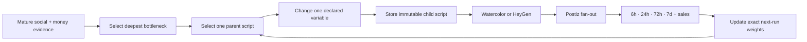
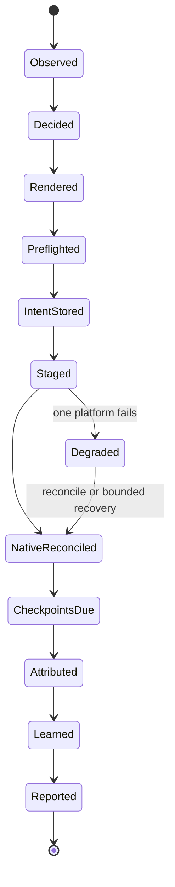

# 28 — Ebook Seller: Dual Monk Revenue Loops

Status: execution SSOT for the current Japanese and English ebook loops

Owner: Dais

Scope: local Mac runtime only; one shared Ebook Seller runner; two product packs; six creative slots per day

Related doctrine: `26-MOBILE-APP-EBOOK-10K-LOOPS.md`, `27-MARKETING-ENGINE-END-TO-END.md`

## 0. Decision

Run one local Ebook Seller skill with two configuration-driven product packs:

1. `ebook-ja-watercolor`: Japanese watercolor monk, selling at `/achan`.
2. `ebook-en-anicca-monk`: English Anicca monk, rendered by the retained HeyGen Anicca Monk Factory, selling at `/monk`.

Each product creates three genuinely new videos per day. Each video fans out through Postiz to that product's TikTok and Instagram accounts. Therefore the daily contract is six unique videos and up to twelve native platform publications—not twelve independently generated videos.

OpenClaw may remain the temporary local clock and process launcher. It does not own product state, publishing truth, metrics, learning, or Telegram wording. The shared Ebook Seller runner owns those contracts so a later scheduler swap does not alter business behavior.

Do not restore the six legacy jobs as the architecture. Their useful assets and craft are inputs to the new adapters; their missing skill paths, raw-log reports, old destinations, and duplicate risks are not restored.

## 1. Outcome and truthful revenue target

Ebooks are one-time purchases. They do not create subscription MRR. Each product has its own non-transferable north-star:

| Product | Verified target | Portfolio effect |
|---|---|---|
| `ebook-ja` | rolling 30-calendar-day settled net revenue of USD `$10,000` equivalent | contributes `$10,000`; EN revenue cannot fill its gap |
| `ebook-en` | rolling 30-calendar-day settled net revenue of USD `$10,000` | contributes `$10,000`; JP revenue cannot fill its gap |
| Both passed | both independent targets are true in the same reporting period | rolling 30-day portfolio net is at least USD `$20,000` equivalent |

Achievement uses actual settled direct-sale and authenticated marketplace receipts after refunds, payment/storefront fees, and known variable fulfillment costs. The first seven complete days may show `pace_30d = settled_net_7d × 30 / 7`, but pace is labeled an estimate and never closes the target. Japanese revenue is reported in JPY plus USD equivalent using the receipt or settlement FX rate; missing FX keeps the USD target unverified rather than inventing a conversion.

At the current direct prices, before fees and refunds, order counts are only gross lower bounds:

| Product | Current price | Gross lower-bound equation |
|---|---:|---|
| English ebook | USD 10.99 | `ceil(10,000 / 10.99) = 910` gross orders; the net target requires more |
| Japanese ebook | JPY 1,580 | `ceil(USD 10,000 / settled net USD-equivalent per order)`; no fixed count without recorded FX and fees |

Publishing volume is an input, not success. A loop is closed only when a native publication is reconciled, due metrics are observed, a business outcome is attributed or explicitly unavailable, and the next creative decision consumes that evidence.

## 2. Measured starting state

The implementation begins from these local read-backs, not assumptions:

| Surface | Current truth | Consequence |
|---|---|---|
| Local scheduler | No current monk/ebook OpenClaw cron jobs; no loaded monk publisher LaunchAgent | Both loops are off and require explicit activation |
| JP legacy assets/state | `~/anicca-monk-factory` retains watercolor assets and prior 07:00 / 12:30 / 20:00 runs | Preserve and characterize; never delete or move this store |
| EN legacy state | Last observed EN run is older; original skill path is absent | Re-enabling a cron alone cannot restore the producer |
| JP TikTok | Postiz integration `cmo5s4edx00vgn10ygnu34a0n`, `obou_anicca`, enabled | Eligible for canary after identity preflight |
| JP Instagram | Postiz integration `cmooplxmu04tpmd0y4h3cpk33`, `obou.anicca`, enabled | Eligible for canary after identity preflight |
| EN TikTok | Postiz integration `cmo5rwq2p00twn10yrsdglng3`, `monk_anicca`, disabled | P0 reconnection blocker for EN TikTok only |
| EN Instagram | Owner-confirmed account `monk.mujo`; no matching live Postiz integration is currently returned | P0: bind the retained HeyGen factory to this exact account before recurring publication; `anicca.en` belongs to aniccaiOS and is prohibited for ebook content |
| EN landing page | `https://aniccaai.com/monk`, HTTP 200, USD 10.99 checkout | Canonical EN destination |
| JP landing page | `https://aniccaai.com/achan`, HTTP 200, JPY 1,580 checkout | Canonical JP destination; `/jp` is not used |
| Direct sales | Product-scoped Stripe snapshots through the latest measured day show zero paid orders for both products | Baseline is zero; views are never relabeled as revenue |
| Native metrics | Exact Postiz analytics read-back works for an actual JP Instagram publication | Reuse the current native metrics lane; do not use the failed Apify collector |

The owner confirmed that the retained HeyGen Anicca Monk Factory is the current English ebook producer and that its Instagram destination is `@monk.mujo`. The older `@monk.anicca` Postiz integration is absent from the live integration list, and `@anicca.en` is an aniccaiOS account, not an ebook account. EN recurring activation therefore remains blocked until the exact `@monk.mujo` transport/integration is read back and bound. The rejected local Wav2Lip proof is not acceptable for publication.

HeyGen is the approved current renderer for this product. A renderer failure becomes a bounded same-path retry and a natural-language Telegram incident, never a silent provider substitution. OmniAvatar and MuseTalk remain optional challengers only; they cannot replace the working HeyGen identity or alter the destination without a measured owner-approved promotion. No EN create is allowed while E4 remains open.

An evidence-only local candidate was also inspected: [`stefanskiasan/MuseTalk-Metal`](https://github.com/stefanskiasan/MuseTalk-Metal/tree/apple-silicon). Its checked-out `apple-silicon` branch contains the model code, MPS device selection, Apple Vision landmark path, and SyncNet scoring. A Vision landmark smoke test passed after installing the macOS bridge. A CPU-only 1.2-second smoke produced an actual H.264/AAC MP4 at 270×480 in 64 seconds; this is not yet a production-length or quality-gated EN render. The canonical owned source is `/Users/anicca/anicca-monk-factory/characters/en/icon_v2_full.png` (1536×2752, fixture hash `d5e744167f5f653d30f0e4c377ffe9a802f8502e683783aaebd580abab1754e0`). The MPS model load drove this Mac's swap to approximately 5 GB and left no usable disk headroom. It is therefore a candidate for E4 evaluation, not a production renderer or an OmniAvatar quality claim.

## 3. Ideal architecture

### 3.0 Current execution status

The JP watercolor producer and pack/routing foundations are complete. The retained EN HeyGen producer exists, but its destination contract is stale: the removed `@monk.anicca` integration and the incorrect aniccaiOS account `@anicca.en` cannot be used. The critical path is `E1 → E3 → E4 → E8 → E15`; no scheduler or EN publication may bypass exact `@monk.mujo` identity and transport read-back.

The runner lives with the shared Marketing Engine under `skills/earn/marketing-engine/`. Product packs contain account IDs, destination, schedule, allowed claims, renderer selection, brand assets, pricing, stop rules, and experiment weights. Producer adapters contain craft. The Postiz adapter contains provider-specific create/reconcile behavior. None of these adapters owns the clock or learning policy.

### 3.1 Local scheduling contract

All times are `Asia/Tokyo` and intentionally staggered:

| Product | Slot 1 | Slot 2 | Slot 3 |
|---|---:|---:|---:|
| `ebook-ja-watercolor` | 07:00 | 12:30 | 20:00 |
| `ebook-en-anicca-monk` | 08:00 | 14:00 | 21:00 |

Each of the six OpenClaw automations invokes the same deterministic command with `product_id` and `slot_at`. It does not embed business prompts. Timeout must exceed the measured HeyGen render ceiling with a bounded margin. Failure alerting is enabled. A job cannot overlap another turn for the same product.

### 3.2 Content-to-account publication matrix

| Product | Three daily creative videos | Postiz destinations for every video | CTA destination |
|---|---|---|---|
| `ebook-ja-watercolor` | Original Japanese watercolor monk story: a concrete suffering hook → short impermanence teaching → one immediately doable action → ebook CTA | TikTok `@obou_anicca` (`cmo5s4edx00vgn10ygnu34a0n`) and Instagram `@obou.anicca` (`cmooplxmu04tpmd0y4h3cpk33`) | `https://aniccaai.com/achan?campaign=<campaign_id>` |
| `ebook-en-anicca-monk` | Original English Anicca Monk delivery using the retained owner-approved HeyGen identity: a concrete pain hook → impermanence reframe → one immediately doable action → ebook CTA; it is culturally authored, not a literal JP translation | TikTok `@monk_anicca` (`cmo5rwq2p00twn10yrsdglng3`, disabled) and Instagram `@monk.mujo` (owner-confirmed; live transport/integration ID pending exact read-back). `@anicca.en` is prohibited. | `https://aniccaai.com/monk?campaign=<campaign_id>` |

One creative produces one final media hash and one campaign ID, then fans out to both product-locked platforms. Platform-native caption and hashtag formatting may differ, but the video, promise, CTA, creative ID, and campaign identity stay the same. Thus each product creates three videos and six platform publications per day; the portfolio creates six videos and twelve platform publications per day.

### 3.3 Script Engine contract

The Script Engine is the decision brain of both loops. Watercolor and HeyGen present an already-approved script; neither renderer invents product claims, selects a CTA, or mutates the message independently. The general research and script-learning doctrine remains Spec 27 §5.1; this section locks the current JP/EN execution contract.

Every script is immutable and carries:

| Field | Contract |
|---|---|
| `script_id`, `parent_script_id`, version | preserve lineage; a published script is never edited in place |
| product, account, language | JP and EN memory never pools as one audience |
| source mechanism IDs/URLs | record the reusable mechanism without copying wording, footage, identity, or unsupported claims |
| hook, pain angle, teaching/reframe, action, CTA IDs | make component-level learning possible |
| hypothesis, declared mutation, baseline | exactly one primary variable differs from the parent |
| campaign, creative, renderer IDs | join script to both native posts and the sale/refund outcome |
| primary metric, maturity window, stop rule | prevent views or immature data from declaring a sales winner |

The first seven live days form a structured baseline of 21 scripts per product. The engine varies one declared component per child and does not promote or retire from immature evidence. After baseline, each rolling 15-slot product window contains 12 exploitation scripts and three exploration scripts, preserving the 80/20 contract despite a three-per-day cadence.

Decision priority is settled contribution/net revenue, paid order, checkout or qualified click, qualified engagement, then view/retention. Six hours is diagnostic, 24 hours is provisional, 72 hours is the primary social decision point, and seven days is final social maturity; a verified order/refund/revenue event writes through when received. Retirement requires at least three comparable mature observations from the same product, account, platform, and format. `insufficient` is not `lost`.

Learning is closed only when the result changes the exact hook, pain-angle, teaching, action, or CTA weights consumed by the next selection. Writing a report or playbook row that the generator does not read is not learning. A mechanism may cross languages only as a challenger with a new culturally authored script and separate JP/EN evidence.

### 3.4 New-video contract

A normal slot is successful only when all three are new for that product:

- `script_id` and semantic signature;
- `creative_id` and immutable experiment intent;
- final media SHA-256.

Exact asset reuse is allowed only for an explicitly labeled recovery of a publication that never became native. A reused render is not counted as a new daily video. Each experiment declares one primary changed variable: hook, angle, proof, pacing, visual treatment, caption, CTA, or landing treatment.

## 4. Durable turn state

Every transition writes an immutable receipt or an explicit named failure. Restart resumes from the last receipt. It never guesses that a network timeout means a Postiz create failed.

### 4.1 Duplicate-safety contract

The unique side-effect key is `(product_id, slot_at, platform)`. Before any create, persist the creative intent and the platform publish key. After create, persist Postiz `postId` before promotion or another network action.

Postiz does not document an idempotency header for create. An unknown POST result is reconciled against the exact integration, content/media hash, and time window before any retry. TikTok and Instagram effects are isolated: one provider failure cannot erase the other's receipt or make the whole turn look successful.

## 5. Attribution and metrics

Every post destination carries a durable campaign token:

- `https://aniccaai.com/achan?campaign=<campaign_id>`
- `https://aniccaai.com/monk?campaign=<campaign_id>`

The landing page preserves the token into Stripe Checkout metadata. Checkout completion, refund, and fulfillment preserve the same token. Without this propagation, sales are product-level truth only and cannot train a creative-level decision.

### 5.1 Checkpoints

For every native platform receipt, collect at 6 hours, 24 hours, 72 hours, and 7 days:

- views, reach, or impressions as supported;
- likes, comments, shares, saves;
- checkpoint status: measured, not yet due, unavailable, missed, or provider error;
- exact native URL, provider post ID, collection timestamp, and evidence reference.

Business truth is collected daily and at attributable events:

- qualified landing visits;
- checkout starts;
- paid orders and settled gross;
- refunds, fees, net revenue, and contribution where available;
- authenticated KDP orders/royalties/KENP only after the source is connected.

The deepest reliable outcome wins: contribution/net revenue > paid order > checkout/click > qualified engagement > view. Unknown is never converted to zero. The deprecated Apify-based collector is outside this design.

### 5.2 Learning policy

The first seven live days establish a truthful baseline at fixed cadence. After that:

1. Compare only the same product, account, platform, format, and mature checkpoint cohort.
2. Change one declared primary variable per experiment.
3. Keep at least 20% exploration; exploitation never exceeds 80%.
4. Require at least three comparable mature observations before retiring a treatment.
5. Store the weight update in the exact decision input read by the next turn.
6. If sales remain zero, test the next funnel bottleneck instead of declaring a social winner.

Volume remains three videos per product per day until positive contribution is measured. More accounts, more books, bundles, or higher cadence are later scale actions—not part of activation.

## 6. Natural-language Telegram contract

Runtime messages begin with `OpenClaw::: Ebook Seller` so the source is audible and unmistakable. They are concise natural language, never raw stdout.

Telegram receives five natural-language message classes:

0. **Creative quality preview — before every Postiz create.** Send the actual JA or EN candidate video to Telegram with product, slot, hook, renderer, render cost, media hash, and a clear `not posted yet` status. The Telegram media receipt is stored on the creative; this is a quality-observation channel, not an approval wait or a publication claim.

1. **Publication receipt — immediate, one message per creative.** Product, slot, one-sentence content/hook, declared experiment variable, campaign ID, render method/cost, both platform statuses, both native links or named failure, and next checkpoint time. A turn cannot say “posted successfully” without Postiz `postId` and a reconciled native URL.
2. **Daily product digest — once per product at 23:30 JST.** Routine 6h/24h/72h/7d checkpoint rows stay in the ledger and are summarized instead of generating per-platform chat spam. Each of the two daily messages includes:

- created videos out of 3;
- TikTok and Instagram native receipts out of 3 each;
- paid orders, refunds, gross and net revenue with source status;
- rolling 30-day settled net, seven-day pace when valid, exact gap to that product's `$10,000` target, and target status;
- best and worst mature creative, or why no comparison is valid;
- the next single experiment;
- incidents with durable owner and recovery state.

3. **Health incident — immediate and deduplicated.** Product/account/stage, what succeeded, what failed, duplicate risk, bounded retry time, and durable repair owner. One repeated fault does not create hourly spam.
4. **Weekly portfolio decision — Sunday 23:45 JST.** JP and EN remain separate: actual rolling 30-day net, `$10k` gap, evidence quality, promoted/stopped experiments, current `$0/$1k/$3k/$10k` gate, and next bounded allocation. The portfolio reports `$20k` only when both products independently pass `$10k`.

Telegram provider message IDs are stored and deduplicated by event UUID. A send failure receives one bounded retry and cannot block durable publication or metrics truth.

## 7. Atomic implementation order

Only the first unchecked item is active. Each item ends in a focused test, real read-back where applicable, spec/state update, commit, and push.

- [x] **E0 — Freeze ownership and pointers.** This file is the current dual-ebook execution SSOT; Specs 26 and 27 remain revenue doctrine and general engine doctrine. **Evidence:** both specs and the index point here, and active renderer/schedule/runtime authority is explicit.
- [ ] **E1 — Characterize retained producers.** Inventory exact JP watercolor and EN monk scripts, assets, voices, captions, output manifests, and state without moving `~/anicca-monk-factory`. **Done:** one known-good fixture per product reproduces its expected identity and all missing dependencies are named.
  - **Current evidence:** JP has a retained 91.04-second fixture, current mutable script state, historical captions, and eleven cached Kling clips. A new 16.2-second free local preview (720×1280 H.264/AAC, SHA-256 `9c748bd84c4acb0c48b320af6db566f95f80cb6f1241681366064f14cdbe56bd`) renders successfully and is delivered to Telegram as message `27359`; it still lacks an immutable historical run manifest, historical voice/audio identity, and a visual comparison against the 91.04-second fixture. EN has retained HeyGen render logs, avatar `anicca_en_monk_v1`, caption generation, and a Postiz Instagram publication step, but its exact known-good media fixture, current authenticated renderer receipt, and `@monk.mujo` transport binding are not yet durably recorded. E1 remains active until both fixtures are reproducible.
- [x] **E2 — Add two product packs.** Canonical JP/EN pack manifests now lock accounts, Postiz integrations, destinations, prices, three JST slots, renderer, claims, and stop rules; the fail-closed loader rejects any mismatch with the account/product registry. **Evidence:** `ebook_packs.py` read-back and product-routing validation pass; JP Instagram is bound to the observed `cmooplxmu04tpmd0y4h3cpk33` integration rather than its stale mapping-pending record.
- [ ] **E3 — Preflight four publication identities.** JP TikTok `@obou_anicca` and JP Instagram `@obou.anicca` are verified. EN TikTok `@monk_anicca` is explicitly disabled. The previous EN Instagram result for `@anicca.en` is invalidated by owner evidence: that account belongs to aniccaiOS. E3 remains open until the retained HeyGen factory's exact `@monk.mujo` publication transport is read back and recorded without guessing an integration ID.
- [ ] **E4 — Bind and prove the retained HeyGen Anicca Monk Factory.** Preserve the approved avatar/voice identity, record the current authenticated renderer path, input/output hashes, provider receipt, media probe, actual cost, and exact `@monk.mujo` destination binding. Render three distinct EN fixtures and prove that neither `@anicca.en` nor the removed `@monk.anicca` integration can receive them. OmniAvatar/MuseTalk are challengers only and do not block this lane.
  - **Deferred challenger evidence:** `stefanskiasan/MuseTalk-Metal@apple-silicon` and OmniAvatar remain historical experiments only. They do not block the retained HeyGen lane.
  - **Deferred E4.0 — Capture the OmniAvatar UI API protocol.** Record browser Network requests for image upload, audio upload, queue join/data, session hash, event ID, and result stream; replay one built-in example through the API client only when a future challenger comparison is authorized.
    - **Measured endpoint contract:** Gradio `5.36.2`, SSE-v3 queue; `start_session` is endpoint `0` and outputs session state; `preprocess_img` is endpoint `9` with `[image, raw_image_state, orientation_state, session_state]`; `infer_scene` is endpoint `6` with `[processed_image, audio, text, orientation_state, steps, session_state]`. The browser UI successfully completes both uploads; its generator currently errors after queue submission.
  - **Deferred E4.0a — Build the OmniAvatar API adapter.** Challenger-only; not part of activation.
  - **Deferred E4.0b — Run the challenger quality gate.** Challenger-only; not part of activation.
  - **Deferred E4.0c — Evaluate MuseTalk without changing production identity.** Challenger-only; not part of activation.
  - **Deferred E4.1 — Compare the broken Space to a known inference fix.** Challenger-only; not part of activation.
  - **Deferred E4.2 — Build the free 1.3B repair lane.** Challenger-only; not part of activation.
    - **Local terminal finding:** the official CLI hardcodes CUDA device selection, `nccl`, and `torch.cuda.set_device`; this Mac reports MPS available but CUDA device count zero. Docker does not change that hardware contract. Any local terminal execution therefore requires a genuine MPS/MLX port of the OmniAvatar audio-conditioning path, not just cloning the official repo.
  - **Deferred E4.3 — Prove before challenger promotion.** A challenger requires owner approval before it can replace HeyGen.
- [ ] **E5 — Build and prove the product-isolated Script Engine.** Reuse Spec 27 §5.1 and complete S1–S9 in order. **Done:** mature evidence changes the exact next script input twice consecutively, while JP/EN memory, lineage, and one-variable causality remain intact.
  - [ ] **S1 — Recover script history.** Bind retained JP/EN scripts to known creative, native-post, metric, click, and order evidence; duplicates and unknown ancestry remain explicit.
  - [ ] **S2 — Enforce immutable schema.** `brain/script_ledger.py` locks required script fields, deterministic IDs, semantic duplicate rejection, product/language isolation, parent lineage, and one declared component mutation. Publication intent now carries an optional `script_id` only after the ledger proves product/creative/renderer binding and either the exact account or the product-scoped script account; the latter is required for one creative to fan out safely to both canonical accounts. EBook runner wiring must make that receipt mandatory before any render or Postiz create.
  - [ ] **S3 — Lock two writer contracts.** `script_ledger.py` validates JP and EN independently: hook → pain → teaching/reframe → action → CTA must occur in that order, and each body must use its own language character set. `ollama_writer.py` now calls the local `qwen2.5:1.5b` runtime in a JSON-only contract; its draft passed the immutable EN ledger after unsafe sleep/anxiety claims were added to the rejection gate. It remains open until research-backed culturally authored input replaces fixed baseline material.
  - [x] **S4 — Add deterministic preflight.** `script_ledger.py` rejects semantic duplicates, missing source proof/CTA/campaign/creative IDs, invalid mutation declaration, unsupported medical/guaranteed claims, product-language mismatch, and parent-less non-baseline scripts. **Evidence:** both 21-script baselines replay through preflight; an unsupported claim fixture is rejected.
  - [x] **S5 — Materialize two baseline queues.** `baseline_queue.py` materializes 21 immutable, semantically unique scripts for each product (seven culturally distinct pain/theme rows × three action treatments), all held in the product-scoped script ledger. **Evidence:** `evidence/scripts/ebook-baseline/{ebook-ja,ebook-en}.jsonl` each contains 21 distinct script and semantic-signature receipts.
  - [ ] **S6 — Select one mutation from the bottleneck.** `component_weights.py` now consumes only mature product-scoped outcomes and selects by the five script components, with deterministic 80/20 exploit/explore selection. It remains open until real attribution selects parent and changed component from the deepest reliable outcome.
  - [ ] **S7 — Attribute outcomes to script components.** Join script → creative → two platform receipts → campaign → click/checkout/order/refund/net without pooling JP and EN.
  - [ ] **S8 — Write component weights back.** Product-scoped component weights now retain observation counts and mark retirement eligibility only after three low-scoring mature observations; selection returns the exact weight-input hash. It remains open until durable outcome collection writes these inputs for the next production run.
  - [ ] **S9 — Prove two-turn learning.** Two consecutive fixture turns and then one real mature turn show that changed evidence changes the selected parent/mutation and visible script while replay is identical.
- [ ] **E6 — Build the shared resumable runner.** `ebook_runner.py` validates the canonical pack, JST slot, immutable product-scoped script receipt, and both fan-out accounts, then records a replay-safe receipt. JA renders through the owned local watercolor adapter and can send the actual candidate video and provider receipt before any Postiz create. EN remains blocked until the retained HeyGen runtime and `@monk.mujo` transport are bound. Publish, reconcile, measure, attribute, and learning remain to be connected. **Done:** crash/restart and unknown-POST tests prove no duplicate create.
- [x] **E7 — Wrap Japanese watercolor.** The shared runner renders only an immutable product-scoped JP script with locked Kyoko voice, cached watercolor clips, and caption style. A baseline and action-only mutation produce distinct 720×1280 H.264/AAC hashes at zero cost, and both preview videos are delivered to Telegram before publication. **Evidence:** `evidence/renderers/ebook-e7-ja-action-mutation.json`.
- [ ] **E8 — Wrap English HeyGen monk.** Preserve the approved character and voice, render only accepted immutable scripts through the retained HeyGen adapter, and keep scheduler logic outside it. **Done:** three real renders pass visual/audio preflight, produce durable receipts, record actual cost, and are bound fail-closed to `@monk.mujo`.
- [ ] **E9 — Propagate campaign attribution.** The shared runner now stages the existing canonical product+creative attribution token for each fan-out platform intent; it is the token required in the owned redirect URL and later Stripe evidence. Landing, Stripe Checkout metadata, completion, refund, and fulfillment remain to be exercised. **Done:** one non-production checkout fixture and Stripe read-back bind the same campaign without counting test revenue.
- [ ] **E10 — Implement Postiz stage/create/reconcile.** Persist intent and `postId`, isolate platform effects, and reconcile unknown outcomes before retry. **Done:** forced timeout and partial-platform tests produce zero duplicates and truthful degraded state.
- [ ] **E11 — Connect free/native checkpoints and business truth.** Reuse the Marketing Engine's current native/Postiz analytics and product-scoped Stripe snapshots; exclude old Apify paths. **Done:** one actual native post and one no-sale business day render measured/null states correctly.
- [ ] **E12 — Implement natural Telegram projections.** Add the four exact classes in §6 with event-UUID dedupe; routine checkpoints roll into the product digest. **Done:** real publication, daily-product, incident, and weekly-portfolio Bot sends return provider message IDs and exactly match ledger values without raw-log or checkpoint spam.
- [ ] **E13 — Run non-publishing shadow turns.** Execute both products through script decision, render, preflight, intent, metrics read, and report without provider create. **Done:** three consecutive shadow turns per product have no unowned state, identity ambiguity, accidental external effect, or undeclared script mutation.
- [ ] **E14 — Publish the JP canary.** One watercolor creative fans out through Postiz to JP TikTok and Instagram. **Done:** both native URLs and Postiz IDs reconcile, Telegram reports the script hypothesis naturally, and no duplicate exists.
- [ ] **E15 — Publish the EN canary.** One HeyGen creative publishes to Instagram `@monk.mujo`; if EN TikTok `@monk_anicca` remains disabled, Instagram publishes and the turn remains degraded. **Done:** every eligible native effect reconciles, actual render cost is recorded, the script lineage is intact, and no aniccaiOS account receives ebook content.
- [ ] **E16 — Enable six local OpenClaw slots.** Create six local command automations with exact timezone, non-overlap, bounded timeout, and failure alert. Verify no legacy monk publisher is loaded or enabled. **Done:** scheduler read-back matches §3.1 and each job calls only the shared runner.
- [ ] **E17 — Complete the seven-day activation soak.** Monitor without passive waiting while independent fixes and checkpoint collection continue. **Done:** 42 unique videos and scripts exist—21 per product—with up to 84 platform receipts, duplicate external effects equal zero, every due checkpoint is measured or has a named status, daily Stripe truth exists, Telegram IDs exist, and at least one mature result changes a later script input.
- [ ] **E18 — Enter revenue scaling.** Keep cadence fixed until contribution is positive, then allocate more winning capacity within provider/account limits. **Done:** `ebook-ja` and `ebook-en` each independently show at least USD `$10,000` equivalent of actual rolling 30-day settled net revenue; the portfolio is at least `$20,000`, and neither target is closed by views, pace estimates, or the other product's revenue.

### 7.1 Contract test matrix

| To-Be | Test name | Required evidence |
|---|---|---|
| Each product routes only to its two locked accounts and CTA | `test_ebook_product_account_routing` | exact four Postiz IDs and two destination paths match §3.2 |
| One creative fans out without becoming two videos | `test_creative_fanout_preserves_identity` | TikTok/Instagram rows share media hash, creative ID, campaign ID, promise, and CTA |
| A child script changes exactly one declared component | `test_script_lineage_and_single_mutation` | immutable parent/child diff matches the declared hook/angle/teaching/action/CTA mutation |
| JP and EN script memory remains isolated | `test_script_learning_is_product_language_scoped` | an EN winner cannot change JP weights without a new JP challenger treatment |
| Mature evidence changes the next consumed input | `test_script_weight_writeback_changes_next_turn` | two consecutive turns show evidence → weight hash → selected parent/mutation → visible script change |
| Telegram emits exactly four natural message classes | `test_owner_report_four_classes_and_dedupe` | fixture equality plus real Bot message IDs; routine checkpoints create no chat spam |
| JP and EN revenue cannot subsidize each other's target | `test_ebook_targets_are_product_isolated` | `$20k/$0` and `$0/$20k` fixtures both leave one target false; `$10k/$10k` passes both |
| Pace, gross, views, or missing JP FX cannot close net target | `test_rolling_net_target_rejects_proxies` | only actual rolling 30-day settled net with recorded conversion passes |

| E2E item | Judgment |
|---|---|
| UI change | none |
| Maestro | not required; this is a local service, publisher, ledger, and Telegram flow |
| Real E2E | required: exact Postiz/native receipts, real Telegram Bot message IDs, and product-scoped Stripe read-back |

## 8. Activation gates and rollback

No recurring slot is enabled before E1–E13 pass. JP and EN canaries are independent. EN TikTok disconnection cannot block JP or EN Instagram, but it prevents claiming the full EN loop is healthy.

Rollback disables only the six new scheduler entries and preserves every intent, render, Postiz receipt, native URL, metric, sale, and Telegram event. It never deletes retained monk state. Scheduler disablement is not evidence deletion.

Best case: four Postiz identities are healthy, six new videos ship daily, early clicks/orders identify one profitable mechanism, and capacity scales after contribution turns positive.

Base case: JP runs fully while the retained HeyGen lane publishes to `@monk.mujo` and EN TikTok reconnects; the system remains truthful and continues all unaffected work.

Worst case: HeyGen authentication/rendering or the `@monk.mujo` publication transport is unavailable. Durable intents prevent duplicates, unaffected work continues, the incident is reported naturally, and business snapshots remain correct. No ebook content is redirected to an aniccaiOS account.

## 9. Rejected architectures

**Restore six old cron jobs unchanged.** This is fastest only in appearance. The old skill paths are incomplete, notification output is raw, current account mappings differ, and two clocks can create silent duplicates.

**Build one independent engine per language.** This preserves local autonomy but duplicates idempotency, attribution, metrics, reporting, and learning. Product differences belong in packs and producer adapters.

**Wait for full Life Manager migration before publishing.** This reduces temporary scheduler debt but delays the first revenue evidence. The runner is made scheduler-neutral now; only the clock is temporary.

The strongest objection to the selected architecture is that “temporary” OpenClaw scheduling may persist. The mitigation is structural: no business state or decision logic is stored in OpenClaw, so replacing the clock later is a bounded manifest change.

The most likely way this spec is wrong is that the retained HeyGen account or the current `@monk.mujo` transport cannot sustain three distinct daily renders/publications. E4 measures that capacity and exact destination before recurring activation.

## 10. Primary-source alignment

- Postiz, “Create or schedule a new post”: <https://docs.postiz.com/public-api/posts/create>. The response's `postId` is persisted before further action.
- Postiz, “Get analytics data for a specific published post”: <https://docs.postiz.com/public-api/analytics/post>. Analytics are accepted only after exact native identity reconciliation.
- OpenClaw Cron Jobs, “The scheduler persists jobs, wakes the agent at the right time”: <https://docs.openclaw.ai/automation/cron-jobs>. OpenClaw is used only as the local clock and delivery surface.
- Google Cloud idempotency, “オペレーションを複数回行っても、1 回だけ行った場合と同じ最終的な効果”: <https://cloud.google.com/discover/idempotency?hl=ja>. Because POST is not inherently idempotent, intent persistence and reconciliation precede retries.
- OmniAvatar's official repository declares Apache-2.0 and grants a “no-charge, royalty-free, irrevocable copyright license”: <https://github.com/Omni-Avatar/OmniAvatar/blob/main/LICENSE.txt>. E4 still records the exact code, weight, Space, and owned-input license chain used by production.
- Hugging Face documents that existing “ZeroGPU Spaces are available to use for free to all users”: <https://huggingface.co/docs/hub/spaces-zerogpu>. Free access is not treated as a capacity SLA; E4 measures the real three-render daily budget.
- MuseTalk-Metal, `apple-silicon` branch: <https://github.com/stefanskiasan/MuseTalk-Metal/tree/apple-silicon>. The checked-out source contains the MPS device selector, Apple Vision landmark adapter, and SyncNet scorer used for the evidence-only candidate evaluation.
- Barnent1's `musetalk-mac` fork: <https://github.com/barnent1/musetalk-mac>. Its README claims a complete `upstream/musetalk/models` tree, but the checked-out tree omitted that required package; it is rejected as a standalone candidate until upstream repairs the distribution.
