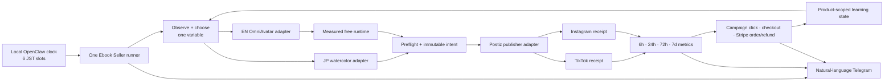
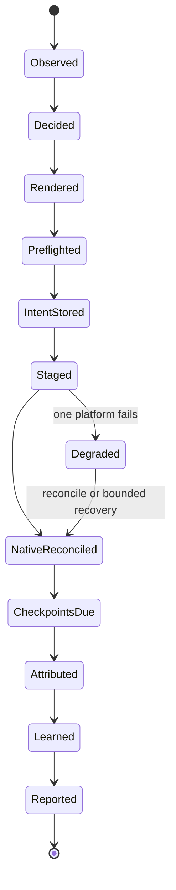

# 28 — Ebook Seller: Dual Monk Revenue Loops

Status: execution SSOT for the current Japanese and English ebook loops

Owner: Dais

Scope: local Mac runtime only; one shared Ebook Seller runner; two product packs; six creative slots per day

Related doctrine: `26-MOBILE-APP-EBOOK-10K-LOOPS.md`, `27-MARKETING-ENGINE-END-TO-END.md`

## 0. Decision

Run one local Ebook Seller skill with two configuration-driven product packs:

1. `ebook-ja-watercolor`: Japanese watercolor monk, selling at `/achan`.
2. `ebook-en-anicca-monk`: English Anicca monk, rendered with OmniAvatar through a measured free execution path, selling at `/monk`.

Each product creates three genuinely new videos per day. Each video fans out through Postiz to that product's TikTok and Instagram accounts. Therefore the daily contract is six unique videos and up to twelve native platform publications—not twelve independently generated videos.

OpenClaw may remain the temporary local clock and process launcher. It does not own product state, publishing truth, metrics, learning, or Telegram wording. The shared Ebook Seller runner owns those contracts so a later scheduler swap does not alter business behavior.

Do not restore the six legacy jobs as the architecture. Their useful assets and craft are inputs to the new adapters; their missing skill paths, raw-log reports, old destinations, and duplicate risks are not restored.

## 1. Outcome and truthful revenue target

Ebooks are one-time purchases. They do not create subscription MRR. The first north-star is:

> Combined `ebook-ja` + `ebook-en` monthly **net revenue run-rate of USD $10,000 equivalent**, calculated from settled direct-sale and authenticated marketplace receipts, after refunds and payment fees.

The stretch target inherited from Spec 26 remains $10,000 monthly gross revenue for each product. Product-local currency results remain separate until a recorded FX rate and timestamp are available.

At the current direct prices, before fees and refunds:

| Product | Current price | Gross sales needed per month | Approximate daily pace |
|---|---:|---:|---:|
| English ebook | USD 10.99 | 910 | 30/day |
| Japanese ebook | JPY 1,580 | 1,000 for JPY 1.58m | 33/day |

Publishing volume is an input, not success. A loop is closed only when a native publication is reconciled, due metrics are observed, a business outcome is attributed or explicitly unavailable, and the next creative decision consumes that evidence.

## 2. Measured starting state

The implementation begins from these local read-backs, not assumptions:

| Surface | Current truth | Consequence |
|---|---|---|
| Local scheduler | No current monk/ebook OpenClaw cron jobs; no loaded monk publisher LaunchAgent | Both loops are off and require explicit activation |
| JP legacy assets/state | `~/anicca-monk-factory` retains watercolor assets and prior 07:00 / 12:30 / 20:00 runs | Preserve and characterize; never delete or move this store |
| EN legacy state | Last observed EN run is older; original skill path is absent | Re-enabling a cron alone cannot restore the producer |
| JP TikTok | Postiz integration `cmo5s4edx00vgn10ygnu34a0n`, `obou_anicca`, enabled | Eligible for canary after identity preflight |
| JP Instagram | Postiz integration `cmooplxmu04tpmd0y4h3cpk33`, `obou.anicca`, enabled | Eligible for canary after identity preflight |
| EN TikTok | Postiz integration `cmo5rwq2p00twn10yrsdglng3`, `monk_anicca`, disabled | P0 reconnection blocker for EN TikTok only |
| EN Instagram | Postiz integration `cmn8y95rg02d2qx0y09bbk5pb`, `anicca.en`, enabled | Eligible for canary after identity preflight |
| EN landing page | `https://aniccaai.com/monk`, HTTP 200, USD 10.99 checkout | Canonical EN destination |
| JP landing page | `https://aniccaai.com/achan`, HTTP 200, JPY 1,580 checkout | Canonical JP destination; `/jp` is not used |
| Direct sales | Product-scoped Stripe snapshots through the latest measured day show zero paid orders for both products | Baseline is zero; views are never relabeled as revenue |
| Native metrics | Exact Postiz analytics read-back works for an actual JP Instagram publication | Reuse the current native metrics lane; do not use the failed Apify collector |

The owner inspected the existing OmniAvatar output and approved its quality as good enough for the current English Anicca monk. Existing evidence identifies the `alexnasa/OmniAvatar` ZeroGPU run, a 5.04-second 400×720 H.264/AAC output, and Telegram receipt `4893`; this owner decision promotes OmniAvatar from challenger to the primary EN renderer for this loop. Implementation binds that accepted artifact to the durable ledger or reproduces the same free path before recurring EN activation.

HeyGen is explicitly outside this architecture: there is no subscription, no HeyGen API call, no paid fallback, and no new HeyGen-derived source asset. A provider outage or free-quota exhaustion becomes a bounded OmniAvatar retry and natural-language Telegram incident; it never authorizes a silent renderer substitution. The EN recurring schedule starts only after the intended free path proves that it can deliver three distinct daily renders at zero render cost.

## 3. Ideal architecture

The runner lives with the shared Marketing Engine under `skills/earn/marketing-engine/`. Product packs contain account IDs, destination, schedule, allowed claims, renderer selection, brand assets, pricing, stop rules, and experiment weights. Producer adapters contain craft. The Postiz adapter contains provider-specific create/reconcile behavior. None of these adapters owns the clock or learning policy.

### 3.1 Local scheduling contract

All times are `Asia/Tokyo` and intentionally staggered:

| Product | Slot 1 | Slot 2 | Slot 3 |
|---|---:|---:|---:|
| `ebook-ja-watercolor` | 07:00 | 12:30 | 20:00 |
| `ebook-en-anicca-monk` | 08:00 | 14:00 | 21:00 |

Each of the six OpenClaw automations invokes the same deterministic command with `product_id` and `slot_at`. It does not embed business prompts. Timeout must exceed the measured OmniAvatar render ceiling with a bounded margin. Failure alerting is enabled. A job cannot overlap another turn for the same product.

### 3.2 New-video contract

A normal slot is successful only when all three are new for that product:

- `script_id` and semantic signature;
- `creative_id` and immutable experiment intent;
- final media SHA-256.

Exact asset reuse is allowed only for an explicitly labeled recovery of a publication that never became native. A reused render is not counted as a new daily video. Each experiment declares one primary changed variable: hook, angle, proof, pacing, visual treatment, caption, CTA, or landing treatment.

## 4. Durable turn state

Every transition writes an immutable receipt or an explicit named failure. Restart resumes from the last receipt. It never guesses that a network timeout means a Postiz create failed.

### 4.1 Duplicate-safety contract

The unique side-effect key is `(product_id, slot_at, platform)`. Before any create, persist the creative intent and the platform publish key. After create, persist Postiz `postId` before promotion or another network action.

Postiz does not document an idempotency header for create. An unknown POST result is reconciled against the exact integration, content/media hash, and time window before any retry. TikTok and Instagram effects are isolated: one provider failure cannot erase the other's receipt or make the whole turn look successful.

## 5. Attribution and metrics

Every post destination carries a durable campaign token:

- `https://aniccaai.com/achan?campaign=<campaign_id>`
- `https://aniccaai.com/monk?campaign=<campaign_id>`

The landing page preserves the token into Stripe Checkout metadata. Checkout completion, refund, and fulfillment preserve the same token. Without this propagation, sales are product-level truth only and cannot train a creative-level decision.

### 5.1 Checkpoints

For every native platform receipt, collect at 6 hours, 24 hours, 72 hours, and 7 days:

- views, reach, or impressions as supported;
- likes, comments, shares, saves;
- checkpoint status: measured, not yet due, unavailable, missed, or provider error;
- exact native URL, provider post ID, collection timestamp, and evidence reference.

Business truth is collected daily and at attributable events:

- qualified landing visits;
- checkout starts;
- paid orders and settled gross;
- refunds, fees, net revenue, and contribution where available;
- authenticated KDP orders/royalties/KENP only after the source is connected.

The deepest reliable outcome wins: contribution/net revenue > paid order > checkout/click > qualified engagement > view. Unknown is never converted to zero. The deprecated Apify-based collector is outside this design.

### 5.2 Learning policy

The first seven live days establish a truthful baseline at fixed cadence. After that:

1. Compare only the same product, account, platform, format, and mature checkpoint cohort.
2. Change one declared primary variable per experiment.
3. Keep at least 20% exploration; exploitation never exceeds 80%.
4. Require at least three comparable mature observations before retiring a treatment.
5. Store the weight update in the exact decision input read by the next turn.
6. If sales remain zero, test the next funnel bottleneck instead of declaring a social winner.

Volume remains three videos per product per day until positive contribution is measured. More accounts, more books, bundles, or higher cadence are later scale actions—not part of activation.

## 6. Natural-language Telegram contract

Runtime messages begin with `OpenClaw::: Ebook Seller` so the source is audible and unmistakable. They are concise natural language, never raw stdout.

Per-slot completion reports include product, slot, creative/hypothesis, native links or named platform failure, next checkpoint time, and whether the turn is healthy or degraded. A turn cannot say “posted successfully” without Postiz `postId` and a reconciled native URL.

Checkpoint reports include the exact metrics, checkpoint age/status, change from the previous mature comparable result, and the next decision if evidence is sufficient. Daily product digests include:

- created videos out of 3;
- TikTok and Instagram native receipts out of 3 each;
- paid orders, refunds, gross and net revenue with source status;
- best and worst mature creative, or why no comparison is valid;
- the next single experiment;
- incidents with durable owner and recovery state.

Telegram provider message IDs are stored and deduplicated by event UUID. A send failure receives one bounded retry and cannot block durable publication or metrics truth.

## 7. Atomic implementation order

Only the first unchecked item is active. Each item ends in a focused test, real read-back where applicable, spec/state update, commit, and push.

- [x] **E0 — Freeze ownership and pointers.** This file is the current dual-ebook execution SSOT; Specs 26 and 27 remain revenue doctrine and general engine doctrine. **Evidence:** both specs and the index point here, and active renderer/schedule/runtime authority is explicit.
- [ ] **E1 — Characterize retained producers.** Inventory exact JP watercolor and EN monk scripts, assets, voices, captions, output manifests, and state without moving `~/anicca-monk-factory`. **Done:** one known-good fixture per product reproduces its expected identity and all missing dependencies are named.
- [ ] **E2 — Add two product packs.** Encode canonical accounts, integrations, landing destinations, prices, three JST slots, renderer, claims, and stop rules. **Done:** schema and identity tests reject the old EN Instagram integration and `/jp` destination.
- [ ] **E3 — Preflight four Postiz identities.** Read back all four integration profiles; reconnect EN TikTok without altering the other three. **Done:** four account/profile mappings are enabled and match this spec, or EN remains explicitly degraded with only Instagram eligible.
- [ ] **E4 — Bind the approved OmniAvatar artifact and prove free capacity.** Recover Telegram artifact `4893` into durable evidence or reproduce the same `alexnasa/OmniAvatar` free path; record source/model revision, license chain, provider receipt, quota state, latency, input/output hashes, media probe, and the owner's quality approval. Then render three distinct daily fixtures through the intended free runtime. **Done:** all three complete at zero render cost with stable character/voice identity and no HeyGen request, subscription, source asset, or fallback.
- [ ] **E5 — Build the shared resumable runner.** Implement observe, decide, render, preflight, intent, publish, reconcile, measure, attribute, learn, and report states with the unique publish key. **Done:** crash/restart and unknown-POST tests prove no duplicate create.
- [ ] **E6 — Wrap Japanese watercolor.** Preserve its identity and expose only bounded experiment variables. **Done:** golden output and one-variable mutation characterization pass.
- [ ] **E7 — Wrap English OmniAvatar monk.** Preserve the approved character and voice behind the free OmniAvatar adapter; no scheduler code enters the adapter. **Done:** a real render passes visual/audio preflight, produces a durable receipt, records zero render cost, and rejects any HeyGen configuration.
- [ ] **E8 — Propagate campaign attribution.** Carry campaign ID from each destination through landing, Stripe Checkout metadata, completion, refund, and fulfillment. **Done:** one non-production checkout fixture and Stripe read-back bind the same campaign without counting test revenue.
- [ ] **E9 — Implement Postiz stage/create/reconcile.** Persist intent and `postId`, isolate platform effects, and reconcile unknown outcomes before retry. **Done:** forced timeout and partial-platform tests produce zero duplicates and truthful degraded state.
- [ ] **E10 — Connect free/native checkpoints and business truth.** Reuse the Marketing Engine's current native/Postiz analytics and product-scoped Stripe snapshots; exclude old Apify paths. **Done:** one actual native post and one no-sale business day render measured/null states correctly.
- [ ] **E11 — Implement natural Telegram projections.** Add per-slot, checkpoint, incident, and daily product messages with event-UUID dedupe. **Done:** a real Bot send returns a provider message ID and matches ledger values.
- [ ] **E12 — Run non-publishing shadow turns.** Execute both products through decision, render, preflight, intent, metrics read, and report without provider create. **Done:** three consecutive shadow turns per product have no unowned state, identity ambiguity, or accidental external effect.
- [ ] **E13 — Publish the JP canary.** One watercolor creative fans out through Postiz to JP TikTok and Instagram. **Done:** both native URLs and Postiz IDs reconcile, Telegram reports naturally, and no duplicate exists.
- [ ] **E14 — Publish the EN canary.** One OmniAvatar creative fans out through Postiz to EN TikTok and Instagram; if EN TikTok remains disabled, Instagram publishes and the turn remains degraded. **Done:** all eligible native effects reconcile, render cost is zero, and the blocker is explicit.
- [ ] **E15 — Enable six local OpenClaw slots.** Create six local command automations with exact timezone, non-overlap, bounded timeout, and failure alert. Verify no legacy monk publisher is loaded or enabled. **Done:** scheduler read-back matches §3.1 and each job calls only the shared runner.
- [ ] **E16 — Complete the seven-day activation soak.** Monitor without passive waiting while independent fixes and checkpoint collection continue. **Done:** 42 unique videos exist—21 per product—with up to 84 platform receipts, duplicate external effects equal zero, every due checkpoint is measured or has a named status, daily Stripe truth exists, Telegram IDs exist, and at least one mature result changes a later decision input.
- [ ] **E17 — Enter revenue scaling.** Keep cadence fixed until contribution is positive, then allocate more winning capacity within provider/account limits. **Done:** the first combined $10k monthly net revenue run-rate is supported by settled receipts and refunds/fees, never extrapolated views.

## 8. Activation gates and rollback

No recurring slot is enabled before E1–E12 pass. JP and EN canaries are independent. EN TikTok disconnection cannot block JP or EN Instagram, but it prevents claiming the full EN loop is healthy.

Rollback disables only the six new scheduler entries and preserves every intent, render, Postiz receipt, native URL, metric, sale, and Telegram event. It never deletes retained monk state. Scheduler disablement is not evidence deletion.

Best case: four Postiz identities are healthy, six new videos ship daily, early clicks/orders identify one profitable mechanism, and capacity scales after contribution turns positive.

Base case: JP runs fully while EN Instagram proves the free OmniAvatar lane and EN TikTok reconnects; the system remains truthful and continues all unaffected work.

Worst case: the free OmniAvatar runtime has no capacity or Postiz has an outage. Durable intents prevent duplicates, unaffected work continues, the incident is reported naturally, and business snapshots remain correct. The system does not purchase or invoke HeyGen.

## 9. Rejected architectures

**Restore six old cron jobs unchanged.** This is fastest only in appearance. The old skill paths are incomplete, notification output is raw, current account mappings differ, and two clocks can create silent duplicates.

**Build one independent engine per language.** This preserves local autonomy but duplicates idempotency, attribution, metrics, reporting, and learning. Product differences belong in packs and producer adapters.

**Wait for full Life Manager migration before publishing.** This reduces temporary scheduler debt but delays the first revenue evidence. The runner is made scheduler-neutral now; only the clock is temporary.

The strongest objection to the selected architecture is that “temporary” OpenClaw scheduling may persist. The mitigation is structural: no business state or decision logic is stored in OpenClaw, so replacing the clock later is a bounded manifest change.

The most likely way this spec is wrong is that the available free OmniAvatar quota cannot sustain three distinct daily production renders even though the approved artifact quality is sufficient. E4 measures that capacity before recurring activation without reopening the owner's quality decision or falling back to HeyGen.

## 10. Primary-source alignment

- Postiz, “Create or schedule a new post”: <https://docs.postiz.com/public-api/posts/create>. The response's `postId` is persisted before further action.
- Postiz, “Get analytics data for a specific published post”: <https://docs.postiz.com/public-api/analytics/post>. Analytics are accepted only after exact native identity reconciliation.
- OpenClaw Cron Jobs, “The scheduler persists jobs, wakes the agent at the right time”: <https://docs.openclaw.ai/automation/cron-jobs>. OpenClaw is used only as the local clock and delivery surface.
- Google Cloud idempotency, “オペレーションを複数回行っても、1 回だけ行った場合と同じ最終的な効果”: <https://cloud.google.com/discover/idempotency?hl=ja>. Because POST is not inherently idempotent, intent persistence and reconciliation precede retries.
- OmniAvatar's official repository declares Apache-2.0 and grants a “no-charge, royalty-free, irrevocable copyright license”: <https://github.com/Omni-Avatar/OmniAvatar/blob/main/LICENSE.txt>. E4 still records the exact code, weight, Space, and owned-input license chain used by production.
- Hugging Face documents that existing “ZeroGPU Spaces are available to use for free to all users”: <https://huggingface.co/docs/hub/spaces-zerogpu>. Free access is not treated as a capacity SLA; E4 measures the real three-render daily budget.
