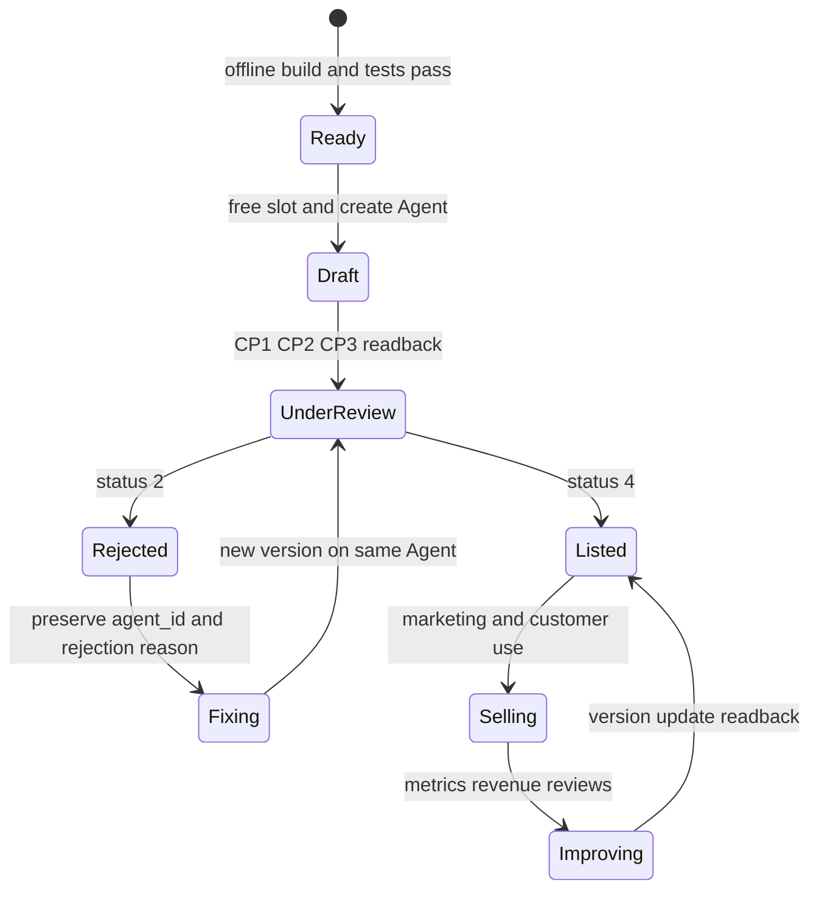
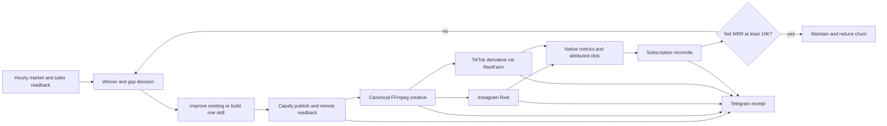
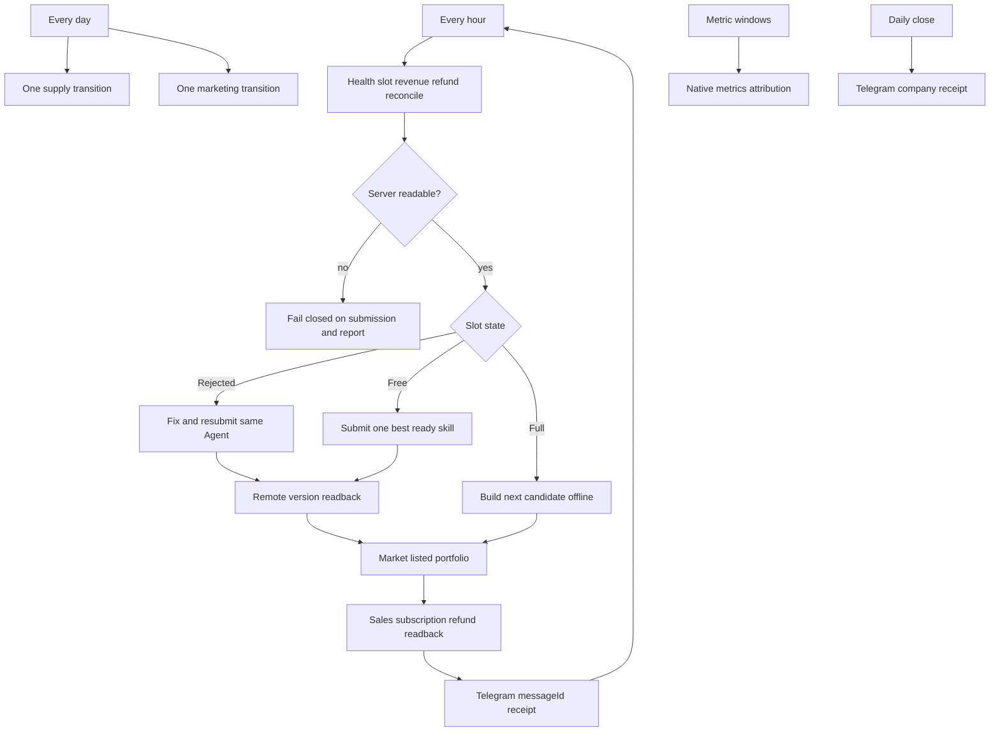

# Capafy $10K MRR closed loop

## Goal

Life Manager public repositoryだけをsourceとして、Capafy skillの発見、改善、新規開発、公開、マーケティング、subscription revenue照合、Telegram receiptまでを毎日自走させる。監視と収益照合は毎時動かし、settled subscription MRRが `$10,000` に到達するまで実測値から反復する。

`done="launchdの全Capafy ProgramArguments/WorkingDirectoryがLife Manager main releaseだけを指し、daily build/publishとdaily marketingが7日連続でhealthy terminal state、hourly reconcileが重複なく動き、各passのskill/version status・creative・native post URL・subscription MRR・Telegram messageIdが同じrun_idでreadbackでき、settled active subscription MRR >= $10,000"`

## Current evidence

| 項目 | 実測 | 判定 |
|---|---|---|
| canonical source | `Daisuke134/life-manager` mainはpublic canonical repo。Capafy sourceは`skills/capafy-autopublish`、`skills/self/capafy-loop`、`skills/earn/capafy-marketing`に存在 | sourceは移植済み |
| launchd cutover | loaded 8件すべての`ProgramArguments`と`WorkingDirectory`が`/Users/anicca/Projects/life-manager-main`を指す。旧repo path 0件、duplicate label 0件 | **PASS: runtimeはLife Manager** |
| scheduler | `ai.anicca.capafy-loop-daily`、IG daily、hourly/daily-close monitorはloaded | schedule定義は存在 |
| process health | daily loopとIG marketingはchild failureをそのままnonzeroで返し、成功時だけterminal heartbeatを書く。7日連続の実運転証明は未完 | wrapper false-green解消、C21継続 |
| event ledger | live ledger 471行でduplicate `event_id` 0件、`verified`後の`unresolved` 0件。exact replayはidempotent、新しいretry/occurrenceだけが新IDを得る | **PASS: identityとphaseは単調** |
| last money snapshot | live GET 5 sourceはfresh。5 orders、gross `$19.98`、pending `$8.00`、realized `$0.00`、refund `$0.00`。order billing mixとseller active subscription identityは取得不能 | one-timeとMRRは`unknown`、grossから推定しない |
| marketing snapshot | IG Reel URLあり、121 views、1 click、0 likes、0 comments。marketing/inventory/account snapshotはstale | 投稿履歴あり、closed loopは停止 |
| creative renderer | Capafy STEP3はrepo-owned canonical rendererを呼び、traceable input→verified output、source hash、media/hash gate後だけSTEP4へ進む | **PASS: rendererとdemonstration gateはLife Manager内** |
| better local assets | repo内`skills/video`と旧`video-processing-editing`が存在。ReelFarmはTikTok slideshow/API automation | FFmpeg編集をcanonical rendererへ採用、ReelFarmはTikTok補助rail |
| Telegram | hourly state-changeはcandidate/version、slot、creative/native URL、moneyを単一`run_id`へjoinし、SQLite outboxでat-most-once delivery。live message ID `28667` | **PASS: unified receipt + dedupe** |
| live inventory read | `/agent/agents`の32行を正規化。22 listed、3 occupied、2 free、7 retry、0 blocked、0 unknown。全行でAgent IDとlatest version IDあり | **PASS: exact slot readback** |

## Acceptance criteria

1. Capafyに関するsource、test、launchd templateはLife Manager repo内だけに存在し、runtime dependency scanが`~/.claude/skills`、`~/.openclaw/skills`、`/Users/anicca/anicca`を0件とする。
2. server truthから各Agentの`agent_id`、title、latest version、`status`、`auditStatus`、billing、salesを取得し、5-slot occupancyを決定できる。
3. fresh Agentの作成はnormalized lifecycleが`occupied`の別Agentが5未満の時だけ行う。現在のplatform文字列では`draft`と`under_review`だけがoccupiedである。server unreadable時は新規Agentを作らない。
4. `review_rejected`はactive 5-slotから外すが、同じ`agent_id`で原因を保存し、production/test/listingを修正し、全gate後に同じAgentのnew versionとして再提出する。5-slotが満杯でもこのretryを止めない。
5. `online`へ遷移したAgentはactive slotから外れ、次のready candidateを1件だけsubmitする。同一wakeで空いた全slotを一斉に埋めない。
6. 5-slot満杯時もlisted skillのmarketing、creative改善、metrics、refund、subscription、MRR、Telegram reporting、次candidateのoffline build/testを継続する。
7. marketing creativeは実skillのinput→outputまたはbefore→afterを見せ、canonical video quality gateを通る。generic stock b-roll + TTSだけのartifactをpublicへ出さない。
8. 各terminal runはskill/version status、slot counts、creative hash、account、native URL、money split、Telegram message IDを単一`run_id`で保存する。
9. hourly control loopとdaily side-effect loopが7日連続で動き、duplicate Agent、duplicate version、duplicate public post、missing receiptが0件になる。
10. revenue truthはone-time、hourly、subscription、refund、fee、pending、settledを分離し、settled net MRRだけで`$10,000` gateを判定する。

## As-Is / To-Be

| concern | As-Is | To-Be |
|---|---|---|
| source | Life Manager内の3 skill treeと旧home/repo dependencyに分散 | `skills/capafy/` bounded contextとrepo-owned shared video/provider adapter |
| scheduling | loaded jobが旧repo pathを実行 | repo templateからinstalled release pathだけを実行 |
| slot control | finite inventory drainer。server response変化で現在read不能 | server-normalized 5-slot state machine + candidate backlog |
| rejection | retry codeはあるがcompany-wide receipt/queueと未統合 | same-agent correction loop、原因分類、再発test、resubmit readback |
| cap full | healthy-idleとしてpublisher全体が終了 | fresh submitだけidle。build、marketing、money、repairは継続 |
| creative | generic stock b-roll + TTS、repo外renderer | real demonstration first、FFmpeg quality gate、artifact evidence |
| money | gross/order/pending/MRRのsnapshotがstale | hourly fresh reconciliation、settled net MRRがobjective |
| reporting |別jobのTelegram文面 | single run receipt + state-change/daily-close dedupe |

## Five-slot lifecycle

5-slotは「1回に5 skillsを含める」という意味ではない。`draft`または`under_review`のAgentを最大5つ同時に保持できるactive submission capである。`online`と`review_rejected`はactive slotから外れる。rejected Agentは捨てず、同じ`agent_id`を修正・version updateして再提出する。



### Slot allocator contract

| observed state | publisher action | work that continues |
|---|---|---|
| `occupied < 5` + retry exists | retry rejected Agent first | marketing、metrics、money、candidate build |
| `occupied < 5` + no retry + ready candidate | submit exactly one fresh Agent | same |
| `occupied >= 5` + retry exists | retry same Agent; it reuses its slot | same |
| `occupied >= 5` + no retry | no fresh submission | marketing、metrics、money、offline candidate build |
| listed transition frees slot | next daily wake submits one best candidate | listed portfolio keeps selling |
| server unreadable | do not create/update Agent | public readback where available、marketing safety checks、report blocker |

The existing Life Manager runbook is the primary implementation evidence: `DAILY_LOOP.md` states that a rejected retry reuses its existing slot and proceeds when unlisted is 5, while the five-slot cap applies only to a fresh Agent. Capafy describes itself as a marketplace where publishers upload Skills and users buy/run them.

ソース: [Capafy: Become a Publisher](https://capafy.ai/earn) / 核心の引用: 「Publishers upload Skills they've built; users discover, buy, and run them.」

## Metric contract

`MRR` はactive paid subscriptionの正規化月額合計だけを指す。一時購入、pending payout、gross order value、download、view、click、trialはMRRへ加算しない。

```text
settled_mrr_usd = sum(active_subscription.normalized_monthly_amount_usd)
net_mrr_usd = settled_mrr_usd - refunds_usd - recurring_platform_fees_usd
```

一時購入は`one_time_revenue_usd`、入金待ちは`pending_usd`、全注文は`gross_usd`へ分離する。Capafy APIがactive subscription identityを返さない場合、MRRは`unknown`とし、grossから推定しない。

ソース: [Stripe: What is monthly recurring revenue?](https://stripe.com/resources/more/what-is-monthly-recurring-revenue) / 核心の引用: 「MRRとは、顧客から毎月発生する予測可能な定期収入を指します。」

## Canonical architecture



### Source and runtime boundary

- source/build/test/releaseはLife Manager public repoだけを使う。
- mutable state、credential、logs、media artifactsはrepo外`~/.local/state/life-manager/`へ置く。
- launchd plistはrepo内templateからinstallし、ProgramArgumentsとWorkingDirectoryはcanonical main release pathを指す。
- `/Users/anicca/anicca`と`~/.openclaw/skills`はcutover後にruntime dependencyとして使わない。
- user agentの定期起動はlaunchdを使う。Appleはper-user background processについてlaunchdをpreferredとし、timed intervalsをsupportすると説明する。

ソース: [Apple: Creating Launch Daemons and Agents](https://developer.apple.com/library/archive/documentation/MacOSX/Conceptual/BPSystemStartup/Chapters/CreatingLaunchdJobs.html) / 核心の引用: 「If you are running per-user background processes for OS X, launchd is also the preferred way to start these processes.」

### Cadence

| cadence | responsibility | external side effect |
|---|---|---|
| every hour | health, auth, inventory, active subscriptions, refunds, revenue, MRR, stale-run detection | Telegram only on state change or scheduled digest |
| once daily | choose one highest-EV supply action: improve a selling skill or create one differentiated skill; submit through remote review gate | Capafy publish/update |
| once daily per account | render one quality-gated creative, publish within account cadence, read native URL | social publish |
| metric windows | collect native views/likes/comments/clicks and subscription delta | read-only |
| daily close | one deduped company digest | Telegram |

Hourly wake does not create or publish a new skill every hour. It observes, reconciles and repairs. Supply and public posting remain bounded daily actions to prevent duplicate drafts, duplicate posts and account damage.

## Finished 24/7 operation

24/7は1つのLLM processを永久起動する意味ではない。launchdが短いidempotent wakeを起動し、各wakeがserver/stateを読み、1つのbounded transitionを行い、receiptを残して終了する。



Macが起動中ならlaunchd user agentsが運転する。sleep/offlineでmissしたwakeは次回wakeがdurable stateから再開し、時刻だけを根拠に二重submissionしない。Appleはtimed launchd jobを`StartCalendarInterval`で構成すると説明する。

ソース: [Apple: Scheduling Timed Jobs](https://developer.apple.com/library/archive/documentation/MacOSX/Conceptual/BPSystemStartup/Chapters/ScheduledJobs.html) / 核心の引用: 「specify a StartCalendarInterval key containing a dictionary of time values.」

## How the portfolio makes money

1. **Supply**: live sales、search demand、support/rejection evidenceからone-job skillを作る。
2. **Conversion**: listingはverified output、test input、honest capability、clear billingを持つ。
3. **Distribution**: listed Agentごとに実outputを見せるshort videoを作り、native accountからlanding/listingへ送る。
4. **Monetization**: Capafyのsubscription、hourly access、downloadの実orderを受ける。
5. **Retention**: usage、review、refund、support、churnを読み、売れるAgentのversionを改善する。
6. **Allocation**: slotが空いたら、最も高いsettled contributionを見込むready candidateを1件入れる。
7. **Compounding**: listed portfolioは新規submission待ち中も販売とmarketingを継続する。

Capafy自身もrepeatable AI workflowをpaid Skillにし、subscription、hourly access、downloadでearnすると説明する。

ソース: [Capafy: How to Make Money With AI](https://capafy.ai/blog/how-to-make-money-with-ai) / 核心の引用: 「earn through subscriptions, hourly access, or downloads on Capafy.」

`$10K MRR`へ数えるのはsubscriptionだけである。hourly/downloadはcash revenueとcontributionへ数えるがMRRへ混ぜない。marketingのprimary optimization chainは`qualified native view → landing click → product view → paid subscription → retained subscription → settled net MRR`とする。

## Creative contract

The Capafy marketing loop reuses one canonical Life Manager video renderer. It does not call repo-external `faceless-money-factory`.

1. Input is the selected listing's verified name, capability, audience pain and CTA.
2. The first 1.5 seconds show the result or pain, not a generic money clip.
3. Visuals demonstrate the skill where possible: real UI/output capture, before/after, highlighted deliverable. Stock b-roll is fallback only.
4. `video-processing-editing` behavior is ported into Life Manager: one FFmpeg encode pass, normalized BT.709/yuv420p, mixed/normalized audio, burned captions, frame-accurate edits.
5. Gate requires 1080x1920, 9:16, audible narration, caption safe area, no black frames, no duplicated opening, no secret/PII, and a generated contact sheet plus full mp4 for review evidence.
6. Instagram receives the quality-gated video through the existing Capafy account/poster rail.
7. ReelFarmはTikTok slideshow derivativeにだけ使う。canonical IG renderer、scheduler、revenue truthにはしない。
8. A native post URL readback is required before a post is recorded as published.

Meta documents a dedicated Reel size/aspect-ratio contract; the runtime must validate the produced file before upload rather than assume the renderer complied.

ソース: [Meta: Instagramリールのサイズとアスペクト比](https://www.facebook.com/business/help/1038071743007909) / 核心の引用: 「Instagramリールのサイズとアスペクト比」

## Closed-loop receipt

Every terminal pass writes one immutable receipt keyed by `run_id`:

```json
{
  "run_id": "capafy-...",
  "skill": {"agent_id": "...", "name": "...", "version": "...", "remote_status": "..."},
  "creative": {"artifact_sha256": "...", "renderer": "life-manager-video", "quality_gate": "pass"},
  "distribution": [{"platform": "instagram", "account": "...", "native_url": "...", "post_id": "..."}],
  "money": {"one_time_revenue_usd": "0.00", "pending_usd": "0.00", "settled_mrr_usd": "0.00", "net_mrr_usd": "0.00", "freshness": "fresh"},
  "telegram": {"chat_id": "...", "message_id": "..."},
  "verdict": "success|no-op|failure"
}
```

Telegram report begins with `Life Manager:::` and contains new/updated skill name, agent_id, version status, promoted account, native post URL, revenue split, MRR, artifact, blocker and next atomic action. Media delivery counts only when Telegram returns a message ID.

## Loaded launchd inventory

`launchctl print gui/$(id -u)`、installed plist、repo template、実スクリプトを突合したcurrent loaded setは8件で、owner不明は0件、重複は0件である。8件すべての`ProgramArguments`と`WorkingDirectory`がLife Manager main releaseを指す。旧repoを実行していた動的provision browserはunloadし、account managerがreplacement時にLife Manager sourceから必要時submitする。backup/disabled plistはloaded setへ含めない。

| loaded label | owner / responsibility | cadence | current source | durable state / evidence | logs | observed runtime |
|---|---|---|---|---|---|---|
| `ai.anicca.capafy-ig-account-manager` | Life Manager / IG account lifecycle | 300秒 + RunAtLoad | `$LIFE_MANAGER_REPO/skills/earn/capafy-marketing/capafy-ig-account-manager.sh` | `~/.cloak/clip-accounts-capafy.json`; `~/.openclaw/state/capafy-{ig-lifecycle,account-manager-result}.json`; account-manager evidence | `~/.local/state/life-manager/logs/capafy-ig-account-manager.{out,err}` | loaded; bootstrap run 1; last exit 0 |
| `ai.anicca.capafy-goal-monitor-hourly` | Life Manager / hourly company telemetry + Telegram | 毎時00分 | `$LIFE_MANAGER_REPO/skills/earn/capafy-marketing/capafy-goal-monitor.sh` (`CAPAFY_REPORT_KIND=hourly`) | revenue events/evidence; portfolio; goal-monitor state/delivery; incidents | `~/.local/state/life-manager/logs/capafy-goal-monitor-hourly.{out,err}` | loaded; scheduled |
| `ai.anicca.capafy-goal-monitor` | Life Manager / morning company audit | 毎日09:30 | `$LIFE_MANAGER_REPO/skills/earn/capafy-marketing/capafy-goal-monitor.sh` | goal-monitor shared state/evidence | `~/.local/state/life-manager/logs/capafy-goal-monitor.{out,err}` | loaded; scheduled |
| `ai.anicca.capafy-goal-monitor-daily-close` | Life Manager / daily-close company report | 毎日23:50 | `$LIFE_MANAGER_REPO/skills/earn/capafy-marketing/capafy-goal-monitor.sh` (`CAPAFY_REPORT_KIND=daily_close`) | goal-monitor shared state/evidence | `~/.local/state/life-manager/logs/capafy-goal-monitor-daily-close.{out,err}` | loaded; scheduled |
| `ai.anicca.capafy-ig-marketing-daily` | Life Manager / IG creative + publisher | 毎日16:00 | `$LIFE_MANAGER_REPO/skills/earn/capafy-marketing/capafy-ig-marketing-daily.sh` | IG lifecycle; marketing result/creative/caption; marketing evidence | `~/.local/state/life-manager/logs/capafy-ig-marketing-daily.{out,err}` | loaded; scheduled |
| `ai.anicca.capafy-outcome-monitor` | Life Manager / terminal self-fix outcome verifier | 60秒 | `$LIFE_MANAGER_REPO/skills/earn/capafy-marketing/capafy-outcome-monitor.sh` | `.self-fix-capafy-loop.incident.json`; outcome-monitor lock; result/lifecycle readback | `~/.local/state/life-manager/logs/capafy-outcome-monitor.{out,err}.log` | loaded; scheduled |
| `ai.anicca.capafy-loop-healthcheck` | Life Manager / business-outcome supervisor | 300秒 | `$LIFE_MANAGER_REPO/skills/self/capafy-loop/capafy-loop-healthcheck.sh` | business-health/incident state; daily job readback | `~/.local/state/life-manager/logs/capafy-loop-launchd.{out,err}.log` | loaded; scheduled |
| `ai.anicca.capafy-loop-daily` | Life Manager / daily build, publish and money loop | 毎日08:10 | `$LIFE_MANAGER_REPO/skills/self/capafy-loop/capafy-loop-daily.sh` | portfolio; builder result; earn ledger; last-pass; marketplace evidence | `~/.local/state/life-manager/logs/capafy-loop-daily.{out,err}` | loaded; scheduled |

C1で`capafy-ig-account-manager.sh`、`capafy-outcome-monitor.sh`とそのruntime closureをLife Managerの最終既知実装から復元する。repo-owned templateは`__REPO_ROOT__`と`__LIFE_MANAGER_HOME__`だけを入力にし、render-only commandはlive LaunchAgents directoryへの出力を拒否する。render後の8 plistは`plutil`を通り、account managerは78件、outcome monitorは54件、Python runtime closureは98件のfocused regressionを通る。

C2で旧installed definitionをrollback snapshotへ保存し、8件をbootout、render済みplistをinstall、同じ8 labelsをbootstrapする。`launchctl print` readbackは8/8件のsourceとWorkingDirectoryがLife Managerで、旧repo path 0件、duplicate label 0件、旧動的provision browser 0件である。rollback snapshotのcurrent pointerは`~/.local/state/life-manager/state/capafy-c2-last-backup.txt`に置く。

C3でdaily money loopとIG marketing wrapperをterminal stateの唯一のownerにする。failure injectionではmoney childの`17`とIG childの`23`をそのまま返し、どちらもheartbeatを作らない。child `0`とIG cadence no-opだけがheartbeatを作る。focused 4件、Capafy marketing 112件、runner wiring 10件（subtest 7件）、money loop 7件が通る。

C4はmainに存在するevent store、incident adapter、incident transitionの現行実装をlive stateに対して再検証する。exact replayは同じevent IDでappendされず、semantic changeまたは新しいretry occurrenceは別IDになり、`verified`からの遷移は拒否される。live ledger 471行はduplicate ID 0件、`verified`後の`unresolved` 0件で、outcome 31件、adapter 12件、store 24件、shell monitor 54件、marketing全体112件が通る。追加production codeは不要である。

C5でread-only hourly reconcileをLife Managerへ追加し、account、inventory、90-day sales summary、payout、refundを各1回だけGETしてatomic receiptへ保存する。live receiptは5 sourceすべてfresh、5 orders、gross `$19.98`、pending `$8.00`、realized `$0.00`、refund `$0.00`、inventory 32 Agent観測である。seller側active subscription sourceとorder単位billing modeがないため、one-time revenue、settled MRR、net MRRは`unknown`を維持する。receiptはmode `0600`、focused 4件とmarketing全体116件が通る。

C6でcanonical `inventory_status.py`へserver row normalizerを追加する。live responseの32 Agentは22 `online`、3 `draft`、7 `review_rejected`で、normalized countsはlisted 22、occupied 3、free 2、retry 7、blocked 0、unknown 0となる。32/32行にAgent IDとlatest version IDがある。未知statusまたはidentity欠損時はoccupied/freeを`null`にして`SERVER_UNREADABLE`へfail-closedする。focused 3件、autopublish Python 5件、AID guard、leak scan、marketing 116件が通る。

C7でslot allocatorをside-effect-free decision関数へ分離する。優先順位はserver unreadableで停止、same-Agent retry、cap-full idle、fresh candidate 1件、drained idleで、1 wakeのactionは最大1件である。retryは`retry:<agent_id>`、fresh submitは`create:<feature>`のstable action keyを持つ。live stateはoccupied 3、free 2、ready candidate 1件から`create_fresh`を選び、連続2 readで同じ`create:capafy-o13-user-interview-synthesizer`を返し、readback中のAgent作成は0件である。focused 5件、autopublish 7件、AID/leak guards、marketing 116件が通る。

C8でrejected versionを`<agent_id>:<source_version_id>`キーのdurable repair queueへ保存する。live `review_rejected` 7件は7/7が`update_existing_agent`、同じAgent ID、既知のtarget next versionを持ち、new Agent IDを作らない。連続2 readでも7件のままである。platform detailは`status=2`と`auditStatus=3`を返すがreason本文を返さないため、7件を`platform_reason_unavailable` / `needs_diagnosis`としてfail-closedで保存し、原因を捏造しない。fixtureでは実reasonの保存、同version dedupe、進捗保持、同Agentのnew rejected version追加を検証する。queueはmode `0600`、focused 4件、autopublish 11件、AID/leak guards、marketing 116件が通る。外部same-Agent resubmitはC18で実行する。

C9でlocal candidate artifactとplatform inventoryを分離したdurable backlogを追加する。daily loopは同じinventory readをbacklogへ渡してから`CAP_FULL`/`DRAINED`終了するため、slot満杯でもoffline build/test成果を保持する。live o13 candidateはSKILL、LISTING、icon、test caseの4 gates、listing lint、content hashを持ち、backlog `ready` / platform `not_submitted` / Agent IDなしである。refresh前後のplatform Agent countは32で、platform writeは0件である。backlogはmode `0600`、focused 5件、autopublish 16件、AID/leak guards、marketing 116件が通る。実bounded build executionはC16で行う。

C10でsemantic company stateからstable `run_id`を作るunified receiptと専用SQLite Telegram outboxを追加する。live `capafy-0f203dc8ec1634ba26e6e8fc`はo13 candidate/hash/status、listed 22/occupied 3/free 2/retry 7、latest Reel URL/creative hash/skill Agent、5 orders/gross `$19.98`/pending `$8.00`/realized `$0.00`/refund `$0.00`/MRR unknownをjoinし、Telegram message ID `28667`を保存する。exact replayは同じreceiptを返し、outboxは1 row、attempt 1のままで追加送信しない。message ID不明はretryせず`delivery_uncertain`へ隔離する。hourly launchdを新receiptへ配線し、live kickstartはexit 0、same stateでattempt増加0である。DB/receiptはmode `0600`、focused 5件、marketing 121件、autopublish 16件、outcome-monitor 54件、AID/leak guardsが通る。

C11で旧`video-processing-editing`の必要部分をrepo-owned `skills/video/canonical-renderer/render.py`へ移植する。rendererはlocal libass対応FFmpegを解決し、captionとaudio normalizationを含むvideo encodeを1回だけ行う。その後のread-only gateは1080x1920/H.264/yuv420p/BT.709、48kHz AAC、mean volume、black interval、opening motion、caption safe-area contract、public textのsecret/PIIを検証し、full MP4、contact sheet、manifestを保存する。実o13 candidateは8.0秒、mean volume `-16.1 dB`、全gate pass、hash `sha256:8a88d93f8d49205def2c1c6944268ccbf99f271c8ef7d7671a6e07c1ceab4a7a`である。artifactはrepo外`~/.local/state/life-manager/artifacts/capafy/c11/`に置き、unit 3件と目視contact-sheet確認が通る。milestone Telegram message IDは`28699`。disk headroom gateは存在しない。

C12でCapafy IG daily promptのSTEP3からrepo外`faceless-money-factory`呼び出しを削除し、local `say -f` narrationと`$LIFE_MANAGER_REPO/skills/video/canonical-renderer/render.py`へ置換する。各runはrepo外state下のunique artifact directoryを使い、manifestの`quality_gate=pass`、`video_encode_passes=1`、MP4/contact sheet存在、artifact hash一致を確認できない場合はSTEP4投稿へ進まない。production dependency scanは旧renderer path 0件。promptと同じ30秒commandのlocal runtime artifactは全gate pass、hash `sha256:15052277d2342f177f23b84eb4f5ec01c2bb51fc7adfd8f38869722713a55686`、contact sheet目視済みである。focused wiring 2件、Capafy 123件、video 99件、shell syntaxが通る。milestone Telegram message IDは`28706`。demonstration-first artifact判定はC13で追加する。

C13でcanonical rendererの必須入力に`demo-source`、`demo-input`、`demo-output`を追加する。sourceは非空のrepo-owned test fixtureまたはimmutable live output receiptで、input/outputが空、同一、secret/PII含有、source不存在ならencode前にFAILする。manifestは`demonstration.mode=input_output`とsource path/hashを保存する。o13のconflicting onboarding interview fixtureから実renderした30秒candidateはINPUTとVERIFIED OUTPUTを別sceneで表示し、artifact hash `sha256:00f9416574e25f4b2157dfabb04ed518d12c32dd0ff5a5990628234ff390bc71`、source hash `sha256:c0fd5392757349d25ef580b39198136a3fe6251c57dd159a4cee1a83ebb2605e`、mean volume `-18.3 dB`、全media gate passである。contact sheetは全尺等間隔4frameへ修正し、input/output両sceneを目視確認する。generic text-only/b-roll-only invocationは必須demo contractを満たせずpublic候補にならない。milestone Telegram message IDは`28713`。

C14でC13の実30秒MP4をpublic adoption前のreview mediaとしてTelegramへ送る。Life Manager artifact pathはgateway media allowlist外だったため、同一bytesを既存許可済み`~/.openclaw/media/outbound/`へcopyし、SHA-256一致後にdocument media送信する。provider message IDは`28721`。captionはUser Interview Synthesizer、Agent ID未発行、offline ready/未submit、REVIEW ONLY、Instagram未投稿、artifact hashを明記する。これをpublic Reel成功として数えない。

User reviewはTelegram `28721`を明確にREJECTする。原因は空の長方形、小さい文字、scene固有visual不在、実product interaction不在で、media probeのPASSはcreative qualityを証明しなかった。C14は未完へ戻し、LBJ v97のscene densityを基準にHyperFrames `general-video`で作り直す。新contractは4sceneのproduct UI、transcript→evidence cluster→ranked memo、large captions、local narration/audio identity、full-video local inspectionを要求する。userがTelegram上の改善版を明示承認するまでC15 Instagram public postを禁止する。

C14 HyperFrames review V2はrepo-owned `skills/video/hyperframes/capafy-o13-review/`で実装する。source fixture SHA-256は`c0fd5392757349d25ef580b39198136a3fe6251c57dd159a4cee1a83ebb2605e`、render SHA-256は`f29821f6fa90e8ef28d72d34257beb5f14be3c989e01f0019c3b403bc3657709`。artifactは1080x1920、30.0秒、H.264/AAC stereo、4 sceneで、3/9/17/25/29秒のfull-resolution frameをlocal目視する。Telegram review media message IDは`28747`。これはapproval receiptではなくcandidate delivery receiptであり、userの明示`APPROVE`まではC14を未完、C15を禁止のまま保つ。HyperFrames CLI自身の1 GiB preflight disk gateは今回の明示方針と衝突するため実行環境で無効化し、spec/loopにdisk headroom gateを追加しない。

## Atomic remaining TODO

Items are executed top-to-bottom. Only one item is active.

| ID | atomic action | done evidence | state |
|---|---|---|---|
| C0 | inventory every loaded Capafy launchd label and map source path, state path, log path, cadence | checked-in inventory has no unknown owner | completed — 9/9 loaded labels mapped; unknown owner 0 |
| C1 | restore the complete Life Manager runtime closure and render repo-owned plist templates to Life Manager main release paths | 8/8 rendered plist files pass `plutil`; resolved ProgramArguments/WorkingDirectory point to Life Manager; focused runtime regression passes | completed |
| C2 | install and bootstrap revised jobs once, unload duplicate old-path jobs, and read back the exact loaded set | `launchctl print` points to Life Manager; one owner per responsibility; no duplicate daily/hourly publisher | completed — loaded 8/8; old path 0; duplicates 0 |
| C3 | fix false-green exits so child failure remains nonzero and terminal heartbeat is written only after classified completion | failure injection returns exact child codes `17`/`23`; failed runs write no heartbeat; success/no-op writes heartbeat | completed |
| C4 | fix event identity and incident monotonicity | repeated observation is idempotent; new observation gets new event ID; verified cannot regress to unresolved | completed — live duplicate IDs 0; verified regressions 0 |
| C5 | run a bounded hourly reconcile against live Capafy account/inventory/sales/refunds/subscriptions | fresh receipt separates MRR, one-time, pending, refunds; unknown remains unknown | completed — 5/5 sources fresh; MRR/one-time honestly unknown |
| C6 | normalize current Capafy server response and restore exact status/slot inventory readback | live call returns agent rows and deterministic occupied/free/retry counts | completed — 32 rows; occupied 3; free 2; retry 7 |
| C7 | implement slot allocator contract | table-driven tests cover free/full/rejected/listed/server-unreadable without duplicate Agent creation | completed — max one stable action per wake |
| C8 | implement same-agent rejection repair queue | real rejected fixture preserves agent_id, records reason, adds regression test, creates version update | completed — 7 same-Agent target versions queued; reason absence explicit |
| C9 | create durable offline candidate backlog | cap-full wake can research/build/test one candidate without platform submission | completed — o13 ready offline; platform Agent ID absent |
| C10 | consolidate Telegram schema and dedupe | one state-change message returns message ID and joins skill, slot, post and revenue by run_id | completed — run `capafy-0f203dc8ec1634ba26e6e8fc`, message `28667` |
| C11 | port the required FFmpeg editing subset from `video-processing-editing` into repo-owned canonical renderer | unit tests and one local 1080x1920 candidate artifact pass probe/audio/caption/secret gates | completed — o13 artifact/contact sheet pass; one encode; TG `28699` |
| C12 | replace Capafy STEP3 repo-external renderer call with canonical renderer | dependency audit contains no `~/.claude/skills/faceless-money-factory` | completed — canonical command + manifest gate; old renderer path 0; TG `28706` |
| C13 | add demonstration-first creative gate | public candidate shows verified skill input/output or before/after; generic b-roll-only fixture fails | completed — source-hashed o13 scenes pass; generic invocation fails; TG `28713` |
| C14 | render one real Capafy listing candidate and send it to Telegram before public adoption | actual mp4 + Telegram media message ID + user-observable quality artifact | pending approval — HyperFrames V2 sent as TG `28747`; explicit user approval absent |
| C15 | run one live IG pass through existing account rail | selected listing -> artifact -> account -> native Reel URL -> metrics -> Telegram message ID | pending — hard-gated on explicit approval of rebuilt C14 media |
| C16 | add ReelFarm TikTok derivative behind credential/account/quality gates | no credential means honest no-op; success requires TikTok native URL | pending |
| C17 | run one real slot-controlled supply pass | inventory readback -> allocator decision -> skill/version remote status -> Telegram message ID | pending |
| C18 | prove one rejected Agent correction/resubmit E2E | same agent_id, new version, under-review readback, no orphan Agent | pending |
| C19 | prove one listed transition frees a fresh slot | status=4 reduces occupied count and next daily wake submits exactly one candidate | pending |
| C20 | connect post/click/subscription windows without claiming causal proof | attribution row is candidate unless Capafy exposes order-level UTM/source | pending |
| C21 | prove seven consecutive daily healthy terminals and hourly freshness | 7-day ledger has no stale source, duplicate Agent/version/post or missing Telegram receipt | pending |
| C22 | operate growth and retention experiments until settled net MRR reaches `$10,000` | active subscription readback and refunds/fees reconcile to target | pending |

## Test matrix

| ID | To-Be | test/evidence | cover |
|---|---|---|---|
| T1 | self-contained Life Manager source | dependency scan + clean clone test | pending |
| T2 | five-slot allocator | `test_slot_allocator` table: 0–5 occupied, retry/no retry | pending |
| T3 | same-Agent rejection retry | `test_rejected_retry_preserves_agent_id` | pending |
| T4 | listed frees slot | `test_listed_agent_not_counted_as_unlisted` | pending |
| T5 | server unreadable fail-close | `test_server_unreadable_blocks_only_platform_write` | pending |
| T6 | cap-full productive idle | offline candidate build + marketing/revenue wake evidence | pending |
| T7 | video quality | probe, audio, caption, black-frame, secret and demonstration fixtures | completed — media and source-hashed demonstration gates pass |
| T8 | public distribution | native URL logged-out readback | pending |
| T9 | money separation | one-time/hourly/subscription/refund/fee/MRR fixtures | pending |
| T10 | receipt exactly once | duplicate wake yields one run receipt and one Telegram message ID | pending |
| T11 | seven-day operation | launchd/readback ledger audit | pending |

| E2E item | value |
|---|---|
| UI変更 | なし（Capafy/Instagramの外部UI automationはあり） |
| 結論 | Maestro不要。実Capafy remote status、native social URL、Telegram message IDによるexternal E2Eが必要 |

## Boundaries

- Capafy platformの5-slot policy、review速度、rankingを変更しない。
- review result、subscription、revenue、attributionを捏造しない。
- rejected Agentを別Agentとして作り直さない。
- cap-fullを障害扱いして無限self-fixしない。
- server unreadable時にcached slot countでplatform writeしない。
- public marketingにquality gate未通過artifactを出さない。
- Claude/OpenAIをsource ownerにしない。provider adapterとしてのみ使用する。

## Execution steps

1. C0からC22まで順番に1件ずつ実装する。
2. 各code sliceは該当testをRED→GREENにし、全Capafy regressionを実行する。
3. launchd変更はinstalled plist、resolved path、last exit、receiptをreadbackする。
4. platform writeはslot inventory fresh、lock acquired、idempotency key presentの時だけ行う。
5. public postはquality gateとaccount/cadence gate通過後に1件だけ行う。
6. 各milestoneをcommit/pushし、Telegram message IDをspec evidenceへ記録する。
7. C21の7日連続proof後もC22を継続し、settled net MRR `$10,000`を実測する。

## Growth decision rule

- If a category has settled subscription growth, improve/extend the winner before creating a new category.
- If there is no subscription signal, choose a differentiated customer job from live marketplace and support evidence; do not fabricate a winner from views.
- Each daily supply action states one hypothesis, one success metric and one stop condition.
- Each creative action compares at least hook retention proxy, native reach, landing click and subscription result.
- Price, packaging and retention changes use active subscriber/readback evidence. One-time revenue never validates MRR.

## $10K operating forecast

This is a target model, not current evidence.

| scenario | monthly ARPU | active subscribers needed | operating interpretation |
|---|---:|---:|---|
| best | `$49` | `205` | high-value workflow bundles win; fewer customers, higher proof/support bar |
| base | `$19` | `527` | several repeatable category winners plus daily acquisition and retention |
| worst | `$9` | `1,112` | low-ticket catalog requires much larger distribution and creates support/churn pressure |

The strongest argument against the plan is not that automation cannot publish skills; it is that a larger catalog can increase gross orders without producing retained active subscriptions. The loop therefore optimizes settled net MRR and churn, not listing count or views.

If this spec is wrong, the most likely reason is that Capafy does not expose reliable active-subscription identity or order-level attribution; then `$10K MRR` cannot be verified from its current API and the loop must report `MRR unknown` until a source-of-truth endpoint or payout ledger exists.
