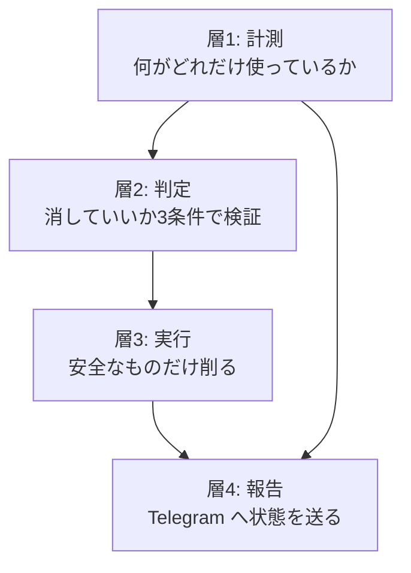

# Mac Mini ヘルス loop — 設計と TODO

**目的**: Life Manager が自分の走っているマシンの健康状態を常に把握し、誰がどこで動かしても勝手に壊れない状態を保つ。OSS として公開できる形にする。
**作成**: 2026-08-31

---

## 0. なぜ要るのか（実際に起きたこと）

2026-08-30〜31、Mac Mini のディスクが 0 バイトになった。その瞬間:

- **Bash ツールが起動できなくなった**（一時ファイルすら作れない）
- Write も Edit も失敗した
- Remote Control が落ちれば iOS から一切コードが書けなくなる状態だった
- 唯一 `Monitor` ツール（stream 型で出力ファイルを作らない）だけが生き残り、そこから復旧した

**ディスクが埋まると、直す手段そのものが消える。** だから「埋まってから対処」は成立しない。埋まる前に自分で気づいて自分で削る仕組みが要る。

さらに、掃除しても意味がなかった。35GB 消した同じ時間帯に、システムが 10〜20分ごとに 1.2GB の release を作り続けていた。**書き込み速度を知らずに掃除しても永久に追いつかない。**

---

## 1. 設計

### 3つの層



### 層1: 計測（何がどこにあるか）

毎回ゼロから `du` を回すと10分でもタイムアウトする（`~/Library` で実測）。だから:

- 大分類だけを定期計測し、結果を `~/.local/state/life-manager/disk-health/inventory.json` に貯める
- **前回との差分**を持つ。「増え続けている場所」が分かることが本質。総量より増加率が重要
- 触れない領域（Spotlight index、システム予約 25GB）を最初から除外して、実際に動かせる容量だけを見る

### 層2: 判定（消していいかの3条件）

**「再生成可能だから安全」は誤り。** 稼働中の loop が今この瞬間に必要としているかだけが判断材料。実際に `~/anicca/skills/earn/x402-sell/node_modules` を「再生成可能」という理由で消し、17個の稼働 loop が参照していたことが後で判明した。

削除してよいのは3つ全てがゼロの時だけ:

```bash
# 1. loop のコードが参照していないか（plist だけ見ると見落とす）
grep -rl '<対象>' ~/loops/releases ~/Projects ~/.local/bin ~/.config

# 2. plist が参照していないか
grep -l "$HOME/<対象>" ~/Library/LaunchAgents/*.plist

# 3. プロセスが掴んでいないか
lsof -n | grep <対象>
```

**`launchctl` が `not running` でも `StartInterval` があれば現役。** 定期実行ジョブは実行の合間は止まって見える。`runs` カウントが1以上なら稼働中とみなす。

### 層3: 実行（安全網つき）

削除の前後で `scripts/loop-guard.sh` が loop の健全性を比較する。比較対象:

- launchd が把握しているジョブの集合
- 存在しない release を指している plist の数

**比較してはいけないもの**: 現在走っているジョブの集合と、非ゼロ終了の集合。`StartInterval` ジョブが数秒ごとに出入りするため、何を消していなくても差分が出る。実際にこれで2回誤検知した。さらに `launchctl list` はジョブの起動・回収の一瞬だけそのジョブを出力から落とすので、消えたラベルは `launchctl print` で個別に問い合わせて確認する。

### 層4: 報告

`~/Library/Logs/disk-watchdog.log` に残すだけでなく、閾値を割ったら Telegram へ送る。本文の先頭に harness 名を付ける（`Claude:::`）。

---

## 2. 現状（実装済み）

| 実装 | 場所 | 状態 |
|---|---|---|
| ディスク watchdog | `~/.local/bin/disk-watchdog.sh` / `scripts/disk-watchdog.sh` | **稼働中**。15分ごと、空き25GB を下回ると発動 |
| launchd 登録 | `~/Library/LaunchAgents/com.anicca.disk-watchdog.plist` | **稼働中**（`runs = 47` 実測） |
| release GC 組み込み | 同 watchdog 内 | **稼働中**。`LIFE_MANAGER_RELEASE_KEEP=2` で呼び、`<release>.gc-trash.<pid>` の残骸も掃除 |
| loop 安全網 | `~/.local/bin/loop-guard.sh` / `scripts/loop-guard.sh` | **稼働中**。3条件で自己テスト済み |
| 台帳 | `specs/MAC-MINI-INFRA.md` | 現況・削除履歴・判定手順 |

**未実装**: 層1の継続的な計測と差分、層4の Telegram 通知、OSS 化。

---

## 3. TODO（順序どおりに実行する）

### A. ディスク掃除の続き（まだ終わっていない）

- [ ] **A1**: `~/.cloak/profiles` の未参照27個（1.9GB）を判定する。`gig-upwork` 1.1GB が最大。ログイン済みセッションを含むので、消すと再ログインが要る。**Upwork をもう使わないかを確認してから**
- [ ] **A2**: `~/.openclaw/skills/.backups` 0.6GB と `workspace/runs` 0.8GB — Life Manager への移行が済んだ範囲を判定して回収
- [ ] **A3**: `~/.openclaw/.git` 2.9GB の `git gc`。前面実行は10分でタイムアウトしたので、`nohup` で完走させて結果を測る
- [ ] **A4**: `~/.local/state/life-manager` の孤児 state 39個（残り約0.9GB）を3条件で判定
- [ ] **A5**: 各ディレクトリの中を1階層深く見る。ディレクトリ単位では「稼働中」でも、中の個別ファイルには未使用のものがある

### A-bis. 集約（最終的に life-manager 1フォルダにする）

**方針（Dais 2026-08-31）**: 最終的に必要なのは `life-manager` repo のフォルダだけ。他は全て集約して消す前提で進める。

各フォルダの git origin を実測した結果、種類が3つに分かれた:

| フォルダ | origin | 種類 | 判定 |
|---|---|---|---|
| `~/Projects/life-manager-main` | `life-manager.git` | **release の生成元（正本）** | `selfbuild` の `LM_SELFBUILD_REPO` がここを指す。**残す** |
| **`~/Projects/life-manager`** | **`life-manager-v0.git`（archived）** | **死んだ repo のクローン** | push が 403 で拒否される。**ここに書いたものは永久に共有されない。中身を救出して削除する** |
| **`~/anicca`** | **`life-manager.git`** | **同じ repo の別クローン 3.5GB** | **集約対象。下記** |
| `~/anicca-project` | `anicca-products.git` | 別 repo | 別途判断 |
| `~/profitable-claude` | `profitable-claude.git` | 別 repo | 別途判断 |
| `~/.openclaw` | `anicca-dais.git` | 別 repo | 別途判断 |
| `~/gig` | `anicca-gig.git` | 別 repo（納品物・収益記録） | 残す |
| `~/anicca-monk-factory` | `anicca-monk-factory-state.git` | state repo | 残す |
| `~/loops` | git 無し | release の置き場 | 残す |

#### どれが正本か（2026-08-31 実測で確定）

`git remote get-url origin` を3つのクローン全部で実行した結果:

| クローン | origin | 生きているか |
|---|---|---|
| **`~/Projects/life-manager-main`** | `life-manager.git` | **✅ 正本。`selfbuild` の `LM_SELFBUILD_REPO` がここを指し、ここから release が切られる** |
| `~/anicca` | `life-manager.git` | 同じ repo の別クローン |
| `~/Projects/life-manager` | **`life-manager-v0.git`** | ❌ **archived**。`git push` が `403 This repository was archived so it is read-only` を返す |

**★ `~/Projects/life-manager` は死んだ repo（v0）のクローン。★** ディレクトリ名が短いので正本に見えるが違う。2026-08-31 のこのセッションで書いた spec は最初ここに置かれ、20コミットが push できないまま溜まっていた。`life-manager-main` 側の worktree へ移して初めて共有された。

**今後 spec やコードを書く時は必ず `~/Projects/life-manager-main`（またはその worktree）で作業する。**

#### `~/anicca` の集約（3.5GB、最優先）

**同じ `life-manager.git` のクローン**で、ブランチ `feature/dist1-mcp-launchd`、未コミット195件、unpushed 0。

44個の loop が `~/anicca/skills/earn/x402-sell` を参照している（他に `marketing-engine` 3件、`sol-funding-daemon.sh` 1件）。

`origin/main` と `~/anicca` のファイル一覧を突き合わせた結果（2026-08-31）:

| | ファイル数 |
|---|---|
| `origin/main` の `skills/earn/x402-sell` | 141 |
| `~/anicca` の同ディレクトリ（node_modules と logs 除く） | 164 |
| **`~/anicca` にしか無いもの** | **23** |

**その23ファイルは全て実行時データだった。** `attempts-0x....jsonl`（ウォレット別の試行記録）、`llm-resale-spend-0x....json`（支出記録）、`events.jsonl`、`market-scout.json` など。拡張子が `.jsonl` / `.json` / `.log` でないものはゼロ件。

**コードの移行は完了している。** 一度は「本番コード17本が `~/anicca` にしか無い」と判定したが、それは `life-manager-main` の作業ブランチ（`feat/lancers-session-self-recovery-20260831`）と比較していたための誤り。`origin/main` には `acquisition-controller.mjs` `sale-observer.mjs` `experiment-tick.mjs` `store-activate.mjs` `the402-worker-daemon.mjs` `image-server.mjs` を含む97本の `.mjs` と、テスト36本が揃っている。**比較対象はチェックアウト中のブランチではなく `origin/main`。**

未コミット195件の内訳も実測した: 165件が未追跡で、うち159件は `marketing-engine/evidence`。変更29件も `intel/*.jsonl` と `evidence/metrics/*` が大半。**コード変更は `cdp_daily_driver_keepalive.py` の1件だけで、`life-manager-main` 側との `diff` はゼロ行**（完全に同一）。

したがって `~/anicca` に残る価値は**実行時 state のみ**。

- [ ] **A-bis-0**: `~/Projects/life-manager`（v0 の archived クローン）の中身を確認し、救うべきものを `life-manager-main` へ移してから削除する
- [x] **A-bis-1**: 完了。コードもテストも `origin/main` に揃っており、移行するものは無い
- [x] **A-bis-2**: 完了。未コミット195件は全て evidence / intel / log の実行時データ。唯一のコード変更は差分ゼロ
- [ ] **A-bis-3**: 44個の loop の参照先を `~/anicca/skills/earn/x402-sell` から release 内のパスへ張り替える
- [ ] **A-bis-4**: `~/anicca/skills/earn/state`（4MB）の移設先を決める
- [ ] **A-bis-5**: 全て済んだら `~/anicca` を削除（**3.5GB 回収**）

### B. ヘルス loop の実装

- [ ] **B1**: `disk-health` skill を作る。層1の計測を実行し `inventory.json` に前回との差分つきで保存
- [ ] **B2**: 増加率の検出。「10〜20分ごとに 1.2GB」のような書き込みパターンを自動で見つけて報告する
- [ ] **B3**: 閾値割れで Telegram 通知（先頭に `Claude:::`）
- [ ] **B4**: `loop-guard.sh` を watchdog の削除処理にも組み込み、自動削除が loop を壊していないことを毎回証明する
- [ ] **B5**: OSS 化。マシン固有のパス（`/Users/anicca`、`ai.anicca.*`）を設定に追い出し、誰の Mac でも動く形にする

### C. アバター動画の毎日投稿

現状: 投稿 loop は既に3本ある。**しかし実質動いていない**（実測 2026-08-31）:

| loop | runs | 状態 |
|---|---|---|
| `life-manager-anicca-obou-instagram` | 0 | 一度も走っていない |
| `life-manager-anicca-main-tiktok` | 0 | 一度も走っていない |
| `life-manager-anicca-en-slideshow-tiktok` | 1 | exit=1、ログディレクトリすら無い |

資産は揃っている（`~/anicca-monk-factory/personas.json`）:

- 英語 `@monk_anicca` → `yangmun-monk-factory` skill、HeyGen avatar_id 設定済み、投稿枠 19:30/12:30/08:30
- 日本語 `@obou_anicca` → `watercolor-monk-factory` skill
- 商品リンク: `aniccaai.com/monk`（EN）/ `aniccaai.com/achan`（JP）
- 音声: EN は HeyGen voice、JP は OpenAI tts-1-hd(onyx)

- [ ] **C1**: 3本の loop が動かない原因を特定する。`runs = 0` はスケジュールに到達していないか、起動即失敗のどちらか
- [ ] **C2**: HeyGen の認証情報を SSOT（`~/.local/share/anicca/credentials.json`）に登録。**現在エントリが無い**ためプランもクレジット残も不明
- [ ] **C3**: 標準アバター（1クレジット/分）で僧侶の品質を1本作って確認する。Avatar V の20倍安い。成立すれば $24/月のまま月200分
- [ ] **C4**: 品質不足なら EchoMimicV3 を Vast.ai で立てる（12GB VRAM、$0.29/時、月$0.70前後）。詳細は `specs/AVATAR-RENDERER-COST.md`
- [ ] **C5**: 1本を最後まで通す（生成 → 投稿 → 実際に見える）。**成功を1回実測してから毎日化する**
- [ ] **C6**: 毎日の自動投稿を有効化し、`personas.json` の投稿枠で回す

### D. 順序の理由

A を先にやる。ディスクが埋まると B も C も動かせない（実際に全ツールが死んだ）。B は A の再発を防ぐ。C は B が守ってくれる土台の上でだけ安全に回せる。
