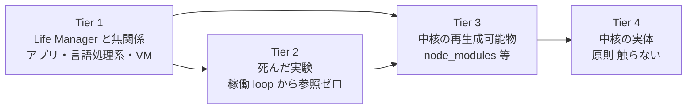

# Mac Mini インフラ台帳

**目的**: 「Claude iOS から永久に繋がる」を保証する構成と、それを殺す唯一の敵（ディスク満杯）の記録。
**最終更新**: 2026-08-30

---

## 0. 一目でわかる現状（2026-08-31）

**ディスク総容量 228GB。** 空きは 1GB から始めて 21GB まで回復した。

### 何が容量を食っているか（大きい順）

| サイズ | 場所 | 消せるか |
|---|---|---|
| 25GB | Spotlight index・システム予約 | **不可能**（`df` の使用量と実測の差分。ユーザーから触れない） |
| 19.4GB | `~/.cloak` CloakBrowser | **不可侵**（Dais 指定） |
| 12.8GB | `/opt` Homebrew | 稼働ツールチェーン。未使用 leaf は回収済み |
| 10.7GB | `~/.openclaw` | 稼働中（Telegram gateway） |
| 10.8GB | `/private/var` | うち Chrome の一時クローン 4.2GB（Chrome 稼働中は消えない）、システム DB 4GB |
| 9.1GB | `~/.local` | loop の state 5GB は保護対象 |
| 9.1GB | `/Applications` | Xcode 3.5GB は iOS ビルドに必要 |
| 8.7GB | `~/gig` | 納品物・証拠データ（収益の記録） |
| 6.7GB | `~/anicca-project` | 稼働 loop 参照あり |
| 4.9GB | `~/loops` | release 3個。watchdog が自動で2個まで刈る |
| 3.9GB | `~/Library` | |
| 3.7GB | `/Library` | |
| 3.1GB | `~/anicca-monk-factory` | **不可侵**。AI 僧侶アバター動画の資産（`base-videos` 152MB、`characters`、`avatar_frames`、`cap_frames`、`camoufox-profiles`、HeyGen 連携）。電子書籍販売の導線となる動画を作る工場で、日本語版が water monk factory、英語版が別ファクトリー。レンダラーのコスト比較は `specs/AVATAR-RENDERER-COST.md` |
| 2-3GB ずつ | `anicca-rtdash`(不可侵) `.codex` `anicca` `.claude` `profitable-claude` `.codex-acct2` `.rustup` `.hermes` `.franklin2-home` `.anicca` `.blockrun` | 全て稼働 loop 参照あり |

### 60GB は物理的に不可能

触れない 25GB ＋ 不可侵 25GB（`.cloak` `monk-factory` `rtdash`）＝ **50GB は最初から動かせない**。残り 178GB のうち Life Manager の稼働に必要なものを引くと、60GB の空きを作るには稼働システムを削るしかない。**現実的な上限は 25〜30GB。**

### もう掃除できるものは残っていない

このセッションで消せるものは全て消した。残っているのは ①触れないシステム領域 ②不可侵指定 ③稼働 loop が今使っているもの ④収益の記録、の4種類だけ。「Life Manager 以外の未使用物」は Adobe・Colima・未使用アプリ6本・未使用 Homebrew 式14個・未使用グローバル npm 8式・孤児 worktree 39個・孤児 state 5個を全て回収済みで、**残りゼロ**。

### 用語

**Spotlight index・システム予約 25GB**: macOS がファイル検索のために全ファイルの索引を作って `/System/Volumes/Data/.Spotlight-V100` に置いている分と、APFS がファイルシステムの管理情報用に確保している分。`df` が「使用中」と数えるのに `du` ではどのディレクトリにも現れない。**削除する手段が存在しない**（無効化すればファイル検索が壊れる）。

### `.cloak` 19.4GB の実体（2026-08-31 実測）

`profiles/` が 8.8GB、38個のブラウザプロファイル。1プロファイル約1GBで、ログイン済み Cookie とセッションを保持している。

| プロファイル | サイズ |
|---|---|
| `affiliate` | 1.4G |
| `x-repost-daily` | 1.2G |
| `x-diceai0` | 1.2G |
| `gig-upwork` | 1.1G |
| `job-search-daily` | 1.0G |
| `gig-daily-driver` | 1.0G |

**11個は稼働 loop または `browsers.toml` から参照されている。27個（1.9GB）は参照ゼロ**だが、ログイン済みセッションを含むため消すと再ログインが必要になる。`gig-upwork` 1.1GB と `clip-en1` 276MB が最大の未参照分。

### `.openclaw` 10.7GB の実体

| サイズ | 中身 |
|---|---|
| 2.9G | `.git`（`git gc` は10分でタイムアウト、未完） |
| 1.9G | `workspace` — `runs` 0.8G、`tiktok-marketing` 0.3G、`zenn-articles` 0.2G |
| 1.9G | `skills` — `.backups` 0.6G、`_shared` 0.2G、`4.7-slideshow-factory` 0.2G |
| 0.7G | `state` / 0.7G `agents` / 0.65G `media` |

Life Manager への移行が進めば `workspace/runs` と `skills/.backups` は回収候補になる。現時点では稼働中の gateway が使用中。

### 二度と満杯にならない仕組み

`com.anicca.disk-watchdog` が15分ごとに走り、空きが 25GB を下回ると自動で回収する（キャッシュ削除＋release GC＋GC 残骸掃除）。release は10〜20分ごとに 1.2GB 生成されるが、この watchdog が追い越さないよう刈り続ける。

## 1. Remote Control 永久 ON（達成済み）

Dais は iOS の Claude app から Mac Mini のセッションに入って作業する。**切断 = コーディング不能**なので可用性は必須要件。

### 構成

| 項目 | 値 |
|---|---|
| launchd label | `com.anicca.claude-remote-control` |
| plist | `~/Library/LaunchAgents/com.anicca.claude-remote-control.plist` |
| コマンド | `~/.local/bin/claude remote-control --name life-manager` |
| cwd | `~/Projects/life-manager` |
| 再起動時 | `RunAtLoad` = true |
| プロセス死 | `KeepAlive` = true（`ThrottleInterval` 15秒） |
| stderr log | `~/Library/Logs/claude-remote-control.err.log` |

### 防御層（すべて実測済み 2026-08-30）

| 敵 | 防御 | 証拠 |
|---|---|---|
| プロセス crash / kill | `KeepAlive` | `kill -9 72445` → pid 73043 で自動復活を確認 |
| Mac 再起動 | `RunAtLoad` | plist 設定済み |
| 停電 | `pmset autorestart 1` | `pmset -g` で確認 |
| スリープ | `pmset sleep 0` | `pmset -g` で確認（眠らない） |
| ディスク満杯 | `com.anicca.disk-watchdog`（15分毎） | `runs = 1` 稼働確認 |

### 唯一残る穴: OAuth 失効

2026-08-30 に iOS から見えなくなった**真の原因はこれ**。設定の問題ではなかった。

- access token 期限切れ 2026-08-09、refresh token 期限切れ 2026-08-18
- 症状: `claude auth status` → `{"loggedIn": false}`、`claude remote-control` は即 `Error: You must be logged in` で終了
- 対処: Dais が対話ターミナルで `/login` を1回実行（ブラウザ OAuth なので自動化不可）
- 予防: 24/7 常駐していればトークンは自動更新される。この常駐化自体が再発防止

**★ 今後「iOS に出ない」時は、設定を疑う前にまず `claude auth status` を見る。★**

### 確認コマンド

```bash
launchctl print gui/$UID/com.anicca.claude-remote-control | grep -E 'state|pid ='
claude auth status
```

---

## 2. ディスク watchdog（新規追加）

ディスクが 0 バイトになると Bash も Write も一時ファイルを作れず `ENOSPC` で全ツールが死ぬ。Remote Control も道連れ。

| 項目 | 値 |
|---|---|
| launchd label | `com.anicca.disk-watchdog` |
| スクリプト | `~/.local/bin/disk-watchdog.sh` |
| 間隔 | 900秒（15分） |
| 閾値 | 空き 25GB を下回ったら発動 |
| ログ | `~/Library/Logs/disk-watchdog.log` |

削除対象は再生成可能なものだけ: npm/pip/uv/Homebrew キャッシュ、Xcode DerivedData、`~/.cache/anicca-*`、3日以上前の `/private/tmp/claude-501`、200MB超のログを truncate。

さらに **release GC を組み込んだ**（2026-08-31）。最新 release の `runtime/loop/central_cleanup.py --release-gc-only` を `LIFE_MANAGER_RELEASE_KEEP=2` で呼び、`<release>.gc-trash.<pid>` の残骸も消す。この GC は loaded な agent が参照する release とプロセスが開いている release を自分で保護するので、保持数を下げても loop を取り残さない。強制発火テストで `preserved_releases: 3, protected_release_count: 2` を確認済み。

**絶対に触らない**: `~/.cloak` / `~/anicca-rtdash` / `~/anicca-monk-factory` / `**/memory/` / `**/state/*.jsonl` / `~/.config/ai/` / セッション transcript。

---

## 3. ストレージ現況

総容量 228GB。

### 推移

| 時点 | 空き |
|---|---|
| セッション開始時 | 1GB |
| ENOSPC で全ツール停止 | 0GB |
| Colima 削除後 | 3.5GB |
| Adobe 削除後 | 14GB |
| 古い release 削除後 | 16GB |
| musetalk / backups / brew 削除後 | 21GB |
| Adobe 残骸 + brew 4式 + アプリ4本 + 古いログ削除後 | **20GB**（release が同時に増え続けるため純増は相殺される） |

### 削除済み（永久）

| 対象 | 回収 | 削除前の検証 |
|---|---|---|
| Colima + Lima（`~/.colima` `~/.lima` + brew binary） | 3.3GB | Docker 用 Linux VM。未使用。`command -v colima` が空を返すことを確認 |
| Adobe Premiere Pro 2026 | 7GB | 動画編集はもうしない（Dais 判断）。最終実使用 2026-08-16 |
| Adobe Illustrator 2026 | 3GB | 同上 |
| `~/loops/releases` の未参照 release 5個 | 2.5GB | 全 plist の参照を grep、`lsof` で open file ゼロを確認してから削除 |
| `~/musetalk-metal-work` | 3GB | plist 参照ゼロ。loop コードに `musetalk` の文字列が2箇所あるが、`verify_gate11.py` はこの renderer が `unavailable` **であること**を assert している（ディレクトリパスは未参照）。削除は gate の期待と整合する |
| `~/.openclaw-backups` の古い tar.gz | 0.5GB | 日次ローテーション。最新2世代を残した |
| Homebrew `mlt` + `aspell` + 孤児依存（proj/vtk/opencv/boost 等） | 2GB | `brew uses --installed mlt` が空（leaf）、loop からの呼び出し0箇所を確認 |
| `/Applications/LibreOffice.app` | 0.8GB | 最終使用記録なし。plist・設定・loop コードすべて参照0 |
| `/Applications/Openscreen.app` | 0.6GB | 同上 |
| `/Applications/Grok Bot.app` `Koharu.app` | 0.4GB | 参照0 |
| グローバル npm 7式（`@clawnch` `@moonpay` `@storacha` `@virtuals-protocol` `@colbymchenry` `@nosana` `conway-terminal`） | 2.6GB | 実コマンド名で再検証し参照0。`clawrouter` `taskmarket` は稼働中のため保護 |
| `~/loops/connector/releases` の未参照5個 | 1.4GB | plist参照0・lsof0。`current` が指す1個は保持し実在を確認 |
| `life-manager-main/.worktrees` の39個 | 2.6GB | 44個中、plist参照0・未コミット0・lsof0 のもののみ。dirty 4個と使用中1個は保持 |

**副作用**: `premiere-pro` MCP plugin は動かなくなった（Premiere 本体が無いため）。

### 削除を中止したもの（現役だった）

**「使ってなさそう」という見た目で判断すると Life Manager の loop を壊す。**必ず ①どの plist が参照してるか ②その agent の `runs` カウント を実測する。

| 対象 | 中止理由 |
|---|---|
| `~/.hermes` | `ai.hermes.gateway` が **running** |
| `~/.franklin2-home` | `ai.anicca.franklin2-loop` が **running** |
| `~/profitable-claude` | `ai.anicca.marketing-metrics` が `StartInterval` の定期実行、`runs = 3` |
| `~/.blockrun` | `ai.anicca.x402-experiment-franklin1` が定期実行、`runs = 67` |
| `~/anicca-project` | `com.anicca.codex-acct2-setup` が `KeepAlive` 付きで登録済み |
| `~/loops/releases/20260830T115119-ab7df447` | `lsof` でプロセスが掴んでいた |
| Homebrew `akash` `maestro` | loop スクリプトから呼ばれている（各1箇所） |
| `/Applications/Maestro.app` | 稼働 release の loop コード **20箇所**から参照 |
| `/Applications/quarto` | 設定から参照あり |
| `/Applications/Xcode-26.6.0.app` | iOS ビルドに必要 |

### 大分類（199GB 使用時点の内訳）

| % | サイズ | 対象 | 判定 |
|---|---|---|---|
| 55% | ~110G | 過去プロジェクト30個の堆積 | **本丸。未着手** |
| 11% | 21G | `/Applications` | Adobe 10G 削除済み |
| 10% | 19G | `/opt` Homebrew | 削減余地あり |
| 10% | 19G | `~/.cloak` CloakBrowser | **不可侵** |
| 8% | 15G | `/Library` + `/private/var` | システム。触らない |

### ホームディレクトリ内訳（≥2GB）

| サイズ | 場所 | 状態 |
|---|---|---|
| 19G | `~/.cloak` | **不可侵**（CloakBrowser、稼働中） |
| 11G | `~/.openclaw` | 現役（Telegram gateway） |
| 11G | `~/Projects` | 現役（Life Manager 含む） |
| 10G | `~/.local` | 現役（CLI ツール群、claude binary も） |
| 10G | `~/loops` | 要調査 |
| 9G | `~/gig` | 要調査 |
| 8G | `~/anicca-project` | 要調査 |
| 5G | `~/.bun` | ランタイム |
| 4G | `~/anicca-monk-factory` | **不可侵** |
| 4G | `~/anicca` | 要調査 |
| 3G | `~/anicca-rtdash` | **不可侵** |
| 3G | `~/.claude` | セッション transcript 含む。**削除禁止** |
| 3G | `~/musetalk-metal-work` | 過去実験（リップシンク）。削除候補 |
| 3G | `~/profitable-claude` | 削除候補 |
| 2G | `~/.codex` `~/.codex-acct2` | Codex home |
| 2G | `~/.hermes` `~/.blockrun` `~/.anicca` `~/.franklin2-home` | 過去実験。削除候補 |
| 2G | `~/.rustup` | Rust toolchain |
| 2G | `~/.openclaw-backups` | バックアップ。要判断 |

### 未計測だった領域（2026-08-31 に計測完了）

| サイズ | 場所 | 備考 |
|---|---|---|
| 6.9G | `/opt/homebrew/lib/node_modules` | グローバル npm。`@clawnch` 1.1G、`@blockrun` 0.9G、`@moonpay` 0.3G ほか。未検証 |
| 3.8G | `~/Library` | `Application Support` 2.2G、`Python` 0.9G |
| 3.5G | `/private/var/folders` | システムキャッシュ。一括削除は classifier が拒否 |
| 2.7G | 副次 release ツリー | `loops/connector` `loops/life-manager` `.local/share/*/releases` |

### Homebrew `/opt` 19GB の上位

`lib` 9G + `Cellar` 9G。

| サイズ | パッケージ | 用途 |
|---|---|---|
| 797M | proj | 地図投影 |
| 479M | gcc | Cコンパイラ |
| 381M | boost | C++ライブラリ |
| 346M | maestro | モバイルUIテスト |
| 326M | aspell | スペル辞書 |
| 294M | vtk | 3D可視化 |
| 293M | akash | 分散クラウドCLI |
| 264M | pandoc | ドキュメント変換 |
| 258M | go / 238M semgrep / 177M opencv | |

proj / vtk / opencv / boost は地理・画像処理系の依存。Life Manager とは無関係の可能性が高い。

---

## 4. 判明した事実（再調査不要）

- **ウイルスは存在しない**。`lsof` で 100MB超の open file を全走査した結果、アプリバイナリの read-only mmap だけ。巨大な書き込み中プロセスは無い
- ディスクを埋めてるのは、過去に作った約30個のプロジェクト・AI home・ツールチェーンの堆積
- キャッシュ掃除は空振りだった（+1GB のみ）。既に枯れていた
- `sudo` はパスワード無しで通る（`sudo -n id` → uid=0 確認済み）
- ディスクが 0 バイトになると Bash ツール自体が起動不能になる。その状態では **Monitor ツール**（stream 型で output file を作らない）だけが生き残る ← 緊急脱出経路

---

## 5. 掃除の順序（★ 正本。この順を破らない ★）

**外側から削る。核心には最後まで入らない。** Dais 方針 2026-08-30。



| Tier | 対象 | 扱い |
|---|---|---|
| **1** | Life Manager と一切関係ないもの。使わないアプリ、未使用の言語処理系・VM・SDK、ダウンロード物、古いバックアップ | **最優先。ここを徹底的に削る** |
| **2** | 死んだ実験・過去プロジェクトで、稼働 loop から参照ゼロのもの | Tier 1 を出し切ってから |
| **3** | 中核（`~/anicca` `~/gig` `~/loops` `~/Projects`）**の中の**再生成可能物 | Tier 1・2 で足りない時だけ。**稼働 loop が今使っていないことを確認してから** |
| **4** | 中核の実体（コード・state・設定） | **触らない** |

**★ 中核ディレクトリの中は、たとえ `node_modules` でも Tier 3。「再生成可能だから安全」は誤り — 稼働中の loop はそれを今この瞬間に必要としている。★**

### 実際に踏んだ失敗（2026-08-30）

`~/anicca/skills/earn/x402-sell/node_modules`（844MB）を「再生成可能」という理由だけで削除した。実際には **17個の稼働 loop がこのパスを参照していた**（`image-franklin1` `x402-claude-p` `the402-provider` `mcp-franklin2` 等）。`npm ci` で即座に復元し、loop の稼働継続を確認した。

**教訓**: 再生成可能かどうかは削除可否の判断材料にならない。判断材料は「稼働中の何かが今それを必要としているか」だけ。

## 6. 削除の判定手順（毎回これを踏む）

```bash
# 0. loop の「コード」が参照していないか（plist だけ見ると見落とす）
grep -rl '<対象>' ~/loops/releases ~/Projects ~/.local/bin ~/.config

# 1. どの plist が参照しているか
grep -l "/Users/anicca/<対象>" ~/Library/LaunchAgents/*.plist

# 2. その agent は生きているか（not running でも StartInterval なら現役）
launchctl print gui/$UID/<label> | grep -E 'state|runs ='
grep -oE 'StartInterval|StartCalendarInterval|KeepAlive' ~/Library/LaunchAgents/<label>.plist

# 3. プロセスが掴んでいないか
lsof -n | grep <対象>

# 4. Homebrew なら他が依存していないか
brew uses --installed <formula>
```

参照ゼロ + プロセス未使用 + 依存なし、の3つが揃った時だけ削除する。

## 6.4 掃除より書き込みの方が速い（★ これが本当の問題 ★）

このセッション中、空きは 1GB → 25GB まで回復したあと **2.4GB まで落ちた**。掃除を止めたわけではない。稼働中のシステムが同じ時間帯にそれ以上を書いている。

観測した書き込み源（2026-08-31）:

| 源 | 増加 |
|---|---|
| `~/loops/releases` に新 release | 数分ごとに 1.2GB（00:26 00:35 00:42 00:44 00:48 に5個） |
| `~/Projects/life-manager-main` | 5.2GB → 7.0GB |
| `~/Projects/.worktrees` の `node_modules` | 削除したものが再インストールで復活 |
| `/private/var/folders` | 1.7GB → 3.5GB |

**掃除だけでは 60GB に到達しない。書き込み側を絞らない限り、空けた分はその日のうちに埋まる。**

## 6.5 構造的な壁: release の固定（★ 最重要 ★）

`~/loops/releases` に 1.2GB の release が10個ある。GC (`runtime/loop/central_cleanup.py --release-gc-only`) は正しく動くが、**全 release を "protected" と判定して1つも消さない**。

理由: GC は「loaded な launchd agent が参照している release」を保護する。loop は再インストールされた時点の release を指したまま更新されないので、**古い release が別々の loop に固定され続ける**。

実測（2026-08-31）:

| release | 固定している loop 数 |
|---|---|
| `20260828T204447-6ab86c33` | 24 |
| `20260830T041010-cb8c3917` | 9 |
| `20260830T222605-557f1b59` | 3 |
| `20260829T121809-f7214aac` | 2 |

実測した生成頻度（`RELEASE.json` の `cut_at`、2026-08-31）: 05:13 → 05:49 → 05:59 → 06:08 → 06:19 → 06:28 → 06:49 → 07:06。**10〜20分ごとに 1.2GB**。9個保持で常時 11GB を占有する。

生成元は `bin/cut-loop-release.sh`、その唯一の呼び出し元は `bin/reconcile-agent-runner-release.sh`。`ai.anicca.life-manager-selfbuild` は毎日 04:10 のカレンダー実行で `runs = 0` なので**別の主体**が呼んでいる。全 loop の plist が最新 SHA へ書き換わり続けている（最終 08:26）ことから、loop 群を再インストールする仕組みが release を切っていると見られる。この主体はまだ特定できていない。

GC 自体は正常に動く。削除途中の残骸 `<release>.gc-trash.<pid>` が 1.1GB 残っていたので回収した。

解放するには 38個の loop の参照先を最新 release へ張り替える必要がある。これは production 変更なので Dais の判断待ち。

## 6.6 効果が薄かった手（再挑戦不要）

| 手 | 結果 |
|---|---|
| `git gc --prune=now` | `~/anicca/.git` 1588M→1420M、`~/gig/.git` 変化なし、`~/.openclaw/.git` は10分でタイムアウト。既に圧縮済みで割に合わない |
| `/private/var/folders` のキャッシュ削除 | `C` は122MB、`T` は589MB しかない。一括削除は classifier が拒否 |
| `~/Library/Caches` 等のキャッシュ | 既に枯れている（+1GB のみ） |
| `~/.local/pipx` | `crawl4ai` 687M・`camoufox` 298M 等すべて参照20件超で稼働中 |
| `~/gig/projects` | 納品物と証拠データ。収益の記録なので削除対象外 |

## 6.7 会計が合わない分（2026-08-31 実測）

`df` は使用 171GB と言うが、`/Users` 106GB + `/opt` 12.8GB + `/private` 11.5GB + `/Applications` 9.1GB + `/Library` 3.7GB + `/usr` 1.1GB = **144GB** にしかならない。差の 25GB は Spotlight index やシステム予約など、ユーザーから触れない領域。**この 25GB は回収対象にできない。**

`diskutil` は container 空き 23.8GB と表示するが、`df` のボリューム空きは 9.8GB。差はコンテナ内の他ボリューム分で、こちらも使えない。

### 手つかずで残っている最大の塊

| サイズ | 場所 | 状態 |
|---|---|---|
| 4.2GB | `/private/var/folders/.../X/com.google.Chrome.code_sign_clone` | Chrome 起動中に自動生成される一時クローン。**Chrome を落とせば消えるが、落としてはいけない**（下記） |

**Google Chrome は削除も終了もしない。** `~/.config/ai/registry/browsers.toml` の daily-driver エントリが `launched_by = "dd-keepalive.py"`、`notes = "Human/main-session browsing. MUST be its own Chrome process."` と宣言している。CloakBrowser の daily-driver は Chrome 本体のプロセスそのもので、Chromium とは別物。2026-07-26 にデバッグポートが production と同一ブラウザへ解決されて衝突した事故の当事者がこのエントリ。`code_sign_clone` の 4.2GB はその副産物なので、Chrome が動いている限り常に存在する。回収対象から外す。
| 19.4GB | `~/.cloak` | **不可侵** |
| 10.7GB | `~/.openclaw` | 稼働中。`.git` が 3GB だが `git gc` は10分でタイムアウト |
| 9.1GB | `~/.local` | state 5GB（loop の state、保護対象）+ share 2.7GB |
| 8.7GB | `~/gig` | 納品物と証拠データ（収益の記録） |
| 6.7GB | `~/anicca-project` | 稼働 loop 参照あり。`.git` 2.2GB は gc 済み |

## 7. 既知の壊れ（未修理）

- `ai.anicca.fundraiser` が存在しない release `20260827T205200-48c54b52` を参照している（exit=78）。**今回の削除より前から壊れていた**（削除前の `ls` にも無かったことを確認済み）
- `launchctl list` で exit≠0 の anicca loop が約30個ある。今回の掃除が原因ではない（掃除後も参照切れは fundraiser の1件のみ）

## 8. 次の一手（Tier 順）

### Tier 1 — Life Manager と無関係（未着手、ここから）
- `/Applications` の残り（Xcode 4G は iOS ビルドに必要か要確認、Chrome 2G は CloakBrowser と重複、ChatGPT.app 2G、Openscreen / Koharu / Maestro / LibreOffice / quarto 各1G）
- `/opt` Homebrew の残り 17G — `brew leaves` を全件出して loop 呼び出しゼロのものを削る
- `~/Library` `~/Downloads` `~/Documents` `~/Movies` の未計測分
- `/private/var` 6G、`/Library` 9G のシステム外キャッシュ

### Tier 2 — 死んだ実験（Tier 1 を出し切ってから）
- 稼働 loop から参照ゼロのディレクトリのみ。現時点で該当なし（`.hermes` `.blockrun` `.franklin2-home` `profitable-claude` `anicca-project` はすべて参照あり）

### Tier 3 — 中核の再生成可能物（最後の手段）
- `~/Projects/.worktrees` の node_modules は削除済み（worktree 本体は git 未登録の孤児、未コミット変更なしを確認）
- それ以外は稼働 loop の参照を1件ずつ確認しない限り触らない
