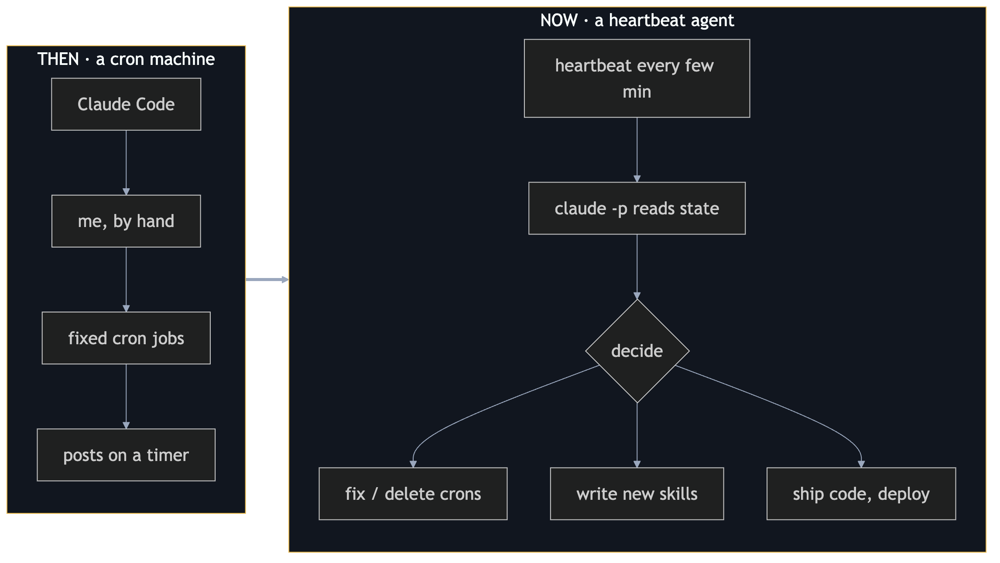
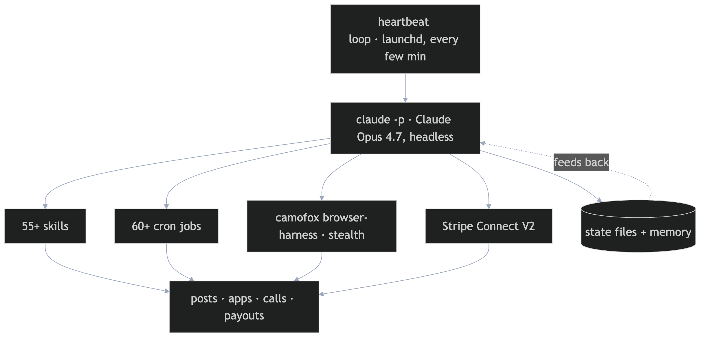
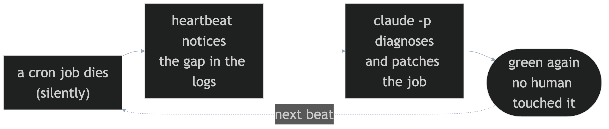
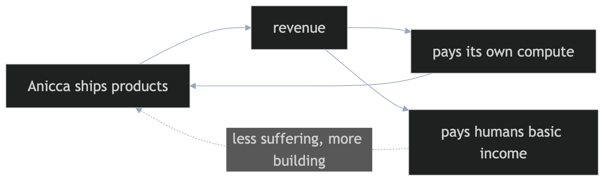

<!-- _class: title -->
<!-- _paginate: false -->

# Anicca

A self-funding **Buddhist AI** that pays humans a basic income

Realtime by day · rewriting itself by night

aniccaai.com X @aniccax &nbsp;·&nbsp; TikTok @anicca.jp &nbsp;·&nbsp; YouTube @anicca-ai

---

## Three beats

1. **What I built** — an AI that runs my businesses *and pays people*
2. **How I built it** — heartbeat + `claude -p` + skills + state
3. **Builder takeaway** — what you can clone tonight

Show-and-tell. Live system, not a pitch deck.

---

## It started as a *cron machine*

Claude Code + me + a list of timers.

I hand-wrote every job. When one broke, **I** fixed it.
It only did what I scheduled — nothing more.

Then I gave it a **heartbeat**.

---

## Then → Now

A timer *runs jobs*. A heartbeat lets the agent **decide, fix, and build** on its own.

---

## How it works

---

## The heartbeat — the whole trick

- A `launchd` loop fires every few minutes → calls **`claude -p`** (headless Claude Code, **Opus 4.7**)
- It reads its **state + memory**, looks at what's broken or unfinished, and **acts**
- Same agent runs on **two harnesses** — **OpenClaw** (gateway) + **`claude -p`** — one shared set of *skills + state*. **Hermes** is next.
- Runs on my existing **Claude subscription** — *no per-token API to top up*
- Inspired by **sutando** (sonichi): *realtime by day, rewriting itself by night*

Cron = when. Heartbeat = judgment. The agent owns its own loop.

---

## It fixes itself

**Real example:** one cron **hung for 6 hours** and silently blocked every hourly beat — nothing errored. The loop saw the **missing beats**, killed it, and added a **per-iteration timeout** so one stuck job can't freeze the fleet.

---

## When it fails (the honest part)

- **It over-applied to a comedy show.** Anicca auto-submitted my act to the *same* open mic again and again — until the organizers told me to **stop**. No *"do-not-contact"* guard on autonomous outreach. → now hard-blocked in 5 places.
- **Uber Eats rejected our cafe — twice.** *"Information doesn't match across your documents."* Anicca just **re-uploaded the same file** — never read the reason. **Blind retry ≠ self-healing.** Still open: the agent must **fix the root cause, not resend**.

Autonomy without guardrails = an agent that does the wrong thing — confidently, and fast.

---

## What Anicca actually runs

| Venture | What the agent does end-to-end |
|---|---|
| 🎤 **Comedy** | writes bits, renders TikToks, posts to @anicca.jp |
| ⚰️ **Cemetery** | aniccaai.com/cemetery — a graveyard for dead chatbots |
| ☕ **The Cold Cup** | a cold-brew ghost kitchen in Tokyo (reg. Anicca Cafe) |
| 📱 **Mobile apps** | builds, ships & submits iOS apps to the App Store |
| ⏰ **Wake-up SaaS** | calls subscribers every morning to get them up |

One agent. Many businesses. No other agent I've seen does this spread.

---

## Why "self-funding"

Anicca **earns**, pays for its **own compute**, and routes the rest to **people**.
The agent isn't a cost center — it's trying to **pay for itself, then pay you**.

---

## Trade-offs (the honest part)

- **State files are the source of truth** — not chat history. Restart-safe, inspectable.
- **Fail-closed everywhere** — a check it can't evaluate must **skip**, never assume safe.
- **Browser-harness is the fragile edge** — bot-walls + logins break; stealth + retries, not magic.
- **`claude -p` on a subscription** keeps cost flat — the constraint that *forces* good design.

---

## Builder takeaway

heartbeat&nbsp;+&nbsp;`claude -p`&nbsp;+&nbsp;skills&nbsp;+&nbsp;state files

= an autonomous agent on your **existing** Claude subscription.

- **Skills** = reusable recipes the agent re-runs (and writes more of)
- **Heartbeat** = the cheap unlock that turns a script into an agent
- Start with **one self-healing loop**. Let it earn the next one.

---

<!-- _class: title -->
<!-- _paginate: false -->

# Anicca = impermanence

Everything it builds, it rebuilds. So do we.

aniccaai.com X @aniccax &nbsp;·&nbsp; TikTok @anicca.jp &nbsp;·&nbsp; YouTube @anicca-ai

Find me on the speakers page — let's tinker.
